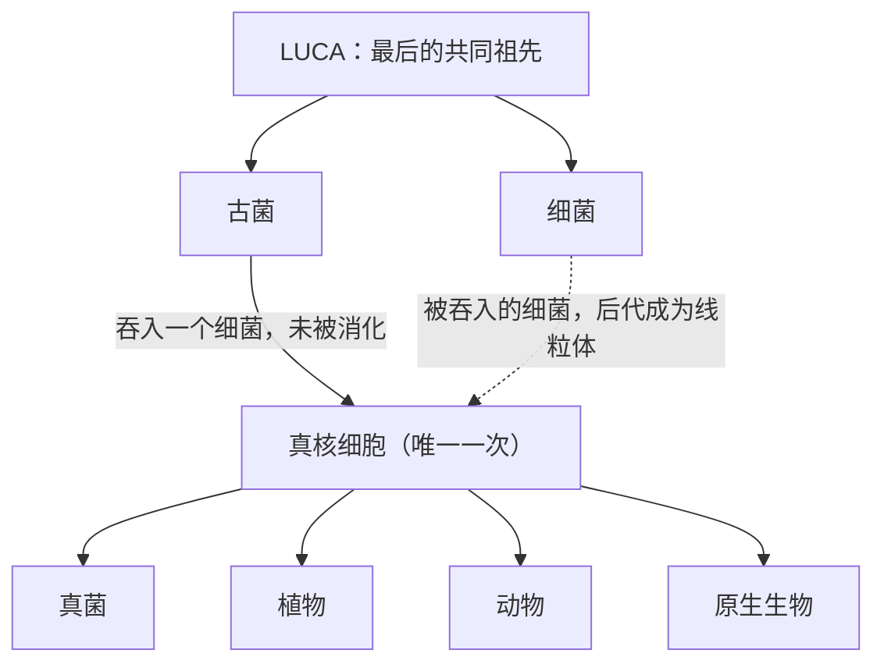

# 01｜为什么地球上所有复杂生命都来自同一个祖先

> 蘑菇、树、蚂蚁和你我，为什么共用同一套细胞设计，而细菌四十亿年都没有加入这个俱乐部？

---

## 一、先说结论

莱恩指出，地球上的生命其实分成两大阵营：一类是细菌和古菌，也就是没有细胞核的「原核生物」；另一类是真核生物，包括所有真菌、植物和动物。奇怪的地方在于，第二类只诞生过一次。今天所有复杂生命的共同点——细胞核、线粒体、内膜系统、有性生殖——不是各自慢慢演化出来的，而是像一份「升级包」被一次性装进同一个细胞，然后由它的后代继承到全世界。所以「复杂生命为什么只出现一次」，才是这本书真正要回答的谜题。

## 二、我们先理解一个问题

先做一件很平常的事：把身边的生命排一排。

路边的一棵树、菜市场里的香菇、家里的猫、显微镜下的一滴池塘水，它们看起来毫不相干。可一旦把镜头推到细胞层面，它们却几乎一模一样：都有细胞核，都有线粒体，基因都被切成一节一节再拼接，都靠同一套方式繁殖。

而地球上数量最多、分布最广的生命——细菌——反而从来没有变成树、变成猫、变成我们。

这就带出一个不太自然的问题：**为什么「复杂」这件事，在地球上只成功过一次？**

## 三、作者到底提出了什么观点？

莱恩的观点可以分成两层。

第一层是分类：生命并不只是「有细胞」和「没有细胞」，而是原核生物与真核生物两大阵营。细菌和古菌属于前者，你我属于后者。

第二层，也是真正要紧的一层：**真核生物不是从细菌逐步「进化升级」上来的，而是两个原核细胞合并出来的。** 一个古菌样的宿主，吞下了一个细菌，没有把它消化掉，反而让它住下来，最终变成细胞里的能量工厂——线粒体。这个新细胞就是所有复杂生命的共同祖先。

也就是说，复杂生命的起源不是树枝上的一次分叉，而是两根树枝长到了一起。

## 四、把这个观点翻译成人话

想象一所学校。

细菌这群学生，四十亿年来一直在同一个年级。它们非常能干，能住在极地冰盖、火山口、浓酸里，数量多到可以铺满地球。但它们在「复杂度」这门课上，始终没有升级。

真核生物则像是一个学生，某天遇到了一位转校生。两人没有各走各的路，而是组成一个小组：一个人出场地和管理，一个人提供全部电力。结果这个小组一下子有了余力，可以同时上好几个高难度课程——盖更大的基因组、造更复杂的结构、最后甚至组建成多细胞的身体。

最关键的细节是：这场「组队」只发生过一次。今天所有的树、菇、虫、鱼、鸟、人，都是那一个小组的后代。

## 五、为什么会这样？

把生命的谱系画出来，会更清楚「一次融合」意味着什么。

正常的演化树是不断分叉的：一次分叉，两个支系各走各路。而真核生物的诞生，是两支重新汇合。莱恩强调，这不是常见现象——正因为罕见，它才只发生了一次。

还有一个旁证：如果复杂特征是各自独立演化来的，我们应当看到多种不同的「复杂方案」。但现实恰恰相反，从蘑菇到人类，真核细胞的核心设计惊人地统一。**统一，往往意味着单一起源。**

## 六、举一个现实生活中的例子

看看你的手臂。

人的手臂、蝙蝠的翅膀、鲸鱼的鳍、猫的前腿，外观差得天差地别，可只要照 X 光，就会发现骨头是同一套：一根上臂骨、两根前臂骨、一排腕骨、然后是手指骨。蝙蝠把手指拉得又细又长，撑起皮膜；鲸鱼把手指包在厚厚的肉里，变成鳍。结构没换，只是比例和用途在变。

解剖学家把这种关系叫「同源」。它说明这些动物不是各造各的，而是从同一个祖先那里继承了同一套零件，之后各自改造。

真核细胞也有它的「同源器官」，只是藏在分子层面：所有真核生物的细胞核、线粒体、组蛋白、剪接机器，都是同一套零件。这等于在告诉我们——它们来自同一个祖先。

## 七、回到书中重新理解

现在再读莱恩的问题，就不会觉得它只是一个分类学的冷知识。

他真正在问的是：既然细菌如此成功、如此多样，为什么唯独复杂度这条路线，它们全都走不通？而真核生物为什么一旦走通，就再没有第二条路线出现？

莱恩并不满足于「偶然」两个字。他的判断是：**真核细胞的诞生不只是运气，而是一次具体、可分析的生物学事件**——两个细胞融合，能量供给方式被彻底改写。抓住这个事件，才能解释为什么只有真核生物能一路走到多细胞、走到性、走到衰老与死亡。

## 八、这个观点背后还有什么？

这里藏着一个容易被忽略的推论：真核生物的共同祖先并不是一个「简单细胞」，而很可能已经相当复杂。

分子生物学上通常把它称为 LECA，即「最后的真核共同祖先」。研究表明，LECA 可能已经拥有细胞核、线粒体、细胞骨架、有性生殖的雏形，以及数以千计的基因。如果这是真的，那就意味着：**从简单的两个原核细胞，到 LECA 这套复杂配置，中间只用了一段相对很短的时间。** 演化史上这种「突然的复杂化」，比慢慢积累更值得追问。

这也是莱恩整本书的引线：复杂化为什么可以这么快？答案不在基因本身，而在于能量供给方式被换掉了。

## 九、这个观点有问题吗？

需要分清楚哪些是共识、哪些是争议。

「线粒体起源于被吞入的细菌」这一点，自林恩·马古利斯以来已被广泛接受，属于主流科学共识。「真核生物是单一起源的」也有很强的分子证据支持。

但莱恩走得更远的地方在于推论。**其一**，「复杂生命只出现一次」并不自动等于「极难出现」——也可能是别的原因，比如细菌的生态位早已被占满，没有留下机会。**其二**，关于内共生发生之前宿主是否已经具备部分复杂特征，学界存在不同解释：有「线粒体早来」模型，也有「宿主先复杂、线粒体后到」的模型，两者对演化顺序的判断不同。**其三**，「复杂」本身的定义并不牢靠：蓝细菌能形成多细胞丝状体，黏细菌会集体行动，这些算不算复杂，会直接影响「只出现一次」这个说法的分量。

所以更准确的说法是：真核生物的单一性是清楚的；把这种单一性解释成「一步登天式的极难事件」，则是莱恩的主张，仍在被检验。

## 十、今天再看这个观点

以下是基于作者思想的现代延伸，不是作者原话。

近十年，分子测序给这个问题补上了新线索。研究者从海底沉积物里找到了一类古菌——阿斯加德古菌，尤其是「洛基古菌」，它们的基因组里带着许多原本被认为只属于真核生物的基因，比如与细胞骨架、膜变形有关的基因。这为「宿主是古菌」的假说提供了有力支持。

同时，比较基因组学让我们能像拼碎图一样重建 LECA 的基因清单。这相当于给莱恩的论证装上了工具：过去只能靠生化逻辑推断的事，现在可以用数据核对。

## 十一、这一篇真正应该记住什么？

1. 生命分为原核生物（细菌、古菌）与真核生物两大类；所有复杂生命都属于后者。
2. 真核生物只诞生过一次，所有真菌、植物、动物都是同一个祖先的后代。
3. 这个祖先很可能来自一次细胞内共生：一个细胞住进另一个细胞，后者变成了线粒体。
4. 「复杂生命为什么只出现一次」，是本书的核心问题；而莱恩的答案是能量。

## 十二、留一个问题

如果复杂生命的诞生，真的只是地球史上一次独一无二的偶然，那么它到底是「必然会被演化出来」，还是「差一点点就不会发生」？

要回答它，我们得先回到一个更基础的问题：生命到底是什么？它首先是一串写好的基因，还是一股正在流动的能量？

下一节，我们就从这个被大多数人默认的前提开始拆。
