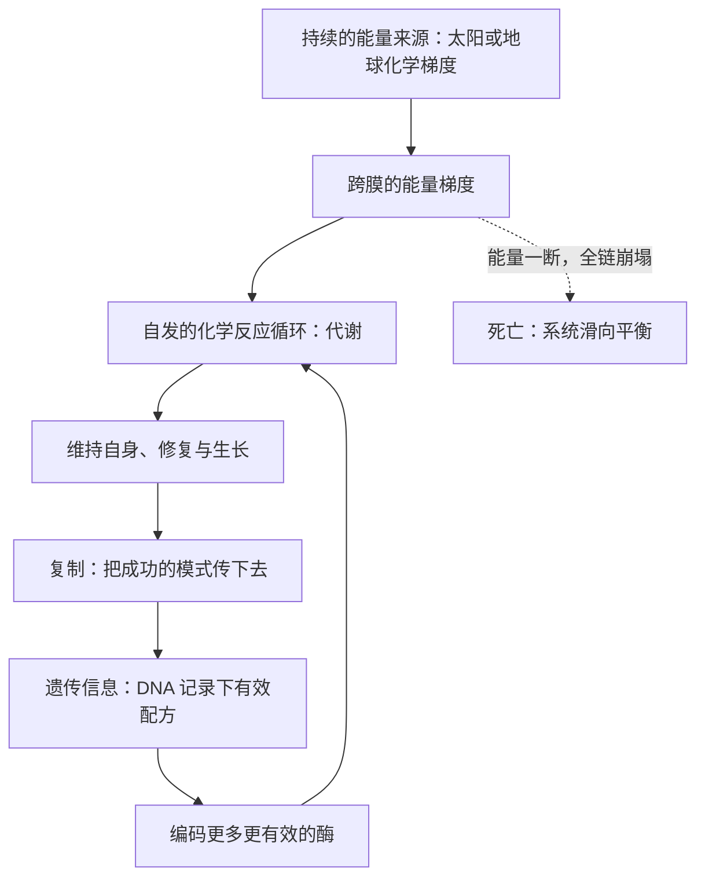

# 02｜生命究竟是什么——为什么「信息」离不开「能量」

> 如果把人体的全部基因序列都交给你，你就真的理解生命了吗？

---

## 一、先说结论

过去几十年，生物学几乎被「信息」这个词接管了。DNA 双螺旋、遗传密码、中心法则，一层层把生命描述成一套写好的程序，基因则是程序里的代码。久而久之，很多人默认：生命就是它的基因组，理解生命就是读懂那串字母。莱恩认为，这种理解是片面的，甚至是一种误导。他主张，生命首先是化学反应与能量的流动；基因信息只有在能量供给之下才有意义，离开能量的信息只是一堆静止的分子。把生命等同于 DNA，会让我们看不见真正驱动演化的问题——能量从哪里来，代价由谁承担。

## 二、我们先理解一个问题

先想一个很平常的场景。假设你手里有一台笔记本电脑，里面存着一个人全部的基因组数据，还有他所有的记忆与文件。现在把电源拔掉，电池也取走。屏幕黑了，风扇停了，硬盘上的数据一个字节都没有丢。

那么问题来了：这台电脑还是「活的」吗？

显然不是。信息完好无损，可它什么也做不了。你不能靠它计算，不能靠它通信，更不能靠它维持自身。缺的不是数据，而是让数据运转起来的能量。

细胞也是这样。DNA 里确实写着构建蛋白质的配方，但 DNA 本身不干活。它不会自己复制，不会自己修复，也不会自己把信息读出来。真正在每时每刻「做事」的，是细胞里成千上万个化学反应——它们需要能量，需要原料，需要一层能维持内外差异的膜。所以，当有人问「生命的本质是信息还是物质」时，莱恩把问题扭向了第三个维度：**是能量。**

## 三、作者到底提出了什么观点？

莱恩的观点可以拆成两层。

第一层是对生命状态的描述：**生命不是一个名词，而是一个动词。** 一个细胞并不是一个稳定的东西，而是一个持续消耗能量、维持自身远离平衡态的化学系统。只要能量流一断，这个系统就迅速滑向平衡，也就是死亡。尸体和活人的化学元素几乎一样，差别在于活人体内仍在流动的能量。

第二层更激进，关于起源的顺序：**能量先于信息。** 莱恩认为，在最早的化学世界里，先出现的是持续的能量梯度与自发进行的化学反应循环；遗传信息是后来才把这些成功模式「记录下来」的手段。换言之，代谢在先，基因在后。基因不是生命的原因，而是生命为了把有效的化学反应稳定下来、传承下去而发展出的工具。

他甚至用一句很重的话来概括：生物学的中心，长期被放在了错误的位置。人们以为基因是主角，其实基因更像是账本，记录着能量如何被使用。

## 四、把这个观点翻译成人话

把细胞想象成一座工厂。

DNA 是档案室里的一柜子图纸，记录着每台机器怎么造、每个零件怎么装。但图纸本身不生产任何东西。要让工厂运转，你需要电力、原料、熟练的工人，还需要一条能把半成品不断推进下去的流水线。没有电，图纸锁在柜子里，工厂就是一片死寂。

细胞的「电力」是能量载体分子，「工人」是酶，「流水线」是代谢通路。它们一起把原料转化成细胞需要的部件，同时不断修补自己、维持内外差异。图纸的意义，只有在工厂运转起来之后才显现。

所以莱恩才说：世界是由能量驱动的，信息只是能量流动留下的记录。你可以保存一份完美的菜谱，但如果没有人、没有火、没有食材，这道菜永远不会出现。

## 五、为什么会这样？

把能量与信息的关系画出来，会看得更清楚：真正放在最前面的，是能量的流入。

这张图的关键在于回路的方向。遗传信息并不是起点，它绕了一圈又回到代谢，帮助细胞更好地获取能量。信息的作用，是让已经成功的能量利用方式被稳定重复，而不是凭一己之力创造生命。一旦能量供给中断，无论信息多么完整，整个循环都会停下来。

莱恩据此提出一个判断：演化真正选择的，不是最优美的基因序列，而是最会算能量账的化学系统。基因只是这场能量博弈的记账方式。

## 六、举一个现实生活中的例子

看看你手机没电变砖的样子。

关机之后，手机里的照片、通讯录、聊天记录、装好的应用，全部原封不动地躺在存储芯片里，一个字节都没丢。可它什么都不是：屏幕黑的，拨不出电话，算不了一道题，连时间都不显示了。一块沉甸甸的金属和玻璃，和一块砖头没有本质区别。

这时你会说「手机就是它的存储内容」吗？不会。你很清楚，真正让这台设备成为手机的，是那股不断流动的电流。信息是内容，电流才是让它运转的前提。生命也是同样的道理：基因组是内容，持续的能量流才是让它活着的前提。这，就是莱恩想让我们换上的那副眼镜。

## 七、回到书中重新理解

现在再读这本书，会发现很多看似独立的谜题，都挂在了同一根钉子上。

生命为什么必须死亡？因为维持远离平衡态需要持续能量，而能量系统会磨损、会泄漏、会积累错误。复杂生命为什么只在历史上出现一次？因为复杂度意味着更高的能量开销，只有一种新的供能方式才付得起这笔账。细菌为什么卡在原地？因为它们的能量供给方式有上限，养不起更大的基因组。

如果只盯着基因，这些问题都无法回答。基因序列本身不告诉你细胞的能量预算，也不告诉你每次复制要付出多少代价。莱恩要做的，就是把能量重新放回解释的中心：**先问这套系统靠什么供能，再问它能长成什么样。**

## 八、这个观点背后还有什么？

这里藏着一个容易被忽略的推论：如果能量先于信息，那么生命的定义也应该跟着改写。

传统上，人们倾向于用「能复制」「有遗传物质」来定义生命。可按照莱恩的思路，一个系统在被记录下来之前，可能已经在利用能量梯度、维持自身了。遗传机制更像是后来加装的稳定器。这意味着，寻找地外生命时，也许不该只找 DNA 或氨基酸，而该去找持续的能量失衡——哪里有稳定的化学梯度，哪里就可能有生命的雏形。

这个推论还有一层现实意义：它提醒我们，生物学的很多争论其实源于视角。你从信息出发，就会问「这段序列编码什么」；你从能量出发，就会问「这个系统如何维持自己」。两种问法会把人带向完全不同的答案。

## 九、这个观点有问题吗？

需要分开看哪些是共识、哪些是争议。

「生命是持续的化学反应、需要能量维持」这一点，属于生物化学的基本事实，没有争议。「基因需要能量才能表达」也是常识。莱恩真正的锋芒在「能量先于信息」这个起源顺序上。

**其一，信息视角并非没有道理。** 有些学者认为，复制与可遗传的变异才是生命区别于其他化学系统的关键，因为没有信息，成功模式无法积累，演化无从谈起。把能量抬得过高，可能低估了信息在长期演化中的独立作用。

**其二，莱恩有把两种视角对立起来的倾向。** 更温和的看法是：能量与信息互相依存、共同演化，硬要分出先后，在现有证据下并不容易。他有时像是在争论「鸡生蛋还是蛋生鸡」。

**其三，关于起源阶段代谢优先还是复制优先，学界存在不同解释。** 有「代谢优先」模型，也有以 RNA 为核心的「复制优先」模型。莱恩明显站前者，但这不是定论。

所以更准确的说法是：生命离不开能量，这一点清楚；把能量说成起源上的绝对起点，则是莱恩的主张，仍在被检验。

## 十、今天再看这个观点

以下是基于作者思想的现代延伸，不是作者原话。

近二十年，系统生物学和非平衡态热力学都在往这个方向靠。研究者越来越倾向于把细胞看作一个耗散结构：它通过不断消耗能量，把自己维持在有序、远离平衡的状态。合成生物学则从另一头验证了能量的分量——当科学家试图造出「最小细胞」时，发现哪怕删到只剩最少的基因，细胞依然要花大量能量去维持膜电位、合成 ATP，能量系统往往是最难精简的部分。

与此同时，单细胞能量代谢的测量技术也在进步，人们可以更直接地看到，一个细胞的能量预算如何限制它能做多少事。这相当于给莱恩的框架补上了可以量化的证据，而不只是哲学式的论断。

## 十一、这一篇真正应该记住什么？

1. 生命首先是持续的化学反应与能量流动，而不是一套静止的信息。
2. 基因信息只有在能量供给下才有意义；没有能量的信息，就像拔掉插头的电脑。
3. 莱恩主张能量先于信息：代谢在前，遗传是后来用来记录成功模式的工具。
4. 只盯着基因，会看不见真正驱动演化的能量与代价问题。

## 十二、留一个问题

如果生命真的是一种靠能量维持的「动词」，那么细胞究竟是怎样把能量存起来、又怎样把它搬运到需要的地方去的？

下一节，我们就走进细胞内部那套通用电网——一堵膜上的质子电池。
