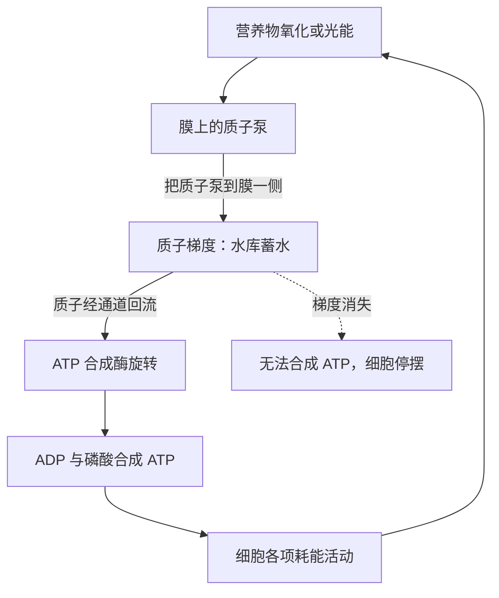

# 03｜我们其实是由「电」构成的——细胞里的质子电池

> 细胞靠什么存能量、搬能量？为什么从细菌到你我，都在用同一套「货币」？

---

## 一、先说结论

如果生命靠能量维持，那么一个关键问题立刻出现：细胞究竟怎样把能量存起来，又怎样把它送到需要的地方？莱恩给出的答案是：**用电，只不过电流的载体不是电子，而是质子。** 所有细胞都在膜的两侧制造出质子（氢离子）浓度差，形成一种既像电池、又像水位差的电化学梯度。这股梯度推动着细胞里最核心的能量分子 ATP 的合成。这套机制叫「化学渗透」，由英国生物化学家彼得·米切尔在二十世纪六十年代提出，今天被看作生命世界通用的电网。它也是全书往后所有论证的地基。

## 二、我们先理解一个问题

先想一个很朴素的问题：细胞为什么要「存能量」？

因为细胞不能想到用能量时再去外面找。它必须像手机一样先把电充进电池，随用随取。可细胞里没有金属电极，也没有锂离子，它拿什么充电？

答案藏在细胞膜上。细胞的内外两侧，质子的浓度可以被调得不一样：一侧多，一侧少。质子带正电，浓度差会同时产生两个效应——电荷的差和浓度的差。两者合在一起，就形成一股推动质子回流的力量。莱恩把这种跨膜梯度称作细胞的「质子动力」，它是所有生命共享的能量货币。

这个想法今天听起来自然，可当年它几乎被整个学界当成笑话。这本身也是这段科学史里最值得回味的部分。

## 三、作者到底提出了什么观点？

莱恩在这一节并没有提出新理论，而是把米切尔的「化学渗透」学说重新推到读者面前，并赋予它极高的地位。

第一，**能量不是直接塞进 ATP 的，而是先以质子梯度的形式储存。** 细胞先把质子泵到膜的一侧，把能量变成一种「势能」；等到需要时，再让质子顺着梯度流回来，途中的一个分子机器顺势把能量装进 ATP。

第二，**这套机制是普遍的。** 从最简单的细菌，到植物叶绿体，再到你我细胞里的线粒体，用的都是同一套办法。不同生命之间的差别，更多在于用什么能量来泵质子，而不是要不要泵质子。

第三，莱恩强调，这个发现经历过长期的冷遇。米切尔在一九六一年提出化学渗透假说时，主流观点认为能量传递靠的是某种高能化学中间物，而不是跨膜梯度。他的想法被视为离经叛道，甚至难以发表。直到证据一点点积累，学界才转向接受，他最终于一九七八年获得诺贝尔化学奖。莱恩借这段历史说明：**一个关于能量的简单直觉，曾经被整个学科忽视了很多年。**

## 四、把这个观点翻译成人话

想象一座水库。

水被泵到高处，蓄起势能。需要用电时，打开闸门，让水从高处冲下来，推动水轮机旋转，带动发电机产生电流。真正被利用的，从来不是「高处的水」本身，而是水从高处流向低处时释放的能量。

细胞的做法一模一样，只不过它的「水」是质子，「高处」是膜的一侧，「水轮机」是一台叫 ATP 合成酶的分子机器。细胞先用能量把质子泵到膜的一侧，堆出一座微型水库；需要能量时，质子从专门的通道流回，ATP 合成酶便像涡轮一样旋转起来，把 ADP 和磷酸捏成一个 ATP。

所以，说「我们其实是由电构成的」，并不是比喻。细胞内部真的有一条由质子流动构成的微型电网，只是它太小，我们无法直接感觉到。

## 五、为什么会这样？

把质子电池的工作流程画出来，结构就很清楚：

这张图里有两个要点。

第一，能量被「中转」了一次。营养物或光能并没有直接变成 ATP，而是先变成质子梯度这个中间形态。这样做的好处是可以把能量暂存起来，还能灵活调度。

第二，ATP 合成酶是一台真正的旋转机器。它由质子的流动驱动，内部转子转动，每转一圈就生成若干个 ATP。莱恩形容它像一台微型涡轮机，这个比喻不是文学修辞，而是结构生物学上的事实。

## 六、举一个现实生活中的例子

看看水电站。

一条大河被大坝拦住，上游水位高、下游水位低。这个水位差就是储存在系统里的势能。水流下的时候，冲击水轮机，水轮机带动发电机，电就出来了。大坝越高，水位差越大，能发的电越多。

关键在于：水电站之所以能发电，不是因为它有「水」，而是因为它维持住了水位的落差。一旦上游下游齐平，水还在，电却发不出来了。

细胞的质子梯度也是这个道理。膜两侧质子浓度相等时，梯度归零，ATP 合成酶空转也发不出能量，细胞随即停摆。所以细胞一生都在拼命维持这个落差——不断把质子泵出去，就像水电站不断把水提回高处。所谓活着，某种程度上就是不停地给自己充电。

## 七、回到书中重新理解

现在再读莱恩的能量论证，会发现质子梯度是一条贯穿全书的暗线。

它解释了为什么生命必须依赖膜。没有膜，就隔不出内外，就制造不了梯度。它也解释了为什么所有生命共用同一套能量机制——因为这套机制实在太早、太基础，早在最后一个共同祖先之前就定型了。它还解释了为什么细胞的能量上限与膜的面积有关：膜的折叠程度决定了能容纳多少套泵和涡轮机。这正是后面「细菌为什么卡在能量瓶颈上」的关键伏笔。

莱恩反复提醒，能量不是抽象的背景，而是有形状、有位置、有几何约束的实体。质子梯度在膜上，膜的面积有限，于是复杂性就有了天花板。

## 八、这个观点背后还有什么？

这里有个耐人寻味的延伸：质子梯度可能比 DNA 更古老。

如果生命起源时先有能量结构，那么最早的质子梯度很可能来自地球本身——比如海底热泉两侧天然的化学差异，而不需要细胞自己制造。也就是说，细胞后来学会的这套「充电」本事，最初可能是从地质环境里「借」来的。莱恩认为，这正是理解生命起源的钥匙：生命不是凭空发明了能量系统，而是接管了一套本来就在运转的自然电池。

这个视角还有一个推论：如果能量机制如此基础，那么任何独立的生命起源，也许都会收敛到类似的方案。这就让「生命起源」从纯粹的偶然，变得带有某种可预期的成分。

## 九、这个观点有问题吗？

要区分「机制的细节」和「框架的推论」。

化学渗透本身，即质子梯度驱动 ATP 合成，今天属于教科书级的科学事实，有大量实验支持，争议极小。米切尔的历史遭遇更多是学术惯性，而不是理论错误。

真正的讨论出现在莱恩据此做的推论上。**其一，存在例外。** 少数微生物确实能绕过质子梯度，直接用底物水平磷酸化或钠离子梯度获取能量。它们数量不多，但说明「所有生命都用同一套电网」这句话，严格说需要打点折扣。**其二，把质子梯度抬成生命定义的核心，可能过度简化。** 有学者认为，它只是能量转换的一种通用实现，未必等同于生命的本质。**其三，关于最早的生命是否真的「借用」了地质梯度，学界存在不同解释**：碱性热泉方案有支持者，也有认为生命先在别处起源、后来才发展出化学渗透的观点。这些都是活跃的假说，不是定论。

所以稳妥的说法是：化学渗透是事实；把它讲成全部生命的故事、乃至生命起源的起点，则是莱恩带有倾向性的主张。

## 十、今天再看这个观点

以下是基于作者思想的现代延伸，不是作者原话。

近十几年，结构生物学把 ATP 合成酶拍得越来越清楚，人们可以直接看到它旋转的部件，甚至用高速成像记录它转动的过程。这台机器被认为是自然界最精巧的纳米马达之一，也成为仿生学和纳米机械研究的灵感来源。

在医学上，质子梯度的视角也有现实意义。许多药物正是通过干扰膜电位或质子泵来发挥作用，比如某些抗生素针对细菌的质子梯度，从而在不影响人体细胞的情况下杀菌。此外，研究衰老的学者也在追问，线粒体膜电位的下降是否与能量供应衰退有关。这些都说明，一块膜上的电压，确实是理解生命与疾病的一条实用线索。

## 十一、这一篇真正应该记住什么？

1. 细胞把能量先存成质子梯度，再通过 ATP 合成酶转成 ATP。
2. 这套机制叫化学渗透，由彼得·米切尔提出，曾被主流冷落，后来获得诺贝尔奖。
3. 质子梯度像水电站的水位差，关键是维持落差，落差一没，细胞就停摆。
4. 膜的面积决定了能量上限，这为后面「细菌的能量瓶颈」埋下伏笔。

## 十二、留一个问题

既然生命靠地质与化学提供的能量梯度维持，那么最早的生命，会不会根本不是从「温暖的原始汤」里随机拼出来的？

下一节，我们就去拆掉这个流传了百年、却可能站不住脚的画面。
