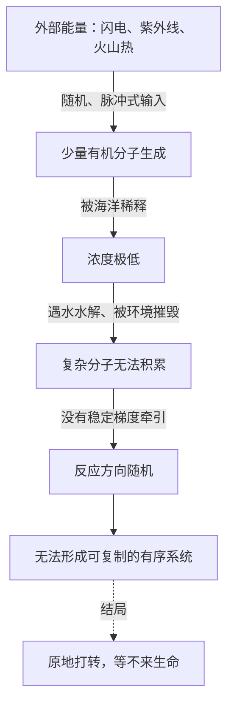

# 04｜生命诞生在「温暖的小池塘」里吗——被误信百年的原始汤

> 闪电劈进一锅汤，真的能劈出生命吗？为什么这个画面在化学上站不住脚？

---

## 一、先说结论

关于生命起源，流传最广的画面大概是「原始汤」：早期地球的海洋是一锅稀薄的有机分子浓汤，闪电、紫外线、火山热不断给这锅汤加能量，分子随机碰撞、越拼越复杂，最后拼出了第一个生命。达尔文当年也设想过一个「温暖的小池塘」。莱恩认为，这个图景在化学上站不住脚。它把生命起源寄托在外部能量和随机碰撞上，却在三个地方同时失败：能量供给不稳定、反应方向没有指向性、关键分子浓度太低。生命需要的不是偶尔一次闪电，而是持续、稳定、有方向性的能量梯度。这一节要做的，就是先把这个直觉拆掉，为下一节的正确地址腾出空间。

## 二、我们先理解一个问题

先问一个最基本的问题：把两个分子放到一起，它们会自己结合成更复杂的分子吗？

多数情况下不会。它们可能根本不反应，可能反应了又立刻散开，也可能生成一大堆乱七八糟的副产物。要凑出生命所需的那种长链、有序、可重复的分子结构，难度高得多。

这就是原始汤假说面对的第一道坎。它假设有一个「浓汤」，分子在里面不断碰撞，总有一刻会碰对。可现实里，早期地球的海洋极其稀薄，有机分子一旦生成，马上就被稀释到近乎为零。稀到这种程度，两个分子相遇的概率低得可怜。更麻烦的是，水本身还在不断破坏复杂分子：很多生命必需的长链分子，遇水就容易水解断裂。把原材料放进一个巨大的水池，相当于一边攒积木，一边有人不停把它们拆开。

## 三、作者到底提出了什么观点？

莱恩在这一节主要做的是「反驳」，可以归为三点。

第一，**能量形式不对。** 闪电和紫外线是脉冲式的、随机的、分布不均的。它们能在局部瞬间制造出一批有机分子，却无法持续地、有方向地推动反应向更复杂的方向走。莱恩主张，生命需要的是一股稳定的能量流，而不是间断的电击。

第二，**方向性缺失。** 光合作用、代谢这类生命核心过程，本质上都是被能量梯度「牵引」着往前走的定向反应。而随机碰撞没有方向，热力学第二定律会把它推向混乱，而不是推向有序。偶尔生成一点复杂分子，也会很快被环境的涨落摧毁。

第三，**浓度问题无解。** 就算分子真的拼出来了，它们在开放海域里也留不住。没有一道边界把它们聚在一起，没有持续的能量把它们维持在高浓度，复杂结构就不可能有时间积累、复制、被选择。

莱恩的结论是：原始汤不只是一个细节有误的假说，而是把因果顺序搞反了。生命不是先有分子、再找能量，而是先有稳定的能量结构，分子再被这股能量组织起来。**先有电池，后有电路。**

## 四、把这个观点翻译成人话

把生命起源想象成盖一栋房子。

原始汤的思路是：把砖头、木料、水泥全倒进一片空地上，然后指望一场接一场的暴风雨把它们吹成一座房子。乍听之下，只要材料够多、时间够长，似乎总有碰巧拼成的可能。

可你仔细想一想就会明白：暴风雨带来的是混乱，不是结构。它会吹散已经立起来的墙，会打乱刚码好的砖。房子真正需要的，是一个持续、定向的力量——起重机把构件吊到该去的位置，工人按图纸把它们固定下来。能量必须被「引导」，才会变成结构。

生命也一样。它不缺原材料，缺的是一台能持续运转、方向明确的「起重机」。原始汤把希望寄托在偶然上，而莱恩认为，出路恰恰在于找到那台天然存在的、由地球提供的起重机。

## 五、为什么会这样？

把原始汤的困境画出来，会更直观：

这张图的核心，是两条同时作用的负反馈：一边被不断稀释，一边被不断摧毁。只要这两条同时存在，复杂度就永远攒不起来。要让局面逆转，必须换一种能量供给方式——不是往系统里丢能量，而是让系统本身处在一股持续、定向的能量梯度中。

## 六、举一个现实生活中的例子

想象你把一箱拆散的零件倒进洗衣机。

里面是螺丝、齿轮、弹簧、外壳，全都混在一起。你按下开关，滚筒开始转，零件叮叮当当互相碰撞。转一个小时，转一天，转一年，会发生什么？

它们不会自动拼成一台机器。恰恰相反，原本完整的零件会被撞坏、磨圆、卡死，最终变成一堆更难用的废铁。混乱的搅动会把材料推向更无序的状态，而不是更有结构的状态。

这就是原始汤图景的问题所在：它期待混乱带来秩序，期待偶然带来设计。而真实的世界里，秩序的来源从来不是搅动，而是被引导的能量。洗衣机转得再久，也变不出一台成品；原始汤熬得再久，也熬不出一个细胞。

## 七、回到书中重新理解

现在再读莱恩对原始汤的批评，就能看出它不只是「挑刺」，而是在重建因果。

他真正要纠正的，是那种把生命起源当成「材料问题」的思路：仿佛只要凑齐原料、给足时间，生命就会自发出现。莱恩认为，材料从来不是瓶颈，瓶颈是**如何把持续的能量变成有方向的组织过程**。这一点想通了，寻找生命起源的方向也就变了：不要去开放的大海，而要去找有稳定能量梯度的特殊环境。

换句话说，驳倒原始汤不是终点。它的价值在于把问题从「分子怎么随机拼起来」改写成了「哪里存在能持续推动化学反应的天然结构」。这个改写，正是下一节所有内容的前提。

## 八、这个观点背后还有什么？

这里有一段值得补充的科学史。一九五三年，米勒和尤里做了著名的实验：在烧瓶里模拟早期大气，用电火花放电，结果真的合成了几种氨基酸。这个结果当年轰动一时，常被引为原始汤假说的证据，也长期写进教科书。

但莱恩提醒，这个实验证明的其实是「简单有机分子可以非生物地生成」，而不是「生命可以这样诞生」。从氨基酸到活细胞之间，隔着一条深不见底的鸿沟：需要长链聚合物、需要稳定的膜、需要能量转换机制、需要可复制的信息分子，还要这些东西在同一个地方、同一段时间里凑齐。米勒实验照亮了第一步，却让很多人误以为后面的路也顺理成章。

莱恩的意思并不是否定这类实验的价值，而是指出：它解决的是「原料从哪来」，而生命起源的真正难题是「组织从哪来」。这两个问题不能混为一谈。

## 九、这个观点有问题吗？

要小心区分哪些是共识、哪些仍在争论。

「原始汤式的随机碰撞难以解释复杂生命的起源」，这一点在学界有相当广泛的认同，米勒实验的局限也普遍被承认。莱恩的批评方向大体成立。

但仍有需要平衡的地方。**其一，原始汤假说并未被彻底否定。** 有学者认为，在潮汐池、黏土表面、冰晶间隙等局部环境里，分子可以被浓缩、被保护，浓度和方向性问题并非完全无解。莱恩的批判可能略显绝对。**其二，外部能量也并非一无是处。** 一些实验表明，干湿循环、温度涨落这类周期性条件，确实能驱动简单聚合反应。**其三，关于生命起源地点，学界存在不同解释**：原始汤、碱性热液喷口、陆上温泉、甚至外太空输入，都有人支持。莱恩强烈倾向热液方案，但这是他的主张，而非唯一答案。

所以更准确的说法是：原始汤作为一个完整的解释，确实漏洞明显；但把它彻底扫进历史，还为时尚早。

## 十、今天再看这个观点

以下是基于作者思想的现代延伸，不是作者原话。

近二十年，陆上温泉假说重新活跃起来。有研究者认为，早期地球陆地上的火山温泉，反复经历干湿交替，能让分子在干的时候连接、湿的时候聚拢，这种循环比开放海洋更适合推动复杂分子的形成。这跟莱恩批评的「稀释与水解」正好呼应，只是把地址从深海搬到了陆地。

与此同时，实验室里已经能在模拟热液条件下合成出部分生命所需的前体分子，向着「组织从哪来」这个更难的问题靠近了一步。这些工作还不能证明生命起源的完整路径，但说明莱恩提出的问题，正在被严肃地用实验追赶。

## 十一、这一篇真正应该记住什么？

1. 原始汤依赖闪电、紫外线等外部能量，把分子随机拼成生命，这个图景广为人知却漏洞明显。
2. 它至少在三处失败：能量不稳定、反应无方向、浓度留不住。
3. 米勒实验证明了简单有机分子可以非生物生成，但远不足以解释生命。
4. 莱恩的关键改写是：生命需要持续、稳定、有方向性的能量梯度，而不只是原料。

## 十二、留一个问题

如果真的存在一个地方，能天然提供持续、稳定的能量梯度，那么生命的出现，会不会就不是巧合，而更接近于一种必然？

下一节，我们潜入深海，去看那些还在冒热气的碱性热液喷口。
