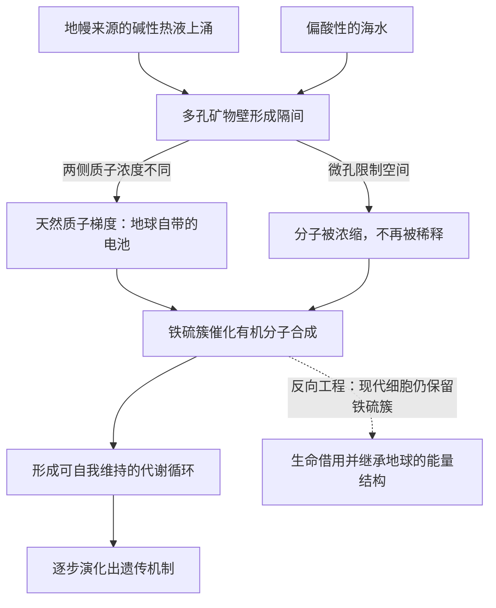

# 05｜生命起源为什么可能是一种必然——深海热泉与质子梯度

> 如果生命不是一场偶然的奇迹，它最可能在哪里、以什么方式出现？

---

## 一、先说结论

莱恩追随地质学家迈克尔·罗素的思路，认为生命起源于海底的碱性热液喷口。那里有一种罕见的天然结构：炽热的碱性流体从岩石缝隙喷出，与周围偏酸性的海水之间，被一层薄薄的矿物隔开。这层矿物天然充当了「膜」，两侧的质子浓度差天然形成了梯度，微孔则像一个个微型反应舱。矿物表面的铁硫簇还能催化有机分子的合成。莱恩据此主张，生命起源不是从零开始，而是「借用」了地球已有的能量结构。如果这套机制成立，那么生命的出现就不再是纯粹偶然的奇迹，而带有某种必然性。不过必须强调，这仍是一个活跃的假说，学界另有「酸性热泉」「黑烟囱」等不同方案。

## 二、我们先理解一个问题

先问：如果上一节已经把原始汤否定掉了，那生命到底需要什么样的环境？

需求其实可以用三条来概括。第一，要有持续、稳定的能量来源，不能靠偶尔的闪电。第二，要有办法把分子聚拢、不让它们被稀释掉。第三，要有某种「方向性」，让反应朝更复杂的方向走，而不是随机地散开。

把这三条摆在一起，会发现它们指向一个共同的特征：**环境本身必须自带结构。** 开放的大海是均质的，没有边界，没有方向；而一个有结构的环境，才能天然提供分隔、浓缩和能量牵引。罗素和莱恩要找的，正是这样一个自带结构的地方。海底热液喷口，恰好同时满足条件。

## 三、作者到底提出了什么观点？

莱恩与罗素的核心主张，可以拆成四点。

第一，**矿物微孔充当了最早的细胞隔间。** 碱性热液喷口会析出多孔的矿物结构，里面布满微小的孔道。每个孔道都同时接触两股不同的流体，等于一个天然的「反应舱」，把分子限制在狭小空间里，解决了稀释问题。

第二，**天然质子梯度充当了最早的电池。** 喷口流体偏碱性，周围海水偏酸性，两者被矿物隔开，就出现了质子浓度差。这与现代细胞膜上的质子梯度在本质上是同一种东西。换句话说，地球早在生命出现之前，就在自发地「造电」。

第三，**矿物表面的铁硫簇充当了最早的催化剂。** 铁硫簇是一类含铁和硫的原子团，现代细胞里许多关键酶的核心正是它。莱恩认为，最早利用能量、合成有机分子的反应，可能就发生在这类矿物表面，后来才被细胞「招聘」进自己的酶里。

第四，**由此推出必然性。** 如果能量、隔间、催化剂都天然具备，那么从简单分子走向更复杂的化学系统，就不需要一个接一个的巧合叠加。环境会把反应往这个方向推。这就是莱恩所说「生命可能是一种必然」的含义。

## 四、把这个观点翻译成人话

把深海喷口想象成一台天然的分拣与组装流水线。

热气腾腾的碱性水从地底涌出，穿过岩石缝隙，遇上海水。岩壁上析出的多孔矿物，就像一堵布满无数小格子的墙。每个小格子里，两侧流体的成分不同，于是产生了电压差；格子的壁上嵌着铁硫矿物，就像涂了一层催化剂，让经过的分子更容易发生反应。

在这个环境里，反应不需要被「碰巧」触发。能量差摆在那儿，催化剂摆在那儿，空间也被限住了。分子只要进入这个结构，就会被推着往某个方向走。莱恩想说的是：生命的起步，不是某个天才分子灵光一现，而像是一条流水线自动把原料加工成半成品，一届届越做越复杂。

## 五、为什么会这样？

把碱性热液喷口的机制画成图，会比文字更清楚：

这张图的关键，是「天然」两个字。膜不是细胞发明的，梯度不是细胞制造的，催化剂也不是细胞合成的——它们全都是地质活动的副产品。生命要做的第一件事，不是从无到有地发明能量系统，而是学会接管一套已经在运转的系统。莱恩认为，这正是生命起源最难、也最容易被忽略的一步。

## 六、举一个现实生活中的例子

看看黄石公园的热泉。

那些咕嘟冒泡的地热泉，颜色诡异，水汽蒸腾，周围寸草不生。它们看起来像是死亡之地，可那里的岩石壁上，同样有矿物析出、有温度差、有化学成分的落差。整个区域就像一块裸露在地球表面的电池：一头是深处的热量与还原性物质，一头是地表的氧化性环境，两者之间的落差持续存在，几十亿年不停歇。

生命并不需要在这里被创造出来，它需要的是这种落差。黄石的热泉提醒我们：地球从来不是一潭均质的水，它到处是能量的高低差——有的地方热，有的地方冷；有的地方酸，有的地方碱。生命的祖先，很可能就诞生在这样一处持续的落差里，而不是在一锅被闪电偶尔搅动的汤里。

## 七、回到书中重新理解

现在再读莱恩的整个框架，可以看出热液喷口这一节的分量。

它不仅回答了「生命从哪里来」，还顺手解释了后面几个大问题。为什么所有细胞都用质子梯度？因为最早的细胞就是从地质梯度里长出来的，这套机制保留至今。为什么细胞里有铁硫簇？因为那正是最早催化剂的遗产。为什么生命起源可能具有某种必然性？因为推动它的不是运气，而是地球本身持续了数亿年的能量结构。

莱恩把这一节称作全书的「锚点」并不为过。在此之后，无论是细菌的能量瓶颈、内共生的能量突破，还是复杂生命的稀有性，都建立在「生命本质上是能量现象、且起源依赖地质能量结构」这个地基之上。

## 八、这个观点背后还有什么？

这里藏着一个相当大胆的推论：如果热液喷口式的环境在宇宙中并不罕见，那么生命起源也许比人们想的更容易。

碱性热液喷口需要的是水、岩石、热量，以及一个氧化性偏强的外部环境。这些条件在太阳系里并非地球独有。罗素和莱恩的追随者由此推测，只要有类似的能量落差，生命的化学起步就可能发生。这跟「生命是极小概率的偶然」形成鲜明对照。

莱恩还暗示，这套机制可能解释了「为什么生命如此迅速出现」。地球形成后不久，大约四十亿年前，就已经有生命迹象。如果起源真的需要一连串天大的巧合，这么短的时间就说不通；但如果它只需要一个自带结构的能量环境，时间就宽裕得多。

## 九、这个观点有问题吗？

要非常小心地对待这一节，因为它涉及的是活跃假说，而不是既成事实。

「生命需要持续能量梯度和天然隔间」这一方向上的批评，在学界有相当支持。但具体到「碱性热液喷口就是生命的诞生地」，远未定论。**其一，有机分子的稳定性是个问题。** 有学者指出，碱性热液环境温度不高、条件温和，但有观点认为它不利于某些关键前体分子的形成与保存；也有人认为这恰恰是优点。**其二，关于起源环境，学界存在不同解释。** 除了碱性热液喷口，还有「黑烟囱」方案——它温度更高、酸性更强，支持者认为那里的化学条件更适合某些反应；此外，陆上温泉、甚至外太空输入也被认真讨论。**其三，从「有梯度、有催化剂」到「出现可自我维持的代谢与遗传」，中间仍有巨大的空白。** 莱恩的叙事在这段路上主要依靠逻辑推演，而非完整实验证据。

所以稳妥的说法是：莱恩和罗素提供了一条逻辑上自洽、且能解释若干事实的路径；但把它当作已经证实的答案，为时过早。

## 十、今天再看这个观点

以下是基于作者思想的现代延伸，不是作者原话。

近十多年，深海探测和实验室模拟给这个假说补上了一些支点。研究者在大西洋中脊的「失落之城」等碱性热液场发现，那里确实存在大规模的天然质子梯度和多孔矿物结构，与理论预测相当吻合。实验室里，也有人在模拟热液条件下尝试合成氨基酸、核苷酸前体，甚至可自我维持的小型反应网络。

这些进展让碱性热液假说从纯粹的思辨，变成了可以被检验、被反驳的科学命题。与此同时，对陆上温泉的研究也在快速推进，两条路线正在争夺「最早生命摇篮」的名号。这场争论本身，就是这门学科最有活力的部分。

## 十一、这一篇真正应该记住什么？

1. 莱恩追随罗素，主张生命起源于海底碱性热液喷口，而非原始汤。
2. 那里的矿物微孔提供隔间，天然质子梯度提供能量，铁硫簇提供催化。
3. 生命起源因此不是从零开始，而是借用了地球已有的能量结构，可能带有必然性。
4. 这仍是活跃假说，学界另有黑烟囱、酸性热泉、陆上温泉等不同方案。

## 十二、留一个问题

如果生命就这样在地球上出现了，那么细菌和古菌的共同祖先——那个被称为 LUCA 的细胞——究竟长什么样？它是不是已经拥有了我们前面讲到的全部本事？

下一节，我们回到生命树上那个最古老的节点。
