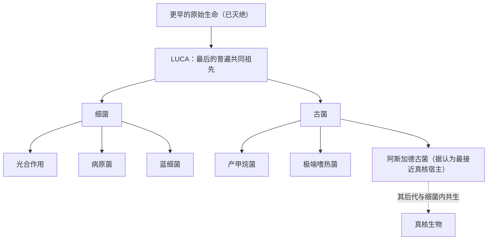

# 06｜LUCA——所有生命最后的共同祖先长什么样

> 细菌和古菌的共同祖先到底是什么样子，为什么它已经握有后来所有生命的关键机制？

---

## 一、先说结论

莱恩认为，LUCA——所有现存生命最后的共同祖先——并不是一团还在化学与生命之间摇摆的「原生糊」，而很可能已经是一个相当完整的细胞。它有细胞膜，有靠质子梯度运转的能量系统，有 DNA、RNA 和蛋白质合成的完整机器，还有一套基本的代谢网络。

更重要的一点是：细菌和古菌这两大分支，并不是各自从不同的源头摸索出生，而是在 LUCA 之后才分开的两条路。我们习惯把演化想象成一棵树，越靠近根部越简单；但莱恩提醒，根部那个点，可能一点也不简单。

## 二、我们先理解一个问题

先把「共同祖先」这个概念讲清楚。

所有生命都用同一套遗传密码，同一套核糖体，同一种能量货币 ATP，同一套把质子泵过膜来存能量的办法。这种高度统一不可能各自发明，只能来自一个共同起点。这个起点就是 LUCA，全称是「最后的普遍共同祖先」。

注意这里的「最后」两个字。LUCA 不是生命史上的第一个细胞，而是「今天所有活着的东西，能追溯到的那位最近的共同祖先」。在它之前，很可能还有其他生命，但那些支系都灭绝了，没有留下后代。所以 LUCA 更像是一场大淘汰之后唯一幸存的家族，而不是伊甸园里的第一个生命。

问题就来了：这个唯一幸存者，长什么样？

## 三、作者到底提出了什么观点？

莱恩的观点可以分三层。

第一层，LUCA 已经是一个真细胞。它不是一袋乱糟糟的分子，而是有边界、有内部结构、能自我复制、能维持自身运转的生命单位。

第二层，LUCA 已经会「用电」。它靠跨膜质子梯度来驱动能量，这套机制与今天的细菌、古菌乃至我们的线粒体一脉相承。换句话说，化学渗透不是后来某个分支的发明，而是从 LUCA 就带下来的祖传手艺。

第三层，LUCA 的年代和生存环境仍然扑朔迷离。它究竟住在深海热泉、还是别的地方；它究竟出现在四十亿年前，还是更晚；它有没有一层严实的膜，这些都还在争论。莱恩本人倾向于：LUCA 生活在一个依赖地质能量、含铁硫、缺氧、偏高温的环境里。

## 四、把这个观点翻译成人话

换个说法：LUCA 不像一台刚拼出一半的机器，更像一台已经能跑的旧车。

它可能没有漂亮的外壳，也没有今天细胞那么精细的配置，但发动机、变速箱、油路都已经在了。细菌和古菌后来各自换轮胎、改内饰、走不同的路，可底盘是同一套。

这也改变了我们理解演化史的方式。我们原以为生命是从最简陋的状态「慢慢往上加」，但 LUCA 的故事暗示：在生命史的最早期，就发生过一次相当彻底的「配置完成」，之后才是漫长而多样的分家。

## 五、为什么会这样？

要理解这个判断，得看两大分支分家之后，各自换了什么。

从图里能看到一个关键结构：细菌和古菌是 LUCA 之后才分叉的两大支系，它们共享的是 LUCA 留下的遗产，而它们各自的新发明——比如细菌的光合作用、古菌的产甲烷——都发生在分家之后。

真正让人惊讶的是遗产的丰富程度。一些研究尝试重建 LUCA 的基因清单，结果通常得到几百个核心基因，覆盖能量代谢、氨基酸合成、遗传信息传递等方方面面。这意味着：在两大分支分开之前，这些机制就已经到位了。

还有一个细节支持「LUCA 会用电」：细菌和古菌的膜脂化学成分明显不同，连耦合质子梯度的酶系也不一样。如果 LUCA 已经有一层完整的膜，那两大分支等于各自独立重造了膜化学。莱恩据此推测，LUCA 的膜可能并不严实，甚至依赖环境本身的质子梯度——它一边「借用」外界的能量差，一边已经开始学着把能量差攥在自己手里。

## 六、举一个现实生活中的例子

想想语言。

今天的英语、德语、法语、印地语、波斯语，看起来千差万别，可语言学家发现它们共享一批古老的词汇和语法结构，于是推断它们来自同一种已经消失的语言——原始印欧语。人们从「父亲」「母亲」「三」这类最不容易被替换的词入手，一点点拼回它的样貌。

关键在于：原始印欧语不是几声含混的吼叫。它已经有完整的语法、丰富的词形变化、成体系的数词。也就是说，那个「共同祖先」本身就已经是一种成熟的语言，各现代语言只是它的不同后代。

LUCA 之于生命，正是原始印欧语之于现代语言。共同祖先并不意味着简陋；恰恰相反，能留下这么多后代和这么统一的规则，往往说明它当时已经相当完备。

## 七、回到书中重新理解

现在再读莱恩，就会发现「LUCA 长什么样」不是一道怀旧题。

它是在追问：复杂性的起点到底在哪里？如果 LUCA 已经拥有能量系统和遗传系统，那么后面我们关心的那些问题——细菌为什么卡住、真核为什么只出现一次——就必须从 LUCA 这个高起点开始算起。

换句话说，生命的故事不是「从零到英雄」，而是「从一个不低的起点开始分岔」。真正难解释的，是为什么只有一条支系越过了复杂性的门槛。

## 八、这个观点背后还有什么？

背后藏着一个关于「根」的分歧。

传统的看法把演化树画成一棵不断分叉的树，根就是 LUCA。但近年来对深海沉积物和地下深部生物圈的研究，让画面复杂起来。科学家在海底以下数百米、甚至更深的沉积物和岩石里，发现了大量活着的微生物；这些环境稳定、缺氧、能量稀缺，可能很接近早期地球的条件。于是有人主张，生命的多样性中心也许在「深部」，而我们熟悉的表层世界只是它伸出来的一角。

如果这个画面成立，那么细菌和古菌的分家可能发生在一个我们尚未看清的深部生态里，LUCA 也可能并不孤独——它身边也许还有别的支系，只是后来都消失了。

## 九、这个观点有问题吗？

需要把共识和主张分开。

「所有生命共享一个共同祖先」，这是主流共识，证据充分。「LUCA 拥有遗传机制和基本代谢」，也被广泛接受。争议主要集中在他更具体的判断上。

**其一**，LUCA 的能量系统有多完整？有学者认为 LUCA 已经具备完整的化学渗透能力，也就是自备膜和质子泵；也有学者认为它更像一个「依赖环境梯度」的半成品，自己还没学会完整发电。两种模型对膜的判断不同。**其二**，LUCA 的基因清单是用今天活着的生物反推出来的，容易高估或低估，不同研究得到的数字差距不小。**其三**，LUCA 的年代估算依赖分子钟和地质证据的校准，目前仍是一个很宽的区间，不是精确的日期。

所以更稳妥的说法是：LUCA 不简单的判断很有说服力；它具体的装备水平、居住环境和确切年代，则还是有待继续检验的前沿问题。

## 十、今天再看这个观点

以下是基于作者思想的现代延伸，不是作者原话。

近年的一个热点，是所谓「阿斯加德古菌」。研究者从海底沉积物、热泉和地下样本里，陆续拼出了这类古菌的基因组。它们带着不少原本以为只属于真核生物的基因，比如与细胞骨架、膜变形有关的基因。这让「真核宿主的近亲是某类古菌」的猜想有了实打实的证据。

与此相关的是对深部生物圈的持续探测。钻探船从海底取样，微生物学家再从里面提取 DNA，拼出一种又一种从未培养过的生命。可以想见，未来关于 LUCA 的争论，很大程度上会由这些来自地下的新数据来决定。

## 十一、这一篇真正应该记住什么？

1. LUCA 是今天所有生命能追溯到的最近共同祖先，不是生命史上第一个细胞。
2. 莱恩认为 LUCA 已是一个拥有质子梯度能量系统、遗传机制和基本代谢的完整细胞，而不是简单的原生糊。
3. 细菌和古菌是 LUCA 之后才分家的两大分支，各自的新发明都发生在分家之后。
4. LUCA 的确切样貌、年代与生活环境仍是研究前沿，作者判断的部分属于活跃假说。

## 十二、留一个问题

如果连共同祖先都已经这么完备，那么真正该追问的就不再是「生命如何从零变复杂」，而是：为什么在 LUCA 之后，绝大多数支系——尤其是细菌——都停在了简单这一侧？

四十亿年，环境变了几轮，细菌几乎无处不在地活了下来，却始终没有变大、变复杂。这究竟是它们不想，还是根本做不到？

下一节，我们就从一道关于「面积」与「体积」的几何题说起。
