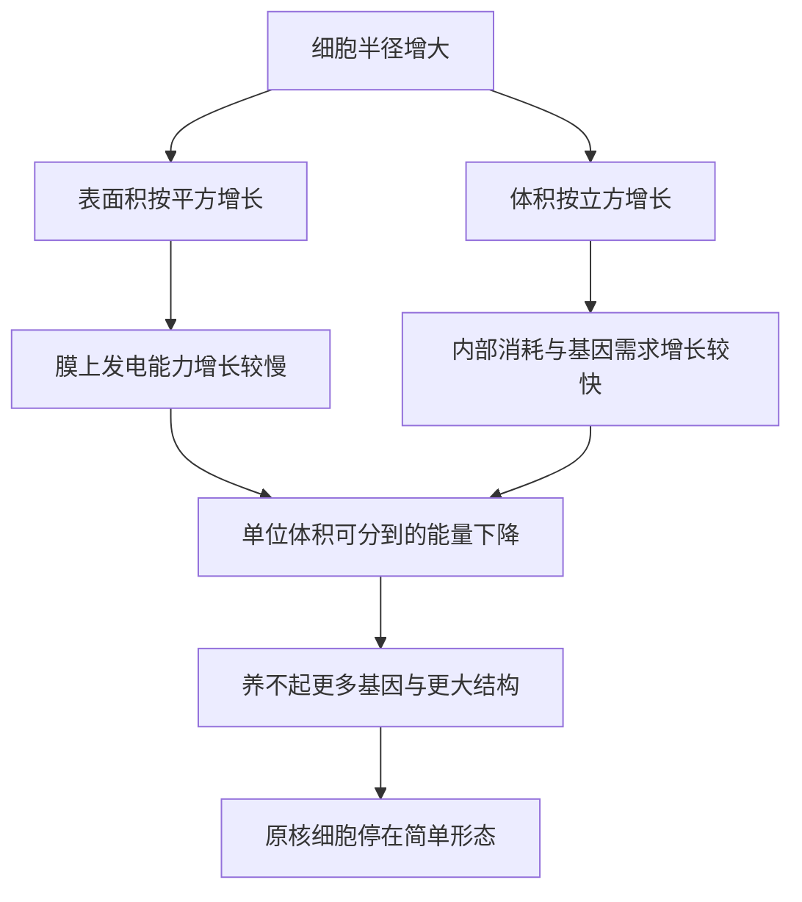

# 07｜细菌统治了地球四十亿年，为什么始终没有变复杂

> 既然细菌无处不在、本领高强，为什么它们四十亿年都没能长成大型、多细胞的复杂生命？

---

## 一、先说结论

莱恩认为，答案不在懒惰，也不在运气，而在几何与能量。细菌的能量生产依赖细胞膜，而膜是一层「表面」。细胞越大，体积按三次方涨，表面积只按二次方涨，能分摊到每个基因、每份细胞质上的能量就越来越少。要变复杂，就得养更多基因、造更大结构，可细菌的能量供给方式负担不起。这不是进化路上的一次失败，而是被几何锁死的一道天花板。

## 二、我们先理解一个问题

先问一个反直觉的问题：复杂一定更好吗？

直觉上，大、复杂、多细胞像是「高级」。可细菌活得好好的：它们占据极地、热泉、高盐湖、地下深处，甚至我们的肠道；论总生物量，它们可能比所有动物加起来还多。它们并不需要变复杂来生存。

所以真正的问题不是「为什么细菌不努力」，而是：**如果变复杂需要付出某些代价，细菌付得起吗？** 这一节要讲的，就是那笔代价。

## 三、作者到底提出了什么观点？

莱恩的观点可以概括为一句话：**原核细胞的能量供给被细胞膜的面积卡住了。**

他把细胞想成一个靠墙上的插座供电的房间。细菌的所有发电设备——呼吸链、ATP 合成酶——都装在细胞膜上。膜是细胞的「外墙」，所以发电能力正比于表面积。

细胞要长得更大，内容即体积，增长得比外墙即表面积快得多。于是每单位体积能分到的膜就越来越少，能量也就越来越紧张。

真核细胞解决这个问题的办法，是把大量膜折进细胞内部，变成线粒体的内膜。相当于在房间里装满发电机，而不是只靠一面墙。这个差别，就是细菌和真核生命之间那道决定性的鸿沟。

## 四、把这个观点翻译成人话

可以把它理解成一家小卖部和一栋大楼的供电差异。

小卖部只有一面墙的插线板，能带动的电器有限；想多进货、多雇人、装更多设备，电就不够了。大楼则在每层、每间房里都布了线路，所以能同时支撑电梯、空调、服务器、照明。

细菌就是那家小卖部。它的基因组、蛋白质合成、代谢都在消耗电，而这些电全靠外膜上的泵来供。它当然可以多复制几份基因、多做几件事，但每多做一件，就要从有限的插线板上再分走一部分。

真核细胞则在大楼化之后，才真正有余力去扩张——更大的基因组、更复杂的调控、最后是多细胞的身体。这一节的核心，就是理解那道「面积追不上体积」的数学。

## 五、为什么会这样？

关键是一道几何题。假设细胞近似球形，半径记为 r。

- 表面积是半径的二次方量级，随半径增大按平方增长。
- 体积是半径的三次方量级，随半径增大按立方增长。

半径翻一倍，表面积变四倍，体积却变八倍。也就是说，**体积永远跑在表面积前面。**

对细菌来说，膜就是发电站，所以「表面积」直接等于「供电能力」。而细胞内部的每一项活动、每一个基因的维持，都要消耗蛋白质，都要耗能。

于是随体积增长，出现一个越来越紧的挤压：需求按体积膨胀，供给按表面积跟，单位体积可用的能量必然下滑。要在这种条件下维持一个庞大的基因组，等于让一个小卖部的插线板去带一整栋楼的用电，根本不现实。

真核细胞的做法是把发电站搬进内部。线粒体的内膜反复折叠，把巨大的产能面积塞进细胞里，供给不再受外表面限制。几何这道墙，就这样被绕过去了。

## 六、举一个现实生活中的例子

拿一块大冰和一堆碎冰来比较。

同样是一公斤冰，放在同一个房间里，哪一份化得快？

答案是碎冰。因为化冰发生在表面，大冰块只有外层接触空气，内部冻得结结实实；而碎冰把同样的体积切成了无数小块，总表面积大得多，于是每一份冰都能同时和暖空气接触，融化自然快得多。

决定融化速度的，不是冰的总量，而是「表面积除以体积」这个比值。碎冰赢在这个比值大。

细菌的处境正好相反：它像一块怎么都不肯碎的冰，所有生意都得在外表面上做。体积一大，表面积就不够用了，能量供给跟不上内部需求。这就是它长不成「大块头」的原因。

## 七、回到书中重新理解

现在再回到那个老问题，就能看清它的分量。

原核生物不是没有尝试过复杂。它们演化出极其多样的代谢方式，能利用光、硫、铁、氢，能在最恶劣的环境里活下来，有的甚至能形成丝状体或聚集成团。但它们始终没能跨过一道门槛：真正大型、多细胞、细胞内有分工的复杂身体。

莱恩的意思是，这道门槛由能量供给方式决定。细菌的多样性是「代谢上的多样性」，而不是「结构上的复杂性」；它们把力气花在了各式各样的「吃法」上，而不是「变大」。

所以细菌不是失败者。它们只是被锁在了一种极其成功、但注定简单的模式里。

## 八、这个观点背后还有什么？

这个几何论证还牵出一连串推论。

如果能量供给真的卡在原核细胞的膜上，那么基因组的大小也该受影响。研究表明，细菌的基因组普遍偏小，而且基因组越大，单位基因能分到的能量越少，复制和维持的成本越高。这解释了为什么细菌的基因数长期徘徊在一个不高的水平。

另一方面，如果真核细胞靠内化的膜解决了问题，那它的基因组才可能大幅扩张，才有本钱去发展复杂的调控网络和多细胞发育。线粒体的到来就是这一步的关键，而它带来的能量红利究竟有多大，则是接下来要算的一笔账。

## 九、这个观点有问题吗？

这个论证有力，但也有需要平衡的地方。

它的说服力在于：几何关系是硬的，能量核算也是可检验的，而真核细胞确实用内膜把产能面积大幅放大了，这与观察一致。

争议则在于：**其一**，有学者认为，细菌不变复杂的原因未必是能量，而可能是生态位被占满、缺乏合适的细胞结构，或基因组重组的限制。**其二**，也有看似反例的大细菌，比如纳米比亚嗜硫珠菌，肉眼可见，但它们体内充满巨大的液泡，把细胞质挤到紧贴细胞膜的位置——这反而像是在绕开表面积问题，某种程度上支持而不是推翻莱恩。**其三**，把「复杂」简单等同于「多细胞、大体型」，可能会忽略细菌在群体行为、生物膜、共生网络上展现出的另一种复杂性。

所以更平衡的说法是：能量供给是一条极有解释力的限制，但是否是唯一的限制，学界仍有不同意见。

## 十、今天再看这个观点

以下是基于作者思想的现代延伸，不是作者原话。

近年对巨型细菌的研究提供了有趣的检验场。有的细菌大到肉眼可见，研究者发现它们会把遗传物质和代谢机器安放在靠膜的位置，甚至用硝酸盐做类似电缆的东西，来跨越大段距离传递电子。这些策略很像是在用各种办法弥补表面的不足，反过来说明表面积确实是一道要绕开的坎。

同时，单细胞测序与代谢模型让研究者能更细地估算不同微生物的能量收支。过去只能靠推理的账，现在有了更多可以核对的数字。

## 十一、这一篇真正应该记住什么？

1. 细菌不变复杂，关键限制是能量供给方式，而不是懒惰或纯粹的运气。
2. 原核细胞的发电依赖细胞膜，能量供给正比于表面积。
3. 细胞变大时，体积按三次方增长、表面积按二次方增长，单位体积能分到的能量下降。
4. 真核细胞靠把膜折进内部，绕开了这道几何限制，才可能走向复杂。

## 十二、留一个问题

如果钥匙是「表面积追不上体积」，那我们自然会想知道：真核细胞到底比细菌多出多少能量？这道差距是小幅领先，还是数量级上的碾压？

一个细菌和一个真核细胞，平均到每个基因头上，能量差究竟有多大？这个数字，被莱恩称作「生物学中心的黑洞」。

下一节，我们就来算这笔账。
