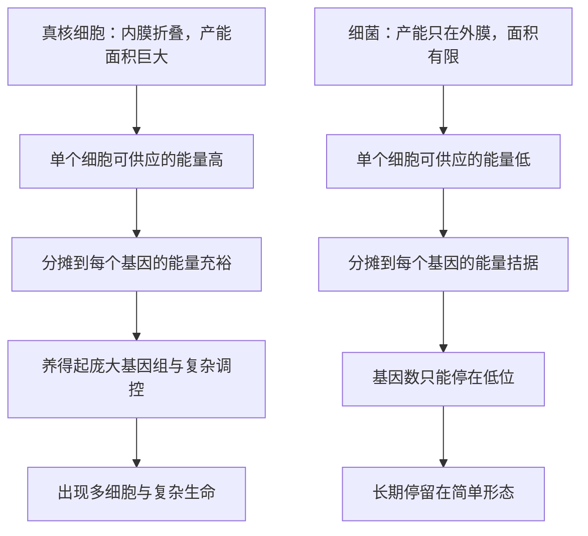

# 08｜「生物学中心的黑洞」——原核与真核之间的能量鸿沟

> 一个真核细胞与一个细菌相比，可用的能量差距到底有多大，为什么这个差距是决定性的？

---

## 一、先说结论

莱恩用数量级估算指出：把能量平均分摊到每个基因头上，真核细胞是细菌的上千倍，某些估算甚至达到十万倍量级。他把这道悬殊的鸿沟称为「生物学中心的黑洞」。

关键是「每个基因能分到多少」，而不是「总共有多少能量」。正因为真核细胞按基因计算的能量宽裕得多，它才养得起庞大的基因组、精细的调控网络，以及最终的多细胞身体。这道鸿沟，比基因本身更能解释复杂生命为什么只出现一次。

## 二、我们先理解一个问题

先理解为什么不能只看总能量。

一个细菌的总能量当然远少于一个真核细胞，这没什么稀奇，大东西耗电多也正常。可如果只比总量，我们会得出一个含糊的结论：真核细胞「大一点、强一点」。

真正的问题是：多出来的能量，够不够支撑多出来的基因？一组额外的基因不是白拿的，它们要转录、要翻译、要维持、要调控，每一项都在耗能。所以有意义的指标，是能量与基因数的比值——平均每个基因能支配多少能量。

这就像看一个家庭富不富，不能只看月收入总数，还要看要养活几口人。总收入高但人口多，人均未必宽裕；总收入一般但人口少，日子反而松快。复杂生命的账，就是按「人均」算的。

## 三、作者到底提出了什么观点？

莱恩的观点是：**按每个基因摊到的能量算，真核细胞和细菌之间存在数量级的差距。**

他采用的是所谓「费米式估算」——不追求精确到个位，而是抓住主要变量，快速算出量级。变量包括：细胞的大小、每单位膜面积能承载的呼吸链密度、每次呼吸能泵出多少质子、每个质子能合成多少 ATP，以及细胞基因组里有多少基因。

把这些变量相乘相除，会得到一个大致在千倍以上的差距。莱恩进一步强调，某些假设下这个差距可以放大到十万倍级别。无论具体数字是多少，结论都一样：这不是「略好一点」，而是跨了一个甚至好几个数量级的鸿沟。

他用的词是「生物学中心的黑洞」——一个巨大、沉默、却贯穿整个生命史的能量深渊。

## 四、把这个观点翻译成人话

可以把这理解为两种经营模式的对决。

一家小厂，全部设备和人员挤在一间平房里，产量有限，但订单也少，勉强周转。另一家大厂，厂房里布满流水线，设备多、人手多，可产能极其充裕，甚至能匀出资源去搞研发、开新线、做长期投资。

真核细胞就是那家大厂。它多出来的能量，不是用来「多喘几口气」，而是换来了几样东西：能养更多基因、能维持复杂的调控、能在需要时造出昂贵的结构、最后还能攒出多细胞身体所需的余量。

细菌则像那家平房小厂：它活得下去，甚至活得很省、很顽强，但它没有富余去承担一次「扩建」的开销。每次想多买设备，都要从紧张的电费里挤出钱来。

## 五、为什么会这样？

这里的关键，是把「能量总量」换成「能量除以基因数」。

为什么真核细胞在这个比值上占尽优势？因为它把产电装置搬进了内部。线粒体内膜提供了天文数字般的可用面积，电机数量大幅增加，而基因组的增幅却没能同步放大。分子和分母一对比，每个基因分到的能量就被抬高了。

反过来看细菌：外膜面积限制了产能，能源本就紧；而基因一旦增加，分子不涨、分母涨，比值反而更糟。于是它被压在低基因数的平衡点上，很难自发向上突破。

## 六、举一个现实生活中的例子

想想一个家庭的月薪和要养活的人数。

A 家月收入三万元，一家六口；B 家月收入两万元，两口人。谁的日子过得宽裕？

算人均：A 家每人五千，B 家每人一万。B 家虽然总收入更低，人均却是 A 家的两倍。要不要供一个孩子读昂贵的专业、要不要换更大的房子、要不要承受一次创业的风险——这些决定的自由度，取决于人均，而不是总数。

真核细胞和细菌的账也是这样。总能量只是分子，基因数才是要养的人。莱恩说的「能量除以基因」，本质就是这场生活的「人均预算」。真核细胞赢的，正是人均这一栏。

## 七、回到书中重新理解

现在再看「复杂生命为什么只出现一次」，逻辑就顺了。

复杂化需要三样东西一起到位：更多的基因、更复杂的调控、更大的结构。这三样都要花能量，而且按人头摊还特别费。细菌的人均预算太紧，根本没法启动这种扩张。

于是复杂性成了一道只有真核细胞才买得起的入场券。而真核细胞之所以买得起，是因为它在很久以前打了一场「能量翻身仗」——它的祖先吞下了一个会发电的细菌。接下来要讲的，就是那场翻身仗本身。

## 八、这个观点背后还有什么？

这个估算方法本身，也是一种态度。

莱恩反复强调，这是「费米式」的推理：不追精确，只求量级对得上。生物世界的许多争论，问题不在于缺少精密数据，而在于没人愿意先做个粗糙但清醒的估算，把数量级定下来。先知道「差一千倍还是差两倍」，再谈细节才有意义。

此外，这个指标还牵出一条推论：如果能量按人头摊是关键，那么基因组越大、调控越复杂的生命，就越依赖稳定的高能供给。这为后面理解性、衰老，乃至多细胞的代价，都埋下了伏笔。

## 九、这个观点有问题吗？

这个估算很有冲击力，但需要谨慎对待。

它的说服力在于：单看几何与膜面积，真核细胞确实拥有远超细菌的产能空间；而观察也支持真核基因组普遍大得多、复杂得多。

需要注意的地方在于：**其一**，估算依赖许多假设，比如每单位膜面积的产能、基因数的统计口径，参数一改，倍数就会明显变动。所以具体是「上千倍」还是「十万倍」，都不宜当作精确结论，只能理解为量级。**其二**，有学者认为，把差异完全归到能量上，忽略了其他可能的限制，比如基因组结构、复制机制、群体大小与选择效率。**其三**，也有观点认为，能量充裕更可能是复杂化的结果之一，而非唯一原因，因果方向值得继续讨论。**其四**，部分细菌基因组其实并不小，也有的真核生物基因组很紧凑，说明这个比值本身也有很大的变动范围。

更平衡的说法是：数量级的鸿沟很可能存在，也很有解释力；但它是不是唯一的钥匙，仍需证据来判断。

## 十、今天再看这个观点

以下是基于作者思想的现代延伸，不是作者原话。

如今，研究者可以用更细的方法去核对这些账。单细胞代谢测量、基因组规模的代谢模型，能给出不同生物的能量收支预估；比较基因组学则能描绘基因组大小与能量策略之间的关系。

一些跨物种的比较研究也提示，能量代谢的「预算方式」确实与基因组大小、生活史策略有关联，这与莱恩的方向一致，但具体倍数仍需更多数据来收敛。

## 十一、这一篇真正应该记住什么？

1. 关键的比较指标不是总能量，而是平均每个基因能分到多少能量。
2. 莱恩用费米式数量级估算，认为真核细胞在这个指标上是细菌的上千倍，某些估算达十万倍量级。
3. 他把这道鸿沟称为「生物学中心的黑洞」。
4. 正是这笔「人均收入」的差距，让真核细胞养得起庞大基因组、复杂调控与多细胞身体。

## 十二、留一个问题

如果真核细胞真的是靠一场能量翻身仗才买得起复杂性的入场券，那么这场翻身仗具体是怎么打的？

那个被吞进去、又没有被消化的细菌，究竟做了什么，让一个原本紧巴巴的细胞突然变得富足？它带来的仅仅是「多一台发电机」这么简单吗？

下一节，我们就来看看那位住进细胞里的老房客——线粒体。
