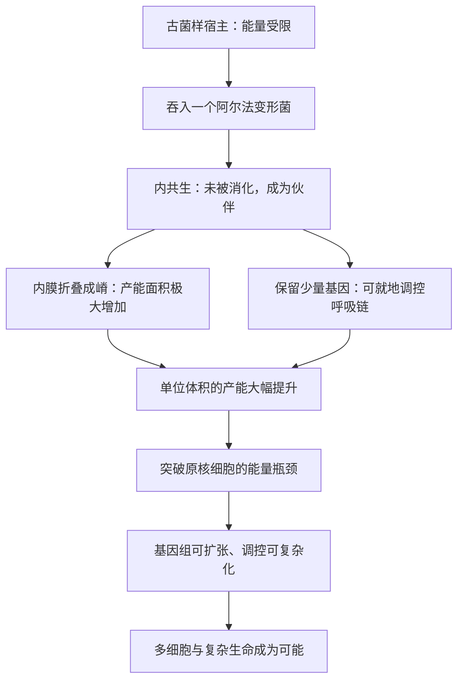

# 09｜线粒体——一次偶然的吞并，如何改写了整个地球

> 线粒体到底是什么，它凭什么一举解开了复杂生命被卡住的能量瓶颈？

---

## 一、先说结论

莱恩认为，线粒体原本是一个自由生活的细菌，被一个古菌样的宿主细胞吞入后没有被消化，而是留下来成为长期的能量伙伴。这一次内共生，就是真核细胞诞生的瞬间。

它的关键贡献有两层：一是把大量折叠的膜搬进细胞内部，让产能面积不再受外表面限制；二是它保留了一小套自己的基因，能就地调控能量生产，快速响应细胞的需要。正是这两点，让宿主一举突破了能量瓶颈，从此才有了复杂生命。

## 二、我们先理解一个问题

先弄清楚线粒体到底是什么。

它不是细胞里一个普通的「零件」。它有自己的膜、自己的 DNA、自己的核糖体，甚至用一套和细菌相似的机制来复制和表达。它像一个住在大楼里的独立住户，有自己的房间、自己的电表和自己的作息。

这个观察让生物学家得出一个惊人的推论：线粒体不是被宿主「设计」出来的，而是被「收留」的外来者。问题于是变成——它原本是谁？它和宿主是怎么走到一起的？

## 三、作者到底提出了什么观点？

莱恩的观点是：**线粒体的到来，不是给复杂生命锦上添花，而是它得以存在的前提。**

第一，内共生确实发生过。一个古菌样的宿主吞入了一个细菌，也就是今天线粒体的祖先，通常认为属于阿尔法变形菌类群。这是「内共生学说」。

第二，这次合并解决了一个致命难题。细菌体制下，产能面积被外膜限制；而线粒体内膜反复折叠成「嵴」，把海量的产能面积塞进了细胞内部。单位体积的发电能力因此暴涨。

第三，线粒体必须保留一部分自己的基因，这不是历史的累赘，而是功能需要。这些基因编码的是呼吸链里最核心、最怕出错的部分；由它在细胞里就地控制，才能对局部能量需求做出及时反应。

## 四、把这个观点翻译成人话

想象一间房子，原来只能靠外墙上一个插座供电，电器一多就跳闸。

后来房东招进来一位租客，这位租客自带一台大功率发电机，而且把发电机装进了地下室和每一个房间。从此这栋房子不仅能供自己用电，还有余量去装空调、加电梯、扩建成更高的楼。

这位租客就是线粒体。它带来的不只是「多发一点电」，而是把供电方式整个换掉——从「外墙有限的面板」变成「满屋子的线路」。房东也因此第一次有了闲钱，可以去经营更大的事业。

## 五、为什么会这样？

来看看这次合并带来的两个具体变化。

第一层变化是「面积」。原核细胞的发电站在外膜上，面积随体积增长而吃紧；线粒体把内膜折进内部，相当于在细胞里造出了无数额外的发电面板。几何那道墙，被从里面绕开了。

第二层变化是「调控」。呼吸链在泵质子、生成 ATP 的同时，也会产生有害的副产物。如果能量生产完全由细胞核遥控，遇到突发情况就来不及。线粒体保留的关键基因，让它可以就地调节膜电位的强弱，既保证供给，又避免伤到自己。这也解释了为什么线粒体的基因没有全部搬到细胞核去。

两层合起来，就是莱恩的核心论点：真核细胞的复杂性，建立在这笔额外的能量红利上；而红利，来自一次吞并。

## 六、举一个现实生活中的例子

想象你把家里的一间空房租给了一位自带发电机的房客。

一开始你只是想收点租金。可这位房客不只交租，他还在房子里装了整套供电系统，甚至帮你重新布线。你原本不敢开的空调、不敢添的电器、想扩建却没钱动的工程，一下子都变得可行。

更重要的是，他不是把一台机器搬进来就算完；他会根据你每天的用电情况随时调整输出，白天多给、夜里收敛，既不让房子断电，也不让线路过载。

线粒体就是这样一位房客。它住进了细胞内部，既提供电力，又参与调度。房东从此有了充足的电力，才有底气去改造整栋房子——扩建基因组、增加调控，直到组建成多细胞的身体。

## 七、回到书中重新理解

现在再读莱恩，会更清楚他为什么把线粒体抬到这么高的位置。

在内共生学说刚被提出时，很多人把它当成一段有趣的历史插曲：某个细胞碰巧吞了个细菌，捡了个便宜。莱恩的贡献是把「便宜」提升为「前提」——没有这次吞并，就没有富余的能量；没有富余的能量，就没有复杂基因组和多细胞；没有它们，也就没有你我。

也就是说，线粒体不是一个关于细胞零件的细节，而是整本书能量逻辑的枢纽。前面我们讲了瓶颈，也算了那道差距，这一节讲的，是差距究竟怎么被填上。

## 八、这个观点背后还有什么？

这段历史本身也值得一提。

内共生学说由林恩·马古利斯在二十世纪六十年代力推。她主张线粒体和叶绿体来自被吞入的细菌，当时遭到强烈质疑，甚至被人嘲笑，论文屡屡被拒。随着分子证据积累——线粒体 DNA、细菌式的核糖体、双膜结构——这个学说逐步被主流接受，成为今天的教科书内容。

但莱恩走得更远。多数人接受「线粒体是内共生来的」，却仍把它看作复杂化的诸多因素之一。莱恩的独特之处，是主张线粒体是复杂性的先决条件：没有它，能量这道坎就迈不过去。这一层，至今仍是他的主张，而非普遍共识。

## 九、这个观点有问题吗？

这里同样需要分清层次。

「线粒体起源于被吞入的细菌」，这是被广泛接受的主流共识，证据充分。「线粒体保留部分基因有其功能原因」，也有不少支持。

争议集中在莱恩的引申上。**其一**，有学者认为，把线粒体说成复杂性的唯一前提，可能低估了其他因素，比如宿主本身的基因组演化、细胞骨架的出现、生态机会的打开。**其二**，关于内共生发生的时机，学界存在不同解释：一种模型认为宿主先具备一定复杂性、线粒体后来才到；另一种认为线粒体的到来更早，甚至先于某些真核特征的成熟。**其三**，也有观点认为，即便能量更充裕，能否走向多细胞还要看其他条件是否配合，能量只是必要而非全部。

所以更稳妥的说法是：线粒体来自内共生，这没有疑问；它是复杂生命「唯一前提」这一点，则是莱恩有力的主张，仍在接受检验。

## 十、今天再看这个观点

以下是基于作者思想的现代延伸，不是作者原话。

近年对线粒体的研究，已经远远超出「细胞发电厂」这个老比喻。它在细胞死亡、免疫信号、代谢调控，甚至细胞间通讯里都扮演角色。研究者还发现，线粒体与宿主细胞核之间的基因协调极其精细，两套基因组要长期配合，一旦失配，就会出问题。

另一个方向，是利用基因组学去追溯那位共生细菌的祖先。通过对自由生活的阿尔法变形菌类群与线粒体基因组的比较，研究者能更清楚地画出这场「合并」发生的大致图景。

## 十一、这一篇真正应该记住什么？

1. 线粒体原本是自由生活的细菌，被古菌样的宿主吞入后未被消化，成为长期伙伴，这就是内共生。
2. 它把折叠的内膜搬进细胞内部，极大增加了产能面积，突破了原核细胞的能量瓶颈。
3. 它保留少量关键基因，能就地调控能量生产，既保证供给又避免损伤。
4. 内共生学说从被质疑到被接受，而「线粒体是复杂生命前提」是莱恩更进一步的独特主张。

## 十二、留一个问题

既然内共生带来如此巨大的好处，那问题就变得尖锐了：为什么这样的合并，四十亿年里几乎只成功了一次？

地球上细胞无数、细菌无数，为什么这种「天作之合」没有反复发生？究竟是它太难，还是我们已经知道的那一次，只是无数次失败中唯一撞上的运气？

下一节，我们就来追问这场「创世级」合并为何如此孤独。
