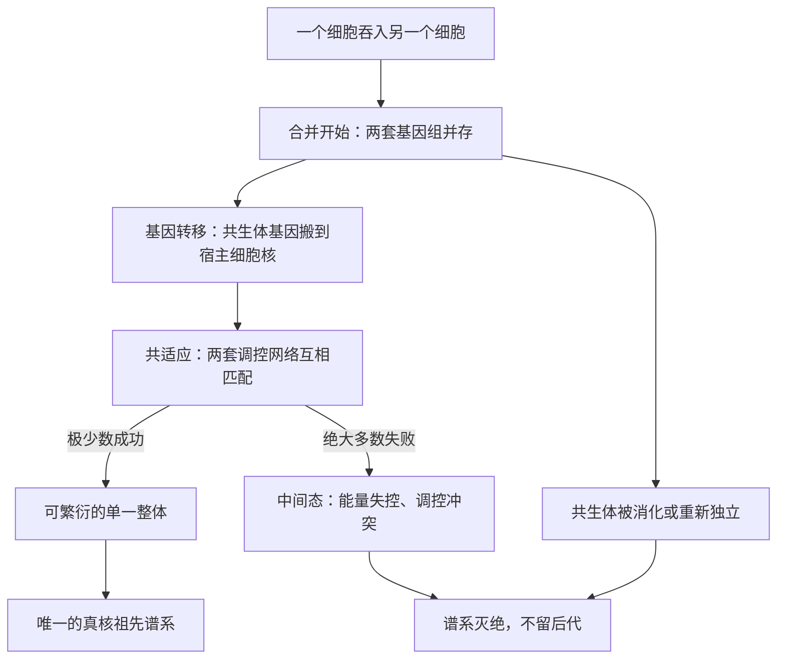

# 10｜为什么这次「创世级」的合并只发生了一次

> 如果内共生是一件大好事，为什么地球给了四十亿年时间，它却只成功了一回？

---

## 一、先说结论

莱恩的观点是：内共生本身并不稀罕，真正稀罕的是「合并之后还能活下去」。一个细胞吞进另一个细胞，只是故事的开始；接下来，被吞进来的那个细胞必须把自己绝大部分基因搬到宿主细胞核里去，而宿主也必须学会用这些外来基因来指挥原来的房客。两套基因组要在漫长的磨合中互相适配，这种「共适应」几乎没有中间路线可走——绝大多数尝试都在半途死掉了。所以结果不是「好几次成功的合并」，而是只有一条谱系穿过了这道窄门，成为今天所有复杂生命的祖先。

## 二、我们先理解一个问题

先别急着问「为什么只有一次」，先问一个更基本的问题：两个细胞合并，为什么不能像两家公司握手一样，签个协议就行？

因为细胞不是合同关系，而是「谁指挥谁」的关系。细胞里几乎所有的关键决定——什么时候分裂、什么时候造哪种蛋白、能量投到哪里——都是由 DNA 上的基因来下达的。当一个细胞住进另一个细胞，这间「新房子」里就同时存在两套基因、两套指令系统。它们必须协调，否则细胞就会在内部吵成一团，连最基本的代谢都维持不下去。

于是问题变成了：两套原本各自独立演化了十几亿年的基因组，凭什么能合得来？

## 三、作者到底提出了什么观点？

莱恩把这次合并的困难，归结为三个环环相扣的环节。

第一，基因必须转移。共生体如果保留自己全套基因，就等于在宿主细胞里维持一个「独立王国」。但独立王国意味着它随时可能重新独立，也意味着宿主无法统一调度能量。演化的实际结果是：共生体的大部分基因要么丢失，要么被搬到宿主的细胞核里。

第二，转移之后必须共适应。基因搬进细胞核，并不等于一切就绪。这些外来基因的产物，很多本来是要回到共生体内部工作的；它们的表达量、时机、与其他基因的配合，都需要重新调校。两套基因组要通过无数代的突变与选择，才能彼此「对上口令」。

第三，中间态很难存活。既没有完全独立、又没有完全融合的半成品细胞，往往是最脆弱的：它的能量系统可能不稳定，它的调控网络可能互相打架。自然选择不会宽容这种状态，一步走错就可能整条谱系灭绝。莱恩因此说，这更像是一次「几乎不可能的奇迹」。

## 四、把这个观点翻译成人话

可以把它想成一次极度危险的搬家。

你有一间住了很久的老房子（共生体），里面有整套自己的水电系统和家具（基因）。现在你要搬进一栋大宅（宿主细胞），但大宅的主人要求：你的东西不能全带，很多家具得扔掉，剩下的还必须照大宅的规矩摆放。搬家过程中，老房子的水管和新房子的电路要一点点对接，对错了就跳闸；而对接还没完成时，两栋房子谁都不能正常住人。

大多数这样的搬家，都死在「对接了一半」的阶段。

## 五、为什么会这样？

用一张图，把「许多次尝试、只有一条谱系穿过」的过程画出来。

莱恩用「黑洞」来比喻这道筛选：所有中间形态就像被吸进视界的一束束光，无论从哪个方向靠近，都难以穿出来；能逃逸的只有一条特定轨迹。所以我们在今天看到的，不是一长串「半融合」的化石，而是干净利落的「只有细菌和真核生物两种」。中间态不是不存在过，而是被筛选掉了，没有留下活的证据。

## 六、举一个现实生活中的例子

想想企业并购。

每年有成千上万家公司合并，公告里写的都是「协同效应」「强强联合」。但研究和经验都显示，大多数并购并没有让公司变得更强，反而死于整合：两套财务系统对不上，两个管理层互相拆台，原有的客户在混乱中流失。合并本身不难，难的是合并之后把两套完全不同的组织「变成一套」。

细胞内共生就是生物学版的并购。吞并只是签字，真正决定成败的是签字之后那段漫长、脆弱、不断出错的整合期。绝大多数并购死于整合，绝大多数内共生尝试也死于整合——这正解释了为什么成功案例如此之少。

## 七、回到书中重新理解

现在再读莱恩的问题，重点就变了。

他不是在问「内共生有没有好处」——有好处是显然的，线粒体给细胞带来了巨大的能量。他问的是一个更尖锐的问题：为什么一个明显有利的事件，在四十亿年里只发生了一次？如果好处那么大，自然选择应该反复把它「选出来」才对。

莱恩的答案是：因为这道门的通过率不取决于「好处有多大」，而取决于「中间过程有多难」。好处是终点，而自然选择是一步步走的，走不过中间那段悬崖，终点再美也到不了。这也把书里的核心逻辑串起来了——有了线粒体才有能量闸门，而这道闸门之所以只开过一次，答案就在这三重难关上。

## 八、这个观点背后还有什么？

这个观点其实改变了我们对「演化困难」的理解方式。

通常我们说某个演化事件「很难」，意思是它需要很多巧合。但莱恩强调的是另一回事：困难往往不在起点，而在路径。内共生需要的是两个细胞相遇，这个起点也许并不罕见；真正罕见的是那条从「两套基因组」走到「一套协调系统」的路径，它可能要求基因转移的先后顺序、调控关系的调整方式恰好可行，稍一错位就全盘皆输。

如果这个逻辑成立，它还意味着：即使宇宙中有许多行星出现了生命，能跨过这道门的也可能极为稀少。这正是全书最后一部分要谈的问题。

## 九、这个观点有问题吗？

需要把「共识」和「主张」分开。

「基因从细胞器向细胞核转移」这一点有大量直接证据，是真核细胞演化的核心事实之一，学界的接受度很高。「两套基因组需要共适应」在原理上也罕有异议。

莱恩走得更远的地方，在于「几乎不可能」这个判断。第一，有学者认为，「只发生一次」未必等于「极难发生」。也可能只是第一次成功者迅速占满了生态位，后来者根本没有机会——这属于生态学解释，与「难度」解释并存。第二，关于中间态，也有人主张某些原核生物之间本来就存在较松散的共生关系，这些「前奏」可能让过渡不那么戏剧化。第三，共适应的程度难以定量：我们无法直接测量当年那道门槛究竟有多高，因此「奇迹」这个词更接近一种修辞，而不是可验证的结论。

所以更稳妥的说法是：内共生难以完成，这是共识；至于它是否难到「近乎奇迹」，则属于莱恩的推断。

## 十、今天再看这个观点

以下是基于作者思想的现代延伸，不是作者原话。

近年的基因组学研究，为「基因转移」这个环节补上了具体数字。研究者比较各种真核生物的基因组后估计，线粒体当年携带的基因中有绝大多数已经转移到细胞核，而线粒体自身只保留了很少一部分。更关键的是，这些转移基因的产物必须再被「运回」线粒体，这套复杂的运输系统本身就是共适应的产物，需要一整套协同演化的分子机器才能运转。

也有实验室尝试在人工条件下诱导内共生，结果往往是不稳定的：宿主与共生体很难形成可遗传的稳定关系。这些尝试从侧面支持了莱恩的判断——融合之后的整合，才是真正的难关。但要把「难关」精确量化为「奇迹级」，仍需要更多证据。

## 十一、这一篇真正应该记住什么？

1. 内共生成功的关键不在「能不能吞进来」，而在「吞进来之后能不能活下去」。
2. 融合要求共生体的大量基因转移到宿主细胞核，并让两套基因组在调控上共适应。
3. 中间态最脆弱，绝大多数尝试在整合过程中灭绝；能穿过的只有极少数。
4. 莱恩用「黑洞」比喻这道筛选：不是过程少，而是几乎全都出不来。

## 十二、留一个问题

如果这次合并真的留下了如此多的「整合痕迹」，那么我们今天的细胞核和基因组里，是不是也应该能找到当年的疤痕？

那些看起来多余、麻烦、甚至像负担的结构——被切碎的基因、需要剪接的片段、混进来的外来基因——会不会正是那次事故的现场记录？

下一节，我们就沿着这些疤痕往回看。
