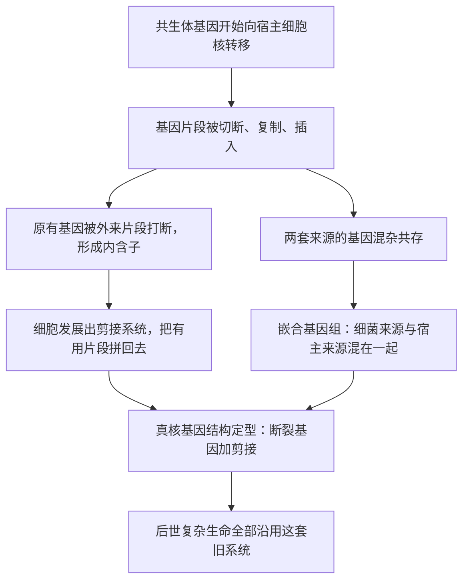

# 11｜细胞核、内含子与基因组——一次融合留下的疤痕

> 真核细胞里那些看起来多余又麻烦的结构，会不会正是那次融合留下的现场证据？

---

## 一、先说结论

莱恩认为，真核细胞身上有许多「怪癖」：基因被一段段不编码的序列打断，转录出来以后还得剪掉再拼接；细胞核把 DNA 包了起来；基因组里混着大量看起来像细菌来源的基因。这些结构一点都不像精妙设计，反而像旧系统上的补丁。莱恩的解释是：它们正是内共生与基因转移留下的历史疤痕。生命不是在白纸上画设计图，而是在一套已有的旧系统上不断改扩建，改到能凑合用，就继续沿用下去。需要说明的是，「内含子从何而来」在学界仍有不同解释，莱恩的讲法只是其中一种。

## 二、我们先理解一个问题

先看一个反直觉的现象。

细菌的基因，通常可以理解成一条连续的指令，从头读到尾就能造出蛋白质。但真核生物的基因不是这样：它更像一句被硬塞了很多无用插入语的话，你必须先把插入语划掉，剩下的话才读得通。

这些插入语叫内含子，划掉它们的动作叫剪接。可问题来了：在一个讲求效率、处处是竞争的世界里，为什么会出现这么麻烦的结构？它看起来只是在增加出错的机会。

同样让人费解的是，我们的基因组里，为什么会有那么多来自细菌的基因？既然它们不是我们「自己」的，为什么没有被清理掉？

## 三、作者到底提出了什么观点？

莱恩把这些怪癖，和上一节讲的内共生直接连起来。

第一步是基因转移。当共生体住进宿主细胞，它的基因开始大规模搬家。搬家不是整整齐齐地搬：基因片段可能被打断，可能被复制成好几份，可能插进宿主某个基因的中间，也可能在插入时把宿主原有的基因切成了几段。

第二步是「修补」的产物。基因被切碎了，细胞就得有一套工具把有用的片段重新拼起来——这就是剪接系统。它未必是事先设计的，更像是为了对付烂摊子而临时发展出来的应急机制。

第三步是嵌合基因组。宿主与共生体两套基因混在一起，经过亿万年的淘汰与融合，形成了一种「你中有我、我中有你」的混合基因组。

莱恩的核心判断是：这些结构不是最优设计的证据，而是历史事故的证据。

## 四、把这个观点翻译成人话

可以这样理解：真正的演化不是建筑师，而是老房子的翻修队。

建筑师会先画好图纸，再按图施工，管线走向清清楚楚。翻修队不行。他们面对的是一栋已经住了很多年、改过很多次的老房子：这里加过一间房，那里换过一根管，上一任房东的走线还留在墙里。他们的任务不是「重新设计」，而是「把新的东西接上去，让房子还能住」。

于是墙里会留下旧管线，天花板会叠着好几层不同年代的补丁，有的线路绕得莫名其妙，但它们都能用。真核细胞的基因组，就是这样的老房子。

## 五、为什么会这样？

把「事故留下疤痕」的过程画出来，会更直观。

关键在于这张图的方向：不是先有「断裂基因」这个设计方案，再去找用途；而是先发生了打断和插入这场事故，然后才有了剪接这套补救措施。先后顺序反了，意思就完全不同。

## 六、举一个现实生活中的例子

拿出一套住了三十年的老房子，动手翻新。

你敲开一面墙，会看到什么？可能是几十年前的铁管，锈迹斑斑但还通水；可能是一段后来加装的塑料管，和铁管用胶带缠在一起；墙里可能还藏着一根早就不用的电线，谁也不知道它原本通向哪里。再打开天花板，一层石膏板下面还有一层，再下面还有更早的涂料。

这些都不是设计。它们是历次装修留下的痕迹：每一任主人都在前人基础上「打补丁」，能用就行，没人会为了美观把整栋房子拆了重来。

真核细胞的基因组，就是这栋老房子。断裂的基因、需要剪接的片段、混进来的细菌基因，都是墙里的旧管线和补丁——不是当初的设计，而是历史一路走过来的证据。

## 七、回到书中重新理解

现在再读莱恩关于细胞核与基因组的讨论，重点就清楚了。

他不是在赞美真核细胞「设计得多精妙」，恰恰相反，他是在指出它有多「不讲究」。一个追求效率的工程师，不会把基因切成碎片再拼回来，也不会在基因组里留下大量外来基因。真核细胞之所以是这样，是因为它诞生于一次事故性的融合，而后续所有演化都只能在这套「改过的旧系统」上继续。

这也解释了复杂生命的一种深层处境：我们不是从零开始的优化产物，而是带着历史包袱往前走的。很多看似古怪的结构，理解它们的关键不是问「它有什么好处」，而是问「它是从哪儿继承来的」。

## 八、这个观点背后还有什么？

这个观点背后，是演化生物学一个重要的思想转变：演化不是工程师，而是修补匠。

工程师可以为了整体最优而推倒重来；修补匠只能在现有材料上东拼西凑，改出一个「够用」的方案，然后被历史锁死，再难回头。这个视角能解释很多现象：为什么生物体充满不合理的结构、为什么有些设计「能将就用就行」、为什么古代遗留会一直保留到现代。

如果莱恩是对的，那么基因组的「丑陋」本身，就是一种证据。它证明复杂生命的历史不是一条平滑的设计之路，而是一次打断、拼接、妥协的过程。

## 九、这个观点有问题吗？

要注意，这一篇里有事实，也有强烈的主张。

先说比较扎实的部分：「真核基因组含有大量貌似细菌来源的基因」「真核基因普遍是断裂基因、需要剪接」，这些都是基因组学的直接观察，基本没有争议。

争议集中在解释上。其一，内含子到底从哪来，学界长期存在两派意见：一派主张内含子很早就存在，是从共同祖先继承下来的，即「内含子早来」；另一派主张内含子是后来才插入基因组的，即「内含子晚来」。莱恩把内含子和内共生、基因转移绑在一起，属于后一派的一个版本，但并非定论。其二，「嵌合基因组」的来源比例统计，不同研究给出的数字差别很大，部分所谓细菌来源的基因，也可能是其他途径引入的，未必都和线粒体祖先直接相关。其三，把基因组的所有怪癖都归因于这一次融合，有过度简化的风险：基因组里还有转座子、病毒残留、重复序列等许多其他来源，未必都能追到同一个事件。

所以更准确的说法是：这些结构是历史遗留，这一点大致成立；把它们的来源具体锁定为「这次内共生」，则是莱恩的解释框架，竞争性的解释依然存在。

## 十、今天再看这个观点

以下是基于作者思想的现代延伸，不是作者原话。

近二十年的比较基因组学，让「疤痕」看得越来越清楚。研究者把真核生物与细菌、古菌的基因组逐一比对，既能找出大量疑似来自线粒体祖先的基因，也能重建这些基因在细胞内的「搬迁路线」。同时，关于剪接系统的研究显示，这套机器极其古老，几乎在所有真核生物中都存在，这种普遍性本身就暗示它起源很早，可能就发生在真核细胞成形的关键阶段。

不过也有研究提醒：基因在基因组之间流动的渠道不止一条，病毒、质粒、甚至不同细胞之间的水平转移都会留下类似痕迹。因此，要单凭基因组的混杂程度，就断定「这里一定发生过某一次特定融合」，还需要更精细的证据。这恰好说明，莱恩提出的是一幅有说服力的历史图景，而不是一件已经结案的铁证。

## 十一、这一篇真正应该记住什么？

1. 真核基因普遍被内含子打断，必须经过剪接才能读通；这是事实。
2. 真核基因组是混合体，混有大量疑似细菌来源的基因。
3. 莱恩把这些「怪癖」解释为内共生与基因转移留下的历史疤痕，而不是设计的产物。
4. 内含子的起源仍有早来与晚来之争；莱恩的解释只是其中一种。

## 十二、留一个问题

如果真核细胞的基因组是这样一套「补丁摞补丁」的系统，那么它要维持运转，就得不停地修补、清理、替换坏掉的部件。

可问题是：无性繁殖只是把同一套系统原样复制下去，坏掉的部件会一代代堆积。一个带着这么复杂的基因组、又依赖线粒体供能的细胞，靠什么办法让后代不至于越复制越糟？

下一节，我们来看看，为什么真核细胞几乎都绕不开「性」。
