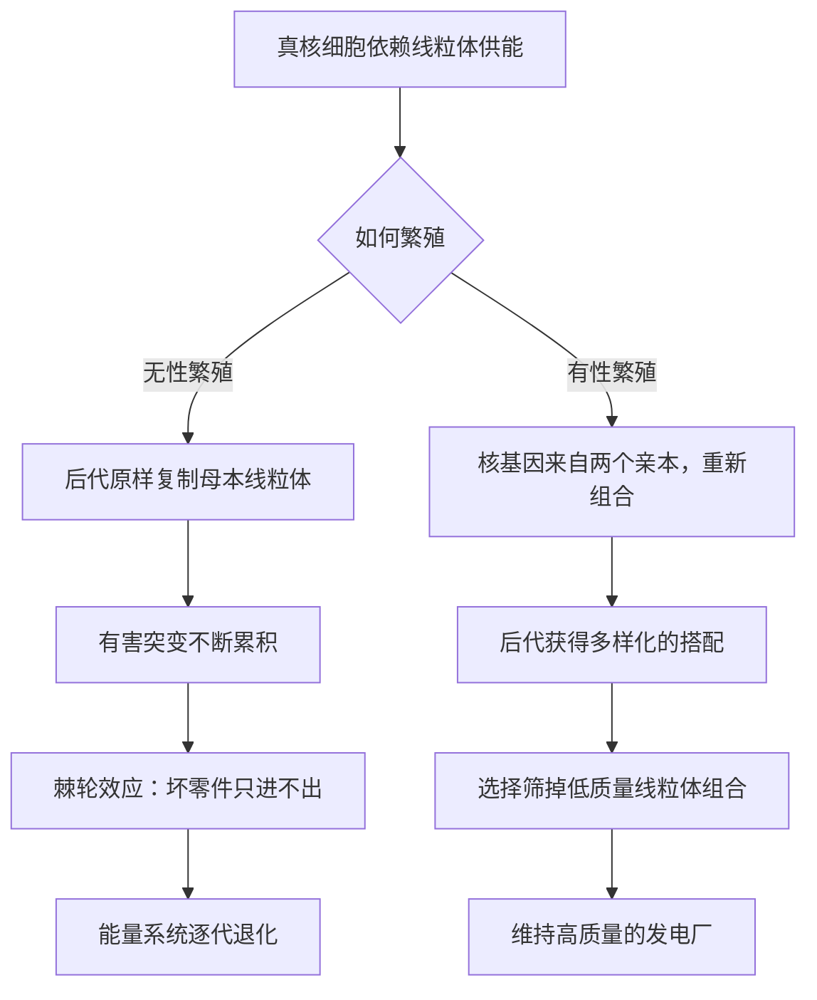

# 12｜真核细胞为什么非要「性」不可

> 无性繁殖更快、更省事、也不用找对象，为什么复杂生命几乎都选择了有性生殖？

---

## 一、先说结论

莱恩认为，答案要回到线粒体。无性繁殖等于把同一套「发电厂」原样复制给下一代，一旦线粒体的基因里累积了有害突变，这些坏零件就没有办法被剔除，只能一代代往下传——这种只进不出的累积，被形象地称为棘轮效应。有性生殖做的事情，是通过基因重组，让后代的核基因与线粒体有机会重新组合，再由选择筛掉质量差的搭配，从而保住「发电厂」的水准。所以性不是奢侈，而是复杂生命维持能量系统的必要机制。需要提醒的是，这只是关于性起源的众多理论之一，并非学界定论。

## 二、我们先理解一个问题

先把账算清楚。

无性繁殖看起来占尽优势：不需要找伴侣，不需要等待，一个个体就能直接复制自己，效率高、成本低。有性生殖却处处吃亏：要花精力找对象，只能把自己的基因传下去一半，还要冒被寄生、被竞争的风险。按最朴素的思路，性应该被自然选择淘汰才对。

可现实恰好相反：几乎所有复杂生命——动物、植物、真菌——都选择了有性生殖。这就成了一个经典难题：一个明显昂贵的机制，为什么会被保留下来？

## 三、作者到底提出了什么观点？

莱恩把这个问题和线粒体绑定在一起。

他先指出一个事实：线粒体有自己的基因组，而这个基因组的突变率不低，修复能力却很有限。这意味着线粒体 DNA 很容易累积损伤。

接着是关键推理。在无性繁殖中，后代只从一个亲本那里继承线粒体，相当于把同一套设备原样复制。如果某台设备上出现了坏突变，它没法被「换掉」，也没法和别的版本「比较」，只能继续传下去。坏突变一代代叠加上去，就像棘轮一样越卡越紧，只朝一个方向走，回不了头。这就是棘轮效应。

有性繁殖则提供了两个出口。第一是重组：后代的核基因来自两个亲本，基因组合被重新洗牌，可能产生新的、更健康的搭配。第二是筛选：在选择之下，携带低质量线粒体的组合会被淘汰，携带高质量线粒体的组合留下来。性因此成了一套质量控制机制，专门对付线粒体这套容易出故障的能量系统。

## 四、把这个观点翻译成人话

把它想成一家工厂的设备管理。

如果一家工厂永远只复制自己现有的那套机器，机器用旧了、老化出故障了，也只能照旧复制，坏的地方一起复制下去。时间一长，整条生产线越来越差，而且没有任何机会换新。

有性繁殖相当于把两家工厂的设备重新搭配：每个后代的设备由两边的零件重新组合，谁家的机组更可靠，谁的组合就更容易在竞争里存活。这样，坏设备被自然淘汰，好设备被保留下来。工厂这才不至于越开越垮。

## 五、为什么会这样？

用一张图对比两条路线。

这张图想说明的是：性解决的问题，不是「多生孩子」，而是「怎么保证孩子继承的发电厂依然可靠」。在这个框架里，性不是锦上添花，而是维持系统运转的基本保险。

## 六、举一个现实生活中的例子

拿出一份重要文件，反复复印。

第一次复印，还比较清楚。把复印件再复印一次，就模糊一点。再拿这份复印件去复印，又模糊一点。这样往下复印几十次，最后几乎只剩一团黑影，什么也读不出来。

问题出在哪？每一次复印都会引入一点失真，而失真一旦产生，就再也回不去了——你手上只有越来越差的复印件，没有原稿可以校对。

有性生殖的作用，就相当于回到原稿、把两套材料重新组合再誊写一遍：它不断引入「重新组合」的机会，让后代的「文字」保持清晰，而不是沿着一条只会越走越糊的单一路线一直复制下去。

## 七、回到书中重新理解

现在再看「性为什么存在」，问题的重心就变了。

传统讨论常把性理解成「基因交流」或「增加变异」，这当然没错，但它没有回答那个尖锐的问题：无性繁殖明明更省事，为什么性没有被更省的方案挤走？

莱恩的回答是：因为真核细胞不是随便什么细胞，它是一台依赖线粒体的高耗能机器。对这种生物来说，能量系统的长期质量是生死攸关的事，而质量控制恰恰是无性繁殖做不到的。性不是复杂生命的可选项，而是这套能量架构逼出来的题解。这也接上了前面的线索：复杂生命的一切特殊性，最终都要回到能量上找原因。

## 八、这个观点背后还有什么？

这个观点背后，是一个更深的问题：性的代价谁来付？

因为性让每个个体只能传递一半基因，也让亲密接触带来疾病传播的风险。按理说，自然选择应该偏爱那些「走捷径」的无性个体。可现实中，无性路线在复杂生命里往往只是短暂的插曲，很快就会被淘汰。这意味着，性背后一定有非常强的收益，足以抵消这些代价。莱恩给出的收益，就是「维持能量系统的质量」。

顺着这条线，还会引出更多问题：既然性带来重组，为什么只有两种性别？既然要保证线粒体质量，为什么我们只从母亲那里继承它？这些正是后面几节要谈的。

## 九、这个观点有问题吗？

关于性为什么存在，学界提出的理论不止一种，必须分开看。

最常被提到的几种包括：其一，清理有害突变。无性群体里，坏突变会像棘轮一样累积，性可以通过重组把它们「甩掉」。其二，红皇后假说。性是为了应对不断演化的寄生虫——因为寄生虫也在快速变化，只有不断重组的后代才有机会逃脱。其三，DNA 修复。性过程中的重组可能与修复遗传损伤有关。

莱恩的特点，是把「清理有害突变」这条思路具体落到线粒体上：不是泛泛地说「重组有好处」，而是指出线粒体这套系统特别需要质量控制。这个角度很有解释力，但也有学者认为它过于聚焦单一机制，忽略了生态学与寄生虫的因素；而红皇后假说在许多寄主与寄生体系中同样有大量支持证据。

所以更平衡的看法是：莱恩提供了一把很锋利的钥匙，但它未必是唯一能开锁的那把。

## 十、今天再看这个观点

以下是基于作者思想的现代延伸，不是作者原话。

近年来的研究让「线粒体质量控制」这个环节变得可以观察。学界确认了线粒体 DNA 在动物中通常只由母系传递，也发现细胞内部存在专门淘汰受损线粒体的机制，比如通过分裂与自噬来清除质量差的线粒体。这些机制的存在，说明「维持线粒体质量」确实是细胞的一项正经任务，而不是想象出来的需求——这为莱恩的框架提供了间接支持。

但也有反例值得注意：一些有性生殖的物种，其线粒体的传递方式并不完全符合简单模型；而在某些无性繁殖的生物中，线粒体质量似乎也没有立刻崩坏。这些都提醒我们，线粒体与性之间的联系可能比莱恩描述的更复杂，也更值得继续研究。

## 十一、这一篇真正应该记住什么？

1. 无性繁殖高效，却有致命缺陷：线粒体的有害突变会像棘轮一样累积、无法清除。
2. 有性生殖通过重组和选择，帮助后代维持高质量的线粒体与核基因组合。
3. 在莱恩看来，性不是奢侈，而是复杂生命维持能量系统的必要机制。
4. 这只是一家之言，性起源还有红皇后、清除有害突变等多种竞争性理论。

## 十二、留一个问题

如果性是为了让后代的基因重新组合、以便筛选出更好的「发电机组合」，那按这个逻辑，参与重组的「类型」应该越多越好才对。

可事实是，地球上几乎所有有性生物都只有两种性别。为什么是两种，而不是三种、四种、甚至更多？

下一节，我们就来看看，这条路的尽头为什么只剩下两个入口。
