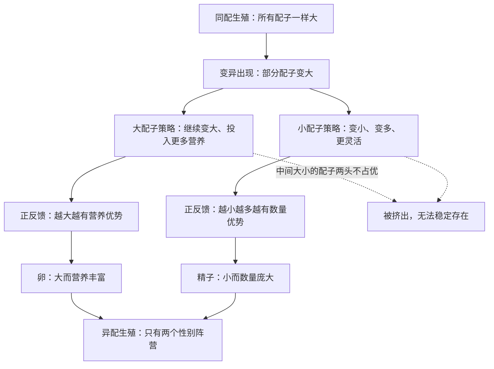

# 13｜为什么地球上只有两种性别

> 如果性别只是「谁提供基因」的分工，为什么几乎所有有性生物都只有两种，而不是三种、四种？

---

## 一、先说结论

主流演化生物学和莱恩的解释是：关键在配子的大小。有性生殖最初可能并不分性别，所有繁殖细胞一样大。但一旦出现「大小分工」——一方提供大而富含营养的卵，另一方提供小而灵活的精子——演化就会被一条自我强化的逻辑迅速推向两个极端。中间大小的配子最不划算：既不够营养，又不够灵活。于是分工越走越远，最终收敛为两种。这个现象叫异配生殖。两种性别不是自然的设计，而是一条路径被走到极致的结果。

## 二、我们先理解一个问题

先抛开「男」「女」这种社会化的说法，只问一个生物学的核心问题。

繁殖时，两个繁殖细胞融合。从纯功能角度看，它们只需要各出一半基因就行。既然如此，理论上可以有三方、四方共同参与，或者干脆不区分类型。可现实是：几乎所有有性生物都只有两种性别，而且分工得极其极端——一方出很大的繁殖细胞，另一方出很小的。

为什么不出现「三种中等大小」的和平格局？为什么分化一旦开始，就再也停不下来？

## 三、作者到底提出了什么观点？

莱恩沿用的，是演化生物学里关于异配生殖起源的经典推理。

起点是同配生殖：所有个体的繁殖细胞差不多大，彼此没有区别。这时，一个微小的变异就能打破平衡——有的个体产生稍大的配子。更大的配子能提供更多营养，对后代更有利，于是就出现了两种策略。

一种策略是「继续变大」。既然大配子更有优势，那就在这条路上加码，把资源都投进一个又大又营养的卵里，追求质量。

另一种策略是「变小、变多、变快」。放弃在营养上竞争，转而追求数量和机动性，把资源分散到许多小而灵活的精子上，追求命中率。

这两种策略各自形成正反馈：越偏向大，越在营养上占优；越偏向小，越在数量上占优。夹在中间的中等配子，两头的好处都拿不到——营养不如卵，数量与灵活不如精子，因此在竞争中被挤掉。分化越走越极端，最终只剩两个阵营。因为只有两端稳定，所以只有两种性别。

## 四、把这个观点翻译成人话

可以把它想成一场「军备竞赛」的两条岔路。

一条路是造一台巨大的、功能强大的机器，样样都要顶配，但数量少、造价高。另一条路是造一堆便宜、轻便、数量庞大的小工具，牺牲性能和续航，换来铺天盖地的覆盖。这两条路都很有道理，竞争的结果是各自把各自的方向推到极致。

真正尴尬的是「什么都想要一点」的中间方案：机器不够大、性能不够强，数量也不够多，成本还下不来。它既没有大机器的碾压力，也没有小工具的铺开能力，于是最先被淘汰。

配子的大小分工，走的就是同一条路。

## 五、为什么会这样？

把这条自我强化的路径画出来，会更清楚「中间为什么站不住」。

这张图的关键在中间那条虚线：中等大小不是折中，而是最差。一旦两端的正反馈启动，中间方案就同时被两边压制，无法作为一个稳定的第三性别存在。

## 六、举一个现实生活中的例子

观察快递行业的分化。

今天的快递市场，大致被撕成两头。一头是大件物流：用大卡车、走干线、一次运很多，单位成本低，但慢，覆盖不了最后几百米。另一头是同城闪送：用电动车、小哥满街跑，快、灵活、能送一单就送一单，但单件成本高、量小。

夹在中间的「不大不小」的服务最难做：论成本比不过大件物流，论速度比不过闪送；既养不起大车队的规模，又做不到随叫随到的灵活。于是市场自动向两端集中，中间被慢慢挤空。

配子大小的分化也是如此：不是有人规定只能有两种，而是市场（自然选择）把中间方案淘汰掉了。

## 七、回到书中重新理解

现在回头看「为什么只有两种性别」，问题的性质就变了。

它不再是一个「自然为什么刚好设计了两个」的问题，而是一个「为什么分化会收敛到两端」的问题。莱恩以及他援引的演化理论给出的答案是：性别不是设计，而是路径依赖。一个微小的初始不对称，在正反馈的作用下不断放大，最后由这条路径本身决定了终点。

这也和全书的主线相呼应：复杂生命的许多特征——性、两性、母系遗传——都不是被精心规划出来的方案，而是从一次偶然的融合出发，被能量逻辑和演化动力学一路推着走到现在的形状。

## 八、这个观点背后还有什么？

一旦配子分成了大和小，一连串后果就跟着来了。

大配子昂贵、数量少，提供大配子的一方，通常在后代身上投入更多；小配子便宜、数量多，提供小配子的一方，投资相对少。这种投资的不对称，会进一步引出择偶偏好、性选择、以及两性之间在繁殖策略上的冲突。也就是说，两种性别不只是「两种配子」，它还塑造了后面整个生物界的行为与形态。

从这个角度看，性别问题不只是繁殖问题，而是一整套演化后果的起点。

## 九、这个观点有问题吗？

异配生殖的起源，是演化生物学中讨论比较充分的问题，但仍有不同模型并存。

「自我强化」这套解释，通常追溯到帕克、贝克、史密斯等人的工作，它强调配子大小的破坏性选择，是主流框架之一。不过也有学者从其他角度切入，比如强调配子竞争、环境条件、群体结构对分化路径的影响；还有人指出，在特定条件下，中间大小未必总是被淘汰，模型的具体结果依赖于参数假设。

另外要区分清楚：莱恩在书里对两性的叙述，更像是对既有理论的转述和整合，而不是他本人独创的全新模型。他真正的贡献，是把这个问题放回「能量与融合」的大框架里，赋予它一条统一的叙事线。把这条叙事线当成已被完全证实的定论，则是不准确的。

## 十、今天再看这个观点

以下是基于作者思想的现代延伸，不是作者原话。

现代研究用实验与建模，检验了「配子大小分化」的条件。一些在藻类、真菌等简单有性生物身上的观察显示，它们确实处在从同配向异配过渡的不同阶段，为「路径是连续的」提供了现实样本。群体遗传学的模型也表明，在一定的成本与收益设定下，分化确实会向两端收敛。

与此同时，研究也发现，异配生殖在生物界并非只有一种实现方式：有的物种用「交配型」而不是「雌雄」来区分，交配型有时也不止两种。这提醒我们，「只有两种性别」这个说法，在宏观动物、植物层面基本成立，但放到整个生物界，就会遇到许多需要单独讨论的例外。

## 十一、这一篇真正应该记住什么？

1. 两性问题的核心，是配子大小的不对称，而不是「自然只设计了两类」。
2. 一旦分化开始，两端的正反馈会把中间方案挤掉，最终收敛为卵与精子两个阵营。
3. 两种性别是路径依赖与自我强化的结果，不是预先规划的设计。
4. 这套模型是主流解释之一，但仍有竞争性模型，且在简单生物中存在例外。

## 十二、留一个问题

如果性是为了让后代的质量得到保障，而性别又收敛成两种，那么照理说，后代应该从父母双方各继承一套东西才对。

但有一个例外非常扎眼：线粒体，我们几乎只从母亲那里继承，父亲的那一套会被主动清除。既然两套都继承了，为什么不各用一半，反而要丢掉一套？

下一节，我们就来看看，这种「偏心」的继承方式背后，藏着什么逻辑。
