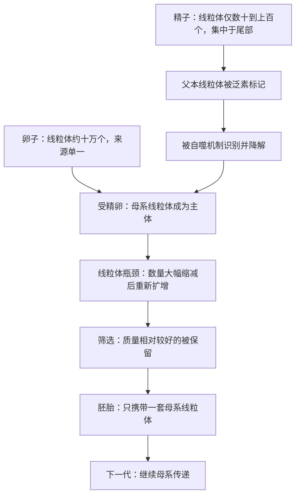

# 14｜为什么线粒体只从母亲那里继承

> 我们身上那套发电厂为什么只认母系这一条线，父本的那一套又去了哪里？

---

## 一、先说结论

先说一个确凿的生物学事实：在绝大多数动物里，线粒体只从母亲一方继承。卵子贡献了未来胚胎几乎全部的线粒体，精子带来的那一小批，则在受精后很快被标记、清除、降解。于是你的线粒体全部来自你母亲的卵子，而你母亲的又来自她的母亲，如此一路上溯，形成一条只走母系的窄线。

至于「为什么」会这样，目前并没有一个被普遍接受的最终答案。莱恩给出的解释强调两点：一是父本线粒体数量少、复制次数多、突变风险高；二是让后代只保留一套来源单一的线粒体，可以避免两套基因组在同一个细胞里互相竞争、甚至「打架」。在他的框架里，母系遗传不是可有可无的细节，而是维护整套能量系统的又一重保险。

## 二、我们先理解一个问题

我们先把问题问得更精确一点。

如果线粒体是细胞的发电厂，那么一个人身上其实有两套潜在来源：母亲通过卵子给的，父亲通过精子给的。照理说，多一套发电厂似乎是好事——更有备份、更有冗余。可现实是，父本的那一套几乎总是被丢弃。

所以真正的问题不是「为什么只有母亲的被保留」，而是：**为什么生命要主动放弃另一半线粒体？** 这种「只留一套」的安排，背后是不是有某种必须付出的代价，或者某种必须避免的风险？

要理解这件事，得先记住线粒体身上一个不太寻常的特点：它自带一小圈 DNA（脱氧核糖核酸）。这圈 DNA 虽然只有三十几个基因，却是细胞内唯一存在于细胞核之外的遗传物质。凡是「有两套遗传物质共存」的地方，就埋着冲突的种子。

## 三、作者到底提出了什么观点？

莱恩的观点可以从「数量」和「冲突」两个角度来拆。

第一，从数量上看，卵子和精子极不对称。卵子体积大、细胞质多，里面的线粒体动辄以十万计；精子为了轻装游泳，线粒体数量要少得多，通常只有几十到上百个，而且集中在尾部，专门为鞭毛运动供能。这个悬殊的起点，本身就决定了母系一方在数量上占绝对优势。

第二，从突变上看，精子在生成过程中经历多次细胞分裂和复制，而线粒体 DNA 的复制与修复机制又相对粗糙。复制次数越多、修复能力越弱，出错的机会就越大。莱恩据此认为，父本线粒体携带有害突变的概率更高，把它们带进胚胎，等于把一批质量存疑的零件直接装进新机器。

第三，从冲突上看，如果胚胎里同时存在两套来源不同、序列略有差异的线粒体，它们会在同一个细胞里各自复制、争夺资源。哪一套复制得更快，哪一套就可能占据上风。莱恩把这种局面看作一种潜在的基因组冲突：细胞内部本该协调一致的能量系统，反而变成了两套程序在暗中较劲。

所以他的判断是：**单亲、而且是母系单亲地继承线粒体，是一种主动的、有筛选意义的安排。** 父本的那一套被清除，不是偶然的遗漏，而是被系统性地排除。

## 四、把这个观点翻译成人话

用一句更朴素的话说：线粒体这套零件，宁可只有一条来源清晰、经过检验的供货渠道，也不要两条互相不服气的渠道同时进场。

这不是因为「两份」一定不好，而是因为「两份不同的」可能带来三种麻烦：一是它们可能不兼容，凑在一起反而降低效率；二是它们会互相竞争，谁复制得快谁占便宜，而占上风的那一套未必是质量最好的那一套；三是核对质量变得更难——只有一套时，所有问题都能追溯到同一条线，清理和筛选都更简单。

生命选择了最简单、最可控的那条路：只留下母亲的那一套，其余一律清场。

## 五、为什么会这样？

把受精到清除的过程画出来，会看得更清楚。

这张图里有两个关键点。第一是「清除」：父本线粒体一进入卵子，很快就被打上标记，随后被细胞自己的回收系统处理掉。第二是「瓶颈」：哺乳动物的生殖细胞在发育早期，线粒体数量会被压到很低的水平，然后再重新扩增。这个「先压缩、再放大」的过程，相当于一次严格的质量抽检——数量少的时候，随机留下的个体差异被放大，携带严重缺陷的谱系更容易被淘汰。

莱恩强调，这两步合起来，构成了对能量系统的一道防线：先把来源减少到一条，再用瓶颈做筛选。

## 六、举一个现实生活中的例子

想象一栋老房子做电路改造。

原先的设计有点混乱：主电源从两条不同的线路进来，一条走东墙，一条走西墙，各自接了一部分房间。表面看是「双保险」，实际麻烦不断——两路电压不完全一致，接在同一台电器上会互相顶牛；某一路漏电，另一路未必能及时察觉；维修时你甚至搞不清某个插座到底归谁管。电工后来做了一件很简单的事：**只保留一套总电闸**，把所有回路统一到这一个入口，另一路彻底断开。

从那以后，线路清清楚楚：哪里跳闸，查一个总闸就知道；要检修，拉下总闸就安全；再没有两路电源互相冲突、互相短路的隐患。代价是失去了「双路冗余」，换来的是秩序、可追溯和可维护。

母系遗传的逻辑与此神似：与其让两套来源不同、可能互相干扰的线粒体在细胞里共存，不如只留一条经过检验的线路，让整套能量系统变得可控。

## 七、回到书中重新理解

现在再回到莱恩的问题，就能看出它和全书的能量主线是连着的。

前面已经讲过，复杂生命能有今天，靠的是线粒体带来了巨大的能量供给；也讲过，有性生殖的一大功能，是帮助后代清理有害的线粒体突变。母系遗传补上的，则是第三块拼图：**不仅要清，还要清得彻底、清得只有一条标准。**

如果两套线粒体可以在细胞里自由共存、自由竞争，那么前面所有的质量控制都会被削弱——你刚淘汰掉一条坏谱系，另一条来源不同的线可能又冒出来占据位置。单亲遗传把这条退路堵死，让筛选只能沿着唯一一条线进行。

## 八、这个观点背后还有什么？

这个观点背后，藏着两个容易被忽略的推论。

其一，母系遗传其实和「两性」这件事是连着的。前面谈过异配生殖：一方提供大而营养丰富的卵，另一方提供小而灵活的精子。正是这种大小分工，导致精子细胞质极少、线粒体极少，卵子则贡献了几乎所有细胞质。也就是说，**母系遗传在很大程度上是异配生殖的副产品**——不是先规定了「只能母系」，再由大小分工去实现，而是大小分工一旦形成，母系传递几乎就成了默认结果。

其二，线粒体 DNA 只有三十几个基因，远少于它作为独立细菌时的规模。绝大多数原本属于它的基因，早已转移到细胞核里。留在里面的这一小圈，主要管能量生产最核心的几件事。这带来一个微妙的后果：线粒体和细胞核之间必须长期「对表」，任何一方的突变都要和另一方匹配。单亲遗传让这条对表关系稳定下来，不必同时应付两种版本的线粒体。

## 九、这个观点有问题吗？

这里必须把「事实」和「解释」分开。

「父本线粒体通常被清除、线粒体以母系方式传递」是确凿的观察事实，争议很小。但在「为什么会这样」这一层，学界存在不同解释，没有定论。

第一种解释，就是莱恩偏重的「基因组冲突」版本：单亲遗传是为了避免细胞内两套线粒体互相竞争。这一说法逻辑自洽，但目前缺少直接的、决定性的实验证据。

第二种解释更偏「损伤」：精子在成熟过程中会经历剧烈的氧化环境，线粒体本身已经受损，清除它们是一种被动的清理，而不是为了防冲突。这个版本更强调父本线粒体的「坏」，而不是「两套并存」的「乱」。

第三种解释把它看成「副产品」：既然受精卵的细胞质几乎全来自卵子，那么父本线粒体本来就少得可怜，被稀释、被降解不过是自然结果，未必需要额外找一个适应性的理由。

此外，还要注意「母系遗传」并非宇宙通则。少数生物存在例外，比如某些贝类有所谓的「双单亲遗传」，雄性的线粒体可以传递下去；某些针叶树以父系方式传递线粒体。这些例外提醒我们：**母系遗传在动物中普遍，但不是所有生命都必须遵守的定律。**

所以更稳妥的说法是：事实清楚，机制部分清楚，而「为什么值得演化成这样」仍是活跃的假说——莱恩的解释是其中很有影响力的一种，但不是唯一的一种。

## 十、今天再看这个观点

以下是基于作者思想的现代延伸，不是作者原话。

近二十年的细胞生物学，把「清除」这一步看得越来越细。研究者发现，父本线粒体在进入受精卵后，会被贴上泛素这种「待处理」标签，随后被细胞的自噬系统吞掉；这一过程涉及一系列专门的蛋白。换句话说，清除不是模糊的「自然消失」，而是有明确分子执行者的主动程序。

另一方面，线粒体「瓶颈」也获得了更具体的理解：它可能不仅是数量上的缩减，还牵涉到 DNA 分子的复制与分配方式，从而影响哪些突变会被传递下去。这为「筛选」提供了可检验的机制。

临床上也出现了直接的延伸。「三亲婴儿」技术，即线粒体替代疗法，正是把母亲的细胞核与一位健康捐献者的卵子细胞质结合，用来避免把母亲的有害线粒体突变传给孩子。这项技术已进入个别国家的合法医疗框架，也引发了关于身份与伦理的持续讨论——它让「线粒体只走母系」这件原本抽象的事，变成了可以操作、也必须面对的现实问题。

## 十一、这一篇真正应该记住什么？

1. 线粒体只从母亲继承，父本的那一套在受精后被主动清除——这是确凿的生物学事实。
2. 母系一方的线粒体数量占绝对优势，父本数量少、复制多、突变风险更高。
3. 莱恩主张，单亲遗传能避免细胞内两套线粒体互相冲突，并让质量筛选只沿一条线进行。
4. 「为什么」仍有多种假说，冲突说、损伤说、副产品说并存，母系遗传也并非绝对通则。

## 十二、留一个问题

既然线粒体会被如此严格地筛来筛去，那这是否意味着，生命在维持能量系统上付出的代价远比我们以为的大？

如果连一套发电厂都要这样层层把关、不断淘汰，那么当这套系统用了几十年、损伤越积越多时，身体会怎样应对？换句话说，我们为什么终究会老、会死？

下一节，我们就从「细胞为什么需要主动死去」开始，去追问衰老与死亡背后的能量账本。
