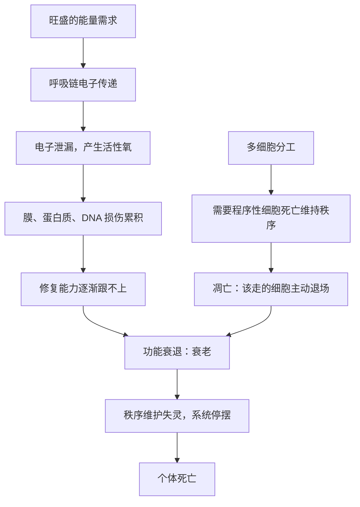

# 15｜我们为什么会衰老和死亡

> 自然选择明明偏爱活得更久，为什么复杂生命几乎都逃不过衰老与死亡？

---

## 一、先说结论

先给一个反直觉的判断：衰老和死亡，很可能不是生命的意外故障，也不是某个「致死基因」在作祟，而更像是复杂生命长期运转必须付出的代价。

莱恩的解释沿着能量这条线展开。细胞在制造能量时，会不可避免地产生活性氧（常被称为自由基）这类副产品；能量需求越旺盛、代谢越活跃，这类损伤的积累就越快。与此同时，多细胞身体还要依靠「程序性细胞死亡」——让一部分细胞按计划自我了断——来维持秩序、塑造器官、清除异常。于是衰老更像是一台高负荷机器在长期运转后磨损的累积，而死亡则是这套系统终将停摆的结果。不过要特别说明：这条线索并非「代谢越快、寿命越短」那样简单的老理论，莱恩对它的处理是有条件的、经过修正的。

## 二、我们先理解一个问题

问题要先问对。

自然选择的核心逻辑，是让个体活得久一点、留下更多后代。那么，如果衰老和死亡对个体不利，为什么演化没有把它们「清除」掉？为什么不是活到某个时刻就永远健康地持续下去？

更奇怪的是，衰老几乎普遍存在。从线虫到家蝇，从老鼠到人类，绝大多数复杂生命都有明确的寿命上限。一个如此普遍、又如此不利的特征，为什么会反复出现？

这提示我们：也许衰老根本不是被「选择」出来的，而是某种更底层的东西，被选择「没能解决」。

## 三、作者到底提出了什么观点？

莱恩的观点，可以从「能量代价」和「多细胞代价」两条线来理解。

第一条线是能量代价。细胞靠呼吸链传递电子，把能量存进 ATP（三磷酸腺苷）。但这条链并不完美，电子有时会提前「漏」出去，和氧结合生成活性氧。活性氧会攻击膜上的脂质、蛋白质和 DNA，造成损伤。身体的修复能力有限，损伤一点点累积，功能就一点点衰退。莱恩强调，这不是简单的「烧得越旺、坏得越快」——真正的关键，是电子传递链的效率与膜的组成能不能把漏电控制在低水平。

第二条线是多细胞代价。我们不是单个细胞，而是一个由数十万亿细胞组成的共同体。要让这个共同体正常运转，就必须允许一部分细胞主动死亡：胚胎发育时手指要靠细胞凋亡分开，免疫细胞完成任务后要退场，受损或可能癌变的细胞要被及时清除。也就是说，「细胞的死亡」是秩序的一部分。而一旦这套秩序随年龄逐渐失灵，该走的细胞不走、该修的修不好，整个身体便走向衰败。

莱恩的结论是：**死亡不是生命的故障，而更像是复杂生命这套高耗能、高度分工系统的运行成本。** 你想要大能量、想要多细胞分工，就得接受随之而来的磨损与秩序维护问题。

## 四、把这个观点翻译成人话

换个说法：生命并不是被人关掉的，而是自己一直开着、一直磨损，直到再也维持不住。

可以这样理解——一台机器的寿命不取决于它有没有「死亡按钮」，而取决于它的损耗速度、维护能力和运行强度三者的平衡。细胞的修复机制就像维护预算，年轻时够用，损伤还没超过修复速度；随着年龄增长，损伤累积、修复效率下降，天平慢慢倾斜到坏的一边。

而多细胞这件事，又给天平加了一枚砝码：身体不能只顾着「保住每一个细胞」，它必须允许、甚至主动要求某些细胞去死。这种「为了整体而牺牲局部」的机制，在年轻时是秩序，在年老时则可能变成失控。

## 五、为什么会这样？

把两条线画在一起，会更容易看出它们如何汇合。

图的左半边是「磨损」：能量生产不可避免带来损伤，这是耗能系统的固有代价。右半边是「秩序」：多细胞身体依赖一批批细胞按计划死亡。两条线在「衰老」处汇合——磨损让功能下降，而凋亡调控的失灵让身体更难纠正错误。最终，当修复与秩序都无法维持，个体走向死亡。

值得注意的是，这里的「程序性细胞死亡」和「个体死亡」是两回事。前者是被精确调控、对整体有利的；后者莱恩并不认为是某个为「死亡」而设的程序，而更像是系统无法维持后的自然结果。这个区分很关键，它决定了我们该把它理解为「设计」还是「代价」。

## 六、举一个现实生活中的例子

想象两台服务器，配置一模一样。

一台常年满负荷运转：任务排满、CPU（中央处理器）和内存长期在高位、风扇昼夜不停、硬盘频繁读写。另一台则常年闲置，偶尔处理一点轻任务，大部分时间安静待机。

几年之后，两者的差别会显现出来。满负荷那台，电容老化更快、风扇轴承磨损更重、硬盘的写入寿命消耗更多、散热系统积灰更严重，故障率明显更高；闲置那台虽然也旧了，但损耗远没那么剧烈。

不过，事情没这么简单。如果满负荷那台恰好用的是更好的散热、更耐久的电容、更稳健的供电，它完全可能比一台廉价、散热差的闲置机器活得更久。**决定寿命的从来不是「忙不忙」这一个数字，而是运行强度、硬件质量与维护水平的整体平衡。**

这正是衰老问题的真实图景：不是简单地「用得越多坏得越快」，而是多个因素共同作用，且条件不同、结果可以反转。

## 七、回到书中重新理解

把这一篇接回全书的能量主线，意义就清楚了。

前面的论证一直在说：真核细胞靠线粒体获得了巨大的能量预算，复杂生命的一切——大基因组、多细胞、性、两性——都建立在这笔预算之上。衰老则是这笔预算的另一面：**能量越充沛，随之而来的副产物与维护负担也越大。**

换句话说，复杂生命的繁荣和它的衰老，来自同一套机制。线粒体既是能量的来源，也是活性氧的主要产地；多细胞既是分工的胜利，也是秩序维护的负担。莱恩想说的，不是「能量害了我们」，而是「能量的好处与代价是打包在一起的，无法只取其一」。

于是死亡不再是需要单独解释的怪事，而是这套能量叙事里顺理成章的一环。

## 八、这个观点背后还有什么？

再往下追一层，会碰到自由选择理论的老争论。

一个流传很广的版本是「生命速率」假说：代谢越快，寿命越短。这个说法直观，但早就遇到了麻烦。鸟类和蝙蝠的代谢率相当高，寿命却远超同等体重的哺乳动物；某些爬行动物代谢缓慢，寿命也未必更长。这说明「快慢」本身不足以解释寿命。

自由基理论也经历了修正。早年人们以为，多吃抗氧化剂就能清除自由基、延长寿命；后来的实验却令人失望——大规模补充抗氧化剂并没有显著延长人类寿命，有些情况下甚至可能有反效果。原因之一在于，活性氧并不只是「坏东西」，它还参与细胞信号传递，是正常生理的一部分。把自由基一股脑清除，反而可能打乱调控。

莱恩的处理方式，是把重点从「自由基多少」转向「电子传递链的质量与调控」。他强调膜的组成、质子泄漏的程度、线粒体自身的更新能力。换句话说，真正影响衰老的，不是抽象的「代谢速度」，而是能量系统在分子层面的稳健程度。这正是他与经典「生命速率」理论划清界限的地方，也是他的说法更谨慎、更带条件的原因。

## 九、这个观点有问题吗？

衰老是生物学里最难的开放问题之一，这里必须保持平衡。

说服力方面：把衰老与大能量系统、多细胞机制联系起来，确实整合了很多零散事实——线粒体功能随年龄下降、活性氧造成损伤、凋亡失调与疾病相关，这些都是被反复观察到的。这条思路至少给了问题一个统一的落脚点。

争议方面：衰老的「主因」至今没有共识。学界至少还有几种竞争性解释：一是「端粒磨损」，认为染色体末端的保护结构随分裂而缩短，设定了细胞分裂的极限；二是「蛋白质稳态失衡」，强调错误折叠蛋白的累积；三是「表观遗传漂变」，认为基因调控信息在岁月中逐渐失真；四是「进化层面的解释」，比如「突变累积」与「拮抗基因多效性」，认为衰老是不受选择约束的副产品，或是那些年轻时有益、年老时有害的基因留下的账单。莱恩的能量视角，与这些解释部分是互补的，部分也有张力。

过度简化方面：把莱恩读成「新陈代谢越快，死得越早」是一种误解。他本人恰恰在修正这种简化；而「死亡是必然代价」这种说法，也容易被读成宿命论。事实上，不同物种的寿命差异极大，说明衰老的速度是可调控的，并非固定不变。

换言之，莱恩提供的是一个有解释力的框架，而不是一个已经被证明的定论。

## 十、今天再看这个观点

以下是基于作者思想的现代延伸，不是作者原话。

近年衰老研究进入了一个新阶段。研究者发现，通过饮食限制、特定药物或基因操作，可以在多种动物身上延长寿命并改善健康状态；其中一些干预与线粒体功能、能量感应通路密切相关。这为「能量与衰老相关联」提供了新的支持。

同时，「部分重编程」等细胞技术展现出逆转某些衰老标志的可能，让「衰老可否被干预」从哲学问题变成了实验问题。线粒体移植、靶向线粒体的抗氧化剂、清除衰老细胞等方向，也都在积极研究中。

但必须提醒：这些进展大多仍处于动物实验或早期临床阶段。它们支持「衰老不是铁板一块」这一判断，却还没有给出终结衰老的答案。莱恩的框架在这里更像一副有用的透镜，而不是一张已经画好的施工图。

## 十一、这一篇真正应该记住什么？

1. 衰老与死亡很可能是复杂生命高能耗、多细胞系统的代价，而不是简单的意外故障。
2. 能量生产会产生活性氧，造成损伤累积；多细胞身体又依赖程序性细胞死亡来维持秩序。
3. 莱恩修正了经典的「生命速率」理论：关键不是代谢快慢，而是能量系统的质量与调控。
4. 衰老的主因仍是开放问题，端粒、蛋白稳态、表观遗传等解释并存，能量视角是重要但不唯一的一家。

## 十二、留一个问题

如果复杂生命的衰老与死亡，是这套高能耗系统长期运转的必然成本，那么这套系统在地球上走得有多不容易？

我们已经看到，它依靠一次几乎不可能的内共生才得以启动。既然如此，放眼整个宇宙，能够跨过这道门槛、真正演化出复杂生命的地方，究竟会有多少？
