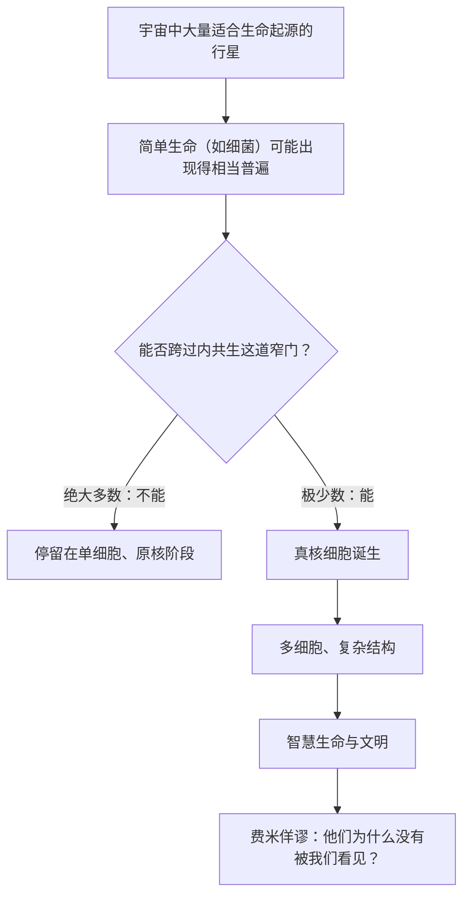

# 16｜复杂生命是宇宙的常态，还是地球的意外

> 如果复杂生命的门槛高到几乎无法跨过，那么宇宙里的我们，究竟是普遍还是孤独？

---

## 一、先说结论

先分清两个层次。

第一个层次是生物学推理：如果复杂生命的诞生真的依赖一次近乎不可能的内共生事件，那么「适合生命起源的行星很多」和「能演化出复杂生命的行星很少」这两件事，完全可以同时成立。细菌或许在宇宙中相当普遍，但真正复杂、多细胞、有智慧的生命，可能被这道门槛挡在了外面。

第二个层次是作者的推测：把这道生物学门槛外推到整个宇宙，去估计复杂生命的概率，并联系到费米佯谬——「如果宇宙里本该有很多文明，那他们都在哪里？」这一步已经超出可以观测验证的范围，属于莱恩的科学推测，而不是观测结论。

这一篇要做的，就是把「推理」和「推测」这两层清楚地分开。

## 二、我们先理解一个问题

先把问题问清楚：为什么「生命普遍」和「复杂生命罕见」不能互相推出？

很多人直觉上认为，只要宇宙足够大、行星足够多，生命就一定会遍地开花，复杂生命也迟早会出现。这个推理藏着一个默认前提：从简单生命到复杂生命，是一段平缓的、只要时间够长就必然走完的路。

但如果这个前提是错的呢？如果从细菌到复杂生命之间，横着一道极窄的关口，绝大多数生命一旦走到那里就再也过不去，那么「行星多」就不能保证「复杂生命多」。行星数量再多，也只是让更多生命走到关口前排队，不等于有更多能跨过去。

所以真正关键的问题是：**从简单生命到复杂生命，到底是一段渐变的路，还是一道几乎过不去的窄门？**

## 三、作者到底提出了什么观点？

莱恩的答案，倾向于后一种：那是一道窄门，而且窄得惊人。

第一，从时间上看。地球大约在四十亿年前就有了生命，但复杂生命——那些有细胞核、有线粒体、有复杂结构的真核生物——出现得很晚，中间隔了很长一段时间。如果复杂化只是一件顺理成章、水到渠成的事，为什么用了这么久才发生一次？

第二，从次数上看。真核生物在地球史上只诞生过一次，此后所有复杂生命都是这一个祖先的后代。一次成功、再无第二次，这个「孤本」式的事实，本身就暗示成功率极低。

第三，从门槛的构成上看。内共生不是「一个细胞吞了另一个」这么简单。要真正合为一体、共同繁衍，需要把共生体的大量基因转移到宿主细胞核、重建调控网络、让两套基因组长期互相匹配。莱恩认为，这个「共适应」过程极其脆弱，任何一步走偏都可能前功尽弃。

因此他的推论是：**跨过这道门的生命或许极其稀少，复杂生命在宇宙中可能是一种罕见现象，而不是普遍规律。**

## 四、把这个观点翻译成人话

用一句朴素的话说：宇宙里「有生命」和「有复杂生命」是两件不同难度的事。

前者也许只是「水、岩石、能量同时在场，凑出最基础的新陈代谢」；后者却要求「已经出现的生命，恰好又完成了一次需要几百个巧合同时成立的合并」。

一个是常见的起步，一个是极难的升级。把两者混为一谈，就会得出「生命这么多，复杂生命当然也多」的错觉。莱恩想纠正的，正是这种错觉：数量上的多，并不能替代难度上的高。

## 五、为什么会这样？

把「行星数量」和「门槛通过率」这两个变量画在一起，会看得更清楚。

这张图的关键，是中间那个分岔。行星数量再多，只是让更多人走到这个岔口；而能不能通过，取决于一道与行星数量无关、只与事件难度有关的窄门。这就解释了为什么「宇宙很大」不必然推出「到处是复杂生命」：**分母很大，但通过率极小，乘积未必大。**

## 六、举一个现实生活中的例子

想象一个彩票游戏，规则很苛刻：想拿到最终大奖，你必须连续两次中头奖。

第一次中奖的概率也许已经很低，但只要有足够多的人买、足够多期开奖，总会有人中。问题在于第二次——不是换一张彩票重新抽，而是你上次中奖的那张票，还必须在另一套独立的抽奖里再次命中。

结果就是：第一次中奖者看起来不少，可真正拿到大奖的人极其稀少。不是因为没有机会，而是因为必须「连着中两次」这个条件，把绝大多数幸运者挡在了半路上。

复杂生命在莱恩框架里的处境与之类似：生命的出现可能是「第一次抽中」，而内共生是那道额外的、几乎无法绕开的第二次抽奖。于是「有生命」与「有复杂生命」之间，隔着一个数量级完全不同的概率。

（所谓「大过滤器」，就是用来形容这类把绝大多数候选者卡住的关卡的概念；它未必只有一个，也未必都在同一环节。）

## 七、回到书中重新理解

把这一篇接回全书的能量主线，意义就很清楚了。

整本书一直在论证：复杂生命的诞生，是一次能量供给方式的根本改写。细菌卡在能量瓶颈上，真核细胞靠内共生打开闸门，从此才有了大基因组、多细胞、性、衰老与死亡。这条链上的每一环，都是具体、可分析的生物学事件。

而一旦这条链成立，它就不只解释地球，也隐含着对外星生命的判断：**如果复杂生命必须依赖这样一串罕见事件，那么「宇宙中生命是否普遍」和「宇宙中复杂生命是否普遍」，答案很可能不同。** 前者可能乐观，后者则可能悲观。

这不是文学式的浪漫感叹，而是把地球生命的经验，作为一个样本来反推普遍规律。样本只有一个，正是它最让人不安的地方。

## 八、这个观点背后还有什么？

再往下想，会碰到一个更深的问题：我们凭什么用地球这一个样本，去推断整个宇宙？

这背后是所谓的「孤独样本」难题。我们知道地球生命是怎么走的，但不知道这条路有多少种走法，也不知道哪些步骤是「普遍必然」，哪些是「地球特供」。如果内共生之后还有别的通往复杂生命的路径，只是我们没见到，那么「复杂生命罕见」的结论就会被削弱。

还有一个容易被忽略的点：即使复杂生命罕见，也不等于「有智慧的生命」罕见。从复杂生命到智慧、到文明、到能被我们探测到的技术信号，中间还有许多额外的、同样未必容易跨过的门槛。莱恩谈的主要是「复杂」这一道，更靠后的环节他并没有给出确定判断。

这也提醒我们：费米佯谬的答案可能有多种，莱恩提供的只是其中一种——「复杂生命本来就太少」。还有别的解释，比如文明存在的时间太短、信号方式不对、或者我们探测得还不够。

## 九、这个观点有问题吗？

这里要把生物学推理与宇宙推测彻底分开。

在生物学这一层，莱恩的论证有相当的说服力：真核生物单一起源、内共生需要复杂的共适应、复杂化在地球史上只发生一次，这些都有一定的观察支持。用它们来说明「复杂化很难」，是合理的。

但外推到宇宙，就进入了推测领域，争议明显更大。第一，「地球只成功一次」这个样本量为一的事实，既可能意味着概率极低，也可能只是运气问题——一次成功并不自动等于「必然极难」。第二，我们对「适合生命的条件」了解得非常有限，用地球标准去筛外星环境，本身可能就有偏差。第三，费米佯谬至今没有公认解法，把「复杂生命罕见」当作它的答案，只是众多候选解释之一。第四，生命起源与复杂化的难度究竟有多大，学界存在不同估计，从「相当普遍」到「极其罕见」都有支持者。

因此更准确的说法是：**「复杂生命在地球上很难得」是有依据的生物学判断；「复杂生命在整个宇宙中很罕见」则是建立在这个判断之上的、尚未被观测证实的推测。** 两者的证据强度不在一个量级上。

## 十、今天再看这个观点

以下是基于作者思想的现代延伸，不是作者原话。

近二十年，系外行星研究取得了巨大进展。天文学家已经确认了数以千计的行星，其中不少位于恒星的宜居带内，也有富含水或岩石质地的候选者。这让「适合生命起源的地方可能很多」从设想变成了有数据支撑的判断。

与此同时，太阳系内的探测也在推进：火星地下的水与有机分子、木卫二和土卫二冰层下的液态海洋，都被列为可能孕育简单生命的环境。这些发现支持「简单生命或许并不稀有」这一半。

但复杂生命那一半，依然是一道没有数据的门槛。我们至今没有在地球之外发现任何生命，更不用说复杂生命。有研究者尝试用统计方法估算「从简单到复杂」的转变率，也有人主张这类转变受制于能量与信息的硬约束，因此格外罕见；但都谈不上定论。

换句话说，现代观测丰富了问题的两侧，却没有替我们回答中间那道窄门到底有多窄。

## 十一、这一篇真正应该记住什么？

1. 「生命常见」和「复杂生命常见」是两件事，不能互相推出。
2. 莱恩的生物学推理是：复杂生命依赖一次近乎不可能的内共生，因此可能极其稀少。
3. 从「地球案例」外推到「整个宇宙」，已经从生物学推理进入了作者的科学推测，证据强度完全不同。
4. 费米佯谬有多种可能解释，「复杂生命罕见」只是其中之一，尚未被观测证实。

## 十二、留一个问题

如果性、两性、衰老、死亡，乃至我们在宇宙中的孤独，都被同一条「能量」的线索串联起来，那这究竟是生物学的一次真正转向，还是一个过于优美的、尚未被证实的框架？

当一套理论能解释的事情太多时，我们该为它的解释力惊叹，还是该对它的边界保持警惕？下一节，我们就把整本书收个尾。
