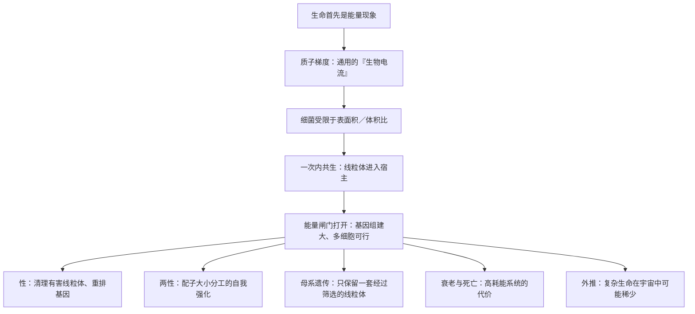

# 17｜如果答案只是「能量」——这本书真正想告诉我们什么

> 把性、两性、衰老、死亡乃至宇宙中的孤独都用「能量」串起来，这套说法究竟有多少分量，边界又在哪里？

---

## 一、先说结论

先给一个总的判断。

莱恩最有价值的贡献，未必是他给出的每一条具体结论，而是他把「能量」重新放回了演化解释的中心。在他之前，主流叙事倾向于把生命看成一套遗传信息的执行过程，基因是主角，能量只是背景供给。莱恩主张反过来看：能量供给方式决定了哪些复杂结构在物理上「养得起」，哪些养不起。

但这个框架仍然是活跃的假说，而不是已经盖棺的定论。许多环节有扎实的生化与观测基础，另一些环节则依赖推理和估算，直接证据有限。真正值得带走的，不是「能量万能」这个口号，而是一种思考方式：**遇到一个生物学的「为什么」时，先问它需要付出什么代价，再问为什么结构会是现在这样。**

## 二、我们先理解一个问题

先问一个元问题：为什么我们会担心「一套理论解释得太多」？

因为解释力强，本身并不等于正确。历史上不乏这样的例子：一套框架能优雅地说明很多现象，人们便倾向于把它当成万能钥匙，直到新的证据暴露出它解释不了的角落。理论的危险，往往不在它错了，而在它太顺——顺到让人不再去追问证据在哪里。

所以面对「一切都由能量解释」这样的主张，真正该问的不是「它讲得美不美」，而是：**它到底能解释多少，哪些部分是靠数据，哪些部分是靠推理，哪些部分还只是猜想？**

## 三、作者到底提出了什么观点？

把这本书的主线收拢一下，莱恩的主张可以概括成一条递进的链条。

起点是：生命首先是能量现象，而不是信息现象。细胞靠质子跨膜形成的电化学梯度驱动能量，这套机制在所有生命里通用。

第二步是：细菌的能量供给方式受限于细胞膜的表面积与体积之比，因此卡在复杂化的门槛前；而一次偶然的内共生，让一个细胞住进另一个细胞，线粒体带来了内部折叠的产能表面，一举打开了能量闸门。

第三步是连锁后果：有了充足的能源，真核细胞才养得起庞大的基因组与多细胞身体；性、两性、母系遗传、衰老与死亡，都可以被放在这条能量线索上重新解释。

最后是外推：如果复杂生命依赖这样一串罕见的巧合，那么它在宇宙中可能极其稀少。

莱恩的核心主张是：**这条链条不是零散的解释拼凑，而是同一个底层机制在不同尺度上的展开。**

## 四、把这个观点翻译成人话

换个说法：莱恩提供的，不是一本「标准答案册」，而是一副重新校准过的透镜。

戴上这副透镜，你看到的生物学问题会变成另一种问法——不再只问「哪个基因控制了它」，而是先问「这样的结构要花多少能量、要承担什么代价」。很多原本孤立的现象，会因此显出隐约的关联：为什么细菌变不大，为什么真核细胞能养得起那么多基因，为什么要有性，为什么要有两种性别，为什么线粒体只走母系，为什么我们会老。

但这副透镜也有它的放大盲区。它擅长处理「成本」和「约束」这类问题，却不擅长直接回答某些细节：具体的分子机制是什么，某个性状究竟何时出现，某条推断是否有实验支持。看得到大局，未必看得清局部。

## 五、为什么会这样？

把全书的主干重新铺成一张图，会比逐章回忆更清楚。

这张图有一个鲜明特点：所有下游结论，最终都归到同一个节点——能量供给被改写。**树越统一，越要警惕：是被证据统一起来的，还是被叙事统一起来的？** 这正是评估莱恩框架时最该保持清醒的地方。

## 六、举一个现实生活中的例子

想象一辆车，仪表盘上只有一个转速表。

只看转速表当然有用：它能告诉你发动机转得多快，在加速、爬坡、高速巡航时给出关键信息。如果你只盯着「转速」这一项，确实能解释不少驾驶表现——为什么起步要慢、为什么高转速费油、为什么长时间高转容易过热。

但一辆车的状况，远不是转速表能概括的。机油压力、冷却液温度、电池电压、轮胎磨损、刹车片厚度，这些指标各自反映不同系统；只看转速，你既可能漏掉正在酝酿的故障，也可能误判某次抖动的真正原因。

莱恩的「能量」视角，很像这块转速表：它抓住了最关键的动力指标，能把很多看似无关的现象联系起来，功劳很大。但一个负责任的驾驶者不会把它当成唯一的仪表；同样，一个负责任的读者也不该把「能量」当成生物学的全部解释。

## 七、回到书中重新理解

那么，翻完这本书，我们到底该带着什么离开？

一个有用的态度是：把它当作一份「有主张的提案」，而不是「已定案的判决」。提案里最扎实的部分——化学渗透、质子梯度、线粒体的内共生起源、能量与基因组规模的关系——可以放心吸收；提案里最激进的部分——内共生是唯一的一次、复杂生命因此罕见、衰老与死亡是能量代价——则应带着问题去记。

有意思的是，莱恩本人其实也没有把话说死。他反复承认许多环节是推断，强调证据的边界。这种「大胆假设、谨慎标注」的姿态，恰恰比结论本身更值得学习。

## 八、这个观点背后还有什么？

再退一步，这件事还牵涉到科学争论如何运作。

莱恩的框架触动了不少传统叙事，自然会引来反驳。一些学者认为，把复杂化归因于能量单一因素，低估了生态、遗传漂变、寄生与竞争等力量的作用；也有人质疑某些关键估算的假设是否稳健。这些反驳并不必然否定能量视角，而是提醒我们：一个解释越是想包打天下，就越需要接受更严格的检验。

同时也要看到，争论本身是科学健康的标志。一个新框架的价值，往往不在于它是否全对，而在于它是否提出了能被检验、能被反驳、也能激发新研究的命题。从这个角度说，莱恩的贡献至少在这一点上是成立的：他让「能量」重新成为必须被认真对待的解释变量。

## 九、这个观点有问题吗？

必须承认，这个框架的边界相当明显。

在说服力方面，它的优势是整合：用一条线索把从细胞起源到宇宙生命概率的多个层面串起来，提供了少见的统一视角，而且核心机制——化学渗透与内共生——有坚实的生化基础。

在争议方面，问题同样真实。第一，把复杂化的原因主要归于能量约束，可能低估了生态与随机因素，比如细菌的生态位早被占满，是否也让复杂化缺少机会。第二，「复杂生命只出现一次」这一事实，是否足以推出「极难出现」，仍有讨论空间。第三，从地球经验外推到宇宙，缺乏观测支撑，属于推测。第四，衰老、死亡这类问题的多因性很强，能量只是其中一条线索，不宜独占解释权。

在过度简化方面，最需要警惕的是把莱恩读成「能量决定一切」。他本人并没有这样宣称；把他简化成一句口号，既不符合书里的谨慎，也会掩盖那些尚未解决的分歧。

所以更公允的评价是：这是一个雄心很大、洞见很多、但远未完成的框架。它值得认真对待，也值得认真怀疑。

## 十、今天再看这个观点

以下是基于作者思想的现代延伸，不是作者原话。

近十年，几条研究线在不同方向上检验着这个框架。线粒体生物学与结构生物学让我们对呼吸链复合物、ATP 合成酶的工作方式有了更精细的认识；比较基因组学让我们能重建真核起源前后的基因变化；阿斯加德古菌等发现则不断为「宿主是古菌」这一环补充证据。这些进展大多支持能量视角的核心部分。

与此同时，其他解释也在发展。有人强调生态机遇与随机性，有人强调细胞内部结构的演化动力学，也有人从信息与调控角度切入。它们与莱恩的框架并非全然对立，更像是从不同侧面逼近同一段历史。

值得注意的是，「能量约束」这个思路的影响已经溢出生物学：在讨论生命起源、行星宜居性乃至人造系统的设计时，人们越来越多地先问「这套结构的能量预算是否成立」。这或许是莱恩最具持久价值的遗产——不是某个具体结论，而是一种提问方式。

## 十一、这一篇真正应该记住什么？

1. 莱恩最大的贡献，是把能量重新放回演化解释的中心，而不是把生命简化为信息。
2. 这条能量线索确实串起了细菌的瓶颈、内共生、性、两性、母系遗传、衰老与死亡；其中许多环节有坚实基础，另一些仍属推理。
3. 面对解释力极强的框架，要区分「数据支持的部分」与「靠推理外推的部分」，尤其要警惕从地球经验推及宇宙。
4. 真正值得带走的是方法论：先问代价从哪里来，再问结构为何如此；把理论当作透镜，而不是答案册。

## 十二、留一个问题

绕了一整圈，让我们回到最初的谜题：地球上的复杂生命，为什么只出现过一次？

有人会说，那是因为这道门槛高到几乎不可复制；也有人会说，那只是四十亿年里一次没有留下第二次机会的偶然。读完莱恩，你不必立刻选边。你可以带着他那句提醒——先看能量、先看代价——去重新审视这个问题，然后形成你自己的判断。

如果复杂真的只是一次侥幸，那么此刻正在追问这件事的你，本身就是那场侥幸的回声。宇宙是否因此变得孤独，取决于你如何理解这一次「恰好在场」。
