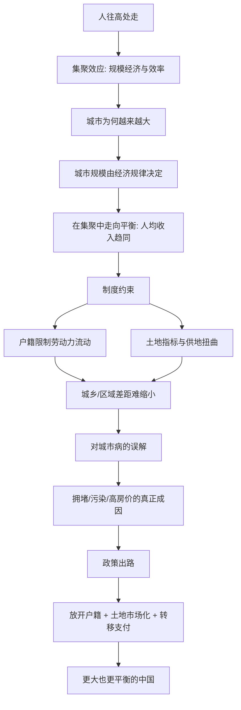

# 《大国大城》深度解读系列

## 系列简介

《大国大城》是经济学家陆铭的代表作。它要回答的，是中国城市化进程中最容易被情绪绑架、却最需要冷静分析的一组问题：**大城市是不是太大了？人口该不该继续往大城市集中？限制大城市、发展中小城市，真的能让中国更平衡吗？**

陆铭的答案建立在一个朴素的经济学直觉上：**人往高处走，是规律，不是问题。** 城市之所以变大，是因为集聚能带来更高的效率与更多的机会；真正该被质疑的，不是"人为什么来"，而是"为什么制度不让人来"。

他提出的核心判断是"在集聚中走向平衡"：区域之间的平衡，不该理解为人口和产出均匀分布，而应理解为**人均收入趋同**。据此，他主张放开户籍、让土地与人口流动起来、让市场决定城市规模。

本系列围绕 **14 个核心问题**，从城市化的基本规律，讲到户籍、土地、城市病与政策出路。

---

## 全书核心问题

| 层次 | 问题 |
|---|---|
| 规律问题 | 城市为什么会变大？规模由什么决定？ |
| 判断问题 | 人口流入是负担还是财富？什么叫"平衡"？ |
| 制度问题 | 户籍、土地等制度如何影响了城市化？ |
| 误解问题 | 拥堵、污染、高房价，真的是"人太多"造成的吗？ |
| 出路问题 | 怎样改革，才能让中国既做大城市、又更平衡？ |

---

## 全书知识地图



---

## 全系列目录

### 第一部分：城市化的基本规律

#### 01｜为什么大城市会越来越大？

核心问题：城市扩张是失控，还是经济规律的结果？

核心观点：集聚效应：人、资本、企业聚在一起，能共享基础设施、匹配更细的分工、产生知识与技术的溢出，从而带来更高的生产率。城市越大，这种效应通常越强。因此"越来越大"不是病，而是效率的选择。

理解难度：★★★☆☆

关键词：集聚效应、规模经济、分工、知识溢出

---

#### 02｜城市规模到底由什么决定？

核心问题：一个城市该有多大，是谁说了算？

核心观点：城市的规模，本质由"集聚带来的收益"与"拥挤带来的成本"之间的平衡决定。通勤、房价、污染是成本，机会与收入是收益；当两者大致相等时，城市规模趋于稳定。行政限制可以短期改变人口分布，但很难长期对抗经济规律。

理解难度：★★★★☆

关键词：城市规模、集聚收益、拥挤成本、均衡

---

#### 03｜人口流入，是大城市的负担还是财富？

核心问题：外来人口是在"抢资源"，还是在"创造价值"？

核心观点：人口流入既是劳动力，也是消费者与纳税人。服务业、物流、建筑、养老照护等大量岗位依赖外来人口。把人口视为负担，往往忽略了一个事实：城市之所以能运转，正是因为有源源不断的人进来做工、消费与创新。

理解难度：★★★☆☆

关键词：人口流入、劳动力、服务业、贡献

---

#### 04｜什么是“在集聚中走向平衡”？

核心问题：区域平衡，是让各地"一样富"，还是让人"一样富"？

核心观点：陆铭的关键判断是：平衡不等于人口和产出均匀分布，而应理解为**人均收入趋同**。与其让每个地方都建工厂，不如让劳动力自由流动，让人去收入更高的地方，再通过转移支付弥补差距。总量可以不均，人均可以趋同。

理解难度：★★★★★

关键词：平衡、人均收入、人口流动、转移支付

---

### 第二部分：中国的制度约束

#### 05｜户籍制度如何影响了中国的城市化？

核心问题：户籍只是一张纸，为什么会有这么大的影响？

核心观点：户籍绑定了教育、医疗、养老、购房等公共服务与权利。它让大量在城市工作的人无法真正"成为城市人"，形成了"人在城市、权利在故乡"的割裂。结果是城市化"不彻底"，内需被压制，社会也被人为分层。

理解难度：★★★★☆

关键词：户籍、公共服务、权利割裂、城市化

---

#### 06｜为什么劳动力流动被“卡住”了？

核心问题：如果大城市机会多，为什么人没有充分流过去？

核心观点：因为流动有制度成本：落户门槛、子女入学、社保转移、住房限制。这些成本让劳动力无法"用脚投票"，也让城市之间的工资差距长期存在。流动不完全，正是资源配置效率损失的核心。

理解难度：★★★☆☆

关键词：流动障碍、落户、社保、候鸟式迁移

---

#### 07｜土地制度怎样限制了城市的发展？

核心问题：土地明明是建城市的基础，为什么反而成了约束？

核心观点：建设用地指标按行政方式分配，导致人口流入的大城市"地不够用"、人口流出的地方却"地没人用"。土地供应与人口流向错配，既推高了大城市房价，又造成了小城市空置与浪费。

理解难度：★★★★☆

关键词：土地指标、供地错配、建设用地、空置

---

### 第三部分：城市病与误解

#### 08｜大城市病真的是“人太多”造成的吗？

核心问题：拥堵、污染、高房价，该怪人口，还是怪别的？

核心观点：城市病主要来自规划、管理与定价，而非人口总量。拥堵可以用公共交通与路权定价缓解；污染与产业结构、能源、监管更相关；高房价与土地供应和预期相关。把城市病归因于"人多"，容易开出错误药方。

理解难度：★★★★☆

关键词：城市病、拥堵、污染、规划、定价

---

#### 09｜高房价的根源到底是什么？

核心问题：房价高，是因为人多，还是因为地少、钱多？

核心观点：在人口持续流入的大城市，住房需求旺盛，而土地与住房供给受指标与规划限制，供需失衡推高价格。高房价本质上是"人往高处走"与"地不能跟着走"之间的矛盾。

理解难度：★★★☆☆

关键词：房价、供求、土地供应、预期

---

#### 10｜限制大城市，为什么可能让问题更严重？

核心问题：为了"平衡"而限制大城市，结果会怎样？

核心观点：限制落户与用地，并不能让人不流动，只会让人"流而不迁"：人在城市工作，却无法安定消费、成家、育儿。这既压制内需，也加剧城乡割裂，还可能让资源错配更严重。限制往往治标不治本。

理解难度：★★★★☆

关键词：限制、流而不迁、内需、资源错配

---

#### 11｜城乡与区域差距为什么难以缩小？

核心问题：为什么投了那么多钱，差距还是那么大？

核心观点：如果劳动力不能自由流动，落后地区的人就无法分享发达地区的繁荣。仅靠给落后地区"输血"（项目、补贴），往往效率低下；真正有效的是"让人走出去"，再以转移支付保障基本公共服务。

理解难度：★★★★☆

关键词：城乡差距、区域差距、转移支付、人口流动

---

### 第四部分：出路与政策

#### 12｜为什么要让市场决定城市规模？

核心问题：城市该多大，为什么不该由行政命令决定？

核心观点：市场通过价格反映稀缺：土地、住房、通勤的时间成本，都会自动发出信号。行政决定城市规模，往往忽略这些信号，造成"该大的不大、该小的不小"。让市场配置，并辅以公共政策，才更接近有效率的均衡。

理解难度：★★★★☆

关键词：市场配置、价格信号、行政干预、效率

---

#### 13｜土地和财政该怎么改？

核心问题：地方政府依赖卖地，这个模式怎么破？

核心观点：改革方向包括：让建设用地指标跟随人口流动、允许土地跨地区交易、调整中央与地方的财税关系、以更稳定的地方税源替代对土地财政的依赖。核心是让"人、地、钱"跟着市场走。

理解难度：★★★★★

关键词：土地改革、土地财政、财税体制、人地钱

---

#### 14｜一个更平衡的中国，应该是什么样子？

核心问题：如果把陆铭的思路走到头，中国会变成什么样？

核心观点：一个"更大也更平衡"的中国：人口持续向城市群集聚，形成若干世界级都市圈；同时通过户籍放开与转移支付，让人均收入与基本公共服务逐步趋同。平衡不靠"摊大饼"，而靠"人自由流动 + 财政再分配"。

理解难度：★★★★☆

关键词：都市圈、城市群、人均趋同、再分配

---

## 推荐阅读顺序

**主线顺序（推荐）：01 → 14。**

```text
第一段｜规律（01–04）   集聚 → 规模 → 人口流入 → 在集聚中走向平衡
第二段｜制度（05–07）   户籍 → 流动障碍 → 土地
第三段｜误解（08–11）   城市病 → 房价 → 限制的反效果 → 差距
第四段｜出路（12–14）   市场决定规模 → 土地财政改革 → 平衡的中国
```

**阅读建议：**

- **想先抓住骨架**：读 01、04、05、08、12 五篇。
- **关心房价与城市病**：读 08、09、10。
- **关心政策与改革**：读 12、13、14。
- **想练习批判性阅读**：重点看 02、04、10、13 四篇。

---

## 全系列状态

> 本系列共 14 篇，正文生成中。
