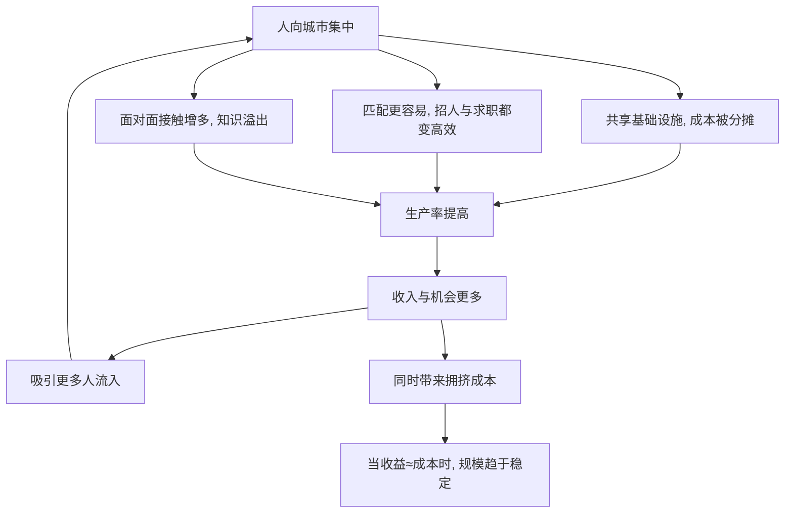

# 01｜为什么大城市会越来越大？

> 城市不断膨胀，是失控，还是经济规律的结果？

---

## 一、先说结论

陆铭的答案很干脆：**城市变大，主要是因为它更有效率。**

这个机制叫"集聚效应"。人、企业、资本聚到一起后，会产生三种好处：共享更完善的基础设施、匹配更精细的分工、以及知识与技术的相互溢出。三者叠加，让同样一个人在大城市能创造更高的价值。

所以，"大城市越来越大"不是失控，而是人在用脚投票。真正需要解释的不是"人为什么来"，而是"为什么有人想挡住他们来"。

---

## 二、我们先理解一个问题

先做一个思想实验。

如果把你从上海放到一个偏远小城，你的能力没有任何变化，但你会发现：能选择的岗位少了很多，能合作的同行少了，能接触到的信息、客户、机会也少了。你的收入很可能下降一大截。

反过来，把你放到一个人口更多、产业更全的城市，同样是你，能做的事、能赚的钱、能学到的东西，都会明显增加。

问题来了：

> 如果人的能力没变，只是换了个地方，产出就不同——那"增长"到底来自人，还是来自人所在的城市？

这正是陆铭要解释的：**城市本身就是一种生产力。**

---

## 三、作者到底提出了什么观点？

陆铭在书中反复强调一个核心机制：**集聚效应。**

所谓集聚，是指人和经济活动在空间上的集中，它会带来三类收益：

1. **共享（sharing）**：更多人分摊机场、地铁、医院、学校等大型设施的成本。
2. **匹配（matching）**：企业和劳动者都更多，双方更容易找到"合适"的那一个——招人的招得到，找活儿的找得着。
3. **学习（learning）**：人与人面对面接触，知识、技术、想法更容易传播和碰撞。

集聚还带来更细的分工：在大城市，一个人可以只做"婚庆摄影"，而在小城，他可能得同时做设计、修图、主持。分工越细，效率越高。

陆铭的结论是：**城市的规模不是随意的，它由"集聚带来的收益"和"拥挤带来的成本"共同决定。** 在收益还大于成本的地方，人就会继续涌入。

---

## 四、把这个观点翻译成人话

想象一条街。

街上只有一家早餐店。老板既要做包子、又要收钱、还要送外卖——样样自己来，效率很低。

当这条街变成一条真正的商业街后，事情变了：出现了专门做包子的，专门送外卖的，专门管收银的，甚至有人专门负责采购。每个人都只做一小块，但整条街的产出大幅上升。

城市就是这条商业街放大一万倍的样子。

再看一个更日常的例子：你有没有发现，**同样一份工作，在小城市和大城市的薪资差距，往往远大于生活成本的差距？** 这不完全是因为大城市的公司更慷慨，而是因为在更大的市场里，同样的劳动能被匹配到更值钱的位置上。

这就是集聚效应：**它不改变你的能力，但它改变你的能力能卖多少钱。**

---

## 五、为什么会这样？

把集聚的逻辑拆开：

关键在于 **E → G** 这一条正反馈。

生产率提高 → 收入提高 → 吸引更多人 → 集聚效应更强 → 生产率再提高。这是一个自我强化的循环。它解释了为什么城市一旦形成优势，就会持续吸引人口，甚至"赢者通吃"。

当然，集聚也有成本：地价、房价、通勤时间、拥堵、污染。当这些成本上升到一定程度，人口流入会放缓，城市规模趋于均衡。**所以城市不是无限膨胀，而是在"收益与成本"之间找一个动态平衡点。**

---

## 六、举一个现实生活中的例子

看一个大城市的普通工作日。

早上，外卖骑手把早餐送给写字楼里的程序员；程序员写的代码，让一家创业公司拿到了投资；投资人白天见完创业者，晚上去餐厅吃饭；餐厅的厨师和服务员，很多是从外地来的；他们下班后，又要靠快递、打车、便利店维持生活。

这些人彼此不认识，却构成了一条完整的链条。少了任何一环，城市的效率都会下降。

再对比一个县城：它可能也想要"互联网产业""金融中心"，但缺乏足够的人、企业与需求，最终往往只能建成一排排空置的写字楼。

这说明一件事：**城市的价值不在楼有多高，而在于人和人之间能不能高效地彼此需要。** 集聚之所以重要，就是因为它让这种"彼此需要"变得密集、频繁、低成本。

---

## 七、回到书中重新理解

现在再回看陆铭为什么从"集聚效应"讲起，就顺了。

他要先破除一个直觉：很多人认为"城市太大是问题，应该限制"。但如果不先理解城市为什么能带来效率，就会把"增长的动力"误当成"需要治理的麻烦"。

所以第一篇的任务，是把大城市从"被审视的对象"变成"被解释的对象"：**先承认城市是效率的产物，再谈它带来了哪些成本、这些成本该如何解决。** 这也为后面"在集聚中走向平衡""放开户籍"等主张，铺好了逻辑起点。

---

## 八、这个观点背后还有什么？

**第一，集聚效应并不意味着"越大越好"。** 它有边际递减与拥挤成本；超过某一点，收益会被通勤、地价、污染吃掉。

**第二，集聚的前提是"能流动"。** 如果制度限制了人的流动，集聚效应就无法充分释放，效率损失会被隐藏在"看起来更平衡"的表象下。

**第三，它把"城市问题"从道德判断变成效率判断。** 不再问"人该不该来"，而问"来了之后，成本怎么降、收益怎么分配"。

**第四，它与"在集聚中走向平衡"是一个整体。** 集聚不是要牺牲平衡，而是走向更高水平平衡的手段——这一点会在第 04 篇展开。

---

## 九、这个观点有问题吗？

有，需要一些平衡。

**第一，集聚的收益有多可靠，存在争议。** 一些研究支持城市规模与生产率正相关，但具体效应大小、以及是否在所有发展阶段都成立，学界仍有不同估计。

**第二，它可能低估了拥挤成本的严重性。** 在治理能力不足的城市，拥堵、污染、公共资源紧张可能来得更早、更猛，这会削弱"越大越有效率"的判断。

**第三，它可能忽略区域与国家安全等非经济考量。** 例如边疆地区、粮食安全、生态功能区的人口布局，不能只用效率标准衡量。

**第四，但它的核心提醒很有价值。** 把城市化理解成"人往高处走"的自然结果，而不是需要遏制的冲动，能避免很多政策的南辕北辙。

**所以更准确的说法是**：集聚效应是理解城市化的关键机制，城市扩张有其经济合理性；但"越大越好"并不自动成立，规模收益与拥挤成本需要在具体条件下权衡，非经济目标也应纳入考量。

---

## 十、今天再看这个观点

以下部分是基于陆铭思想的现代延伸，不是他书里的原话。

今天，"集聚"这件事正在被技术重新定义。远程办公、在线协作、直播电商，让一部分人可以"人在小城、服务大城市"，似乎削弱了地理集聚的必要性。

但另一面，创新最密集的行业——AI、芯片、生物医药、金融——依然高度依赖面对面的碰撞。硅谷、深圳、班加罗尔的经验反复说明：**越是需要创意与协作的产业，越离不开集聚。**

所以更可能的图景不是"大城市消失"，而是"集聚升级"：一部分常规工作被远程化、分散化，而高价值的创新活动，仍会向少数超级城市圈进一步集中。

---

## 十一、这一篇真正应该记住什么？

1. **城市本身就是生产力。** 集聚通过共享、匹配、学习三种机制，提高每个人的产出。
2. **集聚有一个自我强化的循环。** 生产率高 → 收入高 → 吸引更多人 → 生产率更高。
3. **城市规模由收益与成本共同决定。** 不是无限膨胀，而是在拥挤成本上升后趋于均衡。
4. **"人为什么来"才是关键问题。** 与其问如何限制，不如问如何降低集聚的成本。
5. **这是理解全书的地基。** 先承认城市化的经济逻辑，后面户籍、土地、平衡的讨论才有依据。

---

## 十二、留一个问题

> 如果把你放到一个更大的城市，收入能明显提高，
> 那么当你选择留在小城时，
> 究竟是"这里更适合生活"，还是"有一道看不见的门，让你过不去"？

---

**下一篇**：集聚效应解释了城市为什么会变大，但它没说清一件事——一个城市到底该有多大？这个"大小"是行政规划出来的，还是市场自己长出来的？

下一篇我们就来拆开这个问题——**城市规模到底由什么决定？**
