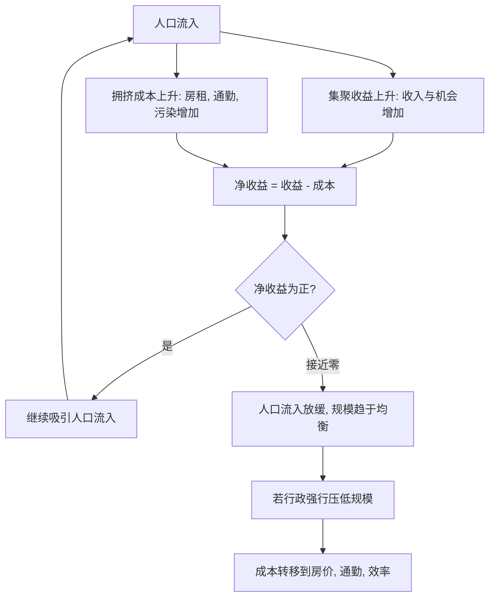

# 02｜城市规模到底由什么决定？

> 一个城市该有多大，究竟是谁说了算？

---

## 一、先说结论

陆铭的答案是：**城市的规模，本质上由"集聚带来的收益"与"拥挤带来的成本"之间的平衡决定。**

只要在一个城市里多住一个人、多开一家企业，带来的收益还大于它造成的成本，这座城市就还会继续长大；当两者大致相等时，规模就趋于稳定。行政手段可以在短期内改变人口分布，但很难长期对抗这条经济规律。

换句话说，城市该多大，不是规划出来的，而是被千千万万个人的选择"算"出来的。

---

## 二、我们先理解一个问题

先问一个有点奇怪的问题：

如果城市规模这么重要，那么"上海应该有多少人"这件事，到底是谁决定的？

是国务院吗？是城市规划部门吗？还是某个专家算出来的？

好像都不是。因为在没有谁下达命令的情况下，很多城市还是从几十万人长到了上千万人；而另一些地方，就算给了政策、给了地、给了钱，人口也留不住。

这说明一件事：**一定存在某种没有写在文件里的机制，在悄悄决定城市的规模。** 我们的任务，就是把这个机制找出来。

---

## 三、作者到底提出了什么观点？

陆铭认为，城市规模是由两股力量的平衡决定的。

一股是**集聚收益**。城市越大，共享的设施越多、分工越细、匹配越容易、知识溢出越频繁，人的收入与机会就越多。这是把人和企业往城里拉的力量。

另一股是**拥挤成本**。人多了，地价和房租会涨、通勤会变长、拥堵与污染会出现、公共服务会紧张。这是把人往外推的力量。

只要前者还大于后者，人就会继续流入；当两者大致相等，人口流入就放缓，城市的规模就稳定下来。陆铭把这种状态称为一种**均衡**：不是谁规定的大小，而是收益与成本互相"磨"出来的结果。

他还特别强调：行政力量可以短期内改变人口分布，比如通过落户门槛、用地指标、产业布局；但如果人为压制的规模偏离了经济规律，代价往往会在别的地方冒出来——人虽然进不来，但需求还在，于是房价更高、成本更贵、效率更低。

---

## 四、把这个观点翻译成人话

把城市想象成一个巨大的合租房。

一开始房子空，租金便宜，住进来的人还能互相帮忙：会做饭的、会修电脑的、会带孩子的凑在一起，生活越来越方便。于是更多人想搬进来。

人一多，麻烦也来了：卫生间要排队，房租被抬高，通勤变远，邻里摩擦增多。这时候，"搬进来"的吸引力就开始下降。有人宁愿搬到远一点、便宜一点的地方，也不愿再挤在市中心。

**没有人规定这间合租房该住几个人。** 但每个人都在心里算账：住进来的好处，值不值那些不方便？当很多人的答案从"值"变成"不值"，人数就稳定了。

城市就是这样一间不断被重新定价的合租房。它的规模，是无数人算账的结果。

---

## 五、为什么会这样？

把两股力量画在一起：

关键在于 **B 与 C 同时上升**。

收益是"规模越大越高"，成本也是"规模越大越高"。两者的差额，才是决定人要不要来的真正信号。均衡点不是一个固定数字，而是随技术、交通、管理能力的变化而移动的：地铁修好了，通勤成本下降，均衡规模就变大；治理变差了，污染加重，均衡规模就可能变小。

---

## 六、举一个现实生活中的例子

很多县城都做过同一件事：在城外划出一大片地，修路、通水、通电，盖起成排的新楼、商场和写字楼，规划里写着"未来常住人口翻倍""打造区域副中心"。

可几年过去，新区里楼是新的，人却很少：店铺关门，街道空旷，晚上亮灯的窗户稀稀拉拉。与此同时，老城区和更远的沿海城市，仍在吸走这里的年轻人。

这不是"没人想要发展"，而是**新区缺少让人进来的收益**。那里没有足够多的企业，没有足够细的分工，也没有足够密的同行与客户。人搬进去，收入并不会提高，反而要面对更远的通勤、更少的就业。也就是说，集聚收益还没上来，拥挤成本却先到了——于是人用脚投票，走了。

**楼可以一夜之间建起来，集聚效应却不能。** 这正是城市规模"由经济规律决定"最直观的证据：你可以造出一座城的壳，却造不出它的人气。

---

## 七、回到书中重新理解

现在再看陆铭为什么把"规模"讲成一个均衡问题，就说得通了。

他要破除的是一种"城市规划思维"：似乎只要定一个目标人口，再配好土地和产业，城市就能长成想要的样子。但真实的城市规模，是无数个体在收益与成本之间权衡的结果。规划可以引导，却不能替代这个过程。

理解了这一点，后面很多事情就有了统一解释：为什么有些地方"地给得再多也留不住人"，为什么大城市"人明明进来了，却又住不安稳"，为什么单纯限制规模常常伴随更高的房价与更低的效率。**规模问题，本质上是"让不让人自由选择"的问题。**

---

## 八、这个观点背后还有什么？

第一，**均衡不等于最优。** 市场磨出来的规模，是各方权衡的结果，但未必是"最理想"的规模，因为拥堵、污染这类成本往往没有被完全定价，外部性需要公共政策来修正。

第二，**均衡点是会移动的。** 交通技术、通信技术、治理能力都会改变收益与成本曲线。高铁与地铁让城市能承受更大规模，而糟糕的规划会让规模提前触顶。

第三，**它与人口流动是一体两面。** 如果流动被限制，规模就不再由收益与成本决定，而是由制度和门槛决定，均衡的前提就被破坏了。

第四，**它把城市管理从"控制数量"转向"管理成本"。** 与其纠结该有多少人，不如想想怎么把通勤、住房、污染这些成本降下来，让均衡点自然上移。

---

## 九、这个观点有问题吗？

需要一些平衡。

第一，**"均衡"是理论上的简化。** 现实中，人口流动受信息、习惯、制度影响，往往反应滞后，未必能立刻到达那个理想平衡点。一些经济学者认为，市场摩擦可能让城市长期偏离均衡。

第二，**它可能低估了城市承载力中的硬约束。** 水资源、土地、生态、安全，在某些城市确实是刚性的。关于这些约束该由价格调节还是由行政管控，学界存在不同解释。

第三，**它可能弱化了非经济目标。** 边疆稳定、国防布局、区域协调、粮食与生态安全，不能只用收益与成本的账来算。

第四，**但它的核心提醒是有力的。** 把城市规模看成"人用脚投票的结果"，能避免"拍脑袋定人口"的政策惯性。

所以更准确的说法是：城市规模在长期确实受集聚收益与拥挤成本支配，行政干预难以长期对抗这一逻辑；但均衡的到达需要时间，也需为非经济目标与硬约束留出空间。

---

## 十、今天再看这个观点

以下部分是陆铭思想的现代延伸，不是陆铭的原话。

今天，两股新力量正在改写"收益—成本"的曲线。

一端是技术。远程办公、在线协作、直播电商，让一部分工作不再必须挤在市中心，理论上降低了拥挤成本，也让中小城市有了承接的可能。另一端是治理。轨道交通、城市更新、数字治理，能在同一空间里容纳更多人，把均衡点往上推。

但也要看到，高价值的创新活动依然高度依赖面对面，而治理能力差的城市，成本会更早、更猛地压过收益。所以未来的图景很可能是**分化**：善于降低拥挤成本、提升集聚收益的城市继续变大，而只会"筑巢引凤"、却造不出集聚的地方，新区依旧空置。

---

## 十一、这一篇真正应该记住什么？

1. **城市规模由"集聚收益"与"拥挤成本"的平衡决定**，不是由文件规定的大小。
2. **两股力量都随规模上升**，差额才是决定人口进出的信号。
3. **均衡点会移动**，技术、交通、治理能力都能改变它能承受的规模。
4. **行政可以短期改变分布，却难以长期对抗规律**，偏离的代价会转移到房价、效率与生活成本上。
5. **管理的重点是降低成本**，而不是简单地控制人数。

---

## 十二、留一个问题

> 如果一个城市的人口还在不断流入，
> 那么这些新来的人，
> 究竟是在"添麻烦"，还是在"添动力"？

---

**下一篇**：既然规模由收益与成本决定，那么流进来的人，到底给城市带来了什么？我们常说"人太多，资源不够用"，可城市里的外卖、快递、养老照护，又几乎全靠外来人口撑着。这笔账，究竟该怎么算？

下一篇我们就来拆开这个问题——**人口流入，是大城市的负担还是财富？**
