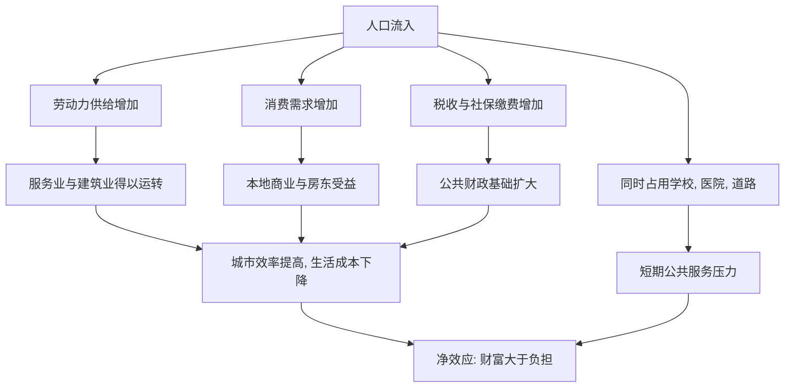

# 03｜人口流入，是大城市的负担还是财富？

> 外来人口是在"抢资源"，还是在"创造价值"？

---

## 一、先说结论

陆铭的答案很清楚：**人口流入主要不是负担，而是财富。**

因为人来到城市，不只是"多了一张嘴"，更是"多了一双手、一个消费者、一个纳税人"。他们填补了大量本地人不愿做或做不过来的岗位，支撑着城市的日常运转；他们消费、租房、缴税，反过来又养活了更多产业。把人口简单当成负担，等于只算成本、不算产出。

真正的问题不是"来了多少人"，而是"城市有没有让他们真正安定下来"。

---

## 二、我们先理解一个问题

做一个极端的思想实验。

假设某天早上，一座大城市里所有外来人口同时消失：送外卖的、开网约车的、快递分拣的、工地上的、餐厅后厨的、医院里的护工、小区里的保洁，全部不见了。

结果会怎样？

不是城市"突然宽松了"，而是城市**当天就瘫痪了**：早餐没人送，快递没人分，垃圾没人收，老人没人照护，工地全部停工。本地居民的生活成本会在一天之内暴涨。

这就逼出一个问题：

> 如果这些人真的"多余"，为什么他们一消失，城市立刻转不动？

反过来想就更清楚：**他们不是城市的负担，而是城市能正常运转的前提。**

---

## 三、作者到底提出了什么观点？

陆铭认为，人口流入会从三个方向为城市创造价值。

第一，**作为劳动力**。外来人口大量进入服务业、建筑业、制造业与照护行业，这些岗位往往劳动强度大、收入不算高，却是城市生活的底座。没有他们，这些工作要么没人干，要么必须由更高工资的人来干，成本最终转嫁给所有人。

第二，**作为消费者**。人来了要住、要吃、要出行、要消费，这本身就在创造需求，养活了本地的商铺、房东、服务业从业者。人口规模本身就是市场规模的来源。

第三，**作为纳税人**。只要就业和社保正常，流入人口也在缴税、缴费，参与分担公共成本。他们并非只享受、不付出。

陆铭强调，把人口视为负担，往往来自一种错觉：只看见他们占用的学校、医院、道路，却看不见他们撑起的服务、消费与税收。**这是一种只记支出、不记收入的账。**

---

## 四、把这个观点翻译成人话

想象一个家庭请了位住家阿姨。

如果只看"支出"：她吃饭要花钱，住一间房要占地方，用水用电要交费——好像是个"负担"。

可如果把她做的事算进来：做饭、打扫、带孩子、照顾老人，让家里的两个大人能安心上班、多挣工资，让孩子有人照看——这时候你会发现，**她不是家庭的成本，而是家庭能高效运转的关键一环。**

城市的逻辑一模一样。外来人口对城市的"成本"，是看得见、容易抱怨的；而他们创造的"价值"，是分散的、融入在日常里的，轻易不会被注意到。于是错觉产生了：好像城市在为外来人口"买单"，其实是城市在享用他们的劳动。

---

## 五、为什么会这样？

把人口流入的正负两面画出来：

关键在最后一步 **J → K**。

人口流入确实会带来公共服务的短期压力，这一点不能否认。但压力的本质，常常是"供给没跟上"，而不是"人太多了"。学校不够可以建学校，医院不够可以建医院；真正难以替代的，是人带来的劳动与需求。**把供给问题说成人口问题，是找错了对象。**

---

## 六、举一个现实生活中的例子

看一座城市运转的日常。

中午，写字楼里的白领点了一份外卖，是骑手顶着太阳送来的；下午，家里买的快递被送到小区驿站，分拣员一天要扫几千件；晚上，独居老人家里来了照护员，帮忙做饭、喂药、陪聊；小区楼道里，保洁把一天的垃圾清走；与此相关的一整条链条——仓库、货车、餐馆、菜市场——同样大量依赖外来人口。

这些岗位，本地人往往不愿意做，或者根本做不过来。**如果把这些人都"请走"，不是城市更轻松，而是整座城市的生活会立刻变得又贵又难。**

更值得注意的是，这些人同时在消费、在租房、在给老家的孩子寄钱。他们的存在，让城市的商铺有生意、房东有租金、财政有税源。他们不是"分蛋糕的人"，很大程度上也是"做蛋糕的人"。

---

## 七、回到书中重新理解

现在再看陆铭为什么要专门讨论"负担还是财富"，就明白了。

因为他要纠正一个非常普遍、也非常有政策后果的直觉：城市资源紧张，是因为人太多，所以应该控制人口。这个直觉一旦成为政策前提，限制落户、限制子女入学、限制住房，就显得"理所当然"。

但陆铭指出，这样做会陷入循环：你越不让人安定，他们越不敢消费、不敢成家、不敢长期投入，城市的消费与创新就被压制；你越把公共服务不足当成"人太多"的证据，就越不会去扩大供给，压力反而长期存在。**把财富误读成负担，最后可能既失去财富，又没减轻负担。**

---

## 八、这个观点背后还有什么？

第一，**它把"人口"和"人力资本"连在一起。** 外来人口不只是体力劳动者，其中还有大量年轻、愿意奋斗、正在积累技能的人。他们是城市未来的一部分，而不是一次性的耗材。

第二，**它把"负担"翻转为"投资不足"。** 很多所谓的负担，其实是公共服务没有随人口同步扩容。问题的解法是"补供给"，而不是"赶人走"。

第三，**它和"在集聚中走向平衡"直接相连。** 如果流入被承认是财富，那么让人安定下来、公平享受服务，就不再是"额外照顾"，而是让财富真正落地的必要步骤。

第四，**它也是一种城市治理观的转变。** 从"管理人口数量"转向"服务常住人口"，从把外来者当变量，转向把他们当市民。

---

## 九、这个观点有问题吗？

需要一些平衡。

第一，**短期压力是真实存在的。** 学位、床位、道路在短期内弹性有限，人口快速流入确实可能造成紧张。一些经济学者认为，不能因为长期是财富，就忽视短期的公共品供给约束。

第二，**"财富"不是无条件的。** 如果流入人口长期无法就业、无法融入，或者社保、住房长期缺位，其正面效应也可能被削弱。财富能否兑现，取决于制度能否承接。

第三，**它在分配层面有争议。** 流入人口创造的收益，未必由他们自己获得；城市原有居民可能受益更多，也可能感受到竞争。关于成本与收益该如何分担，学界存在不同解释。

第四，**但它的核心判断站得住。** 把人口流入整体定性为"负担"，既不符合城市运转的事实，也容易导向压制内需、割裂社会的政策。

所以更准确的说法是：人口流入在总体上更接近财富而非负担，是城市运转与市场规模的来源；但其正面效应的兑现，需要公共服务同步扩容与制度上的公平接纳。

---

## 十、今天再看这个观点

以下部分是陆铭思想的现代延伸，不是陆铭的原话。

今天，人口流入的意义正在被两件事放大。

一是**老龄化**。随着本地人口老化，养老照护、医疗辅助、社区服务对劳动力的需求只会越来越大，外来人口恰好补上了这个缺口。可以说，越老的城市，越离不开流动人口。

二是**消费与创新**。年轻人是消费与创业的主力，一个城市能不能留住他们，直接决定未来的活力。大量研究显示，人口持续流入的城市，往往在服务业与创新上更有优势。

当然，另一面也出现了新变量：自动化、人工智能、平台经济正在改变岗位结构，某些原本由外来人口承担的重复性工作可能被机器替代。但这更可能是岗位的迁移，而不是对流动需求的消失——**只要城市还需要被照护、被服务、被消费，人就仍然是财富。**

---

## 十一、这一篇真正应该记住什么？

1. **人口流入既是劳动力、消费者，也是纳税人**，把它只当成本，是算漏了账。
2. **城市日常运转高度依赖外来人口**，外卖、快递、照护、建筑都是明证。
3. **公共服务紧张，本质是供给问题**，不该简单归因于"人太多"。
4. **让流入人口安定下来，才能兑现其财富效应**，压制反而两败俱伤。
5. **管理的对象应是服务常住人口**，而不是控制人口数量。

---

## 十二、留一个问题

> 如果一个城市既需要外来人口的劳动，
> 又不愿让他们公平地享受城市的公共服务，
> 那么这座城市，到底是在"接纳财富"，还是在"透支财富"？

---

**下一篇**：承认了人口流入是财富，还只是第一步。真正容易让人困惑的是另一个词——平衡。很多人说，人不能都往大城市跑，不然区域差距越来越大。可陆铭偏偏说，集聚和平衡并不矛盾。这两件看似对立的事，到底如何统一？

下一篇我们就来拆开这个问题——**什么是"在集聚中走向平衡"？**
