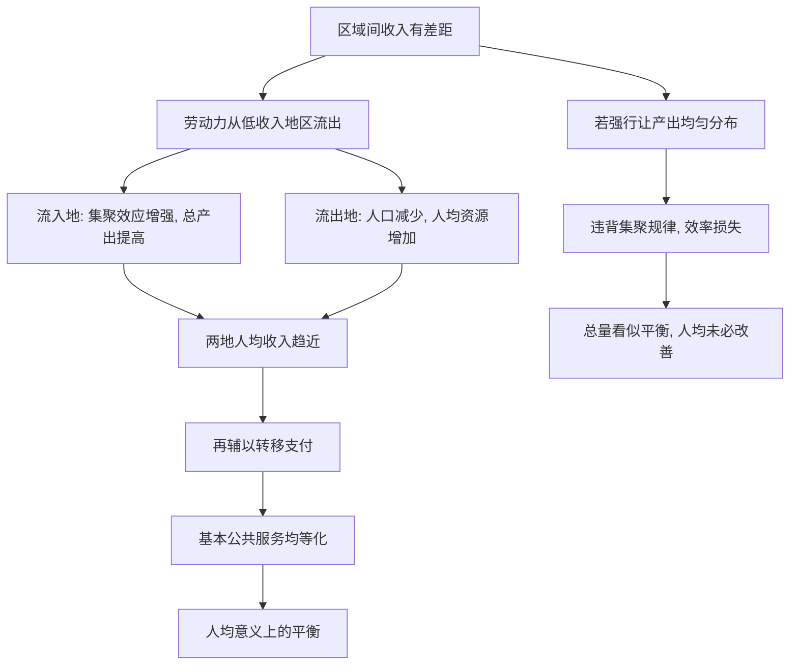

# 04｜什么是“在集聚中走向平衡”？

> 区域平衡，是让各地"一样富"，还是让人"一样富"？

---

## 一、先说结论

陆铭的判断是：**平衡不等于人口和产出的均匀分布，而应理解为人均收入的趋同。**

人们习惯把"平衡"想成一幅均匀的图景：每个地方都有差不多的工厂、差不多的人口、差不多的产出，谁也不比谁强。但陆铭说，这不是平衡，这是"摊大饼"。真正的平衡，是让每个地方的人，不论住在哪里，都能过上水平相近的生活。

总量可以很不均，人均却可以趋同。**关键不是让每个地方都变强，而是让人能去更强的地方，再让收入差距被拉平。**

---

## 二、我们先理解一个问题

先看一组对比。

有两个地方：一个沿海省份，一个内陆省份。沿海省份的总产出是内陆的好几倍，人们一看这个数字，立刻得出结论：区域差距太大了，要赶紧让内陆也发展起来，把工厂、项目搬过去。

但请再问一句：

> 如果内陆有一半的年轻人，已经到沿海去工作、去生活了，
> 那么"内陆省份的总产出"这个数字，还能代表"内陆人的收入水平"吗？

答案是不能。因为人走了，产出算在沿海，但收入寄回了内陆的家。用"每个地方的产出"来衡量"每个人的生活"，就像用"每个班的总分"来评价"每个学生的水平"——班大有班大的原因，未必说明学生更优秀。

这就是理解"平衡"的关键岔路口。

---

## 三、作者到底提出了什么观点？

陆铭认为，区域平衡应该用**人均**指标来衡量，而不是总量指标。

他区分了两件事：

一是**总量平衡**，即让每个地区的 GDP 都差不多。这要求人口和产业在空间上均匀分布，等于违背集聚规律，代价很高，效果往往不好。

二是**人均平衡**，即让每个地区的人均收入、人均公共服务水平逐步趋同。这并不要求各地人口一样多、产业一样全，只要求"人"的生活水平接近。

陆铭主张，中国该追求的是后者。而实现途径有两条：

第一，**让人流动起来**。人往收入更高的地方去，剩余人口的人均资源反而增加，两地的人均收入差距会缩小。这叫"人往高处走，差距跟着走"。

第二，**用转移支付补差**。对人口流出地，通过财政转移支付保障基本公共服务、教育医疗与生态补偿，让留下的人也不至于掉队。

一句话概括：**集聚解决效率，转移支付解决公平，两者合起来，才是"在集聚中走向平衡"。**

---

## 四、把这个观点翻译成人话

想象一个村子。

村子里有十户人家，只有一块好地能种出高产的粮。如果规定"每户都必须种这块地"，大家挤在一起，产量反而上不去；如果规定"每家分一小块"，好地被切碎，谁也发挥不出规模。

更聪明的办法是：让愿意种地、擅长种地的人多种一点，其他人去做别的事，或者去别的地方。最后算账不看"每户种多少地"，而看"每户分到多少粮"。

地可以不均，粮可以平均。

这就是陆铭讲的"平衡"：**它衡量的是每个家庭的收入，而不是每块地的产出。** 一个地方不必样样都有，只要这里的人的收入能跟上全国水平，平衡就算实现了。

---

## 五、为什么会这样？

把"集聚"与"人均趋同"连起来看：

关键在于 **B → D** 这条最容易被忽略的路径。

人们总盯着流入地的"更大"，却忘了流出地的"更少"。人口减少之后，同样的土地、学校、财政，分给更少的人，人均水平自然上升。**集聚不是拉大差距的元凶，限制流动才可能让差距固化。** 当人不能走，落后地区就只能靠输血维持，而输血往往比不过自己走出去。

---

## 六、举一个现实生活中的例子

拿各省的 GDP 来做对比，会看到两种情况。

如果按**总量 GDP** 排名，差距非常惊人：一个沿海省份的总量，可能是某些中西部省份的好几倍。单看这个数字，很容易得出"区域严重失衡"的结论，进而想方设法把产业搬过去、把人口留下来。

但如果换成**人均 GDP**，画面会明显不同。因为人口流出地的人均分母也变小了，很多中西部省份与沿海省份的人均差距，远没有总量差距那么夸张。有些年份、有些地区，人均指标甚至出现了持续收窄的趋势。

这两把尺子，量的其实是两件事：**总量衡量的是"这个地方产出了多少"，人均衡量的是"这个地方的人过得怎么样"。**

陆铭提醒的就是这件事：如果我们盯着总量，就会拼命追求"每个省都一样大"；如果我们盯着人均，就会把注意力放在"人能不能自由流动、留下的人有没有保障"上。**同样的数据，选错指标，会导向完全相反的政策。**

---

## 七、回到书中重新理解

现在再看"在集聚中走向平衡"这句话，它就不再矛盾了。

前面讲集聚能带来效率，这一节讲平衡。很多人担心：人越往大城市跑，区域差距不是越大吗？陆铭的回答是——**只要人是在流动的，集聚恰恰是缩小人均差距的机制。** 人多的地方产出高，但人少了的地方人均也在提高，两头的"人均"会靠近。

所以这套主张的顺序是：先承认集聚，再谈平衡；先让人流动，再谈补差。**平衡不是集聚的反面，而是集聚的自然结果。** 这也解释了为什么陆铭反对用"限制大城市"的方式来追求平衡——那既损失了效率，又未必改善人均。

---

## 八、这个观点背后还有什么？

第一，**它把"区域"重新定义为"人"的组合。** 一个地区的繁荣，最终要落在当地人的收入与生活上，而不是落在一串 GDP 数字上。

第二，**它给转移支付找到了新理由。** 既然总量本来就不该均匀，那么财政的作用就不是"把产业搬过去"，而是"把人照顾好"——教育、医疗、养老、生态补偿。

第三，**它是全书的一个枢纽。** 往前接集聚效应，往后接户籍、土地与城市政策。放开流动是前提，否则人均趋同无从发生。

第四，**它把公平与效率从对立变成互补。** 集聚提高效率，流动缩小人均差距，转移支付兜住底线，三者并不冲突。

---

## 九、这个观点有问题吗？

关于这一问题，学界存在不同解释。

第一，**"人均趋同"需要多长的时间，并不确定。** 一些经济学者认为，如果流动不充分、转移支付不到位，人均差距也可能长期存在，甚至在某些阶段扩大。

第二，**它可能低估了流出地的代价。** 人口持续流出，会留下老龄化、空心化、公共服务难维持等问题。留下来的人未必都能分享到"人均提高"的好处。

第三，**它可能弱化了地方多样性。** 一个地方的价值，不只在收入，还有文化、生态、国防等功能，这些无法简单用"人均"来折算。

第四，**但它的核心洞见是清楚的。** 把平衡理解为"人均趋同"而非"总量均匀"，确实能避免很多低效的重复建设，也为区域政策提供了更合理的标尺。

所以更准确的说法是：以人均指标理解平衡，是比"总量均匀"更贴近民生、也更尊重经济规律的思路；但它需要流动畅通、财政托底，以及对流出地社会成本的妥善处理，才能真正兑现。

---

## 十、今天再看这个观点

以下部分是陆铭思想的现代延伸，不是陆铭的原话。

今天，人口向少数城市群集聚的趋势更加明显，这让"人均趋同"的思路有了新的现实背景。

一方面，高铁、通信、数字服务让流动成本下降，人更容易"走出去"；另一方面，也出现了"远程就业"的新可能，让一些人在小城生活、为大市场工作。这在某种程度上扩大了"集聚"的方式：不一定要人聚在一起，也能分享大城市的机会。

但挑战也在上升。人口流出地的老龄化更快，公共服务的维持更依赖财政转移；而流入地的住房、教育压力，又需要同步扩容。**"集聚中走向平衡"不会自动发生，它需要制度上的一整套配合。**

---

## 十一、这一篇真正应该记住什么？

1. **平衡不等于均匀分布**，而应理解为人均收入与公共服务的趋同。
2. **总量可以不均，人均可以趋同**，两把尺子量的是两件事。
3. **人口流动本身就是缩小人均差距的机制**，限制流动反而可能固化差距。
4. **集聚负责效率，转移支付负责公平**，两者缺一不可。
5. **衡量区域政策，要看人均，而不是看总量。** 选错指标，会开出错误药方。

---

## 十二、留一个问题

> 如果"平衡"指的是人均而非总量，
> 那么一个省份该不该为"留住人"而焦虑？
> 还是说，它真正该关心的，是留下来的人过得好不好？

---

**下一篇**：我们已经知道，人口流入是财富，集聚也能走向平衡。可理想和现实之间，还隔着一整套制度。最典型的，就是那张小小的户籍——它为什么能决定一个人在城市里能享受什么、能得到什么？

下一篇我们就来拆开这个问题——**户籍制度如何影响了中国的城市化？**
