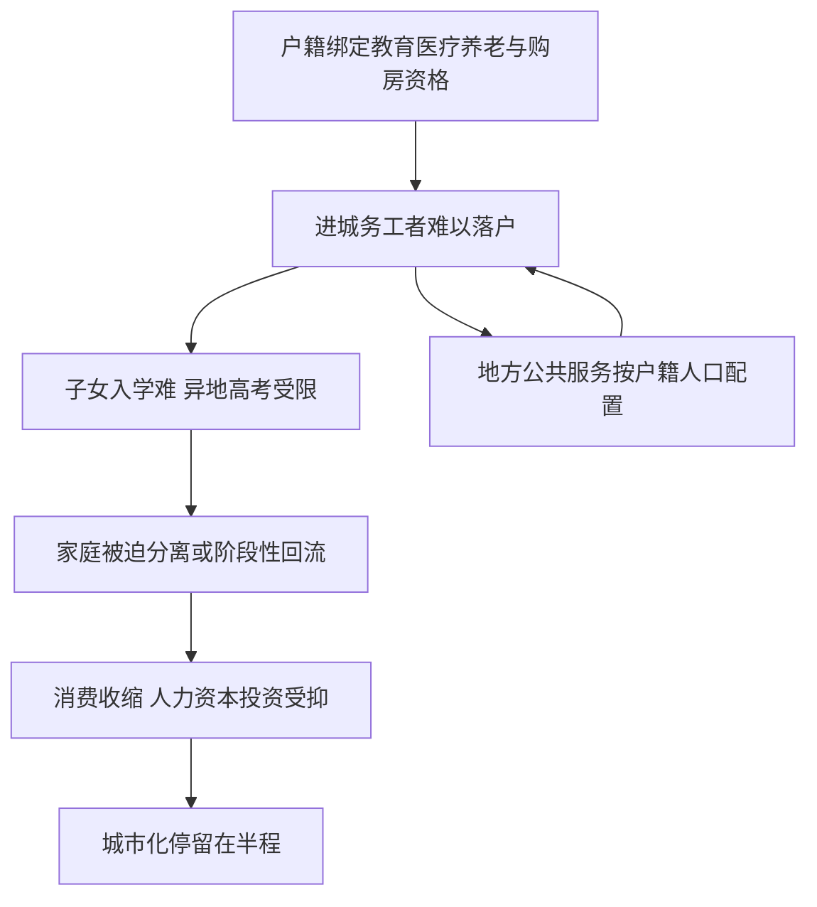

# 05｜户籍制度如何影响了中国的城市化？

> 户籍只是一张纸，为什么却能决定一个人算不算真正的“城里人”？

---

## 一、先说结论

陆铭认为，户籍制度的关键问题，不在“登记”这两个字，而在它背后捆绑的一整套权利。

一个人在城里工作、缴税、消费，本该就算城里人；但户籍决定了孩子能不能在城里上学、能不能在当地参加高考、医保怎么报销、有没有资格申请保障房和买房。于是出现了“人在城市、权利在故乡”的割裂：身体进城了，身份还在原地。

陆铭的判断是：正因为这层割裂，中国的城市化是“不彻底”的——人进了城，却没有真正成为城市的一部分，城市化的内需效应和社会融合效应都被打了折扣。

---

## 二、我们先理解一个问题

我们常说“城市化率”，往往指的是城镇常住人口占全部人口的比重。但“常住”是一个统计概念，不等于“安顿”。

想一个场景：一个人在城市打工十几年，每月缴社保，租着房子，孩子却因为没有本地户口，只能回老家上学。你说他算城里人吗？从他每天的生活看，是；从他的权利与退路看，不是。

所以这一篇要回答的问题不是“户口本上写什么”，而是一个更本质的问题：**当一个人长期在城市工作生活，为什么一张纸可以决定他到底是不是城市的一部分？**

---

## 三、作者到底提出了什么观点？

陆铭对户籍的分析，可以概括为一句话：**户籍不是身份标签，而是福利与资格的分配器。**

在很长一段时间里，义务教育、医疗报销、社会保障、保障房、购房与车牌资格，都与本地户籍挂钩。户口因此变成了一张“准入许可证”：有它，你就是“自己人”，可以享受本地的公共资源；没有它，你即使在这里工作、纳税，仍是“外来人口”。

由此，陆铭主张，改革的方向不是简单地把户口本换掉，而是**逐步剥离附着在户籍上的福利差异**，让公共服务跟着“人”走，而不是跟着“户口”走。同时，人口流入地的财政与用地，也要跟常住人口挂钩——这就是他反复强调的“人、地、钱”要一起动。

---

## 四、把这个观点翻译成人话

把制度翻译成一个家庭的生活。

一对夫妻从农村来到大城市打工，男的在工地，女的做保洁。他们在这里住了十年，社保按时缴，房租按时交，日子过得和城里同事没多大差别。

孩子到了上学的年纪，问题来了。想进公立学校，要居住证、要社保连续缴纳的年限、要租房备案，有的还要看有没有房产。凑不齐，就只能上收费更高的民办学校，或者把孩子送回老家。

送回老家意味着什么？夫妻继续在城市打工，孩子交给老人带，一年见几次。等到中考、高考，孩子还得回户籍地考试，而那里的教材、题型、录取规则，和他从小长大的城市并不一样。

这不是某一家的意外，而是一种被制度固定下来的常态。陆铭说的“不彻底”，说的就是这种状态：人已经进城，生活的重心已经进城，但**身份和权利被一纸户籍按在了原地。**

---

## 五、为什么会这样？

把这条链条拆开来看：

这里有两个自我强化的环节。

一个是 **B → C → D → E**：因为难落户，子女教育和家庭团聚都受影响；因为不敢把孩子、老人接来，消费和长期打算都被压缩——不敢长租、不敢装修、不敢多生一个孩子。

另一个是 **F → B**：地方财政与公共服务长期按户籍人口配置，外来人口越多，本地承担的“额外压力”越大，于是更有理由抬高落户门槛。门槛一高，权利割裂就更深。

**关键在于**：户籍不是一个孤立的制度，而是把教育、医疗、财政、土地串在一起的一个结。

---

## 六、举一个现实生活中的例子

最有代表性的，就是**农民工子女在城市上学难、以及异地高考受限。**

在一个大城市，非本地户籍的孩子要入学，往往需要一整套证明材料；到了升学关口，又常被要求回户籍地参加中考或高考。可这些孩子有的从小就生活在这座城市，说的是一口本地话，熟悉的也是这里的环境，唯独考试要回一个自己并不熟悉的地方。

对他们来说，城市是一个“可以生活但不能扎根”的地方。他们的父母承担了城市的建设，孩子却难以分享城市的教育。

这里面最耐人寻味的一点是：**限制往往不发生在“进城”这一步，而发生在“留下来”这一步。** 人可以被允许来打工，但不容易被允许在此成家、育儿、老去。

---

## 七、回到书中重新理解

现在回看陆铭为什么把户籍放在“制度约束”部分的第一位，就顺了。

前面讲的是城市化的规律：集聚带来效率，人口流入是财富。但要真正实现“在集聚中走向平衡”，前提是**人能够自由流动并真正定居**。户籍恰恰在这里设了一道闸门。

如果人来了却留不下，那么城市化的两个核心收益都会落空。第一是效率：劳动力不能稳定地在高生产率的地方工作，资源配置就被扭曲。第二是平衡：陆铭说的平衡是人均收入趋同，而人均趋同的前提，正是人能走出去、并真正融入。

所以户籍不是一个“户口管理”的小问题，而是整个“在集聚中走向平衡”的逻辑能不能成立的关键一环。

---

## 八、这个观点背后还有什么？

**第一，户籍问题的本质是财政与权利问题。** 它之所以难改，是因为背后连着地方财政、教育经费、社保统筹，牵一发而动全身。

**第二，它和土地制度紧密咬合。** 落户往往和购房资格、宅基地权益连在一起：进城的人不敢轻易放弃老家的地，城市又不容易给他们稳定的居住预期。

**第三，它压制的是一种“未来感”。** 不敢长租、不敢安家、不敢生育，本质上是人对未来没有稳定预期。这对内需和人口结构的影响，比一时的工资差距更深远。

**第四，它提醒我们，城市化不只是“盖楼”，更是“给人身份与权利”。** 大楼可以很快建起来，融入却需要制度配套。

---

## 九、这个观点有问题吗？

有，而且需要认真对待。

**第一，大城市承载力的担忧并非空穴来风。** 一些观点认为，教育、医疗、交通等公共服务在短期内确有上限；如果落户完全放开，可能出现学位与床位紧张，甚至影响本地居民的服务质量。这是需要正视的现实约束。

**第二，财政与利益的协调是真实难题。** 公共服务由地方负担，而人口流入的收益未必全部留在本地。简单要求“流入地全兜”，在实践中可能遇到强烈的地方阻力。关于这一问题，学界存在不同解释：有人主张中央加大统筹、按常住人口转移支付；也有人认为应先推动公共服务均等化，再逐步放开落户。

**第三，太快与太慢都各有风险。** 一步到位可能带来短期冲击，慢慢来则可能让“半城市化”固化整整一代人。

**所以更准确的表述是**：户籍确实是城市化“不彻底”的核心原因之一，剥离福利歧视、让公共服务跟人走，方向清晰；但具体的节奏、财政分担与承载能力，需要在实践中谨慎安排，不能只有理想目标而忽略过渡成本。

---

## 十、今天再看这个观点

以下部分是基于陆铭思想的现代延伸，不是他书里的原话。

近几年，政策已经在朝“放宽落户”的方向走：多数中小城市基本取消了落户限制，大城市普遍采用积分落户，一些超大城市的门槛也在松动。这说明，陆铭所指出的方向，正在被现实逐步承认。

但另一面也值得注意：落户放开和教育、高考、社保统筹并不是一回事。户口迁得进，不等于孩子能在本地高考；人落了户，也不等于社保、公积金、宅基地权益能顺畅衔接。真正决定“能不能安顿”的，往往是这些附着其上的隐性条款。

所以更可能的图景是：**落户这道显性门槛会越来越低，而隐性的权利衔接，会成为下一阶段的真正战场。**

---

## 十一、这一篇真正应该记住什么？

1. **户籍的关键不在登记，而在福利捆绑。** 它决定了孩子上学、看病报销、买房资格等一系列权利。
2. **它造成了“人在城市、权利在故乡”的割裂。** 身体进城了，身份和退路还在原地。
3. **结果是城市化“不彻底”。** 家庭分离、消费收缩、人力资本投资受抑，内需被压制。
4. **背后是财政、土地与权利的交织。** 改户籍，实质是改公共服务的配置方式。
5. **它是“在集聚中走向平衡”能否成立的关键一环。** 人留不下，集聚的效率与人均的趋同都难以实现。

---

## 十二、留一个问题

> 如果一个人在城市工作、纳税、生活了一辈子，
> 孩子却因为一张纸而无法在这里考试、安家，
> 那么所谓“城市化”，究竟是完成了，还是只完成了一半？

---

**下一篇**：户籍解释了人为什么“进得来、留不下”。但还有一层更基础的问题：即便没有户口这道门槛，人真的能自由地流动吗？他为什么总是像候鸟一样，年年往返，却始终没有真正安顿下来？

下一篇我们就来拆开这个问题——**为什么劳动力流动被“卡住”了？**
