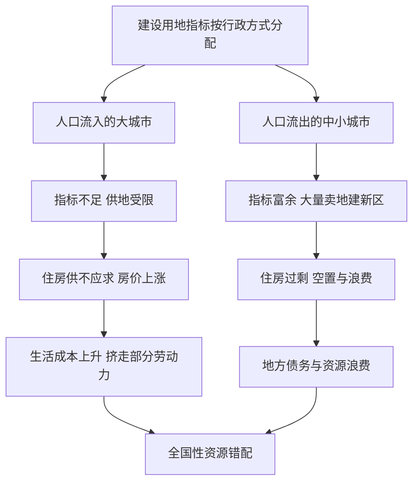

# 07｜土地制度怎样限制了城市的发展？

> 土地明明是建城市的基础，为什么反而成了约束？

---

## 一、先说结论

陆铭认为，问题出在**建设用地的指标分配方式**上。

在中国，城市要发展，得先有建设用地指标；而指标是按行政层级、按地区大体平均分配的。结果是人口持续流入的大城市“地不够用”，人口不断流出的地方却“地没人用”。土地供应与人口流向错配，一头推高了大城市的房价，另一头造成了中小城市的空置与浪费。

用一句话概括他的判断：**人往高处走，地却不能跟着走。** 城市发展的约束，很大程度上不是“地太少”，而是“地放错了地方”。

---

## 二、我们先理解一个问题

城市要长大，需要地：住宅、道路、工厂、学校、公园，哪一样都离不开土地。

但土地不是想要就能有。它受两条线约束：一条是建设用地指标的总量管理，另一条是耕地保护的红线。总量有限、红线要守，那么问题就变成了——**这些有限的建设用地指标，该怎么分？**

按人口分？按现状分？还是按地区平均分？

这不是一个技术问题，而是一个决定城市命运的问题。分得对，地跟着人走，城市顺畅生长；分得不对，人地分离，两头都难受。这一篇要回答的，正是：**土地分配的方式，怎样反过来限制了城市的发展。**

---

## 三、作者到底提出了什么观点？

陆铭的核心判断是：**建设用地指标的配置，与人口的流动方向发生了错配。**

具体来说：

- 人口大量流入的大城市，生产、居住、通勤的需求都在增长，但建设用地指标却有额度限制，供地跟不上，住房供不应求，地价房价被推高。
- 人口持续流出的中小城市和县城，指标反而相对宽裕；为了拉动经济、增加财政收入，它们大量卖地、建新区，结果房子盖出来没人买，出现空置与浪费。

针对这个错配，陆铭主张的改革方向是：**让建设用地指标跟随人口的流动，并允许指标跨地区交易**（比如城乡建设用地增减挂钩、地票等机制）。人口流入的地方多拿地、多建房；人口流出的地方通过指标交易获得收益，而不是硬着头皮去建没人用的新城。

一句话：**让“人、地、钱”一起跟着市场走。**

---

## 四、把这个观点翻译成人话

想象一个班组一起干活，中午分饭。

饭菜的总量是固定的，该怎么分？如果按“每张桌子平均分”，那么干活的桌子吃不饱，闲着的桌子剩一堆——可实际上，干活的桌子才有更多张嘴要吃饭。

土地指标就是那锅饭。人口流入的大城市，是干活最多、吃饭的嘴最多的桌子，却常常分不到足够的份额；人口流出的地方，是已经没几个人吃饭的桌子，面前却堆着吃不完的饭。

于是你看到的景象就是：**那边地价高得吓人，房子越盖越挤；这边马路修得又宽又直，新区盖了一大片，晚上却没几盏灯。**

饭没错，分法错了。

---

## 五、为什么会这样？

把错配的机制画出来：

关键在于，这不是两个孤立的现象，而是**同一套分配规则在两端的镜像结果**。

一端是 **B → D → E → H**：城市越有活力、越多人愿意来，地却越紧张，房价越涨；高房价又抬高了生活成本，反过来把一部分本可以留下来的人挤走。这里损失的是集聚效应本该释放的效率。

另一端是 **C → F → G → I**：地方为了发展、为了财政，把指标变成卖地的冲动，建出一批超出真实需求的住房与基础设施。这里损失的是投资效率，还留下了债务。

两端的损失汇到一起，就是陆铭所说的**资源错配**：不是土地总量不够，而是它没有流向最需要、回报最高的地方。

---

## 六、举一个现实生活中的例子

最能说明问题的，就是**建设用地指标的错配：人口流入的大城市“地不够用”，人口流出的地方“地没人用”。**

先看大城市这一头。它每年有大量年轻人涌入，要租房、要买房、要通勤，产业也要扩张。可建设用地指标是有限额的，住宅用地尤其紧张。供给上不去，需求却在涨，结果就是地价、房价水涨船高，年轻人把一生积蓄押在一套房上，生活质量被高房价挤压。

再看另一头。一些人口持续外流的县城和中小城市，指标相对宽裕，于是热衷于搞新区、修大道、建商品房小区。可本地的人口在减少，房子卖不动，新区到了晚上冷冷清清，路灯亮着，窗户黑着。

有意思的是，这两件事常常出现在同一个国家、同一年份。**大城市为“地不够”发愁，小城市为“地没人用”发愁——这恰恰说明，问题不在总量，而在分配。**

陆铭想借此说明的是：土地不能只看“有多少”，还要看“放在哪”。当土地供给与人口流向相反时，无论哪一端，都会付出代价。

---

## 七、回到书中重新理解

现在回看，这一篇为什么排在户籍与流动之后，就顺了。

前面两篇讲的是“人”的流动被卡住：户籍让人的身份无法落地，制度成本让人的流动变成候鸟式往返。这一篇则把镜头转向另一条腿——**土地**。

陆铭的逻辑是一体的：城市化的顺畅运转，需要“人、地、钱”三样东西同步流动。人往城市走，地却留在原地，两者一错位，问题就来了。人口流入地缺地，房价被推高；人口流出地却有地没人用，投资被浪费。这不只是土地问题，也是房价问题、财政问题、区域平衡问题的共同根系。

更重要的是，它直接关系到“在集聚中走向平衡”能不能实现。如果地不能跟着人走，那么集聚的收益会被供给瓶颈吃掉，平衡也无从谈起。**土地制度，是把人口、房价、财政、区域差距串在一起的那根线。**

---

## 八、这个观点背后还有什么？

**第一，土地不只是土地，它连着地方财政。** 在很多地方，卖地收入是重要的财政来源，这使土地分配不仅是空间问题，也是利益的再分配问题。

**第二，它和房价问题直接相通。** 人口流入地供地不足，是理解大城市高房价的一条关键线索——当然，这不是唯一线索。

**第三，耕地保护与粮食安全是真实存在的约束。** 指标管理并非无端设限，它背后有国家战略层面的考量，不能被简单否定。

**第四，土地是地方政府“经营城市”的工具。** 通过规划、供地、招商，地方政府深度参与城市生长，这也让土地改革牵动极广。

---

## 九、这个观点有问题吗？

有，需要更审慎地看。

**第一，耕地保护与生态红线是合理约束。** 中国人口多、人均耕地少，把土地完全按效率配置，可能威胁粮食安全与生态底线。效率不是唯一标准，这一点必须承认。

**第二，房价的成因是多重的。** 一些经济学者认为，供地不足确实是重要因素，但货币环境、预期、投资投机、收入增长等也在起作用。关于房价主因，学界存在不同解释，不宜把土地一项当成唯一答案。

**第三，指标跨地区交易也有风险。** 如果缺乏监管，可能出现炒作、套利，甚至让一些地方“卖指标换钱”却损害了本地长远发展；地方利益的阻力也不容低估。

**第四，收缩城市同样需要建设用地。** 人口流出不等于不要发展，它们仍需要基础设施与产业用地，简单的“指标跟着人走”也需要配套的过渡安排。

**所以更准确的表述是**：土地供给与人口流向的错配，确实是推高大城市房价、造成中小城市浪费的重要原因，让地跟着人走的方向值得认真对待；但土地配置还牵连粮食安全、生态保护与地方财政，改革需要在效率与安全之间取得平衡，而非单向度地放开。

---

## 十、今天再看这个观点

以下部分是基于陆铭思想的现代延伸，不是他书里的原话。

近些年，政策已经在朝“人地挂钩”的方向调整：新增建设用地指标开始更多向人口流入的城市群倾斜，城乡建设用地增减挂钩、集体经营性建设用地入市等机制在探索，城市更新与存量土地盘活也被反复强调。这些变化，与陆铭所主张的方向是呼应的。

但另一面，约束依然存在：耕地保护的红线不会放松，地方财政对土地的依赖也很难短期摆脱；而人口流出地区如何“体面地收缩”、如何处理已经建成的空置资产，仍是尚未解决的难题。

所以更可能的图景是：**土地会越来越跟着人走，但“跟着走”的过程不会是简单的市场出清，而是一场涉及财政、规划、生态与地方利益的长期调整。**

---

## 十一、这一篇真正应该记住什么？

1. **问题不在土地太少，而在土地放错了地方。** 指标与人口流向错配，是核心症结。
2. **错配有两张面孔。** 大城市“地不够用”推高房价，中小城市“地没人用”造成空置浪费。
3. **两端是同一套规则的镜像结果。** 一端损失集聚效率，一端损失投资效率。
4. **方向是让地跟着人走。** 指标随人口流动、允许跨地区交易，让人、地、钱一起动。
5. **但土地连着粮食安全、生态与财政。** 改革必须在效率与安全之间权衡，不能只看一头。

---

## 十二、留一个问题

> 如果一座城市里人越来越多、房子却越来越难买，
> 而另一座城市里人越来越少、房子却越盖越多，
> 那么这到底是资源不够，
> 还是我们把资源放错了地方？

---

**下一篇**：土地错配解释了为什么大城市“地不够用”、小城市“地没人用”。可当人们把拥堵、污染、高房价都归咎于一个原因——“人太多了”——这个归因真的成立吗？城市病，究竟该怪人，还是怪别的？

下一篇我们就来拆开这个问题——**大城市病真的是“人太多”造成的吗？**
