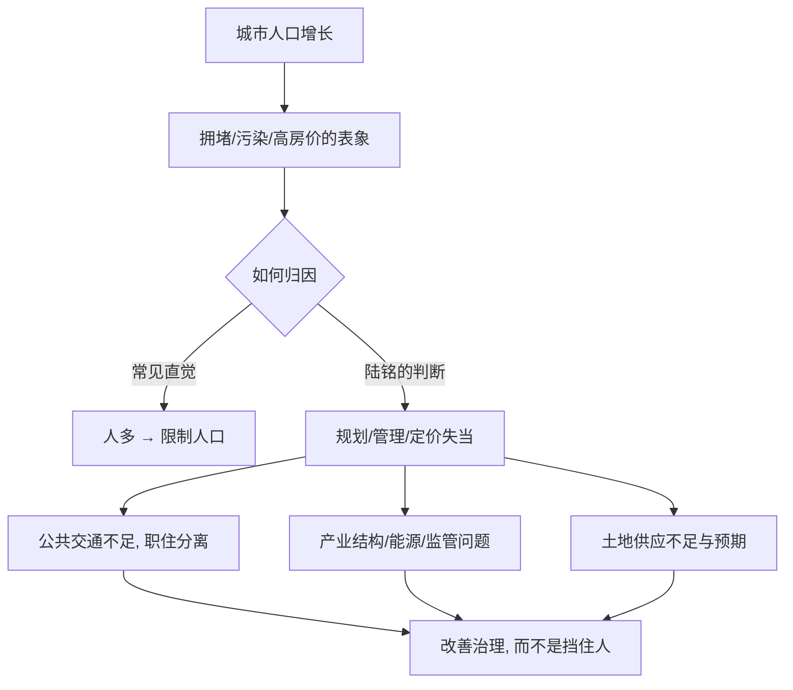

# 08｜大城市病真的是“人太多”造成的吗？

> 拥堵、污染、高房价，该怪人口，还是怪别的？

---

## 一、先说结论

陆铭认为，大城市病主要来自规划、管理与定价的失当，而不是人口总量太多。

拥堵可以用公共交通和路权定价来缓解；污染更多与产业结构、能源结构和监管有关；高房价则与土地供应和预期有关。把城市病简单归因为“人多”，很容易开出错误的药方——去限制人口，而不是去改善治理。

换句话说，城市病不是“人来了”的必然结果，而是“城市没管好”的具体表现。同一个规模，能不能过得舒服，取决于城市怎么组织自己。

---

## 二、我们先理解一个问题

先做一个思想实验。

假设有两座城市，人口都是三百万。第一座摊大饼式扩张，居住区在城郊、工作区在市中心，地铁稀疏，公交不准点，职住严重分离。第二座紧凑而密集，轨道成网，职住相对平衡，换乘方便。

同样的人口，同样的三百万，为什么第一座堵成停车场，第二座还能顺畅流动？

这说明一个关键点：**“人多”并不是城市病的唯一变量。** 真正决定城市病轻重的，是城市的空间组织、公共供给与管理方式。

所以这一篇要问的，不是“人为什么这么多”，而是“为什么同样多的人，在不同的城市里，体验差这么远”。

---

## 三、作者到底提出了什么观点？

陆铭的核心判断是：**城市病的成因，要从规划、管理、定价三方面去找，而不是从人口规模去找。**

- **拥堵**：路权没有被合理定价，公共交通供给不足，职住分离严重。
- **污染**：与产业结构、能源结构、监管力度关系更大。
- **高房价**：与土地供应和预期有关，这一点会在后面单独展开。

他因此反对把“控制人口”当作治理城市病的主要手段。在他看来，人口是城市活力的来源，而不是需要清除的麻烦。治理的对象应该是“管道”，而不是“水流”。

这里要区分清楚：**“城市病主要由规划与治理决定”是陆铭的观点**；而“人口规模确实会推高城市成本”则是一些经济学者的补充看法，两者并不完全冲突。

---

## 四、把这个观点翻译成人话

城市像一间房子，也像一套水管。

房间里人多，当然会显得拥挤。但如果你把房间设计得合理——多开门、多修通道、动线清晰——人多也能顺畅走动。水管堵了，你不能怪水太多，要去看是不是管径太小、拐弯太多、设计太差。

人是有腿的，水是会流的，真正决定“堵不堵”的，是通道够不够、设计得好不好。

再比如一家餐厅排长队。表面看是“顾客太多”，但仔细一看：座位少、动线乱、翻台慢、点单系统落后。同样的客流量，一家运营好的餐厅就能消化。城市的拥堵，常常是同一种问题——不是人太多，而是“通道”没修够、“流程”没设计好。

---

## 五、为什么会这样？

把城市病的形成逻辑拆开：

关键在于 **C** 这一步的分岔。归因方式不同，药方就完全不同。

如果认为病因是“人多”，那么政策自然是落户门槛、人口调控、疏散中心城区；如果认为病因是“治理”，那么政策就是修地铁、调路权、优规划、治污染。前者是让人别来，后者是让城市变好。陆铭主张的是后者。

人口规模当然不是完全无关——它更像一个“放大器”，会放大治理的好坏。但放大的方向，取决于治理水平。治理好，规模带来效率；治理差，规模暴露短板。

---

## 六、举一个现实生活中的例子

看一个最日常的场景：堵车。

早晚高峰，一条主干道排成长龙，人们的第一反应往往是“人太多了、车太多了”。但仔细看这条路的状况：附近没有地铁，或者地铁线路稀疏；公交不准点、换乘麻烦；大量人住在郊区、工作在市中心，职住分离严重；路口设计不合理，红绿灯配时粗糙。

这些因素叠加，才造成了拥堵。同样数量的车辆，如果地铁成网、公交换乘方便、职住更平衡，路面压力会小很多。

反过来，有些城市人口更多、密度更高，却因为轨道交通发达、规划紧凑，通勤体验反而更好。**这说明堵车主要来自规划与公共交通的不足，而不是人口总量本身。** 堵车是一面镜子，照出的是城市的组织能力，而不是人口的绝对数量。

---

## 七、回到书中重新理解

陆铭讲城市病，不只是就事论事，而是在为后面“不该简单限制城市规模”作论证。

如果先认定“城市病就是人多造成的”，那么“限制人口”就顺理成章，甚至显得理所当然。但如果城市病来自规划与治理，那么正确的出路就是改善治理，而不是把人挡在门外。

这一篇真正的任务，是把“病因”从人口转移到治理。只有病因找对了，后面关于房价、关于限制的反效果、关于城乡差距的讨论，才有共同的起点。

---

## 八、这个观点背后还有什么？

**第一，治理能力是关键变量。** 同样的规模，管理得好的城市病更轻，管理得差的城市病更重。

**第二，定价能把外部成本内部化。** 拥堵费、停车费、排污权等价格工具，能让“挤占公共资源”的行为付出成本。

**第三，不能走到另一个极端。** 完全不承认人口规模对拥堵、污染、房价的影响，同样是不客观的。

**第四，它把城市病从“人口问题”变成了“治理问题”。** 讨论的重点，从“人该不该来”，转向“来了之后怎么让人过得好”。

---

## 九、这个观点有问题吗？

需要一些平衡。

**一些经济学者认为**，人口规模确实会推高拥堵、污染与房价，尤其在治理能力一时跟不上的城市，规模压力是真实存在的。基础设施的扩建需要时间与财政，未必能追上人口流入的速度。还有人指出，拥堵费、停车费等定价手段具有分配效应，可能对低收入者不够公平。

**但另一种看法是**，把城市病完全归因于人口，会忽略一个事实：同样的人口规模，不同城市的结果差异巨大。这说明规模并非决定性因素。

所以更准确的说法是：**人口规模是城市病的“放大器”，治理水平是“调节阀”。两者都重要，但政策真正的抓手，在于治理。** 承认人口有影响，不等于承认“限制人口”是解法。

---

## 十、今天再看这个观点

以下部分是城市治理思想的现代延伸，不是陆铭的原话。

今天，技术进步正在改变城市治理的能力边界。大数据交通调度、智慧信号灯、实时公交、轨道网络的加密、职住平衡的规划理念、拥堵定价的试点、清洁能源与新能源车的推广，都在把“治理”这个变量做大。

这意味着，同一座城市、同样的人口，能够通过更好的组织方式，获得更低的“城市病成本”。数字化让治理可以更精细，也让“规模”有机会转化为“效率”而不是“负担”。

当然，技术不是万能的。规划的历史欠账、财政的约束、利益格局的惯性，仍然会拖慢改进的速度。

---

## 十一、这一篇真正应该记住什么？

1. **城市病主要来自规划、管理与定价，而不是人口总量。**
2. **同样的人口规模，不同治理水平的结果差异巨大。**
3. **归因错误，就会导致药方错误。** 怪人口，就会去限制人口；怪治理，才会去改善城市。
4. **人口规模是放大器，治理水平是调节阀。**
5. **治城市病，要治“管道”，而不是治“水流”。**

---

## 十二、留一个问题

> 如果堵车主要不是因为人多，
> 而是因为路和地铁修得不够、规划不合理，
> 那么把人口挡在城外，
> 真的能让城市更通畅吗？

---

**下一篇**：城市病里最让人揪心的一项，是高房价。如果拥堵的病因是“管道”而不是“水流”，那么房价的病因，究竟是“人多”，还是“地少、钱多”？我们下一篇就来拆开这一层——**高房价的根源到底是什么？**
