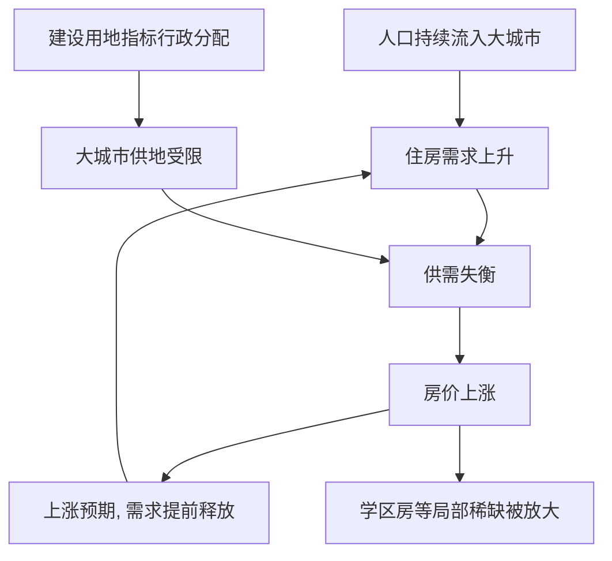

# 09｜高房价的根源到底是什么？

> 房价高，是因为人多，还是因为地少、钱多？

---

## 一、先说结论

陆铭认为，在人口持续流入的大城市，住房需求旺盛，而土地和住房的供给受到建设用地指标与规划的限制，供需失衡推高了价格。

高房价的本质，是“人往高处走”与“地不能跟着走”之间的矛盾。人要来，是因为这里有更好的收入与机会；而地能不能跟着人来，却由指标和规划说了算。

所以，房价问题不只是一个价格问题，它背后是人口流向与土地供给之间的错位。

---

## 二、我们先理解一个问题

任何一件商品，价格高无非有两种解释：要么是想要的人多，要么是给出来的东西少。

很多人只看到前半句——“人多”，却忽略了后半句——“供给”。房子也是一样。

先做一个思想实验。假设一座城市每年涌入几十万人，工作机会不断增加，但新增的住宅用地几乎不增加，新房供给也跟不上。那么房价会怎样？答案几乎是必然的：上涨。这不是因为“人坏”，而是因为供给没有跟上需求。

所以，讨论房价之前，必须先问一句：**到底是需求太旺，还是供给太紧？** 如果只看需求，就会得出“把人赶走”的结论；如果看到供给，问题的方向就完全不同了。

---

## 三、作者到底提出了什么观点？

陆铭的观点可以拆成需求端和供给端两条线。

**需求端**：人口持续流入大城市，收入增长，大家对未来有上涨预期，于是住房需求旺盛。

**供给端**：建设用地指标按行政方式分配，大城市的供地受到规划与指标的限制，土地“不够用”，新增住房供给跟不上人口流入。

两条线一夹，价格就被推高。陆铭的核心判断是：**高房价的根源，不在于“人多”，而在于“人地错配”——人往大城市走，地却不能跟着人来。**

需要区分的是：**陆铭更强调供给约束这个可改革的变量**；而**一些经济学者认为**，货币与信贷环境、投资与投机需求，在房价上涨中也扮演了重要角色。这两者并不互相否定，而是观察同一个问题的不同侧面。

---

## 四、把这个观点翻译成人话

想象一个突然爆火的景区。

游客数量暴涨，大家都想进去看。可景区就是不加建停车场，不新增入口，不扩建道路。结果是什么？门票被炒高，周边停车费飞涨，体验还越来越差。

这时你不能简单地说“游客太多”——游客来，是因为这里值得来，是需求信号。你真正该做的是：多开入口、多修停车场、提高接待能力。

房子也是同一个道理。**人口流入是需求的信号，土地供给不足才是价格的推手。** 你不能因为价格高，就去责怪“想来的那些人”；你该问的是，为什么供给不能跟着需求一起长。

再看学区房，就更直观了：一所好学校旁边的房子，贵得离谱。真的是“住的人太多”吗？不是。是因为好学校这种资源稀缺，又和房子绑定，而这片区域的土地与住房供给几乎不增长。需求高度集中，供给却几乎冻结，价格自然被顶上去。

---

## 五、为什么会这样？

把房价的形成逻辑拆开：

关键有两条。

第一条是 **D → E**：供给端被卡住。人口流入越多，供地却受指标与规划约束，缺口就越大。

第二条是 **F → G → C** 这条反馈环：房价越涨，预期越强，越有人提前入市，需求进一步推高价格。价格本身会强化价格，这是房地产市场的典型特征。

所以，只盯住需求端去“限购、限人”，往往治标；要让价格回归，供给端必须能跟着人口流动走。

---

## 六、举一个现实生活中的例子

看看学区房。

一所口碑很好的小学周围，房子的价格往往远高于同城其他区域。为什么？因为“好学校”这种稀缺资源被绑定在房子上，家长愿意为入学资格付出高额溢价，而这片区域的土地与住房供给几乎不增加。

需求集中在极小的地理范围内，供给又几乎固定，价格就必然被推高。学区房是“局部供地不足加上资源绑定”的极端缩影。

把这个逻辑放大到整座城市，就是大城市高房价的同一版本：人口持续流入，住宅用地供应受指标限制，新增住房跟不上，价格被长期推高。学区房是小尺度的放大镜，大城市房价是大尺度的同一道题。**理解了学区房，就理解了“人地错配”如何变成价格。**

---

## 七、回到书中重新理解

这一篇把“土地”和“房价”连了起来。

在讲土地制度的那一层里，重点是“建设用地指标错配”；到了房价这里，错配就变成了看得见的价格——大城市地不够用，小城市地没人用，而人口却在往大城市走。

陆铭由此得出一个判断：**房价不是孤立的金融现象，而是人、地、钱三者关系的价格表达。** 要让房价问题回到正轨，就得让土地供给跟着人口走，而不是让人口迁就土地指标。

---

## 八、这个观点背后还有什么？

**第一，预期的作用。** 预期上涨会提前释放需求，形成自我强化的上涨循环。

**第二，土地财政的角色。** 一些讨论指出，地方的供地节奏与财政收入相关，这会影响供给的判断与节奏。

**第三，房价其实是一个信号。** 它反映的是稀缺程度。价格高，说明“这里有人想住，但房子不够”，而不是“人错了”。

**第四，改革方向是“人地挂钩”。** 让建设用地指标跟随人口流动，让大城市能提供更多住房，才可能从根本上缓解供需失衡。

---

## 九、这个观点有问题吗？

需要一些平衡。

**一些经济学者认为**，货币宽松、信贷杠杆、投资与投机需求，以及土地财政，在推高房价中的作用不容忽视。仅靠调整供地，未必就能把房价降下来。**还有人指出**，供地也受到耕地保护、生态红线、城市形态等约束，不可能无限扩张；而且房价若大幅下跌，也可能带来金融风险，不能简单假设“供给多了就一定好”。

**但另一些看法是**，从供需框架看，“人口流入加供给受限”，仍然是理解大城市房价的核心线索。忽略供给约束，就容易把病因误判为“人太多”，从而开出限制人口这样的药方。

所以更稳妥的表述是：**房价是需求、供给、货币、预期共同作用的结果；但“人往高处走而地不跟着走”，是理解大城市高房价的关键矛盾。** 承认其他因素存在，不等于否认供给约束的重要性。

---

## 十、今天再看这个观点

以下部分是住房政策的现代延伸，不是陆铭的原话。

今天的住房供给方式，正在变得更多元：都市圈与轨道交通向郊区外扩，郊区和新城承接一部分居住需求；租赁住房、保障性住房被更多提及；限购限贷、房产税试点等需求端工具也在被反复讨论。

这些变化，本质上都是在回答同一个问题：怎么让“住”这件事，在人口不断流入的城市里，重新变得可负担。

但核心矛盾依然存在——**人往高处走，而地能不能跟着走，仍然取决于制度设计。** 只要“人地错配”没有缓解，房价的压力就难以真正消退。

---

## 十一、这一篇真正应该记住什么？

1. **价格等于需求加供给，别只盯着需求。**
2. **大城市高房价，是“人要来”与“地给不了”之间的矛盾。**
3. **学区房是局部供地不足的极端案例。**
4. **病因决定药方：是限制需求，还是增加供给。**
5. **让土地供给跟着人口走，才可能真正缓解房价压力。**

---

## 十二、留一个问题

> 如果高房价的背后，是“地没有跟着人走”，
> 那么用限制人口、限制落户的办法去压房价，
> 会不会只是把需求挡在门外，
> 而让问题以另一种形式继续存在？

---

**下一篇**：如果限制人口既挡不住人，又可能让问题以别的形式冒出来，那么这套“限制”的逻辑本身，是不是就有问题？我们下一篇就来追问——**限制大城市，为什么可能让问题更严重？**
