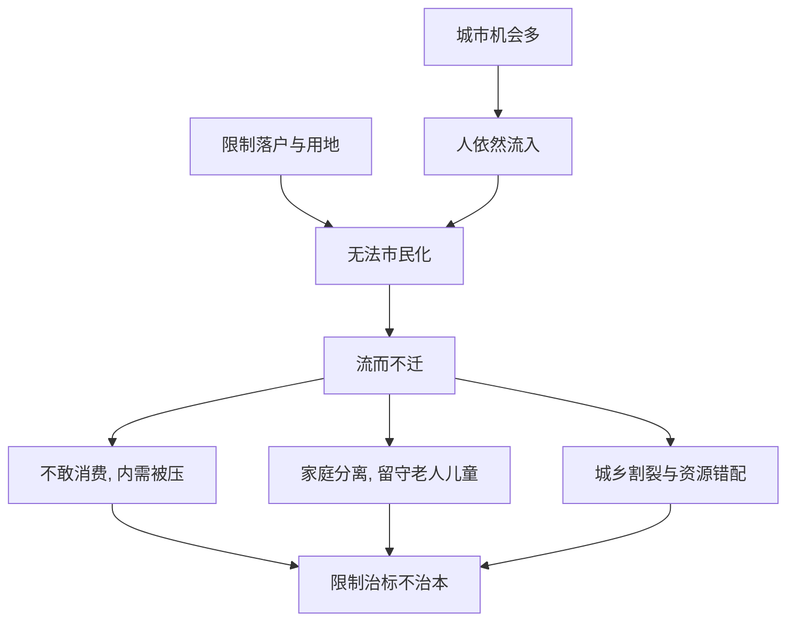

# 10｜限制大城市，为什么可能让问题更严重？

> 为了“平衡”而限制大城市，结果会怎样？

---

## 一、先说结论

陆铭认为，限制落户与限制用地，并不能让人不流动，只会让人“流而不迁”：人在城市工作，却无法安定下来、成家、育儿、消费。

这既压制了内需，也加剧了城乡割裂，还可能让资源错配更严重。所以，限制往往治标不治本——它改变的是人的身份，而不是人的去向。

一句话：**该来的还是会来，只是来了也留不下。**

---

## 二、我们先理解一个问题

先做一个思想实验。

假设有一座城市，GDP 高、岗位多、工资高，但政策上不让人落户、不让孩子就近上学、不让买房、社保医保也难以接续。那么，人会不来吗？

不会。人会照样来打工，只是“来而不留”。于是出现一种奇怪的状态：**人在城市赚城市的钱，权利和家庭却留在故乡。**

那么问题就来了：这样的限制，真的减少了大城市的人口吗？还是只是改变了这些人的“身份”——把他们从“市民”变成了“暂时在这里劳动的人”？

这一步想通了，后面的结论就很自然。

---

## 三、作者到底提出了什么观点？

陆铭的核心判断是：**限制不能消除流动的动机，只能改变流动的质量。**

人往高处走，是因为机会和收入。这个动力不会因为一道门槛就消失。门槛能做的，是让流动变得“不完整”：

- 人仍然会来，但无法完成“市民化”，长期处于悬置状态。
- 消费被压制：不敢花钱、不敢成家、不敢生育，因为没有稳定预期。
- 家庭被拆开：孩子留在老家，父母留在老家，形成留守儿童与留守老人。
- 城乡被割裂：人在这头，权利在那头，两边都不完整。

与此同时，限制用地与落户还会带来资源错配，让城市的效率受损。所以陆铭说，限制往往是治标不治本——**堵住了入口，需求却还在原地。**

---

## 四、把这个观点翻译成人话

想象一家公司。

它需要大量人手，却只肯招“临时工”：不给转正，不给长期合同，不给稳定的福利。结果会怎样？

人还是会来干活，因为总得挣钱。但他们不会在公司安家，不会长期投入，不会把这里当成自己的未来，随时准备离开。公司省下了一笔钱，却失去了稳定、忠诚和员工对公司的长期投入。

城市限制落户，本质上就是让千万劳动者长期做“城市的临时工”。**城市拿到了他们的劳动，却没有得到他们的消费与稳定；他们也没有真正融入城市。** 双方都付出了代价，只是这个代价被“看起来更平衡”的表象掩盖了。

---

## 五、为什么会这样？

把“限制”的传导链条拆开：

关键在于 **B → D** 这一段：限制并没有切断 A → B，人还是来了；它只是把 B 直接引向了 D——来了，却留不下。

于是限制的效果，不是“让人不来”，而是“让人来了也不完整”。这个偏差，正是陆铭认为限制政策最容易犯的错误：**它以为自己在减少流动，实际上只是在降低流动的质量。**

---

## 六、举一个现实生活中的例子

看一个在城市打工的人。

他在城市工作了十年。孩子留在老家上学，父母也在老家；社保医保还挂在户籍地；买房资格没有，落户积分遥不可及。他每年只有春节才回一次家；赚的钱大多寄回去或者存起来，不敢在城市大额消费，不敢轻易生第二个孩子，更不敢谈“定居”。

他不是不想留，而是留不下。

结果就是：城市得到了他的劳动，却没有得到他的消费和稳定；他也没有真正成为城市的一部分。这就是“流而不迁”——**人一直在流动，却始终迁不进去。**

限制落户并没有让他少来，只是让他一直悬在中间：既不完全属于城市，也难以回到原来的生活。这种悬置状态，才是限制真正制造的代价。

---

## 七、回到书中重新理解

这一篇，把前面讲过的户籍、流动障碍、土地约束，都落到了后果上。

限制不是中性的。它不会像想象中那样，让人“安分地待在原地”，而是会产生一种“人不人、乡不乡”的中间状态。人来了，但身份、家庭和权利都还留在故乡。

陆铭由此得出方向性的判断：**与其限制，不如让人真正市民化。** 因为只有让人安定下来，消费才会释放，家庭才能团聚，内需才能真正打开，城乡之间那条人为的裂缝才有可能被弥合。

---

## 八、这个观点背后还有什么？

**第一，内需被压制。** 不敢消费的根源，是缺乏稳定的预期和身份，而不只是收入问题。

**第二，人口与生育意愿被透支。** 不敢成家、不敢生育，一个重要前提就是“不知道自己会不会一直留在这里”。

**第三，代际代价。** 留守儿童、留守老人，是这种制度安排最沉默的成本。

**第四，限制的自我矛盾。** 本意是想让区域更平衡，结果却制造了更深的割裂——人在这头，权利在那头。

---

## 九、这个观点有问题吗？

需要一些平衡。

**一些学者认为**，大城市的资源承载力——水、土地、交通、教育、医疗——确实有限，短期内若完全放开，公共服务可能承受明显压力。适当引导人口在城市群内多点分布，也有其合理之处。此外，限制落户在一定程度上也保护了本地原有的公共服务供给，不能一概否定。

**但另一种看法是**，完全依靠行政限制，既拦不住流动，又会制造身份割裂，社会成本很高。人既然事实上已经来了，把他们长期放在“半融入”的状态里，问题只会积累而不是消失。

所以更稳妥的表述是：**方向应该是“让人留下来并共享公共服务”，而不是“让门变得更窄”。** 承认承载力约束，不等于要长期依赖限制；真正的难题，是如何在接纳的同时扩容公共服务。

---

## 十、今天再看这个观点

以下部分是人口迁移政策的现代延伸，不是陆铭的原话。

近年来，政策的方向正在从“限制”转向“接纳”：放宽落户、推行居住证与积分落户、推动随迁子女入学、都市圈内社保与公积金互认、保障性住房覆盖更多新市民。

这些变化，本质上是在回应陆铭所说的那个问题——与其让人“流而不迁”，不如让人真正“迁得进去”。

不过，落实的程度在各地并不均衡。制度上的口头接纳，与公共服务上的实际覆盖，之间仍有距离。这也说明，方向对了，路还很长。

---

## 十一、这一篇真正应该记住什么？

1. **限制不会消除流动，只会降低流动的质量。**
2. **流而不迁的状态是：人在城市，权利在故乡。**
3. **代价有三样：内需被压、家庭分离、城乡割裂。**
4. **限制治标不治本，堵住入口，需求仍在。**
5. **出路是市民化，而不是把门变得更窄。**

---

## 十二、留一个问题

> 如果限制大城市，既没有挡住人，
> 又在城市与故乡之间制造了一道裂缝，
> 那么中国的城乡与区域差距，
> 为什么投了那么多钱，还是难以缩小？

---

**下一篇**：限制没能让人少来，也没有真正改善平衡。但有一个问题一直没被正面回答——为什么我们投入了那么多项目、补贴和基建，城乡与区域之间的收入差距依然顽固？我们下一篇就来面对它——**城乡与区域差距为什么难以缩小？**
