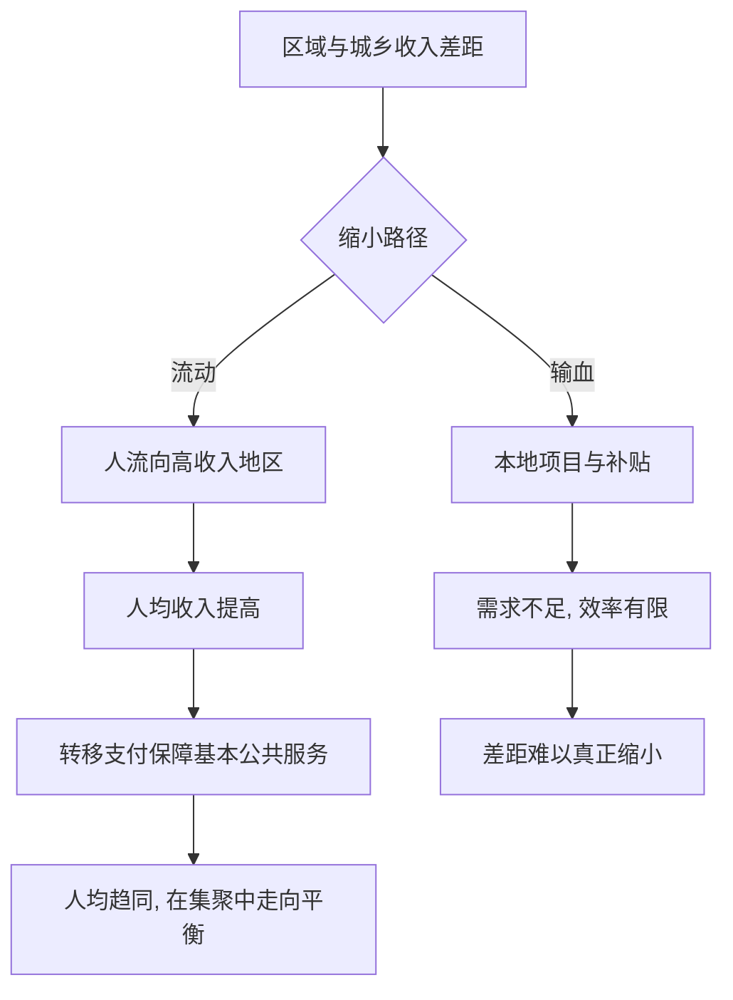

# 11｜城乡与区域差距为什么难以缩小？

> 为什么投了那么多钱，差距还是那么大？

---

## 一、先说结论

陆铭认为，如果劳动力不能自由流动，落后地区的人就无法分享发达地区的繁荣。

仅靠给落后地区“输血”——上项目、给补贴、修基建——往往效率低下；真正有效的办法是“让人走出去”，再以转移支付保障基本公共服务。

所以，差距难以缩小，未必是因为钱投得不够，而可能是因为“人”没有能够自由流向机会更多的地方。**差距的真正出口，在于人的流动，而不只是资本的搬迁。**

---

## 二、我们先理解一个问题

先做一个思想实验。

有两个村子。A 村靠近大城市，交通便利、市场广阔；B 村在深山，资源有限、需求稀少。现在给 B 村修一条高速公路、建一个工业园、每年发放补贴——这样能不能让 B 村追上 A 村？

答案取决于一件事：**B 村的人，能不能到 A 村去工作，能不能分享那边更高的工资和更丰富的市场。**

如果不能，那么 B 村的收入上限，仍然由它本地的资源和产业决定。问题就变成了：缩小差距，究竟靠把“钱”搬到 B 村，还是靠让“人”能走到 A 村？这正是理解区域差距的核心分歧。

---

## 三、作者到底提出了什么观点？

陆铭的观点有三层。

**第一，区域差距的本质是人均收入差距，而不是总量差距。** 一个地方总量小，但如果人少，人均可以很高；一个地方堆了很多投资，总量上去了，人均却未必改善。

**第二，让人流动，是最有效的差距缩小机制。** 人从低收入地区流向高收入地区，自己的收入提高，留下的人均资源也会改善。

**第三，转移支付应当保障基本公共服务，而不是到处建工厂。** 财政的功能，是让不同地方的人，都能享受到体面的教育、医疗和社保，而不是在每个县都复制一套可能没有需求的产业。

一句话概括：**让市场配置人，让财政再分配保底线。**

---

## 四、把这个观点翻译成人话

想象一户人家有好几个孩子。

与其给每个孩子都在各自村里建一间工厂——很可能没订单、没需求——不如让愿意出去的孩子到城里工作，赚更高的工资；然后家里用赚得多的人的贡献，去补贴留在村里照顾老人和孩子的兄弟姐妹，让每个人都能过得体面。

结果是什么？总量上，城市更大、村庄更小；但人均上，大家反而更接近了。

这就是“在集聚中走向平衡”在家庭尺度上的版本：**不是让每个地方都长成一模一样，而是让每个人的人均收入趋于接近。** 人口可以继续向高效的地方集中，而财政负责把基本保障和公共服务补齐。

---

## 五、为什么会这样？

把“差距缩小”的两条路径拆开对比：

关键的分岔在 **B**。

走“输血”这条路，是把资源往落后地区搬。但如果当地缺乏配套的市场和需求，投资回报低，甚至出现设施空置，钱花出去了，人均收入却改善有限。

走“流动”这条路，是让人去高效的地方创造价值，再通过财政把基本公共服务补齐。这条路的逻辑是：**人往高处走，财政往低处补。** 两者配合，人均差距才有希望真正缩小。

---

## 六、举一个现实生活中的例子

看一个中西部县城和一个沿海城市。

县城的人均收入，明显低于沿海城市。为什么？因为如果人们只能在本地就业，收入上限就由本地产业决定——农业、低端制造、传统服务业，岗位有限、附加值不高。即使修了路、建了产业园区，如果本地和周边没有足够的需求，园区也可能空置。

而沿海城市因为集聚，岗位多、工资高、机会多，同样一个人在那里能创造更高的价值。

两者的人均收入差距，本质上是一个“能不能流动”的问题。如果县城的人可以去沿海工作，并把一部分收入带回家庭，人均差距就会缩小；反之，人被困在原地，差距就会长期固化。

所以，**修路建园是必要的，但如果没有让人流动起来的通道，它最多改变总量，很难改变人均。** 这正是很多地方“投了很多钱，差距却没怎么缩小”的深层原因。

---

## 七、回到书中重新理解

这一篇，是前面所有约束的汇总。

户籍、流动障碍、土地、以及限制大城市的种种做法，最终都体现为同一个结果：城乡与区域差距难以缩小。因为这些约束共同阻止了一件事——**人自由地流向机会更多的地方。**

弄清楚了这一点，陆铭才可能重新定义“平衡”：平衡不是总量上的平均分布，而是人均收入的逐步趋同。差距之所以顽固，往往不是财政不够慷慨，而是流动不够顺畅。

---

## 八、这个观点背后还有什么？

**第一，效率与公平可以并行。** 让市场配置人的流向，让财政负责结果的再分配。

**第二，财政的角色是保底线。** 转移支付的核心，是保障基本公共服务的人均趋同，而不是在每个地方复制产业。

**第三，差距可能被统计掩盖。** 就地投资容易拉高总量数字，却未必改善当地居民的人均收入。

**第四，流动本身就是一种再分配。** 一个人从低收入地区流向高收入地区，既改变了自己的收入，也改变了两个地方的人均水平。

---

## 九、这个观点有问题吗？

需要一些平衡。

**一些学者认为**，人口流动会带来流出地的“空心化”、老龄化和人才流失，而老人、病人等弱势群体往往难以迁移，单靠流动，他们的处境可能更加困难。产业转移、乡村振兴，对留住就业和改善民生也有其价值。完全依赖流动，对不愿或不能离开的人并不公平。

**但另一种看法是**，从人均收入的角度看，限制流动的确会让差距更难缩小。人既然无法分享发达地区的繁荣，差距就会被制度性地固定下来。

所以更稳妥的表述是：**既要逐步放开流动，也要用转移支付去保障那些不流动者的基本生活与公共服务。** 承认“空心化”的风险，不等于要关闭流动的通道；真正的难点，是在流动与再分配之间找到配套的组合。

---

## 十、今天再看这个观点

以下部分是区域发展政策的现代延伸，不是陆铭的原话。

今天的中国，人口仍在持续向城市群和都市圈集中，一些地区则出现人口收缩。与此同时，乡村振兴、产业转移、对口帮扶、基本公共服务均等化、数字基础设施下沉，也在同步推进。

这其实是在同时走两条路：一条是让愿意流动的人流得动，另一条是让留下的人也能过上体面的生活。流动与再分配，谁都不能缺席。

从这个角度看，陆铭的思路并不是“放弃落后地区”，而是主张：**与其把钱用来对抗人的流向，不如用它来补齐人的保障。**

---

## 十一、这一篇真正应该记住什么？

1. **差距难以缩小，卡在“人不能自由流动”。**
2. **输血式投资效率有限，流动才是缩小人均差距的机制。**
3. **转移支付应保障基本公共服务，而不是到处建厂。**
4. **平衡是人均趋同，不是总量平均。**
5. **流动与再分配，必须配套推进。**

---

## 十二、留一个问题

> 如果差距的根源不在“钱”，
> 而在“人能不能走”，
> 那么城市到底该由谁来决定大小——
> 是行政命令，还是市场？

---

**下一篇**：说到这里，一个更根本的问题就浮出来了。如果流动是缩小差距的关键，那么城市规模究竟该由谁来决定？是行政规划的一纸命令，还是市场通过价格发出的信号？我们下一篇就来正面回答这个问题——**为什么要让市场决定城市规模？**
