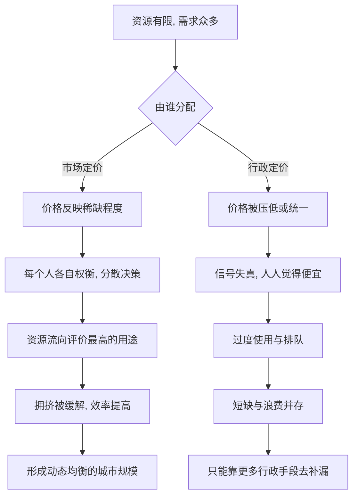

# 12｜为什么要让市场决定城市规模？

> 城市该多大，为什么不该由行政命令决定？

---

## 一、先说结论

陆铭认为，一座城市该有多大，本质上是无数人各自权衡“机会”与“成本”之后的结果，而不是规划文件里写下的那个数字。

价格是这套权衡的语言。房租、地价、通勤时间、拥堵费、水价，都在持续发出“什么更稀缺”的信号。行政命令看不到这些分散在千万人头脑里的信息，就容易让该长大的城市长不大、该收缩的地方硬撑着扩张。让市场去配置，同时用公共政策补上公平与公共品的短板，才更接近一个有效率的均衡。

## 二、我们先理解一个问题

做一个小小的思想实验。

假设有一条每天早高峰都堵死的过江通道。现在有两种定价方式：一种是过桥完全免费；另一种是高峰期收一笔通行费，平峰便宜，夜里更便宜。

免费的时候，所有人都会挤在同一个时段。哪怕你只是出门买个菜，也不介意顺路去堵一堵——因为堵车的代价由整条队伍分摊，而你几乎不用为“占用道路”付钱。结果是桥永远不够用，每个人都觉得“人太多了”。

收费之后，事情变了：真正赶时间的人愿意付钱，不赶时间的人会错峰，或者改坐地铁。桥还是那座桥，人还是那么多人，但拥堵明显缓解了。

问题在于：**同样是“人多”，为什么免费时像灾难，收费时却可以运转？**

因为稀缺的常常不是人，而是被按住了的价格。这正是陆铭讨论“谁来决定城市规模”时，想让我们先看懂的东西。

## 三、作者到底提出了什么观点？

陆铭提出，城市规模应当在边际上由市场机制决定。

所谓边际，就是“再多来一个人，会带来多少产出、多少成本”。这个账，只有分散的价格才可能算清楚：房租上涨说明居住空间变稀缺，通勤变长说明时间成本在上升，工资更高说明这里的劳动更值钱。价格像一个持续的投票器，把千万人的偏好汇总成一个可以行动的信号。

他同时指出，行政力量决定规模，有两个天然短板。一是**信息问题**：一座城市真实的承载能力，很难靠几个指标算出来，而是由无数具体的人在不同岗位、不同地段上试出来的。二是**激励问题**：地方官员的考核往往看总量成绩，容易更在意“把城市做大”的账面数据，而忽略边际成本正在上升。

陆铭的观点并不是“政府什么都不用做”，而是：**先让价格把稀缺讲清楚，再让公共政策去处理价格讲不清楚的部分**，比如公共安全、环境、基本公共服务，以及低收入者的可负担性。

## 四、把这个观点翻译成人话

可以把城市想象成一个巨大的排队现场。

如果所有窗口都不标价、都免费，人就会一股脑涌向最热门的那个窗口，队伍排到门外，大家一边排一边骂“人太多”。但如果每个窗口都有一块牌子，写清“这里要等两小时”“这里多花二十块但十分钟就好”，人们就会自动分散开——赶时间的人多花钱，时间宽裕的人换个窗口。

价格的作用，就是把“这里很挤”这件事，从一句抱怨变成一个人人能看懂、并能据此调整行为的信号。

反过来，如果规定“所有窗口都不许标价”，看起来人人平等，实际上是用所有人的时间，去补贴那些最不在乎时间的人；而真正急着办事的人，反而被堵在队伍里。城市规模的问题，很大程度上就是这么一回事。

## 五、为什么会这样？

把市场定价与行政定价的逻辑并排放：

关键在于 **C → D → E** 这一条链。

价格不是命令，它只是把“稀缺”翻译成一个数字，让每个人自己去决定值不值得。正是这种分散决策，让一座城市在不靠中央计算的情况下，把人力、土地、时间配置到价值更高的地方。而一旦价格被人为压低，信号就失灵，接下来的短缺、排队与错配，只能靠更多的行政手段去补救，越补越复杂。

## 六、举一个现实生活中的例子

拥堵费是最直观的一种。

伦敦、新加坡等城市在市中心或高峰时段收取道路使用费，目的不只是“挣钱”，而是让开车的人意识到：他占用的这段路，在此时此地非常稀缺。收费之后，一部分人改乘地铁、错峰出行或拼车，道路反而更通畅了——车少了，但城市并没有因此变小。

水价也是同一个道理。当水价长期偏低，人们浇地、洗车、灌溉都不心疼，浪费就出现了；而阶梯水价让超额用水变贵，节约的动力立刻就有了。同样是“水不够”，低价时表现为“到处缺水”，合理定价后表现为“用得更省”。

这两个例子都在说明：**很多看起来是“总量不够”的问题，其实是“价格没说话”。** 让价格发声，往往比单纯限制人数更有效，也更不伤及无辜。

## 七、回到书中重新理解

现在再回看陆铭的主张，就顺了。

前面几篇已经说明：城市规模由集聚收益与拥挤成本共同决定；限制人口流动，只会让人“流而不迁”；区域差距的真正出路，是让人能自由走向机会更多的地方。那么接下来必须回答一个政策问题——**这个“规模”，到底该由谁来定？**

陆铭的答案是：让市场在边际上定，让价格去反映稀缺。这不是放任，而是承认一件事：城市是一个极其复杂的系统，它的合理规模，很难被一份自上而下的规划精确算出。政策该做的，是把价格信号修好、把公共品补齐，而不是替所有人决定他们该住在哪里。

## 八、这个观点背后还有什么？

**第一，市场定价需要前提。** 竞争是否充分、信息是否对称、权力是否会被垄断，都会影响价格是否真的反映稀缺。信号失真时，市场同样会失灵。

**第二，市场决定不等于政府退场。** 环境、公共卫生、教育、安全这些领域存在外部性，价格无法完全覆盖，必须由公共政策介入。

**第三，价格有分配后果。** 拥堵费、水价上涨，对低收入者的负担相对更重。因此现实中往往需要配套的补贴、减免或公共服务改善，才能让定价既有效率、也不失公平。

**第四，它把争论从“要不要限制”转向“怎样定价”。** 这是一个更可操作、也更容易达成共识的讨论方向。

## 九、这个观点有问题吗？

需要一些平衡。

**第一，是否存在“最优城市规模”，学界并无定论。** 一些经济学者认为，集聚存在正外部性，市场自发形成的规模可能偏小，也可能因路径依赖而偏离最优，因此单靠价格未必足够。

**第二，拥堵费之类的定价，公平争议真实存在。** 它会改变不同收入群体的出行方式，处理不好会被视为“用钱买路权”。关于这一问题，学界与社会都存在不同看法。

**第三，价格机制对“慢变量”反应迟钝。** 土地、基础设施、人口的调整都要以年计，短期价格波动未必能引导长期最优布局。

**第四，但它的核心提醒依然成立。** 与其用行政命令硬性规定城市规模，不如先把价格信号修准，再针对失灵之处精准补位。**至少，价格提供了一个可被检验、也允许纠错的基准。**

## 十、今天再看这个观点

以下部分是价格机制思想的现代延伸，不是陆铭的原话。

今天，数字技术让定价变得前所未有地精细。网约车的动态调价、外卖高峰期的配送费、电力的实时电价、碳排放权的交易，本质都是同一个逻辑：**用价格把实时的稀缺，传递给每一个正在做决定的人。**

城市治理也在朝这个方向走。实时路况、地铁客流、停车位的动态定价，让“哪里挤、什么时候挤”变得可视、可计价。未来，如果拥堵、用水、用地都能更准确地定价，城市规模的调节可能会从“一刀切的限制”，转向更柔性的“信号引导”。

当然，技术也带来新问题：算法定价是否透明，数据是否被滥用，弱势群体会不会被系统性排除。这些都需要制度去回应，而不能只交给价格。

## 十一、这一篇真正应该记住什么？

1. **价格是稀缺的语言。** 房租、地价、通勤、拥堵费、水价，都在告诉人们什么更紧张。
2. **城市规模应在边际上由市场决定。** 多来一个人是多少产出、多少成本，只有分散的价格算得清。
3. **行政定价容易信号失真。** 被压低的成本，会以排队、短缺、浪费的形式重新出现。
4. **市场决定不等于政府不管。** 公共品、外部性与公平，需要政策补位。
5. **争论应转向“如何定价”，而非“要不要限制”。**

## 十二、留一个问题

> 如果一座城市的拥堵与短缺，多数都能用“价格没说话”来解释，
> 那么当我们抱怨“人太多”时，
> 是不是应该先问一句：这里的价格，被谁按住了？

---

**下一篇**：让市场决定规模，说起来清楚，可现实中有一个环节最难动——土地。地方政府的钱从哪里来，土地指标又按什么分配？

下一篇我们就来拆开这个问题——**土地和财政该怎么改？**
