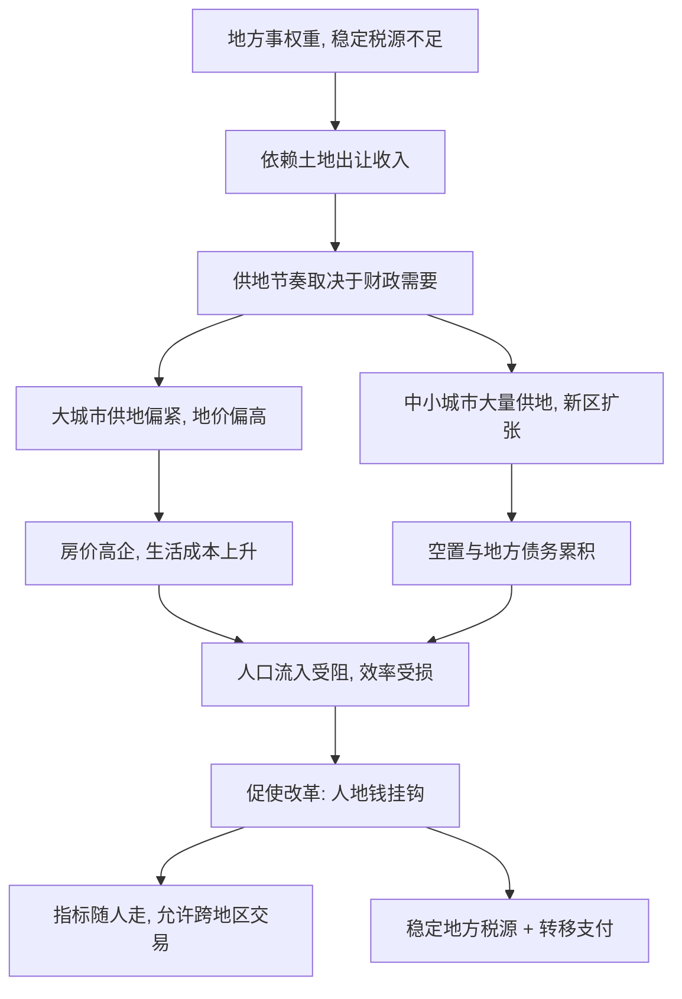

# 13｜土地和财政该怎么改？

> 地方政府依赖卖地，这个模式怎么破？

---

## 一、先说结论

陆铭给出的方向，可以概括成一句话：**让人、地、钱都跟着市场走。**

具体地说，建设用地指标应当跟随人口流动，而不是跟着行政层级分配；土地应当允许在地区之间交易，把“地没人用”的地方的指标，卖给“地不够用”的地方；中央与地方的财税关系需要调整，用更稳定的地方税源，逐步替代对土地出让收入的依赖。

核心是不要让三样东西互相打架：人在往高处走，地却不能跟着走，钱又被绑在土地上。只要这三者拧在一起，城市化的效率与区域平衡就都会受损。

## 二、我们先理解一个问题

做一个小比方。

有一户人家，靠把自家院子里的地一块块卖掉过日子。头几年，地多、买家多，日子过得很滋润，还顺手盖了新房、修了路。可是地是有限的——卖到最后，院子空了，收入也就断了，而每年该花的钱一分没少。

这时候他只有两条路：要么找到一份可持续的营生，要么继续想别的办法“变现”，把问题推给以后。

问题在于：**如果一笔收入来自“卖掉存量”，它注定当不了长久的饭碗。**

地方政府的土地财政，很大程度上就是这户人家的处境。这不能简单归咎于某个人的短视，而要从制度上理解：它为什么会发生，又该怎么走出来。

## 三、作者到底提出了什么观点？

陆铭的分析是这样展开的。

**第一，土地财政有其制度根源。** 在中央与地方财权、事权不完全匹配的背景下，地方承担了大量建设与公共服务的支出，而稳定的自有税源相对不足。土地出让收入归地方支配，于是在“要发展、要建设”的压力下，卖地成了最直接、也最快见效的融资方式。

**第二，供地逻辑被“财政需要”扭曲。** 理想状态下，哪里人多、需求旺，土地就该往哪里多供。但在土地财政下，供地节奏往往取决于“哪里能卖出好价钱、哪里能支撑新一轮建设”。结果是：人口流入的大城市供地偏紧、地价偏高，推高了房价；而人口流出或增长乏力的地方，却大搞新区、大量供地，留下空置与债务。

**第三，改革的方向是让要素跟着人走。** 陆铭主张：建设用地指标与人口流动挂钩；允许土地指标跨地区交易；调整财税体制，让地方有更稳定的税源；并用转移支付保障基本公共服务，让流出地的人不因“留不住人”而失去基本保障。

一句话：**不要用行政分配去对抗人口流向，而要让制度顺着人流、顺着市场去配置资源。**

## 四、把这个观点翻译成人话

可以把全国的建设用地指标，想象成一批“建房许可券”。

过去，这批券是按行政区划、按历史基数发下去的。于是出现了一个怪现象：一个城市明明在快速涌入人口，房子紧、地价贵，手里却没几张券；另一个城市人口在流出，房子空着，券却用不完，还要靠“摊大饼”把新区铺开。

如果把券改成可以交易、可以跟着人走，会怎样？

人多的地方，向人少的地方买券——卖方获得一笔收入，买方缓解了土地紧张。地还是那么多地，但用途变了：稀缺的地方多盖房，过剩的地方少铺摊子。这不是谁吃亏，而是让土地从“低价值用途”流向“高价值用途”，双方都能获益。

至于土地财政收入减少后留下的缺口，则要靠税制改革和转移支付来补——**让地方政府的钱，从“卖一次地”转向“收一份稳定的税”。**

## 五、为什么会这样？

把土地财政的运转逻辑画出来：

关键在于 **A → B → C** 这一段。

并不是某个人偏爱卖地，而是当“事权重、税源轻”时，土地成了最容易动用的资源。它一旦成为主要财源，供地就会跟着财政需要走，而不是跟着人口走；接下来房价与空置，都是这种错配的结果。因此，只盯着“少卖地”是治标，**真正要动的是背后的财权、事权与税源结构。**

## 六、举一个现实生活中的例子

土地财政最典型的图景，这些年在不少城市都出现过。

一座城市要上项目、修路、建新城，钱从哪里来？先把土地整理出来，挂牌出让，用出让收入去支付基础设施，再用更好的配套吸引下一轮土地升值。这个循环在上升期看起来很顺：城市面貌一年一变，账面收入节节走高。

但隐忧也埋在里面。新区铺得越大，需要的人口越多；如果人口没有如预期流入，房子就空着，债务却要按期偿还。而在另一些人口持续涌入的城市，土地指标反而紧张，住房供不应求，年轻人“买不起、住不下”，只能把通勤拉得越来越长。

**同样是土地，有的地方用过了头，有的地方又不够用。** 这不是土地总量不足，而是它与人口流向没有对齐。所谓“土地和财政该怎么改”，改的正是这种错位。

## 七、回到书中重新理解

放到整套逻辑里看，这一篇的位置很清楚。

前面已经说明：土地指标按行政分配，会造成供地错配，从而推高房价、留下空置；限制流动只会让人“流而不迁”；要走向平衡，得让人能自由走向机会更多的地方。而现在的问题是——**如果人口要跟着市场走，土地与财政的制度能不能跟上？**

如果土地指标仍旧按行政层级下发、地方财政仍旧高度依赖卖地，那么即便户籍放开，人进来了，房子也未必建得出来、公共服务也未必养得起。所以陆铭强调，要素改革必须配套：人流动、地跟随、钱匹配。三者缺一，前面的主张都会在落地时打折。

## 八、这个观点背后还有什么？

**第一，土地财政并不只有坏的一面。** 在过去相当长一段时间里，它确实为城市基础设施提供了资金，支撑了快速的城市化。评价它，要区分“曾经有效”与“今天难以为继”。

**第二，土地不只是财政问题。** 它牵涉产权、征地补偿、农民权益、地方债务等一整套制度，改革必须统筹，不能只改一头。

**第三，改革是系统工程。** 房产税、地方债、中央与地方关系、转移支付，任何一项单独推进都可能失衡，需要组合设计。

**第四，它把“谁受益、谁负担”摆上了台面。** 卖地是当期收入、长期成本；税源是当期负担、长期稳定。这背后的代际分配，同样需要正视。

## 九、这个观点有问题吗？

需要一些平衡。

**第一，房产税能否替代土地财政，学界有争议。** 有人认为它是更稳定的地方税源，也有人担心开征阻力大、对普通家庭负担重，且短期内难以填补土地收入的缺口。关于这一问题，学界存在不同解释。

**第二，土地跨地区交易的操作难度不小。** 指标如何定价、收益如何分配、耕地保护与生态底线如何守住，都需要精细的制度设计，稍有不慎就会出现新的寻租与错配。

**第三，对土地财政的历史作用应更公允。** 一些经济学者认为，它在特定阶段为基建融资提供了便利，简单否定并不客观。

**第四，但方向性判断仍然清晰。** 无论具体路径如何，让土地与财政更顺应人口流向，而不是与之对抗，是多数讨论都朝向的共识。

## 十、今天再看这个观点

以下部分是基于陆铭思想的现代延伸，不是他书里的原话。

这些年的政策走向，不少与这一方向呼应：建设用地指标开始更多与人口流入挂钩，一些地方开展房产税试点，地方债的规范化管理逐步推进，中央与地方的财权事权关系也在持续调整。与此同时，随着房地产市场降温、土地出让收入回落，依赖卖地的模式本身也到了必须转型的路口。

接替它的是什么？可能是更稳定的地方税体系，可能是更规范的举债机制，也可能是更大力度的转移支付。具体答案尚未定型，但底层逻辑并不难看清：**地方政府的收入，最终要与它服务的人口和承担的责任相匹配。** 卖地如果越来越难以为继，改革就会从“要不要做”变成“怎么做得更稳”。

## 十一、这一篇真正应该记住什么？

1. **土地财政有制度根源。** 事权重、税源轻，土地就成了最容易被依赖的财源。
2. **供地应当跟着人走。** 指标按行政分配，会造成大城市地紧、小城市地松的双重错配。
3. **改革的方向是人、地、钱一起动。** 指标随人走、土地可交易、地方有稳定税源。
4. **单改一头不够。** 财税、土地、债务、产权需要组合推进。
5. **要看到历史作用，也要看到转型的紧迫。** 曾经有效，不等于可以一直持续。

## 十二、留一个问题

> 如果土地的用途应当跟着人走，
> 那么当你所在的城市“地卖不动了”，
> 它接下来靠什么，去养它的学校、医院和道路？

---

**下一篇**：如果市场决定规模、土地与财政都跟着人走，那么这一整套思路拼起来，中国会长成什么样子？

下一篇我们就来拆开最后一个问题——**一个更平衡的中国应该是什么样子？**
