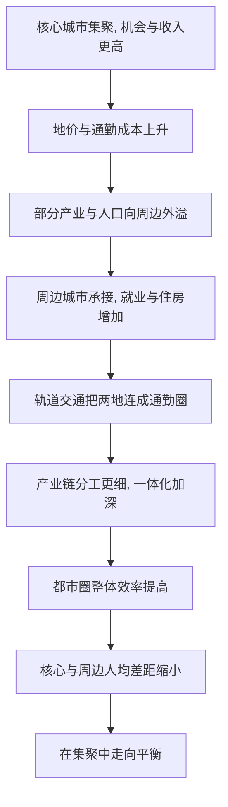

# 14｜一个更平衡的中国，应该是什么样子？

> 如果把陆铭的思路走到头，中国会变成什么样？

---

## 一、先说结论

陆铭描绘的是一个“更大，也更平衡”的中国。

一方面，人口会继续向条件最好的地方集聚，在长三角、珠三角、京津冀等区域形成若干世界级都市圈；另一方面，通过户籍放开与转移支付，让不同地区的人均收入和基本公共服务逐步趋同。

关键在于，这种平衡不是把产业平均摊到每一块土地上，而是靠“人自由流动 + 财政再分配”来实现。**总量可以不均，人均可以趋同；城市可以更大，差距却可以更小。**

## 二、我们先理解一个问题

请想象两张中国地图。

第一张是人口密度图：东部沿海一片明亮，内陆不少地方暗淡。第二张是人均收入图：如果发展得足够平衡，这张图会相对均匀，各地的人均水平不会相差太远。

现在问自己一个问题：

> 我们想要的“平衡”，是哪一张图变均匀？

很多人的直觉，是让第一张图也变均匀——把人和产业均匀铺开，让每个地方都热闹。但陆铭提醒我们，真正的平衡应该看第二张图：**重要的不是“每个地方产出多少”，而是“每个地方的人，能过上什么样的生活”。**

一旦把标准从“地的平衡”换成“人的平衡”，思路就完全不同了。人不必均匀分布，但人的收入与公共服务可以走向接近。

## 三、作者到底提出了什么观点？

陆铭的核心主张，是那句反复出现的判断：**在集聚中走向平衡。**

它的逻辑是：让劳动力自由流向收入更高的地方，人少了的地方，人均资源反而更宽裕；人多了的地方，集聚又带来更高效率。于是，虽然总量差距可能依然存在，但人均差距会逐步缩小。再用转移支付保障基本公共服务，让留在原地的人不至于“被落下”。

至于集聚的形态，他指向的是**都市圈**——由一个核心大城市，加上周边一批中小城市，通过轨道交通、产业链和通勤联系，连成一个功能上的一体。

他特别强调：这不是“大城吃掉小城”，而是“大城带动小城”。核心城市提供研发、金融、总部与高端服务，周边城市承接制造、物流与居住，彼此分工、互相补位。**都市圈越大，内部的分工反而越细，能容纳的角色也越多。**

## 四、把这个观点翻译成人话

看长三角就很好理解。

上海做金融、总部、研发和高端服务；苏州、无锡、宁波等地做制造与配套；昆山、嘉兴、南通这样的城市，承接一部分产业和居住功能。有人住在昆山、去上海上班；一个产品的零件，可能在上海设计、在苏州加工、在宁波组装。

再看珠三角。深圳做研发与创新，东莞做制造，惠州、中山等地承担居住与配套。广州与佛山之间，早已是同城化的通勤关系。人们在这些城市之间穿梭，边界越来越像是行政上的，而不是生活上的。

这就是都市圈的实质：**它不是把城市摊得更大，而是让一群城市像一座城市那样高效运转。** 对个人来说，这意味着选择的半径变大了——工作机会在核心城市，生活成本却可以在周边城市兑现。

## 五、为什么会这样？

都市圈是怎么长出来的：

关键在于 **B → C → D** 这一段。

如果只有核心城市在长，周边不动，就会走向极端：核心城市房价畸高、通勤漫长，而周边被“虹吸”成空。但当价格与成本把一部分功能自然推到周边，轨道交通又把两地紧密连起来时，外溢就会发生。**集聚不是平衡的对立面，而是通往更高水平平衡的路径。** 前提是，流动要顺畅、连接要到位。

## 六、举一个现实生活中的例子

长三角与珠三角的都市圈，就是这套逻辑的现实样本。

在长三角，高铁与城际铁路把上海、南京、杭州、苏州、合肥等城市串成一张网。早上在这座城市开会，中午到那座城市见客户，傍晚回到另一座城市的家里，已经不算稀奇。产业也随之分工：研发集中在核心城市，制造与配套分布在周边，物流沿交通干线铺开。

在珠三角，深莞惠、广佛肇之间的联系同样紧密。很多人在深圳工作、在东莞或惠州生活，靠通勤和轨道交通把两座城市“缝”在一起。

这些地方的共同点是：**人没有被强行安排在固定的位置，而是顺着机会和成本，在城市之间自由流动。** 结果并不是所有城市一样大，而是同一片区域里的城市，人均生活水平的差距，比很多人想象的要小。

这正是一个更平衡的中国最可能的样子：不是每个县都有产业园，而是每个人都能通向一个更好的都市圈。

## 七、回到书中重新理解

走到这里，全书其实形成了一个闭环。

一开始，我们从“集聚效应”出发，理解城市为什么会变大——共享、匹配、学习，让同样一个人在大城市能创造更高的价值。中间几篇，我们看清了户籍、土地与种种误解，如何让人无法顺畅流向机会。到最后这一篇，答案回到了最初的那个概念，却不是简单地“回到原点”。

**集聚不是要被纠正的偏差，而是被制度挡住的一种可能。** 当流动被放开、土地与财政跟随人口、都市圈把城市连成网络，集聚带来的效率，才可能真正转化为更多人的福祉。所谓“在集聚中走向平衡”，说的正是这样一条路：让城市更大，同时让人均差距更小。

## 八、这个观点背后还有什么？

**第一，都市圈需要制度支撑。** 社保互通、户籍互认、跨省协调、轨道交通的共建共管，缺一样，都市圈就只是地图上的圈。

**第二，留在非都市圈的地区同样重要。** 农业区、生态功能区、边疆地区承担着粮食安全、生态屏障等不可替代的功能，不能只用经济效率衡量，需要转移支付与公共服务来保障。

**第三，平衡是过程，不是一步到位的状态。** 人均趋同可能需要很长时间，政策的作用是让这条路更顺、更稳。

**第四，它把“公平”重新定义了一次。** 公平不再是每个地方一样热闹，而是每个人都能获得接近的机会与保障。

## 九、这个观点有问题吗？

需要一些平衡。

**第一，都市圈会不会变成“虹吸”？** 一些经济学者担心，核心城市可能吸走周边的人才与资源，让周边沦为“睡城”或空心化。关于这一问题，学界存在不同解释，结果往往取决于交通、产业与公共服务的具体配套。

**第二，转移支付能否长期支撑基本公共服务均等化，存在争议。** 财力从哪里来、如何分配、会不会养懒，都有不同看法。

**第三，人均趋同的速度与程度，学界并无定论。** 有人乐观，也有人认为地理条件、产业基础造成的差距会长期存在。

**第四，但方向性判断值得重视。** 与其让每个地方都去争抢同样的产业，不如承认分工，把力气用在流动、连接与再分配上。**“更大也更平衡”，至少提供了一种比“处处均衡”更现实的想象。**

## 十、今天再看这个观点

以下部分是基于陆铭思想的现代延伸，不是他书里的原话。

今天，高铁与城际网络正在把越来越多的城市纳入“一小时圈”“两小时圈”，长三角一体化、粤港澳大湾区等区域战略，也在推动跨城协调与制度衔接。户籍方面，城区常住人口较少的城市，落户门槛已明显放宽，超大城市的积分落户也在持续调整。

这些变化并没有证明陆铭的每一句话都实现了，但它们的方向，与“让人流动、让城市连成圈”是一致的。真正考验还在后面：社保与公共服务能否跨城顺畅，土地与财政能否跟上人口，都市圈内部的利益能否协调。**一个更平衡的中国，不会因为画了几条轨道就自动到来，它需要制度一寸一寸地让路。**

## 十一、这一篇真正应该记住什么？

1. **平衡的标准是“人”，不是“地”。** 总量可以不均，人均可以趋同。
2. **都市圈是集聚的高级形态。** 一群城市像一座城市那样分工、通勤、运转。
3. **大城带动小城，而非吃掉小城。** 分工越细，能容纳的角色越多。
4. **制度配套决定成败。** 社保互通、户籍互认、跨省协调、轨道交通缺一不可。
5. **非都市圈地区也需被看见。** 粮食、生态、边疆的价值，不能只用效率衡量。

## 十二、留一个问题

> 如果未来大多数中国人都将生活在若干都市圈里，
> 那么你希望自己所在的地方，
> 是那个“被连进网”的节点，还是那个只在旁边看的人？

---

**收束全系列**

到这里，这个系列走完了一整条路。

我们从“为什么大城市会越来越大”开始，看清了集聚效应——共享、匹配、学习，让城市本身就是一种生产力。接着讨论规模由什么决定、人口流入是负担还是财富、什么才叫真正的平衡；再进入户籍、流动与土地这些制度约束，破解拥堵、房价与差距的种种误解；最后落到市场定价、土地财政与都市圈这些出路。

全书真正想说的，其实只有一句：**人往高处走，不是问题，挡住人往高处走，才是问题。**

但这句话并不意味着标准答案已经写好。集聚的收益有多大、代价有多重，平衡该多快到来，谁该为此买单——这些问题，学界仍在争论，现实也仍在摸索。陆铭给出的，是一套逻辑，而不是一张施工图。

所以，真正重要的不是记住他的结论，而是学会他看问题的方式：先问“规律是什么”，再问“制度挡住了什么”，最后问“怎样的安排，能让更多人以更小的代价，过上更好的生活”。

把这个框架留在心里，你就能自己回答，那个最初的问题——**一个更大、也更平衡的中国，究竟应该是什么样子。**
