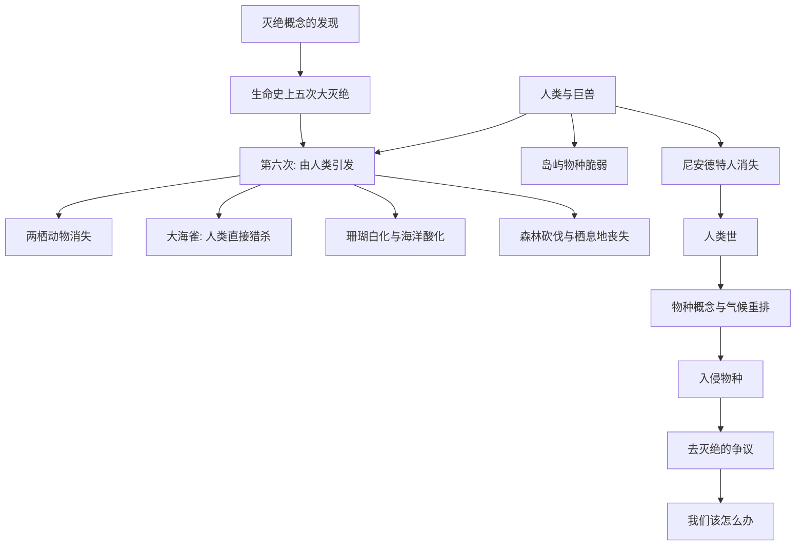

# 《大灭绝时代》深度解读系列

## 系列简介

《大灭绝时代》是科学记者伊丽莎白·科尔伯特的普利策奖作品。它讲的事情听起来像灾难片，却是一件正在发生的科学事实：**人类正在引发地球史上的第六次大灭绝。**

科尔伯特没有停留在"地球很危险"的口号上。她背起行囊，去到金蛙消失的巴拿马、珊瑚变白的澳洲海面、最后的巨兽化石遗址，用一种近乎侦探的写法，把"物种正在消失"这句话拆成一个个具体、可触摸的故事。

她也补上了必要的历史：灭绝这个概念本身，是人类花了几十年才敢承认的；而生命史上已经发生过五次大灭绝，每一次都改写了地球。现在，第六次可能正在我们眼前发生——而这一次的推手，是我们自己。

这本书不是绝望之书，而是一本**清醒之书**：它要你看清代价，然后自己决定该做什么。本系列围绕 **16 个核心问题**，从"灭绝"概念的诞生，讲到青蛙、大海雀、珊瑚、巨兽，再回到人类世与我们的选择。

---

## 全书核心问题

| 层次 | 问题 |
|---|---|
| 概念问题 | "灭绝"这个概念是怎么被发现的？什么是第六次大灭绝？ |
| 现象问题 | 青蛙、大海雀、珊瑚、森林正在经历什么？ |
| 历史问题 | 大型动物、岛屿物种、尼安德特人为何消失在人类身边？ |
| 机制问题 | 物种是什么？气候、入侵物种、去灭绝意味着什么？ |
| 选择问题 | 面对第六次大灭绝，人类能做什么、该做什么？ |

---

## 全书知识地图



---

## 全系列目录

### 第一部分：灭绝是什么

#### 01｜“灭绝”这个概念是怎么被发现的？

核心问题：今天我们习以为常的"物种会灭绝"，为什么曾经是一个近乎不可想象的观念？

核心观点：在居维叶用猛犸象化石证明"有些物种已经永远消失"之前，人们普遍相信物种是固定的、不会灭绝的。承认灭绝，等于承认地球有过"失去"，这在当时是思想上的巨大突破。科尔伯特从这里讲起，提醒我们："灭绝"本身是人类认知的一次革命。

理解难度：★★★☆☆

关键词：居维叶、猛犸象、物种固定、认知革命

---

#### 02｜生命史上发生过哪五次大灭绝？

核心问题：地球历史上最严重的几次灭绝，究竟有多严重？

核心观点：生命史上有五次公认的大灭绝，其中最严重的一次带走了海洋中绝大多数物种。每次灭绝都清空了生态位，改写了随后的生命格局。了解它们，才能理解"第六次"意味着什么尺度的事件。

理解难度：★★★☆☆

关键词：五次大灭绝、二叠纪、白垩纪、生态位

---

#### 03｜什么是“第六次大灭绝”？

核心问题：为什么科学家说，我们正处在一场新的大灭绝之中？

核心观点：当前物种的灭绝速率远高于地质记录中的"背景速率"，而原因与人类活动高度相关：栖息地破坏、气候变化、污染、过度捕猎、物种入侵。科尔伯特的核心判断是：这可能是地球史上第一次由单一物种（人类）引发的灭绝事件。

理解难度：★★★★☆

关键词：第六次大灭绝、背景速率、人类活动、争议

---

### 第二部分：正在消失的生命

#### 04｜青蛙为什么在全球消失？

核心问题：两栖动物为什么成了最先倒下的群体？

核心观点：蛙类皮肤多孔、依赖水陆两栖，对环境变化极其敏感，因此成为"矿工的金丝雀"。巴拿马金蛙在真菌（蛙壶菌）侵袭下迅速消失，是全书最令人不安的现场之一——也是一种提醒：灭绝往往安静、迅速、无声无息。

理解难度：★★★★☆

关键词：两栖动物、蛙壶菌、环境敏感、指示物种

---

#### 05｜大海雀之死：人类是怎样直接抹掉一个物种的？

核心问题：在没有工业、没有污染的时代，人类也能让一个物种彻底消失吗？

核心观点：大海雀是一种不会飞的海鸟，因人类的过度捕猎（取肉、取羽毛）在 19 世纪彻底灭绝。它是"人类直接猎杀导致灭绝"的标志性案例，说明灭绝并不总需要宏大灾难——只需要持续、无节制的索取。

理解难度：★★★☆☆

关键词：大海雀、过度捕猎、直接灭绝

---

#### 06｜珊瑚礁为什么在变白？

核心问题：海里的珊瑚为什么会大面积"白化"？

核心观点：海洋吸收了大量人类排放的二氧化碳，导致海水酸化、温度升高，珊瑚与共生藻的关系统于崩溃，于是出现"白化"。珊瑚礁养活着海洋中极高比例的生物，它的退化会引发连锁性的生态崩溃。这是气候变化最直观的现场之一。

理解难度：★★★★☆

关键词：珊瑚白化、海洋酸化、二氧化碳、连锁效应

---

#### 07｜森林被砍掉之后，物种去了哪里？

核心问题：栖息地丧失，为什么是生物多样性最大的威胁？

核心观点：森林被切割成碎片后，物种不仅失去家园，还因种群被隔离而难以繁衍、更容易灭绝。亚马逊等地的砍伐，把连绵的生态变成了"孤岛"。科尔伯特提醒：**栖息地丧失，是当前物种消失的首要推手。**

理解难度：★★★☆☆

关键词：栖息地丧失、森林碎片化、亚马逊、孤岛

---

### 第三部分：人类与巨兽

#### 08｜为什么大型动物最先消失？

核心问题：为什么猛犸象、剑齿虎这类"巨兽"，总是最先从人类身边消失？

核心观点：大型动物繁殖慢、数量少、目标大，极易被猎杀，也难以在栖息地破碎中恢复。人类扩散到哪里，巨兽往往就消失到哪里。这构成了一条令人不安的规律：**我们的祖先走到哪里，哪里的大动物就倒下。**

理解难度：★★★★☆

关键词：巨兽、过度猎杀、繁殖速度、人类扩散

---

#### 09｜岛屿上的物种为什么格外脆弱？

核心问题：为什么灭绝最容易发生在岛屿上？

核心观点：岛屿物种长期在与世隔绝的环境里演化，往往缺乏对天敌和竞争者的防御能力。一旦人类或外来物种登岛，它们几乎毫无招架之力——渡渡鸟就是经典案例。这解释了为什么岛屿是灭绝的高发区。

理解难度：★★★☆☆

关键词：岛屿、渡渡鸟、入侵、脆弱性

---

#### 10｜尼安德特人是怎么消失的？

核心问题：作为人类的"近亲"，尼安德特人为什么会消失？

核心观点：尼安德特人曾遍布欧亚，却在大约几万年前消失。最可能的原因，是与智人的竞争、杂交与人口压力共同作用——他们并非"低等"，而是被一场更复杂的人类迁徙与竞争所淹没。这是"人类也在被生态规律塑造"的最贴近的例子。

理解难度：★★★★☆

关键词：尼安德特人、智人、竞争、杂交、争议

---

#### 11｜人类是从什么时候开始改变地球的？

核心问题：人类对地球的影响，是从工业革命才开始吗？

核心观点：科尔伯特引入"人类世"的概念：人类对地球的影响早已开始——从大型动物的减少，到森林砍伐，再到核沉降物与塑料颗粒留在岩层中。有学者主张，人类已经构成了一个地质学意义上的"新时代"。这个概念本身，争议与含义同样重大。

理解难度：★★★★★

关键词：人类世、地质学、塑料、核沉降物、争议

---

### 第四部分：机制与科学

#### 12｜物种到底是什么？

核心问题：我们说要"保护物种"，可"物种"到底是什么？

核心观点：物种看似直观，实则边界模糊：有生殖隔离的、有形态相似的、也有杂交频繁的。科尔伯特借此说明：保护生物多样性，其实是在保护一套难以精确划分、却真实存在的生命秩序。模糊的边界，让保护工作更复杂。

理解难度：★★★★☆

关键词：物种、生殖隔离、边界模糊、保护

---

#### 13｜气候变暖会如何重排生命？

核心问题：升温一两度，为什么对生命是巨大的冲击？

核心观点：许多物种的生存依赖特定的温度与季节节奏。气候变暖迫使它们向高纬度、高海拔迁移；迁移不及、或无处可去的物种就会消亡。更棘手的是，物种之间的节奏被打乱（如花开早于昆虫孵化），整张生态网都会被扯松。

理解难度：★★★★☆

关键词：气候变暖、物种迁移、物候错配、生态网

---

#### 14｜入侵物种为什么如此致命？

核心问题：一个"外来物种"，为什么能摧毁一个生态系统？

核心观点：在本地共同演化的物种之间，往往存在平衡；外来物种进入新环境后，缺少天敌与制约，可能迅速繁殖、挤压本地物种。关岛的棕树蛇、澳洲的兔子都是典型案例。人类的活动（航运、贸易、旅行）让"入侵"变得前所未有的频繁。

理解难度：★★★☆☆

关键词：入侵物种、生态失衡、人类活动、案例

---

#### 15｜“去灭绝”能救回失去的物种吗？

核心问题：技术能不能把已经灭绝的物种"复活"？

核心观点：随着基因技术发展，"去灭绝"（de-extinction）从科幻走向讨论：借助冻存组织与近缘物种，理论上或可"复刻"某些灭绝生物。但科尔伯特提醒：复活的个体缺乏栖息地、也缺乏生态位，它是一场关于科学能力与伦理边界的辩论，而非简单的救赎。

理解难度：★★★★★

关键词：去灭绝、基因技术、伦理、栖息地、争议

---

### 第五部分：我们与未来

#### 16｜面对第六次大灭绝，我们该怎么办？

核心问题：看清了代价之后，人类究竟还有没有选择？

核心观点：科尔伯特不给出廉价的希望，也不陷入绝望。她指出：物种的消失往往是缓慢、可逆程度不同的过程——有些一旦失去就永远失去，有些损失则可以通过保护、修复与减缓而减少。真正的问题是：**我们愿不愿意为"看得见的利益"之外的、看不见的代价买单。**

理解难度：★★★★☆

关键词：保护、减缓、选择、代价、清醒

---

## 推荐阅读顺序

**主线顺序（推荐）：01 → 16。**

```text
第一段｜概念（01–03）   灭绝的发现 → 五次大灭绝 → 第六次
第二段｜现象（04–07）   青蛙 → 大海雀 → 珊瑚 → 森林
第三段｜历史（08–11）   巨兽 → 岛屿 → 尼安德特人 → 人类世
第四段｜机制（12–15）   物种 → 气候 → 入侵物种 → 去灭绝
第五段｜未来（16）      我们该怎么办
```

**阅读建议：**

- **想先抓住骨架**：读 01、03、04、08、11、16 六篇。
- **关心气候变化**：读 06、13、11。
- **对"人类做了什么"感兴趣**：读 05、08、09、10。
- **想练习批判性阅读**：重点看 03、11、15 三篇（争议最集中）。

---

## 全系列状态

> 本系列共 16 篇，正文生成中。
