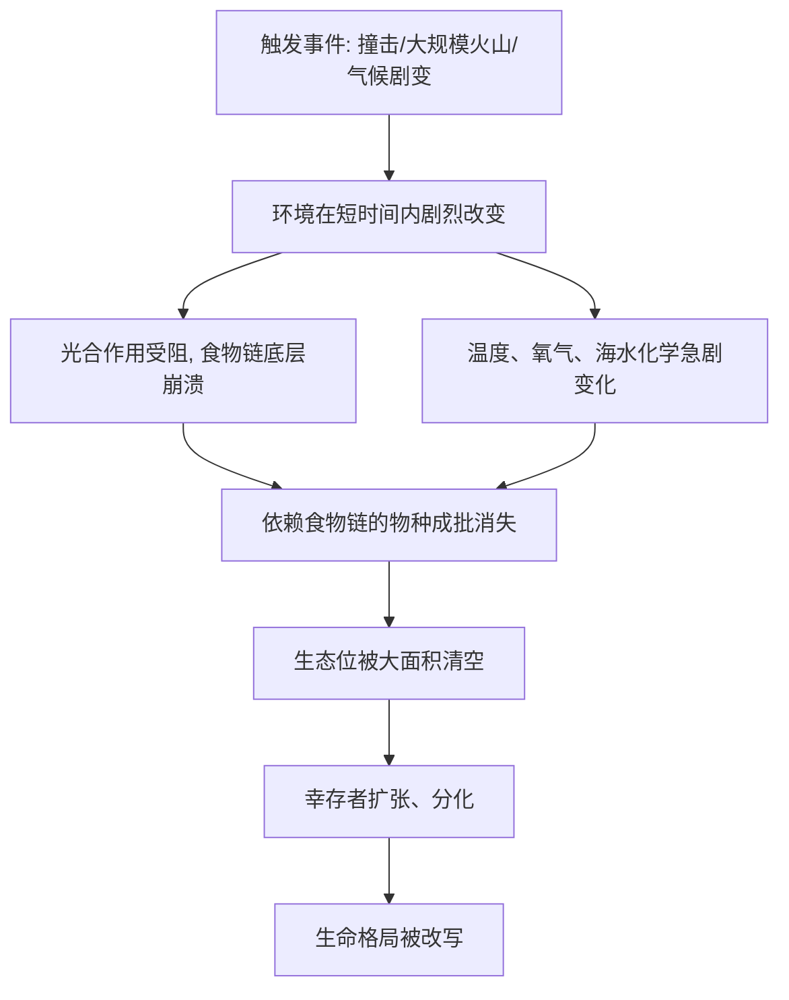

# 02｜生命史上发生过哪五次大灭绝？

> 地球历史上最严重的几次灭绝，究竟有多严重？

---

## 一、先说结论

科尔伯特在书里花了不少篇幅回望生命史，不是为了怀旧，而是为了给出一个尺度。

结论很清楚：**大灭绝不是意外，而是地球生命的常态之一。** 研究显示，在过去的约五亿年里，至少有五次事件在相对短的地质时间内，带走了全球大部分物种。其中一次尤其惨烈，据估计海洋中绝大多数物种都没能活下来。

理解这五次，不是为了吓人，而是为了回答一个朴素的问题：**我们现在说的“第六次”，到底是一个多大的量级？** 没有这个参照系，“第六次大灭绝”只是一句口号；有了它，才知道这句话有多重。

---

## 二、我们先理解一个问题

先想一个反常识的点：

> 灭绝，并不是“个别物种运气不好”，而是可以同时、成批地发生。

人们习惯把灭绝想成一种缓慢的背景事件——某一种鸟不再出现，某一种花再也找不到。但地质记录显示，历史上存在一些时期，物种消失的速度远远超过平常，而且是跨类群、跨海洋与陆地的同时衰退。

于是问题来了：

> 如果生命曾经多次在短时间内大面积消失，那么，是什么能让整个系统同时崩塌？

这就是“大灭绝”（mass extinction）这个概念要处理的事。它问的不是“某物种为什么消失”，而是“为什么很多物种在同一时间一起消失”。

---

## 三、作者到底提出了什么观点？

科尔伯特梳理古生物学界的共识，提出了几个要点：

1. **大灭绝是真实的、可辨认的事件。** 通过对地层中化石的统计，科学家能识别出物种消失速率异常升高的时段。
2. **五次公认的大灭绝各有不同的凶手。** 有的与小行星撞击相关，有的与大规模火山活动、海洋缺氧、气候剧变相关，原因并不单一。
3. **灭绝之后是“重塑”。** 每次大灭绝都清空了大量生态位，幸存的类群得以扩张、分化，改写随后的生命格局。恐龙消失后，哺乳动物的兴起就是最常被提到的例子。
4. **尺度感是关键。** 科尔伯特借这些事件提醒读者：大灭绝意味着生态系统的整体重组，而不只是“少了几种生物”。

她的用意在于建立一个参照：**只有知道历史上“最坏”能坏到什么程度，才能判断当下的变化处在什么位置。**

---

## 四、把这个观点翻译成人话

可以把生态系统想象成一座城市。

平常的物种消失，像是城市里偶尔关掉一家店铺——街还在，人还住着，生活照常。而大灭绝，则像是整片城区同时停摆：供电、供水、交通、供应链一起失灵，大部分居民无法维持生活。

关键在于：**它不是“很多家店同时倒闭”这么简单，而是让“开店这件事本身”都变得困难。**

科尔伯特想说的就是这个：大灭绝不是把物种一个个减掉，而是把维系生命的整套条件——温度、氧气、食物链、栖息地——一起推到临界点之外。

理解了这一点，才会明白为什么“第六次”这个词分量这么重：它描述的不是“某些动物变少了”，而是**整个生命支持系统可能被推离原来的稳定状态。**

---

## 五、为什么会这样？

为什么一次事件能同时击倒这么多物种？可以用一张图来梳理。

关键在 B → C/D → E 这一串连锁。

大灭绝之所以“大”，不在于灭种的刀有多快，而在于**它打击的是共同的基础设施**。当底层生产者和环境条件一起崩塌，依赖它们的物种无论大小、无论海陆，都会同时受到挤压。

所以历史上那些最惨烈的灭绝，往往不是“某个物种被针对”，而是**整个系统被推过了一个阈值。**

---

## 六、举一个现实生活中的例子

最著名、也最容易被记住的一次，是白垩纪末的那场灾难。

研究显示，大约六千六百万年前，一颗巨大的小行星撞击了今天的墨西哥尤卡坦半岛附近，留下了一个巨大的撞击坑。撞击之后，尘埃与气溶胶遮蔽天空，阳光被削弱，全球气温骤降，植物光合作用受挫，食物链从底层开始断裂。

结果是众所周知的：**非鸟恐龙、以及海洋中的大量生物，在这一事件中消失了。** 而鸟类、哺乳动物等幸存者，则在此后的生态真空中迅速扩张。

这个案例之所以成为“大灭绝”的代言人，恰恰因为它把上面那张逻辑图画得很清楚：一个外来的、突如其来的触发事件，通过环境与食物链的连锁反应，造成了全球性的、跨类群的消失。

顺带一提，我们如此熟悉恐龙，很大程度上正因为它们“消失得足够显眼”——这本身也提醒我们：如果一次灭绝没有留下这么大的化石痕迹，我们未必看得见它。

---

## 七、回到书中重新理解

现在再回看科尔伯特为什么要先讲这五次，就顺了。

她不是在做一部古生物通史，而是在给“第六次大灭绝”找一个可比较的标尺。**如果说大灭绝是一种曾多次发生、能被地层记录下来的事件，那么，我们就有理由追问：现在有没有正在发生一次？**

这个追问在逻辑上很有力：它把“灭绝”从遥远的历史，拉回到“是否正在进行”的当下。

但也要注意科尔伯特的分寸：她引用这五次，是为了说明“大灭绝这种量级的事件确实存在”，而不是简单地说“现在和六千六百万年前一样”。尺度相似，机制未必相同——历史那几次多由自然触发，而这一次的推手，可能是单一物种，也就是我们。

所以这一段真正建立的，是**量级的参照，而不是结论的类比。**

---

## 八、这个观点背后还有什么？

**第一，它揭示了灭绝的“非随机性”。** 大灭绝并非随机抽走物种，而是系统性地打击某些类型，比如依赖特定环境、在食物链中位置脆弱者。

**第二，它说明“恢复”需要极长时间。** 研究显示，大灭绝后的生态系统重建，往往要经历数百万年。

**第三，它把地质时间引入了日常认知。** 人类的寿命与注意力只有几十年，而大灭绝是在几十万到几百万年尺度上展开的，这本身构成理解上的困难。

**第四，它给“第六次”提供了一个可检验的框架。** 如果当前速率真的接近大灭绝的量级，理论上应该能在地层与观测数据中找到对应的证据——这正是后面几篇要处理的问题。

---

## 九、这个观点有问题吗？

关于大灭绝的研究，整体证据相当扎实，但仍有一些需要谨慎的地方。

**第一，五次大灭绝的“边界”并非毫无分歧。** 哪几次算、哪几次不算、某些事件的强度如何排序，学界一直有讨论，关于这一问题，学界存在不同解释。

**第二，灭绝速率与成因的估计依赖模型与化石记录。** 化石本身是不完整的，统计方法与时间校准都会影响结论，不同研究给出的数字有时差别不小。

**第三，把历史大灭绝与当下的变化直接类比，需要格外小心。** 触发机制不同（自然事件与人类活动），时间尺度也不同，类比只能用于建立量级感，不能当成预测。

**第四，古生物学的核心结论仍然是稳固的。** 大灭绝确实发生过、确实能改写生命格局，这一点争议很小。

**所以更准确的说法是**：五次大灭绝是理解“第六次”的重要参照系，但它们是参照，不是模板；个别数字与排序可以争，量级感不能丢。

---

## 十、今天再看这个观点

以下部分是基于本书思想的现代延伸，不是科尔伯特的原话。

今天，古生物学与地球系统科学已经把这五次事件研究得越来越细：撞击坑、火山地层、碳同位素异常、海洋缺氧的证据，都被逐层拼合。这些研究带来的一个副产品是：**我们比历史上任何时候都更清楚“大灭绝长什么样”。**

这恰恰是当下的意义所在。过去的人没有参照系，所以可能错过迹象；而我们有了。据估计，当前物种消失的速率明显高于地质记录中的背景水平——这个判断是否已经达到“大灭绝”的等级，还有争论（下一篇会详细谈），但“我们正在改变生命史的轨迹”这句话，已经不再需要类比来支撑。

所以这一篇的现代意义是：**知道历史曾经发生过什么，本身就是一种能力——一种让我们不至于在事情发生时毫无察觉的能力。**

---

## 十一、这一篇真正应该记住什么？

1. **大灭绝是真实发生过的、可辨认的事件。** 它不是个别物种倒霉，而是系统的整体崩塌。
2. **历史上公认的大灭绝有五次，机制各不相同。** 撞击、火山、气候剧变等都可能触发。
3. **大灭绝打击的是共同的环境与食物链。** 所以才能同时、跨类群地清空生态位。
4. **白垩纪末的撞击，是最清楚的“大灭绝”样板。** 它把触发、连锁、消失的路径展示得明明白白。
5. **五次大灭绝是量级参照，不是简单类比。** 历史由自然触发，现在可能由人类推动。

---

## 十二、留一个问题

> 如果生命史上真的发生过五次系统性的崩塌，
> 而且每一次都留下了可辨认的地层痕迹，
> 那么，正在发生的变化，会不会也在未来的岩层里留下同样的签名？

---

**下一篇**：既然大灭绝有先例、有尺度，那么问题就来了：我们此刻是不是正处在“第六次”之中？科学家凭什么这么说，又凭什么被质疑？

下一篇我们就来拆开这个问题——**什么是“第六次大灭绝”**。
