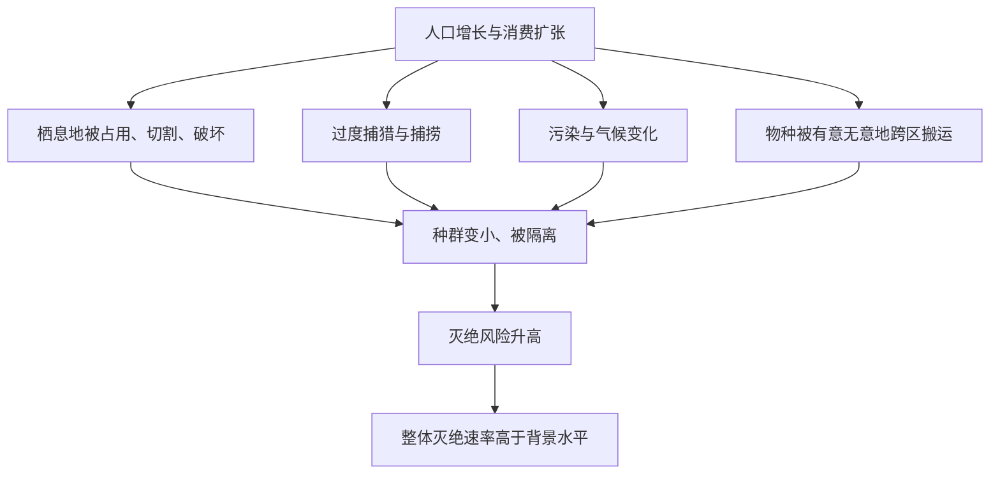

# 03｜什么是“第六次大灭绝”？

> 为什么科学家说，我们正处在一场新的大灭绝之中？

---

## 一、先说结论

科尔伯特的核心判断很明确：**地球可能正在经历第六次大灭绝，而这一次的推手，是人类自己。**

支撑这个判断的关键，是一个量的比较：研究显示，当前的物种灭绝速率，明显高于地质记录中长期存在的“背景速率”。所谓背景速率，就是没有特别灾难时，物种自然消失的平均速度。

如果这个估计成立，那么问题就不只是“某些动物在减少”，而是**物种消失的速度本身被按下了快进键。**

但科尔伯特没有把它说成一个已经结案的结论。她清楚地知道，这个判断依赖若干估计与模型，也仍然处在科学争论之中——这正是这一篇要仔细处理的地方。

---

## 二、我们先理解一个问题

先理解一个词：

> 背景速率（background rate）。

它是物种灭绝的“日常水平”。在没有大灾难的时期，也会有个别物种因为竞争、环境变化、偶然因素而消失，但速度很慢，通常远低于新物种形成的速度。

而“大灭绝”，指的是**灭绝速率在短时间内远超这个日常水平。**

所以，“第六次大灭绝”这个说法其实包含两个需要分别验证的部分：

1. **现在的灭绝速率，是不是真的远高于背景速率？**
2. **如果高，原因是不是人类活动？**

第一个是量的问题，第二个是归因的问题。两者都不能靠感觉，只能靠数据。而数据本身，恰恰是争论最集中的地方。

---

## 三、作者到底提出了什么观点？

科尔伯特在书里综合了多位科学家的研究，提出以下几层判断：

1. **物种正在以高于背景速率的速度消失。** 她引用的是不同研究者对灭绝速率的估计，这些估计往往以“每年每百万物种消失多少种”之类的比率来表达。
2. **人类活动是最可能的共同原因。** 栖息地破坏、气候变化、污染、过度捕猎、物种入侵，这些压力同时作用，且都与人类有关。
3. **这可能是第一次由单一物种引发的灭绝事件。** 历史上的大灭绝多由自然因素触发，而这次的主导者，是我们。
4. **它仍是一个科学判断，而非定论。** 科尔伯特在书中对这种不确定性保持诚实，既不轻描淡写，也不把估计当成已证明的事实。

她的用意在于：**把“第六次”从一个耸动的说法，变成一个可以被检验的科学命题。**

---

## 四、把这个观点翻译成人话

可以把物种的消失，想象成一家医院的病床数。

平时，总有人因为各种原因离开病房，也有新的人住进来，出入基本平衡——这就是“背景”。而如果某天开始，离开的人数突然成倍增加，而新入院的人跟不上，那么无论具体数字是多少，**趋势本身就是一个警报。**

科学家讨论“第六次大灭绝”，本质上就是在算这笔账：**消失的速度，是不是已经明显超过了补充的速度？**

科尔伯特的态度可以概括为一句话：**数字可以争，方向很难争。** 具体速率还有不确定性，但“人类正在把物种消失的速度推高”，这个判断的证据已经相当多。

关键在于：大灭绝不是一夜之间发生的，它是“速度”的问题。**慢，也不代表不会到达终点。**

---

## 五、为什么会这样？

人类活动为什么能同时抬高灭绝速率？可以这样理解。

关键在 A → B/C/D/E → F 这一批同时发生的压力。

单独任何一种压力，物种往往还能扛；但它们**叠加在一起**，作用就成倍放大：栖息地被切碎后种群本已变小，再加上气候变化与外来物种，恢复能力就被抽空了。

所以“第六次”不是某一个坏动作造成的，而是**一整套现代化生活方式，从多个方向同时施压的结果。**

---

## 六、举一个现实生活中的例子

最能说明问题的，不是某一种动物，而是一个比率。

研究显示，当前物种的灭绝速率，被不少研究者估计为背景速率的数十倍到数百倍不等。这个比较之所以关键，是因为它把“灭绝”从一个情绪性的词，变成了一个可测量的量。

它的含义很直接：**如果说过去的物种消失像涓涓细流，那么现在更像被拧开的水龙头。**

但这里必须紧接着说明：这个估计存在明显的不确定性。原因包括——我们并不知道地球上到底有多少物种，很多还没被命名；可靠记录只有短短几百年，而地质记录的时间尺度是百万年，两组数据要放在一起比较，本身就需要大量假设和换算。

所以，关于当前速率究竟高多少倍、是否已经达到“大灭绝”的门槛，关于这一问题，学界存在不同解释。有的研究者认为已经进入大灭绝量级，也有研究者认为证据还不足以如此断言。

**这个例子的价值，恰恰在于它同时展示了“证据的方向”和“估计的不确定”。**

---

## 七、回到书中重新理解

现在再回看科尔伯特的写法，会更清楚她的位置。

她没有把“第六次大灭绝”写成一个已经盖章的宣判，而是写成**一个正在被科学界严肃讨论、并且证据不断累加的判断**。这也解释了为什么全书用大量篇幅写具体的物种与现场——因为抽象的数字容易被质疑，而具体的消失难以否认。

从这个角度看，全书的策略是：**用个案建立可信度，再用速率给出量级。**

而科尔伯特真正的立场，是一种克制的紧迫感：她既不认为“一切都还来得及、不必担心”，也不认为“已经无可挽回、做什么都没用”。她要读者面对的，是一个**既不确定、又值得行动的中间地带**——而这往往是人类最难处理的状态。

---

## 八、这个观点背后还有什么？

**第一，它把“灭绝”从事件变成了速率问题。** 关键不是某一物种是否消失，而是整体消失的速度是否异常。

**第二，它揭示了归因的难度。** “人类活动导致”是总体判断，但具体到某个物种，原因往往混合了多种因素。

**第三，它涉及“基线”的漂移。** 每一代人会把自己出生时的生态状态当作“正常”，于是损失被悄悄抹平——这在生态学上被称为基线漂移。

**第四，它把科学与价值判断绑在一起。** 就算确认了速率在升高，“要不要为此改变生活方式”仍是一个价值问题，不是数据能直接回答的。

---

## 九、这个观点有问题吗？

这一节尤其要慎重，因为“第六次大灭绝”是全系列争议最集中的判断之一。

**第一，速率估计的误差可能很大。** 物种总数的未知、记录时间的短暂、外推方法的差异，都会显著影响倍数估计。不同研究给出的数字可以相差几个数量级。

**第二，“第六次已经发生”与“正在发生”是不同强度的主张。** 前者需要证明灭绝已经达到大灭绝量级，后者只需要证明速率显著偏高。很多争论其实源于把这两者混为一谈。

**第三，关于这一问题，学界存在不同解释。** 有些科学家认为证据已足以称其为一次大灭绝；也有科学家认为，以目前的记录和方法，更稳妥的说法是“正在进入高风险阶段”或“灭绝速率显著升高”，而不是直接等同于历史上的五次。

**第四，归因有时被过度简化。** 把每个物种的消失都归到“人类”头上，可能掩盖了自然因素与具体机制的复杂性。

**第五，但核心方向仍有强证据。** 栖息地丧失、过度利用、气候变化等压力确实在推高灭绝风险，这一点争议很小。

**所以更准确的说法是**：科尔伯特的判断有坚实的方向性证据支撑，但“第六次大灭绝”作为一个已经被确认的结论，仍然需要更谨慎地表述——它是**强判断，不是定论**。

---

## 十、今天再看这个观点

以下部分是基于本书思想的现代延伸，不是科尔伯特的原话。

今天，围绕这一判断的讨论比成书时更细致了。研究者一方面在改进速率估计——用更完整的物种数据库、更长的监测记录、更严谨的统计模型；另一方面，也更强调区分“已经灭绝”与“正在衰退”，因为很多物种是在数量锐减、分布收缩的阶段，还没到正式宣告灭绝的那一步。

这种细化其实让画面更复杂，也更有说服力：**真正的危险，往往不在“最后一对个体死掉”的那一刻，而在之前漫长的、缓慢的下滑。**

所以在今天，这句判断的现代意义或许可以这样表述：重要的不是急着给它贴上“第六次”的标签，而是承认——**我们正在做的事情，正在改变物种消失的速度，而这个速度是可被测量、也理论上可被改变的。**

---

## 十一、这一篇真正应该记住什么？

1. **“第六次大灭绝”的核心，是一个速率判断。** 关键是消失速度是否远高于背景水平。
2. **方向性证据较强，具体倍数仍有争议。** 数字可以争，趋势不易否认。
3. **压力来自人类活动的多个方向叠加。** 栖息地、气候、污染、过度利用、入侵。
4. **这可能是第一次由单一物种引发的大灭绝。** 这正是它的特殊性。
5. **它是强判断，不是定论。** 保持诚实的不确定性，是理解它的前提。

---

## 十二、留一个问题

> 如果我们无法精确知道“现在到底比背景快多少倍”，
> 那么在证据还不完美的当下，
> 我们该等到数字更确定再行动，还是承认——等待本身也是一种选择？

---

**下一篇**：速率是抽象的，但消失是具体的。如果真有一场灭绝正在发生，它一定会在某些生命身上留下最清晰的痕迹——而最先倒下的，往往不是巨兽，而是最不起眼的青蛙。

下一篇我们就来拆开这个问题——**青蛙为什么在全球消失**。
