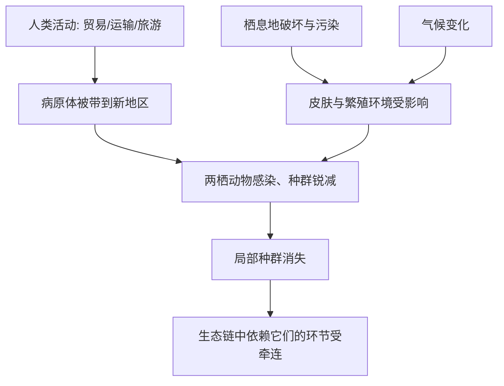

# 04｜青蛙为什么在全球消失？

> 两栖动物为什么成了最先倒下的群体？

---

## 一、先说结论

科尔伯特用一章专门写青蛙，是因为它们提供了一种特殊的证据。

结论是：**两栖动物正在全球范围内异常快速地消失，而它们恰恰是对环境最敏感的群体之一。** 研究显示，蛙类、蟾蜍、蝾螈等两栖动物的衰退，出现在世界许多彼此远离的地区，而且往往发生在看起来还很完好的栖息地里。

科尔伯特在巴拿马亲历了一种金蛙在真菌侵袭下迅速消失的过程。她借此告诉我们：**灭绝有时不是轰然发生的，它安静、迅速，甚至在你还没弄明白原因时就已完成。**

---

## 二、我们先理解一个问题

先想一个常识：

> 青蛙的皮肤，是“裸露”的。

它们不像鸟兽有毛、有羽、有厚皮，它们的皮肤是通透的，既用来呼吸，也用来调节水分和电解质。也就是说，**环境里的温度、湿度、污染物、病原体，几乎可以“直接”作用在它们身上。**

这带来一个耐人寻味的局面：

> 正因为它对环境如此敏感，它也就成了环境变化最早的“报信者”。

于是问题来了：**为什么偏偏是它们先出事？而它们的消失，又能告诉我们什么样的信息？**

---

## 三、作者到底提出了什么观点？

科尔伯特综合两栖动物学家的研究，提出几层判断：

1. **两栖动物正在全球性衰退。** 这不是某个地区、某个物种的偶发事件，而是在多个大陆同时出现的模式。
2. **它们的敏感性使其成为“指示物种”。** 皮肤通透、生活史跨越水陆、依赖特定温湿度，使它们比许多类群更早感受到环境压力。
3. **衰退的原因不止一个。** 栖息地丧失、污染、气候变化、紫外线、病原体，尤其是蛙壶菌，可能共同作用。
4. **疾病的扩散本身也常与人类活动有关。** 贸易、运输、迁移动辄把病原体带到原本不存在的地方。

科尔伯特的用意是：**用最脆弱的群体，去显示整个系统的应力。** 青蛙的问题，往往不是青蛙自己的问题。

---

## 四、把这个观点翻译成人话

可以把两栖动物想成矿井里的金丝雀。

过去矿工下井会带一只鸟。鸟先死，不是因为它最脆弱、最不重要，而是因为它**最先感知到有毒气体**。它用死亡，替所有人报了警。

青蛙在全球的消失，就是这个报警。**它们不是“碰巧倒霉的物种”，而是最早向整栋楼通风报信的邻居。**

科尔伯特关心的，从来不只是青蛙本身。她想说的是：如果连分布广、种类多的两栖动物都开始成片倒下，那么真正的问题，很可能不在它们身上，而在我们改变的环境上。

理解这一点很重要，因为它决定我们怎么读这些消息：**把青蛙的消失当作一个物种的悲剧，还是当作整个系统的预警？**

---

## 五、为什么会这样？

为什么两栖动物会同时受到这么多压力？可以这样梳理。

关键在 A → B 与 C/E → D 这两条线。

一条是**疾病的全球化**：蛙壶菌这类病原体，随人类活动扩散到原本没有它的地方，而当地两栖动物没有演化出抵抗力，于是成片感染。

另一条是**环境压力的叠加**：栖息地被破坏、水体被污染、温度与降水规律改变，都直接冲击它们裸露的皮肤和依赖水陆的生活史。

两条线汇到同一点——**抵抗力本就不高的群体，同时遭遇原本不该同时出现的压力。**

---

## 六、举一个现实生活中的例子

科尔伯特书中最令人难忘的现场之一，是巴拿马的金蛙。

巴拿马金蛙是一种颜色鲜艳、在当地颇为知名的蛙。研究显示，随着蛙壶菌（一种能感染两栖动物皮肤的真菌）扩散到该地区，金蛙种群迅速崩溃。这种真菌会侵害蛙的皮肤，干扰其呼吸与水分调节，最终导致死亡。

科尔伯特记录了研究者眼睁睁看着这一过程发生的心情：他们知道疾病正在逼近，却难以阻止；能做的，往往只是把少数个体转移到人工环境中，留下一个“备份”。

这个案例之所以刺痛人，有几个原因：

- **它发生在一片看起来还很完好的雨林里。** 没有烟囱，没有大片砍伐，灭绝却照样来了。
- **它来得非常快。** 不是几十年缓慢下滑，而是在不长的时间里种群急转直下。
- **它的推手里有我们。** 病原体的扩散，多与人类的运输和贸易有关。

**金蛙提醒我们：一个物种的终结，未必需要一场宏大的灾难，也可能只需要一种搭上人类便车的小小真菌。**

---

## 七、回到书中重新理解

现在再回看科尔伯特为什么把青蛙放在这么重要的位置，就顺了。

她要展示两件事：一是**灭绝可以非常安静**，没有巨响，没有新闻头条；二是**不同的物种，脆弱程度差别巨大**——前面讲的大海雀死于猎枪，而金蛙死于一种看不见的菌。

这两者合起来，构成了一个更完整的图景：大灭绝不是一个单一原因的故事，而是**许多性质不同、尺度不同、快慢不同的消失，同时在各个角落发生。**

所以青蛙这一篇真正的分量，不在“青蛙很可怜”，而在它证明了一件事：**即使在没有明显破坏的地方，生命也可能正在快速流失。** 这恰恰是最难被察觉、也最容易被忽视的一类损失。

---

## 八、这个观点背后还有什么？

**第一，它提出了“指示物种”的概念。** 某些生物的变化，可以提前反映整个系统的健康状态。

**第二，它揭示了病原体扩散与全球化的关联。** 贸易、旅行、运输让物种与疾病都被重新洗牌，这在人类史上从未如此频繁。

**第三，它说明“完整”未必等于“健康”。** 一片看上去完好的森林，内部可能已经发生了剧烈的种群衰退。

**第四，它把“看不见的推手”放回视野。** 大灭绝不只有猎枪和推土机，也可能是显微镜下才看得见的真菌与病毒。

---

## 九、这个观点有问题吗？

关于两栖动物衰退的总体判断，科学界有较强共识，但也有需要分辨的地方。

**第一，不同地区的衰退速度与主因并不一样。** 有的地方以栖息地丧失为主，有的以疾病为主，把它们归到一个统一原因下，可能过于整齐。

**第二，蛙壶菌的作用可能被高估或低估。** 关于它在具体案例中占多大权重、与其他压力如何交互，关于这一问题，学界存在不同解释。

**第三，把两栖动物简单当作“普查整个生态的仪表盘”需要谨慎。** 指示物种的逻辑很有用，但不同类群对环境变化的响应并不一致，不能一概而论。

**第四，同一物种的衰退，也未必都以灭绝收场。** 有些种群被转移、隔离或人工繁育，延缓了终结；这既是希望，也让“灭绝”的判定变得更复杂。

**所以更准确的说法是**：两栖动物的全球性衰退是扎实的观察事实，但把它归因于单一因素、或把它直接等同于“系统即将崩溃”的结论，需要更多证据与更细致的分辨。

---

## 十、今天再看这个观点

以下部分是基于本书思想的现代延伸，不是科尔伯特的原话。

今天，两栖动物仍然被当作监测环境的重要群体之一，相关的研究与保护行动也一直在进行。研究者一边继续追踪病原体的扩散路径，一边尝试用人工繁育、迁地保护、乃至针对疾病的干预手段，为濒危种群争取时间。

但更值得思考的，是这一篇教给我们的阅读方式：**当一种生物在你看不见的地方无声消失时，你凭什么相信环境还健康？**

现代的监测技术让这件事比过去透明了一些——声学监测、环境样本中的遗传物质分析，都能帮助人们更早发现种群的异常。技术变强了，但问题没变：**我们是否愿意把那些不显眼、不紧急的信号，认真当成信号？**

---

## 十一、这一篇真正应该记住什么？

1. **两栖动物正在全球范围内异常快速地消失。** 这是跨大陆的普遍模式，不是局部偶发。
2. **它们是对环境最敏感的群体之一。** 通透的皮肤和两栖生活史，使它们更早感应到压力。
3. **巴拿马金蛙的案例说明：灭绝可以安静而迅速。** 即使在没有明显破坏的地方。
4. **病原体的扩散往往有人类推手。** 贸易与运输让疾病也“全球化”了。
5. **脆弱的群体，常常是系统的预警。** 读懂它们，比哀叹它们更重要。

---

## 十二、留一个问题

> 如果一片看起来完好无损的雨林里，一种蛙已经悄悄消失，
> 那么，我们判断一个生态系统“健康”的标准，
> 究竟是基于它看起来怎样，还是基于它里面还活着什么？

---

**下一篇**：金蛙告诉我们，灭绝可以安静、可以没有凶手现身。但也有些物种的消失，是人们亲眼看着、亲手做成的——没有瘟疫，没有意外，只有一双手接着一双手。

下一篇我们就来拆开这个问题——**大海雀之死：人类是怎样抹掉一个物种的**。
