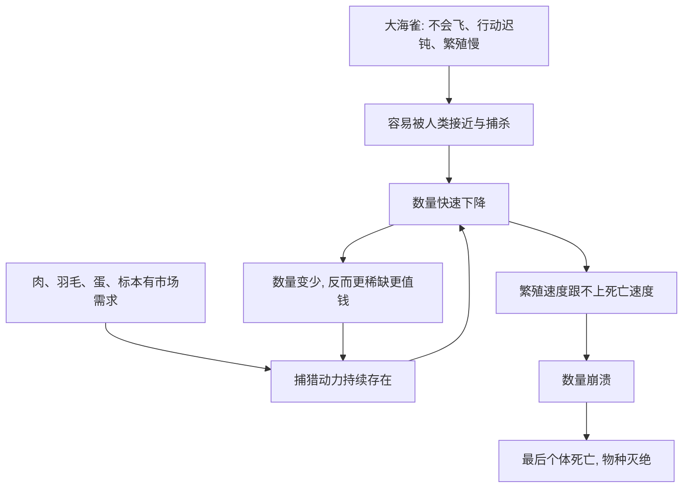

# 05｜大海雀之死：人类是怎样直接抹掉一个物种的？

> 在没有工业、没有污染的时代，人类也能让一个物种彻底消失吗？

---

## 一、先说结论

科尔伯特讲大海雀，是为了堵住一个常见的借口：**“灭绝是现代工业才造成的。”**

结论是：**在没有工厂、没有农药、没有全球变暖的年代，人类仅凭持续的捕猎，就把一个物种彻底抹掉了。** 大海雀因为被取肉、取羽毛，一步步被逼到最后的个体死亡，在十九世纪彻底灭绝。

这件事的意义在于：它证明**灭绝不需要宏大的灾难作为理由，只需要一个足够长、足够彻底、足够没有节制的索取过程。**

---

## 二、我们先理解一个问题

先想一个逻辑：

> 一个物种要延续，只需要一件事——死亡的速度不超过出生的速度。

那么反过来，要让它灭绝，也只需要一件事：

> 让死亡的速度，持续地超过出生的速度。

这听上去很简单，却极难做到——除非有一种力量，持续、稳定、年复一年地取走个体，从不休息。自然界的捕食者做不到这一点，因为猎物减少时它们通常也会减少。

但人类可以。**人类不一定因为猎物变少就自动减少捕猎，反而可能因为稀少而更想得到。**

于是问题就是：**一个不会飞、走得很慢、又很值钱的物种，遇上这样一股力量，会发生什么？**

---

## 三、作者到底提出了什么观点？

科尔伯特通过大海雀的故事提出：

1. **人类可以直接导致物种灭绝，而不只是间接影响。** 大海雀的消失，主因是直接的猎杀和取蛋。
2. **灭绝往往是“累积”的，而不是某一次决定造成的。** 每一艘船、每一群人拿走一点，很少有人觉得自己在终结一个物种。
3. **商业价值会让索取加速到失控。** 肉可以吃，羽毛可以做枕垫，蛋和标本也有需求——价值越高，捕猎越不遗余力。
4. **最后个体死亡，是最容易记住的一幕，却不是最重要的原因。** 真正致命的是之前那漫长的、看似“正常”的索取。

她的用意是让读者看到：**灭绝可以是一个平淡无奇、甚至“合乎情理”的过程。**

---

## 四、把这个观点翻译成人话

可以把它想成一件“大家都在拿一点”的事。

比如一间公司，效益不好，每个人心里都知道有问题，但都觉得“我多拿一点不算什么”。直到有一天公司倒闭，谁也不是那个唯一的责任人。

大海雀面对的就是这个局面。对每一个捕猎者来说，他只是想要一点肉、一些羽毛，或者一枚蛋；大海雀在当时并不“稀有”，甚至显得取之不尽。

**灭绝，恰恰是在“反正还有很多”的感觉里发生的。** 等到人们意识到它变少了，通常已经太迟；而一旦它变得稀少，剩余的个体反而更值钱、更被追逐。

这就是科尔伯特想让人警醒的循环：**没有节制的索取，会让“很多”变成“很少”，而“很少”会加速走向“没有”。**

---

## 五、为什么会这样？

为什么人类的捕猎比自然捕食更致命？可以用一张图来表示。

关键在 F → D 这个回流。

自然界的捕食者会随猎物减少而减少，形成一种自动刹车。人类的捕猎却可能相反：**越稀少，越值钱，越值得去找。** 于是“刹车”变成了“油门”。

当死亡速度持续压过出生速度，数量就会走向一个难以逆转的方向。大海雀就是这样，从一个常见的物种，变成越来越少的记录，最后变成一枚保存在玻璃后的标本。

---

## 六、举一个现实生活中的例子

大海雀是一种不会飞的海鸟，体型似鸭，生活在北大西洋寒冷的海域和岛屿上。据记载，它行动迟缓，对人类并不畏惧，很容易被成群的驱赶和捕杀。

它的消失，不是一场灾难，而是一段漫长的开销：

- **取肉。** 渔民和水手把它当作廉价、易得的食物。
- **取羽毛。** 它细密的羽毛被用作枕垫、被褥等填充物，需求量相当大。
- **取蛋。** 大海雀繁殖极慢，通常一次只产一枚蛋，而蛋又容易被收集。
- **取标本。** 当它变得稀少之后，收藏家和博物馆加入追逐，进一步加速了最后种群的消失。

在十九世纪前后，这个曾经数量众多的物种被彻底抹去。它成了“人类直接导致灭绝”的标志性案例。

**这个案例最刺痛人的地方，是它的平淡：没有恶意，没有计划，只有一年又一年的、理所当然的索取。**

---

## 七、回到书中重新理解

现在再回看科尔伯特为什么要在讲完青蛙之后，紧接着讲大海雀，就顺了。

她要给出两种不同的“消失方式”。金蛙的离开是安静的、外来的、几乎不由人控制；大海雀的离开是喧闹的、直接的、由人一手造成的。

把这两个放在一起，读者就明白了一件事：**灭绝的原因是多样的，但结果是一样的——一旦结束，就再也回不来。**

大海雀还承担了另一个作用：它拆掉了“技术”这个借口。人们常以为，只有现代工业社会才有能力造成灭绝。而大海雀证明，在捕猎工具还很朴素的年代，只要有足够的动力和不间断的索取，人类照样能把一个物种从地球上抹掉。

---

## 八、这个观点背后还有什么？

**第一，它揭示了“直接利用”型灭绝的机制。** 过度捕猎与采集，是最古老、也最直白的物种消灭方式。

**第二，它说明市场价值与灭绝风险往往同向上升。** 越是被需要，越容易被推到崩溃边缘。

**第三，它点出了“责任分散”的陷阱。** 每个人都只取一点，就没有一个人觉得自己在犯罪，但总量足以致命。

**第四，它把“缓慢”与“确定”区分开来。** 过程可以很慢、很不起眼，结果却可以是确定无疑的终结。

---

## 九、这个观点有问题吗？

这个案例本身证据充分，但仍有一些需要谨慎的表述。

**第一，灭绝原因并非单一。** 除捕猎外，栖息地扰动、采集蛋、甚至气候与其他人为干扰，可能也参与了衰退过程。把一切都归给捕猎，会简化历史。

**第二，个别细节的记载可能带有传说色彩。** 最后几只个体被杀死的时间、地点与方式，在不同叙述中并不完全一致，需要格外谨慎地对待。

**第三，用大海雀来代表“人类必然造成灭绝”需要加一句限定。** 很多被过度捕猎的物种并未灭绝，大海雀是其中走向极端的一例，它说明的是“可能”，而不是“必然”。

**第四，关于历史灭绝事件的分因，学界也存在不同解释。** 捕猎的主导作用基本得到认可，但各因素权重多少、与气候等因素如何交织，关于这一问题，学界存在不同解释。

**所以更准确的说法是**：大海雀是“人类过度捕猎直接致其灭绝”的清晰案例，但在叙述时仍应保留对具体细节与多因叠加的谨慎，不宜把它简化成一句教训式的口号。

---

## 十、今天再看这个观点

以下部分是基于本书思想的现代延伸，不是科尔伯特的原话。

今天，直接的过度捕猎依然存在，只是方式变了。远洋渔业把大型鱼类和海洋哺乳动物的数量压到很低；濒危物种的非法贸易仍在进行；只是许多物种不再像大海雀那样“容易到手”，技术反而让捕捞变得更快、更远。

但今天也有大海雀时代没有的东西：**监测数据、保护法规、公众意识与国际贸易方面的约束。** 海鸟、鲸类、猛禽中有一些物种，正是因为人们及时收手，才没有重演大海雀的结局。

所以这一篇的现代意义是：**大海雀的教训，不在于人类注定会消灭物种，而在于——当索取的速度超过了物种补充的速度，而没有人愿意先停手时，结局是可以预见的。**

---

## 十一、这一篇真正应该记住什么？

1. **灭绝不需要工业，只需要持续的过度索取。** 大海雀是人手造成的。
2. **取肉、取羽毛、取蛋，每一项都在削弱种群。** 累积起来就是致命。
3. **稀少会让价值升高，从而加速灭绝。** 刹车变成了油门。
4. **责任分散，是灭绝最容易被忽视的推手。** 每个人都只“拿一点”。
5. **过程可以很慢，结局却可以是永远。** 这是它最残酷之处。

---

## 十二、留一个问题

> 如果大海雀的消失，是在“反正还有很多”的错觉中一点点完成的，
> 那么，今天我们身边那些看起来还很常见的物种，
> 会不会也在经历一个我们尚未察觉的“还有很多”？

---

**下一篇**：大海雀的消失，至少还有直接的凶手。但在海洋深处，有一类生物正在以另一种方式退场——没有猎枪，没有捕获，只有海水在悄悄改变。它养活着整片海洋，却最先显露出崩溃的迹象。

下一篇我们就来拆开这个问题——**珊瑚礁为什么在变白**
