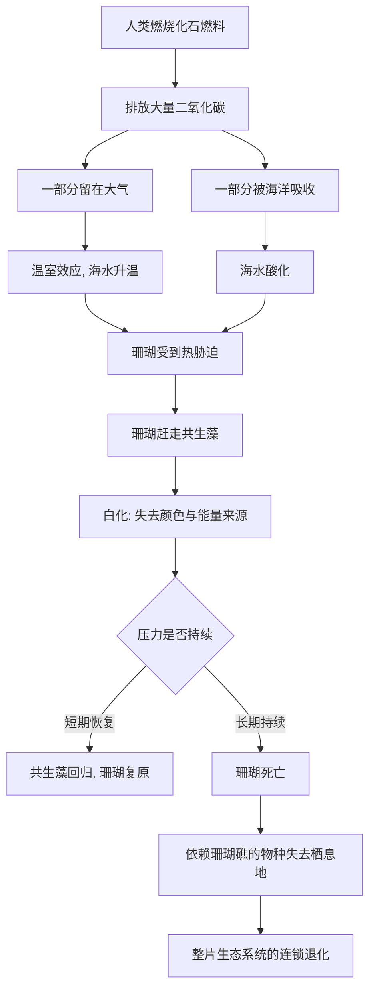

# 06｜珊瑚礁为什么在变白？

> 海里的珊瑚为什么会大面积地“白化”？

---

## 一、先说结论

科尔伯特带我们潜到海面之下，看到的不是鲜艳的珊瑚森林，而是一片惨白的“骨架”。她要用这个现场回答一个问题：**气候变化不是遥远的数字，它已经把一种生态系统推到了崩溃边缘。**

她的核心判断是：珊瑚的白化，是人类排放的二氧化碳在同时做两件事——**让海水变暖，让海水变酸。** 珊瑚对温度和酸碱度都极其敏感，一旦环境超出它的承受范围，它和共生藻的联盟就会解体，珊瑚随之失去颜色、失去能量来源，直至死亡。

而珊瑚礁养活着海洋中极高比例的生物，所以这不仅仅是“一种生物变白了”，而是**一整座海中城市的地基在松动**。

---

## 二、我们先理解一个问题

要理解白化，先要理解珊瑚其实不是一个“个体”，而是一个“联盟”。

珊瑚虫是一种微小的动物，它会建造石灰质的骨骼。但光靠它自己，它活不好——它体内住着微小的共生藻。这些藻类进行光合作用，把阳光变成养分，供给珊瑚；珊瑚则提供住所和庇护。

**这就是珊瑚礁真正的秘密：它是动物和植物的合伙人。** 鲜艳的颜色，也多半来自这些共生藻。

那么问题来了：如果水体突然变热，或者变酸，会让这个“联盟”发生什么？

答案是——**珊瑚会先把共生藻赶出去。** 藻类走了，颜色就没了，只剩白色的骨骼，这就是“白化”。如果压力持续太久，珊瑚就再也请不回它的伙伴，最终饿死。

---

## 三、作者到底提出了什么观点？

科尔伯特借珊瑚这一章提出几个层层递进的判断：

1. **气候变化今天已经可以被“看见”。** 它不只是一条上升的温度曲线，而是一片正在变白的海底。
2. **海洋替人类“接收”了排放，代价由珊瑚承担。** 人类排出的二氧化碳，一部分留在大气里导致升温，一部分被海洋吸收导致酸化。海洋的缓冲，变成了珊瑚的压力。
3. **白化不是孤立事件，而是一个连锁反应的起点。** 珊瑚死亡，依赖珊瑚礁的鱼类、无脊椎动物失去栖息地，整张生态网随之松动。
4. **珊瑚对环境变化极其敏感，是海洋里的“金丝雀”。** 它最早受伤，也最诚实地报告了环境的恶化。

科尔伯特并不是在讲一个“海洋公园正在关门”的伤感故事，而是在说：**我们排放的东西，会以我们不容易察觉的方式回来找我们。**

---

## 四、把这个观点翻译成人话

想象一栋住满人的大楼。

楼里的住户（珊瑚）和楼里的发电站（共生藻）签了长期合同：发电站提供电，住户提供场地。整栋楼灯火通明、热闹非凡。

现在，外面的温度持续升高，环境也越来越不友好。发电站受不了，先撤走了。楼里立刻断电、一片漆黑——这就是白化。

断电一两天，住户还能撑；**可要是断电一直不恢复，住户就会一个个搬走，甚至死在大楼里。** 而依赖这栋楼生活的小商贩、租户、顾客（其他海洋生物），也跟着一起失去生计。

珊瑚礁就是这样一栋“海底大楼”。白化，是电灯熄灭的那一刻；珊瑚死亡，是大楼真正开始空掉的那一刻。

---

## 五、为什么会这样？

把整个链条画出来，会清楚很多。

关键在 **B → C 与 D → G** 这一段。

二氧化碳排放出去，不会自动消失。它要么在大气里加重温室效应，要么沉进海里改变水的化学。**无论走哪条路，最终都打在珊瑚身上。** 珊瑚之所以成为最早倒下的群体，不是因为它特别脆弱，而是因为它同时承受了升温和酸化两重压力。

---

## 六、举一个现实生活中的例子

把珊瑚想成家里的鱼缸。

养过鱼的人都懂：水温、酸碱度、氨氮，任何一项变化，鱼就会出问题。鱼不会跟你抱怨，它只会安静地生病、沉底、死亡。

**而珊瑚礁，就是地球上最大的一座“天然鱼缸”。**

现在，你往这个鱼缸里持续加温、持续通入二氧化碳，却不换水。缸里的珊瑚会先变白，接着鱼会减少，最后整缸水变得浑浊，只剩下藻类和细菌。这个过程不是一天完成的，但方向是确定的。

真正让人不安的地方在于：**珊瑚不会尖叫。** 它只会安静地褪色。等到你终于注意到那片惨白，往往已经晚了——这正是科尔伯特想让我们体会的那种“无声的灾难”。

---

## 七、回到书中重新理解

现在再回看这一章在全书中位置，就很清楚了。

前面讲大海雀，讲的是**人类用双手直接把一个物种捕杀殆尽**。珊瑚讲的是另一条路径：**没有人拿刀去杀珊瑚，人类甚至离它有几百上千公里，但它照样在死。** 这就是现代灭绝最阴险的地方——推手是间接的、分散的、全球性的。

科尔伯特选择珊瑚，是因为它把“气候变化”这个抽象概念，变成了一个可以被眼睛确认的画面。她不需要给你一堆温度数据，只要让你看到那片白色的海底，你就会明白：**这不是预测，这是现场。**

而珊瑚礁的连锁崩塌也提前预告了全书的另一条主线：**一个关键物种或生态系统的消失，会带着一大群依赖它的生命一起走。** 灭绝从来不是单点事件。

---

## 八、这个观点背后还有什么？

**第一，它把“排放”和“灭绝”连在了一起。** 每一次工业活动、每一次燃烧，最终都可能以某种方式打到某个物种头上。

**第二，它揭示了海洋的“缓冲”其实是有限的。** 海洋吸收了大量的二氧化碳，暂时减轻了大气的压力，但代价是海洋自身在变酸、变暖。

**第三，它说明生态系统有“基础物种”的概念。** 珊瑚就是这样的角色：它自己不是最显眼的生物，却是无数其他生物赖以生存的地基。

**第四，它提醒我们“慢”不等于“不致命”。** 白化看起来是一个渐变过程，但渐变走到尽头，就是不可逆的崩溃。

---

## 九、这个观点有问题吗？

科尔伯特的叙述很有力，但同样需要谨慎对待。

**第一，珊瑚白化并不等于珊瑚必然死亡。** 如果热胁迫是短期的，共生藻可以回归，珊瑚有可能恢复。把每一次白化都等同于“珊瑚死亡”，会把复杂的过程过度戏剧化。

**第二，珊瑚并非只受气候影响。** 过度捕捞、污染、疾病、陆源沉积物，都可能加重珊瑚的困境。把珊瑚退化完全归因于二氧化碳，会忽略本地治理的重要性。

**第三，关于升温与酸化的相对贡献，学界存在不同解释。** 一些科学家更强调短期高温事件的致命作用，另一些则更关注长期酸化对珊瑚造礁能力的影响。二者如何叠加，仍在研究中。

**第四，预测未来仍有很大不确定性。** 不同区域、不同种类的珊瑚耐受性差异很大，也有研究显示部分珊瑚在高温下表现出较强的适应性。因此“珊瑚会不会全部消失”，并不是一个已经写好的答案。

**所以更平衡的说法是**：珊瑚白化是气候变化最清晰、最有说服力的现场之一；但它既是全球问题的产物，也受本地因素影响，恢复的可能性与崩溃的风险同时存在。

---

## 十、今天再看这个观点

以下部分是珊瑚礁这一议题的现代延伸，不是科尔伯特的原话。

从本书出版到现在，珊瑚白化已经从一个“预警”，变成了许多海域反复出现的常态。研究者越来越关注两件事：**一是极端高温事件的重现频率，二是珊瑚是否可能通过适应或人工干预延续下去。**

于是出现了两条并行的思路。一条是“减缓”：减少温室气体排放，从源头上降低珊瑚承受的压力。另一条是“修复”：人工培育耐热的珊瑚、建立保护区、移植珊瑚苗。两条路都有人认真推进，也都有人担心它们是否跟得上环境变化的速度。

对普通人来说，这个议题的现代意义不在于“珊瑚离我很远”，而在于：**海洋一直在免费替我们处理排放，而珊瑚正在替这笔账买单。**

---

## 十一、这一篇真正应该记住什么？

1. **珊瑚白化，是珊瑚赶走共生藻、失去颜色与能量来源的过程。**
2. **人类排放的二氧化碳，一面对大气加温，一面对海洋加酸，两重压力打在珊瑚身上。**
3. **珊瑚礁是海洋生态的地基，它退化会引发连锁崩溃。**
4. **现代灭绝的推手可以是间接的、全球性的——没人直接杀珊瑚，珊瑚照样在死。**
5. **白化不等于死亡，但反复白化会把珊瑚推向不可逆的衰退。**

---

## 十二、留一个问题

> 如果一片珊瑚礁正在安静地变白，
> 而它变白的原因，与我们每个人的生活方式都有关，
> 那么在它彻底失去颜色之前，我们愿意为此改变多少？

---

**下一篇**：珊瑚的危机来自海洋与大气，而陆地上最大的威胁，则来自一棵一棵倒下的树。当一片森林被砍伐、切割成碎片之后，原本住在里面的物种，究竟去了哪里？

下一篇我们就来拆开这个问题——**森林被砍掉之后，物种去了哪里？**
