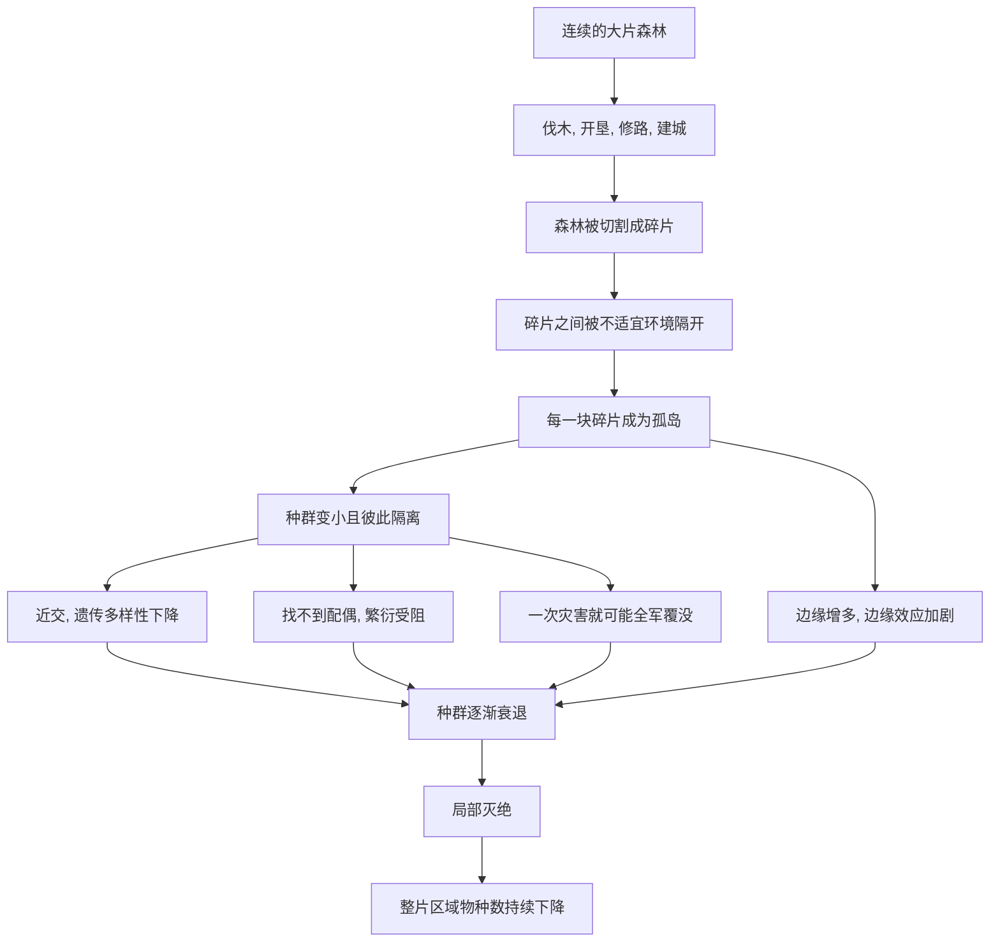

# 07｜森林被砍掉之后，物种去了哪里？

> 栖息地丧失，为什么是物种消失的首要推手？

---

## 一、先说结论

科尔伯特在这一章里给出全书最直白的一个判断：**在导致物种消失的各种原因中，栖息地丧失是排在最前面的那一个。**

伐木、开垦、修路、建城，把原本连绵不断的森林切成了大大小小的碎片。对生活在其中的物种来说，这不只是“房子小了一点”，而是**家园被拆成了互不相连的孤岛**。

她的核心观点可以概括为一句话：**杀死一个物种，最简单的方法不是去猎杀它，而是毁掉它赖以生存的地方。** 栖息地一旦破碎，物种即使暂时还活着，也往往只是“延迟的死亡”。

---

## 二、我们先理解一个问题

先抛开环保话题，只想一个几何问题。

一块面积很大的森林，和同样总面积、却被切成十块小森林，对里面的物种来说，一样吗？

**不一样，而且差别巨大。**

因为物种需要的从来不只是“面积”，还需要**连通性**。动物要迁徙、要寻找配偶、要追踪食物、要躲避季节性的灾难。当森林被道路、农田、牧场切成碎片，每一块碎片就变成了一座海上的孤岛——四面都是不适合生存的“海洋”。

于是问题就变成了：**一座孤岛上，能长期住下多少物种？** 这正是科尔伯特想让我们思考的。

---

## 三、作者到底提出了什么观点？

科尔伯特借森林碎片化的研究提出几点判断：

1. **栖息地丧失是当前物种消失的首要原因。** 相比污染、入侵、疾病，失去家园的杀伤面更广、更根本。
2. **碎片化把连续的生态变成了“孤岛群”。** 大森林变成小碎片后，每块碎片能承载的物种数量显著下降。
3. **隔离会引发一连串问题。** 种群太小，容易近交、遗传多样性下降；一次火灾、一场病害就可能全军覆没；找不到配偶，繁衍随即中断。
4. **存在“延迟灭绝”。** 有些物种在森林被砍的当下还活着，但已注定无法长期存续——它们的名字还挂在名单上，实际上已经走上了消失的路。
5. **保护区若只是孤立的“点”，效果会大打折扣。** 真正需要保护的是足够大的面积，以及让这些面积彼此连通的走廊。

---

## 四、把这个观点翻译成人话

把一片原始森林想象成一座热闹的城市。

城市里有超市（食物）、有住宅（巢穴）、有公路（迁徙通道）、有婚介所（找配偶）。居民各得其所，城市运转良好。

现在，推土机来了，把这座城市切成了七零八落的几个小区，小区之间全是无法通行的荒地。

结果会怎样？

- 居民出不了小区，**找不到配偶**，生育率下降；
- 食物不够，**只能在小范围里反复取用**，资源迅速枯竭；
- 一场火灾、一次传染病，**因为没有其他地方可以逃**，整个小区可能就此清零；
- 久而久之，**小一点的“小区”先空掉**，只剩几个大一点的还在勉强维持。

森林碎片化对物种做的，就是这件事。**物种不是被“杀”死的，而是被困在越来越小的孤岛上，慢慢耗尽的。**

---

## 五、为什么会这样？

把碎片化的影响画成一条链条：

关键在 **E → F** 这一步。

**砍伐的可怕，不在于一次砍掉了多少，而在于它把“连续”改成了“割裂”。** 面积减少是减法，连通性丧失更接近除法——它会把原本能维持的种群，压缩到无法自我延续的规模。

而 **M → J** 这条边同样重要：碎片越小，边缘占总面积的比例越大，阳光、风、温度、外来物种都能更深入地侵入森林内部，那些依赖潮湿阴暗环境的物种最先受到冲击。

---

## 六、举一个现实生活中的例子

想象一个世代居住的老社区。

这里几代人比邻而居，街坊相识，孩子们一起长大。忽然有一天，规划把社区拆成了几块互不相通的飞地，中间隔着宽阔的马路和商业区。

表面上，大家“都还在”。但很快你会发现：**原本自然形成的联系断了。** 老人找不到老友，年轻人找不到对象，小店铺因为客流分散而关门，遇到困难时也再难互相照应。

**社区没有被命令解散，它只是被切碎了。** 切碎之后，它作为“社区”的功能就慢慢消失了。

森林碎片化对物种的影响，也正是这种“看起来还在、实际上已经散了”的过程。这也是科尔伯特想强调的：**栖息地丧失最容易被低估的地方，在于它的后果是滞后的。**

---

## 七、回到书中重新理解

现在再回看这一章在全书的角色，就明白了。

前面几章讲的是青蛙、大海雀、珊瑚，分别对应疾病、直接猎杀和气候。这一章补上了最“传统”、也最庞大的一个原因：**栖息地丧失。**

科尔伯特把它放在现象部分的收尾，是有意为之。因为前面那些案例看起来各有各的故事，背后却有一个共同的底色——**人类的扩张正在挤压其他生命的空间。** 大海雀是被直接捕杀，珊瑚是被间接加温，而森林里的物种，则是被“搬家”搬得无处可去。

到这一章为止，“人类正在引发第六次大灭绝”这句话，已经从“一个物种的悲剧”，扩展成了“一整套机制”。接下来的问题就顺理成章了：**当人类扩散到一片新土地时，最先消失的会是谁？**

---

## 八、这个观点背后还有什么？

**第一，它借用了岛屿生物地理学的思路。** 一些科学家认为，一片森林碎片在功能上就相当于一座岛屿：面积越大、离“大陆”越近，能维持的物种越多。这个框架让“碎片化”有了可以推算的语言。

**第二，它揭示了“灭绝债务”这个概念。** 眼前还活着的种群，可能已经不具备长期存续的能力。今天我们看到的物种数量，可能反映的是过去的森林面积，而不是现在的。

**第三，它把保护的重点从“单个物种”转向了“空间与连通”。** 与其只去抢救某一种明星动物，不如保住足够大、彼此相连的栖息地。

**第四，它和气候议题紧密相连。** 森林既是物种的家，也是巨大的碳库。保护森林同时服务于两个目标，这让它成为最有杠杆作用的行动之一。

---

## 九、这个观点有问题吗？

“栖息地丧失是首要威胁”这个判断总体稳固，但仍需要几点分寸。

**第一，与气候变化的相对重要性，学界存在不同解释。** 有研究强调栖息地丧失是当下最直接的杀手，也有研究提醒气候变化会在未来成为主导力量。二者并非互斥，但在保护资源的分配上会引出不同主张。

**第二，碎片化研究本身存在尺度问题。** 许多结论来自特定地区、特定类群的长期观测，能否推广到所有森林、所有物种，仍需谨慎。

**第三，关于亚马逊的砍伐速度与临界点，不同模型给出的估计并不一致。** “雨林会不会整体退化”是一个有强证据支持、但仍在争论的判断，不宜说成已定的事实。

**第四，把栖息地丧失称为“最大原因”，也可能掩盖其余威胁的独立性。** 在已被切割的碎片里，入侵物种、疾病、猎捕同样可能是压垮某个种群的最后一根稻草。

**所以更准确的说法是**：栖息地丧失，尤其是碎片化，确实是当前生物多样性下降最普遍、最根本的推手之一；但它的作用往往与其他压力叠加，需要放在具体情境里判断。

---

## 十、今天再看这个观点

以下部分是森林与栖息地议题的现代延伸，不是科尔伯特的原话。

从本书出版到现在，卫星遥感让“森林正在消失”这件事变得可以被实时看见。研究者不只关心总面积的增减，也越来越关心**森林的完整性和连通性**——一片被道路切得支离破碎的“森林”，在生态功能上可能远不如它看起来那么完整。

与此同时，出现了几组新的权衡。比如：为了碳汇而种的速生林，未必能替代原始森林为物种提供栖息地；再造林能恢复面积，却很难在短时间内恢复物种组成。也就是说，**“种回去”和“恢复原样”之间，有一道难以跨越的鸿沟。**

对普通人来说，这一议题的现代意义是：**生物多样性危机的主战场，往往不是惊天动地的猎杀，而是每天都在进行的、安静的开发。**

---

## 十一、这一篇真正应该记住什么？

1. **栖息地丧失是物种消失的首要推手，而森林碎片化是它最典型的形式。**
2. **砍伐的杀伤力，来自把连续的生境切成了互不相连的孤岛。**
3. **小种群加隔离，会导致近交、繁衍困难和抗风险能力低下。**
4. **灭绝可能是延迟的：名单上还在，实际上已经注定消失。**
5. **保护的关键是面积与连通性，而不只是圈出一个个孤立的点。**

---

## 十二、留一个问题

> 如果一片森林正在被切成碎片，
> 而碎片里的物种还要很多年才会真正消失，
> 那么我们是否会因为“现在还看得到它们”，就错过了挽救的时机？

---

**下一篇**：森林碎片化让物种困在孤岛里。但还有一类动物，不用等栖息地被切碎，就会最先从人类身边倒下——那些体型庞大、繁殖缓慢的巨兽。为什么人类走到哪里，猛犸象和剑齿虎就消失到哪里？

下一篇我们就来拆开这个问题——**为什么大型动物最先消失？**
