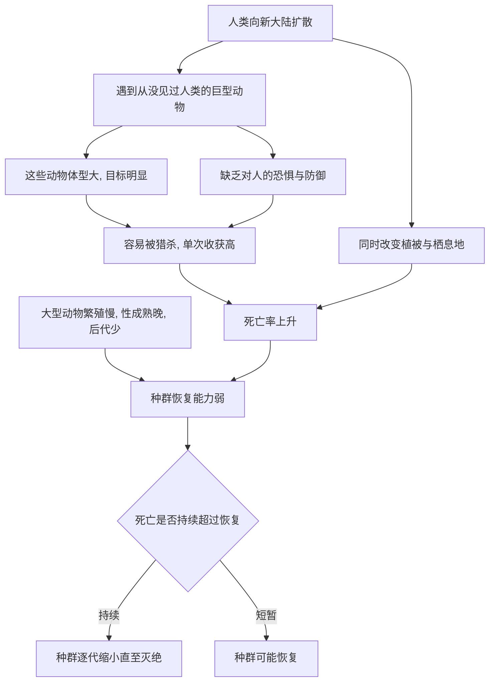

# 08｜为什么大型动物最先消失？

> 为什么猛犸象、剑齿虎这类“巨兽”，总是最先从人类身边消失？

---

## 一、先说结论

科尔伯特在这本书里反复回到一个规律：**人类走到哪里，哪里的大型动物就容易倒下。**

她的核心判断是：猛犸象、剑齿虎这类“巨兽”的消失，与人类的扩散在时间上高度吻合。原因并不神秘——**大型动物繁殖慢、数量本就稀少、目标又大，一旦被持续猎杀，就几乎没有恢复的机会。**

换句话说，它们不是“运气不好”，而是**在生物学上天生就容易被击穿**。这也让这条规律显得格外不安：如果换成今天的大象、犀牛和鲸，逻辑并没有改变。

---

## 二、我们先理解一个问题

先比较两种动物：一只老鼠和一头猛犸象。

老鼠几个月就能繁殖，一胎多仔，环境再恶劣也能迅速回血。猛犸象要很多年才性成熟，怀孕期长，一次通常只生一胎，后代还要照顾很久。

**这意味着什么？**

意味着同样是“每年被猎杀掉一部分”，老鼠的种群能追回来，猛犸象却追不回来。它的繁殖速度，根本赶不上死亡速度。

再叠加两件事：**体型大，所以显眼、好找、一次猎杀收获多；数量本来就不多，所以每一次损失都更致命。** 于是就有了一个残酷的结论：**在人类的压力面前，大型动物是“缓冲垫最薄”的那一群。**

---

## 三、作者到底提出了什么观点？

科尔伯特的论证可以拆成几条：

1. **巨兽的消失与人类扩散在地理和时间上高度相关。** 每当人类进入一片新大陆，那里的巨型动物往往在随后的一段时期里相继消失。
2. **大型动物本身具有“易灭绝”的生物学特征。** 繁殖慢、性成熟晚、后代少、种群密度低、活动范围大，这些特征让它们对额外死亡极其敏感。
3. **猎杀只是机制之一。** 人类还可能通过改变植被、挤占栖息地、间接影响食物链来削弱巨兽。
4. **这是一场全球性的模式，而不是孤例。** 从欧亚到美洲、澳洲，类似的“巨兽消失”反复出现。
5. **这个模式对今天依然有警示意义。** 今天体型最大、繁殖最慢的动物，仍然是最受威胁的类群。

---

## 四、把这个观点翻译成人话

把生态系统想象成一支球队。

小动物像是替补席上的一大批球员，谁受伤了，随时有人顶上。大型动物则像是队里那几位核心主力——**他们最强，但也最不可替代。**

现在，对手（人类）每次都能优先锁定这几个主力，而且他们一旦受伤，恢复期特别长、替补又补不上（繁殖太慢）。结果就是：**比赛还没结束，主力已经一个个离场，整支队伍随之瓦解。**

大型动物在生态里往往扮演类似“关键角色”：它们维持草原、传播种子、影响植被结构。它们的消失不只是一个物种没了，而是**整支球队的打法都被改变了**。

---

## 五、为什么会这样？

把这条规律画出来：

关键在于 **G → H** 这条支路。

人类猎杀只是“输入”，决定结果的是物种自身的“恢复能力”。**大型动物的悲剧在于：它们在被猎杀时损失得最快，在恢复时又回得最慢。** 一快一慢之间，缺口越拉越大，最终无法弥合。

---

## 六、举一个现实生活中的例子

想象一片果园。

果子成熟时，人们最先摘走的，一定是**最大、最甜、最显眼的那些**——因为它们好找、值得摘。而那些小果子常常能挂到很晚。

如果只摘一季，这没什么。但如果**年年都先摘大果**，会发生什么？

树还在，果还在，但“大果”这个特征可能越来越难维持，因为能长成大果的那批枝条，没有机会留下后代。**被优先取走的部分，恰恰是最有价值、恢复最慢的部分。**

人类与巨兽的关系，逻辑与此相似：**优先被取走的，总是体型最大、繁殖最慢的那一群。** 而它们，恰恰是生态系统里最难被替代的角色。

---

## 七、回到书中重新理解

现在再看科尔伯特为什么用“巨兽”来串起人类与灭绝的历史，就很清楚了。

前面讲的是当代正在发生的消失：青蛙、大海雀、珊瑚、森林。这一章把镜头拉远，拉到了几万年前。**她要说明的是：人类改变生态，不是从工业革命才开始的。**

当智人走出非洲、走向各大洲，巨型动物的衰退几乎同步发生。这让“第六次大灭绝”不再只是一个现代问题，而是一条**贯穿人类史的线索**：我们一直是强大的生态力量，只是过去是在局部，现在是全球。

这也把前几章的机制串了起来——过度猎杀、栖息地改变、连锁效应，在巨兽身上第一次合流。接下来自然要问：**如果一片土地被海洋隔绝，那里的物种会不会更脆弱？**

---

## 八、这个观点背后还有什么？

**第一，它触及“人类起源”的生态代价。** 人类的成功，可能建立在其他大型动物的衰退之上。这是一个不舒服但重要的视角。

**第二，它揭示了“关键物种”的概念。** 大型动物常常通过取食、踩踏、传播种子来塑造整个生态。它们消失后，植被和食物网会一起改变。

**第三，它把“灭绝”和“演化速度”联系起来。** 灭绝不只取决于压力有多大，还取决于物种能不能在压力下及时适应、及时繁殖。

**第四，它为今天的保护提供了优先级依据。** 体型大、繁殖慢、分布窄的动物，需要更早、更强的干预。

---

## 九、这个观点有问题吗？

“人类扩散导致巨兽灭绝”这个框架很有解释力，但它也是全书争议最集中的判断之一。

**第一，时间上的相关性不等于因果。** 人类的到来与巨兽的消失时间接近，但同一时期气候也在剧烈变化，把两者分开并不容易。

**第二，气候假说同样有证据。** 一些科学家认为，冰期结束时的气候与植被剧变，才是压垮许多巨兽的主因，人类的猎杀只是叠加因素。

**第三，不同地区的证据并不一致。** 在非洲，大型动物与人类长期共存了很长时间，却没有像美洲那样迅速崩溃；在澳洲、美洲，支持人类作用的证据又更强。这种差异说明情况远比单一假说复杂。

**第四，关于猎杀强度，学界存在不同解释。** 争论的焦点之一是：狩猎采集者的人口规模，是否足以猎尽整个大陆的巨兽种群。

**所以更准确的说法是**：人类很可能是巨兽消失的重要推手之一，但不同地区的主导因素可能不同。**把巨兽灭绝完全归功于人类，或完全推给气候，都会过度简化。**

---

## 十、今天再看这个观点

以下部分是大型动物保护的现代延伸，不是科尔伯特的原话。

本书出版之后，“大型动物最先消失”这条规律并没有被时间冲淡。今天，体型最大、繁殖最慢的动物——大象、犀牛、大型猫科动物、大型鲸类——依然是最受威胁的类群。偷猎、栖息地压缩、人兽冲突，仍然是它们的日常。

因此在保护实践中，出现了一个持续被讨论的分歧：**应该优先保护这些“旗舰物种”，还是优先保护整个生态系统？** 支持前者的人认为，大型动物容易唤起公众关注、也能庇护大片栖息地；倾向后者的人则担心，过度聚焦明星动物会忽略同样濒危的昆虫、植物和真菌。

但无论哪一派，都会同意科尔伯特的判断指向同一件事：**那些最大、最慢、最显眼者，往往最先为人类的扩张买单。**

---

## 十一、这一篇真正应该记住什么？

1. **人类扩散到哪里，大型动物往往就在哪里消失，这是一个反复出现的模式。**
2. **大型动物繁殖慢、数量少、目标大，因而对额外死亡极其敏感。**
3. **猎杀之外，栖息地改变与食物链扰动也在起作用。**
4. **它们往往是生态系统的关键角色，消失会带动整片环境改变。**
5. **关于人类与气候谁更关键，学界仍有争议，但人类的作用不容忽视。**

---

## 十二、留一个问题

> 如果“体型大、繁殖慢”本身就意味着更容易消失，
> 那么今天那些依然庞大的动物，
> 究竟是走在旧规律的老路上，还是有机会被我们拦住？

---

**下一篇**：巨兽的脆弱，源于繁殖太慢、目标太大。但如果一个物种长期生活在一座与世隔绝的岛屿上，它失去的可能不只是繁殖速度，还有**对危险的全部警惕**。当人类和外来物种登岛，它们会遭遇什么？

下一篇我们就来拆开这个问题——**岛屿上的物种为什么格外脆弱？**
