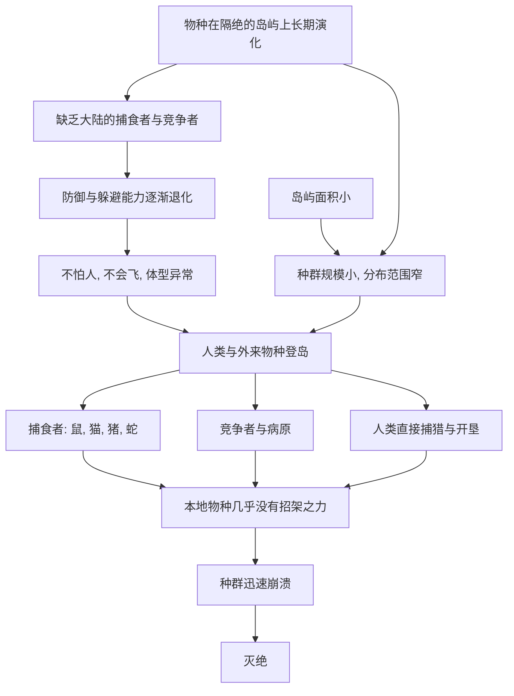

# 09｜岛屿上的物种为什么格外脆弱？

> 为什么灭绝最容易发生在岛屿上？

---

## 一、先说结论

科尔伯特用一个令人难忘的形象，讲清楚了岛屿物种的命运：**渡渡鸟。**

这种鸟生活在与大陆隔绝的岛屿上，世世代代没有天敌，于是演化得又大又慢，几乎不会飞，也不怕人。当人类和随船而来的老鼠、猪、猫登岛之后，它几乎没有任何招架之力，很快便彻底消失。

科尔伯特的核心判断是：**长期隔绝的演化，会剥夺一个物种应对危险的能力。** 岛屿是一座天然的保护罩，但保护罩一旦被打破，里面的居民就会发现——**自己连逃跑的本能都已经失去。**

---

## 二、我们先理解一个问题

先想一想：如果让你在两种环境里长大，哪一种更可能让你学会应对危险？

一种是从小就有猛兽出没的森林，你必须时刻警觉、跑得快、藏得好；另一种是四面环海、没有天敌的孤岛，食物充足、无人打扰。

答案很明显。**危险会塑造物种的能力：警觉、速度、防御、伪装，都是被压力“训练”出来的。** 而没有压力的环境，则会把这一套能力一点点“省掉”——因为维持它们要花代价，用不上就不划算。

岛屿的问题恰恰就在这里：**它太安全了。** 而在一个太安全的地方待久了，一旦危险突然降临，就越没有能力应对。

---

## 三、作者到底提出了什么观点？

科尔伯特借岛屿物种的案例，提出几条相互支撑的判断：

1. **隔绝演化会带来“不设防”的特征。** 岛上物种常常没有防御天敌的行为，甚至失去了飞行、奔跑等躲避能力，体型也可能变得更大或更小。
2. **岛屿上的种群往往规模小、分布窄。** 岛就那么大，能容纳的数量有限，一次打击就可能波及全部。
3. **人类和外来物种是致命的组合。** 捕食者、竞争者、病菌，会随着人和船只一起上岛，而本地物种对它们毫无经验。
4. **岛屿因此成为灭绝的高发区。** 在有记录的灭绝事件里，岛屿物种占了很高的比例。
5. **这也让岛屿成为最能“见效”的保护战场。** 因为范围有限，一旦采取行动，效果往往比大陆更立竿见影。

---

## 四、把这个观点翻译成人话

想象一个从未有外人来过的山谷村落。

这里的人世代务农，从不锁门，家里也不养狗——没有小偷，也没有野兽，为什么要设防？

直到有一天，一群带着武器、携带家畜的陌生人到来。村民们既不知道要躲，也没有抵抗的手段，甚至因为从未见过马和枪而毫无警觉。村庄的命运，可想而知。

**这不是因为他们“笨”，而是因为他们的全部经验里，从来没有“防外人”这一项。**

岛屿物种的处境，正是这个村落。它们不是天生脆弱，而是**在一个不需要防御的世界里，被演化“取消了防御”**。当外面的世界突然闯入，它们来不及重新学会警惕。

---

## 五、为什么会这样？

把岛屿物种的脆弱性画成一条链条：

关键是 **C → D** 这一步。

岛屿物种最致命的，不是数量少，而是**行为上的“不设防”**。它们可能站在捕食者面前毫不躲避，可能把巢筑在地面上，可能不会识别危险。**当危险来自一个它们演化史上从未出现过的方向时，原有的所有能力都用不上。**

---

## 六、举一个现实生活中的例子

把岛屿物种想象成一盆在温室里养大的花。

温室里没有风霜、没有虫害、温度适宜，花开得很好。园丁从不需要它“抗寒”“抗虫”——环境已经替它挡住了全部风险。

现在，把这盆花直接搬到野外。一场霜冻、一阵强风、一群害虫，就可能让它迅速枯萎。

**它不是在温室里变弱了，而是从来没有被要求变强过。**

岛屿就是这座温室，而且是一座范围有限、跑不出去的温室。一旦温室的墙被打破——被人类、被船、被外来物种打破——里面的“花朵”往往来不及适应，就已经消失。

---

## 七、回到书中重新理解

现在再回看科尔伯特为什么把岛屿单列一章，就顺了。

前几章讲的机制——过度猎杀、栖息地丧失、繁殖缓慢——在岛屿上会以最极端的方式叠加：

- 岛本来就小，**栖息地几乎没有退路**；
- 种群本来就不多，**一次打击就可能全灭**；
- 长期隔绝，**又丧失了防御能力**。

所以在岛屿上，人类造成的灭绝往往特别快、特别彻底。渡渡鸟不是孤例，而是一种模式的代表。科尔伯特借此提醒我们：**同样一个物种，在山大林深的大陆也许还能撑住，在一座孤岛上却可能几年之内就没了。**

这也让下一章的追问显得自然：连岛屿上的鸟都守不住，那么曾经遍布欧亚、与我们血缘最近的“亲戚”——尼安德特人，又是怎么走到尽头的？

---

## 八、这个观点背后还有什么？

**第一，它和岛屿生物地理学的框架相通。** 一些科学家认为，岛屿的面积与隔离程度，决定了它能维持多少物种；面积越小、越孤立，物种越少、灭绝风险越高。

**第二，它揭示了“演化遗产”的两面性。** 隔绝既是形成独特物种的摇篮，也是它们脆弱性的来源。

**第三，它解释了为什么岛屿是保护的关键战场。** 保护一座岛，可能等于保住多个特有物种；投入相对集中，回报却很高。

**第四，它把“外来物种”这个议题提前引了出来。** 岛屿案例说明，入侵物种的破坏力，在缺乏共同演化的环境里会被放大到极致。

---

## 九、这个观点有问题吗？

“岛屿物种格外脆弱”总体成立，但仍有几点值得推敲。

**第一，并非所有岛屿物种都同样脆弱。** 有些岛屿与大陆距离近、物种交流频繁，其居民未必都缺乏防御；把岛屿一概而论，容易忽略差异。

**第二，灭绝的原因往往不止一个。** 除了人类和外来物种，海平面变化、气候波动、火山活动，都可能参与其中。把渡渡鸟一类的消失完全归因于某一次事件，可能过度简化。

**第三，关于具体灭绝的时间与主导原因，学界存在不同解释。** 尤其是人类到达与物种消失之间的时间关系，在不同岛屿上的证据并不一致。

**第四，岛屿也曾是物种诞生的摇篮。** 把岛屿只当成“灭绝高发区”，会忽略它同样是演化创新最丰富的舞台之一。

**所以更平衡的说法是**：隔绝演化确实让岛屿物种普遍缺乏防御，人类与外来物种的到来往往带来灾难性后果；但具体到每个物种，成因需要逐案分析，不宜简单套用。

---

## 十、今天再看这个观点

以下部分是岛屿保护的现代延伸，不是科尔伯特的原话。

如今，岛屿已经成为保护实践中投入产出比最高的地方之一。一些项目通过清除岛上的外来捕食者，让本地鸟类和爬行类得以恢复；由于岛屿边界明确，只要堵住上岛的通道，效果往往能持续。与此同时，生态修复也开始借助更精准的技术，识别并控制那些最致命的入侵物种。

但岛屿保护也面临现实张力：岛上往往有人居住，居民的生计、渔业与土地利用，都需要被纳入考量。**保护不能只在生态账本上成立，还要在社会账本上说得过去。**

对读者来说，这一章的现代意义是：**隔绝既保护了一个物种，也让它失去了对世界的戒备；而今天我们要做的，正是替它重新关上那扇被打开的门。**

---

## 十一、这一篇真正应该记住什么？

1. **岛屿物种长期隔绝演化，往往失去对天敌和竞争者的防御。**
2. **种群小、分布窄，加上不设防，使它们对突发打击极度敏感。**
3. **人类与外来物种登岛，是岛屿物种崩溃的常见组合。**
4. **岛屿是灭绝的高发区，也是保护见效最快的地方。**
5. **隔绝既是演化的摇篮，也是脆弱性的根源。**

---

## 十二、留一个问题

> 如果一个物种的脆弱，
> 恰恰来自它从未经历过的危险，
> 那么我们是否有责任，替它挡住那些它根本无从防备的东西？

---

**下一篇**：岛屿物种因为与世隔绝而脆弱。但还有一种消失，发生在欧亚大陆的广阔土地上，主角不是不会飞的鸟，而是我们最近的“亲戚”——尼安德特人。他们曾经遍布欧亚，为何最终也走到尽头？

下一篇我们就来拆开这个问题——**尼安德特人是怎么消失的？**
