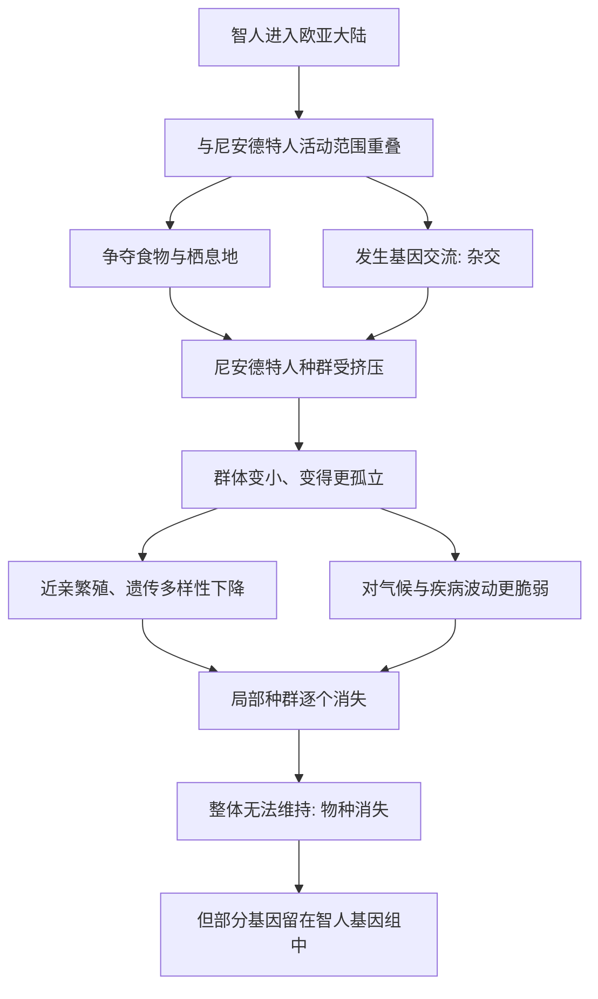

# 10｜尼安德特人是怎么消失的？

> 作为人类的近亲，尼安德特人为什么会从地球上消失？

---

## 一、先说结论

科尔伯特把尼安德特人的消失，当作一个特别贴近我们的案例：**他们不是被某种天灾一次性抹掉的，也不是因为"低等"而失败，而很可能是在一场漫长而复杂的竞争、杂交与人口消长中，被慢慢淹没的。**

这个案例的特别之处在于：尼安德特人不是"别的动物"，而是我们的近亲。他们会用火、会制造工具、会埋葬同伴，脑容量甚至不比我们小。正因如此，他们的消失逼着我们承认一个不太舒服的事实——**能走到今天的，未必是"更好的"，也可能只是"更多的、更巧的、运气更好的"。**

而关于他们究竟为什么消失，学界至今没有定论。科尔伯特给出的不是答案，而是一张由多条线索交织成的网。

---

## 二、我们先理解一个问题

先想一个问题：如果一个物种曾经在欧亚大陆上生存了至少几十万年，人数不算少，还适应了寒冷气候，那它怎么会在大约几万年前就彻底不见了？

这里的关键在于：**尼安德特人不是"突然消失"的，而是"范围一点点收缩、人数一点点变少，直到再也无法维持"。**

这就像一家经营了很久的老店。你不会看到它在某一天关门大吉，更多时候是：客流慢慢减少，分店一家家关，最后剩下的那家也撑不住了。过程的尽头才是"消失"，而过程本身已经持续了很久。

那我们要问的是：这场"慢性收缩"，到底是谁或什么造成的？

---

## 三、作者到底提出了什么观点？

科尔伯特认为，尼安德特人的消失至少牵涉三条线索：

1. **竞争。** 智人进入欧亚大陆后，与尼安德特人在食物、领地、石器资源上产生重叠。智人可能拥有更有效的合作方式、更远的贸易网络，或更灵活的工具技术。
2. **杂交。** 两者并非完全隔离——研究显示，今天非洲以外人群的基因组中，仍带有约百分之一到二的尼安德特人基因。这说明他们曾长期共存，并发生过基因交流。
3. **人口压力与随机因素。** 尼安德特人群体规模小、分布零散，本就容易受气候波动和近亲繁殖的影响。任何一次打击，都可能让一个地方种群再也无法恢复。

科尔伯特的核心判断是：**这不是一场"谁更聪明"的比赛，而是一连串因素叠加的结果。** 单一原因的解释，都不足以说明全部。

---

## 四、把这个观点翻译成人话

把它想成两家小店的竞争。

街角有一家开了很久的老铺子，老板手艺很好，街坊都认识他。后来，街对面新开了一家店，货品种类更多、人手更足、进货渠道更广。老铺子并没有做错什么，手艺也未必差，但它慢慢发现：客人被分走了，伙计不好招了，进货也贵了。

更要命的是，老铺子本来就只有几个人，一旦有人离开、有人生病，就转不过来；而新店人多，撑得住。

几代人之后，老铺子就只剩下招牌了。

**尼安德特人的处境，很可能就类似这样：不是被一次打败的，而是在"人少"对"人多"、"网络窄"对"网络宽"的长期不对称里，被一点点挤出了生存空间。** 关键是"不对称"，而不是"谁更优秀"。

---

## 五、为什么会这样？

为什么竞争与杂交加在一起，会让一个物种消失？可以用下面这条路径来梳理：

这条链条里最值得注意的是 **F → G → H** 这一段。

一个物种真正的危险，往往不是"被杀死"，而是**群体变小之后的连锁反应**：数量少了，找配偶变难，近亲繁殖增多，遗传多样性下降，抵抗环境波动的能力随之瓦解。到那时，哪怕没有直接的猎杀，种群也会自己走向衰亡。

而 **D → K** 这一支说明了另一件耐人寻味的事：**尼安德特人并未完全"消失"。** 他们的部分基因还活在我们身上，这是一场"物种层面的消失"与"基因层面的延续"同时发生的故事。

---

## 六、举一个现实生活中的例子

想想语言的处境。

世界上有很多使用人数很少的语言，它们往往只在一个小村落、一个家庭里被使用。语言的消失通常不是因为"它不好"，而是因为：年轻人去城里工作，改用更通用的语言；老人去世后，会讲的人越来越少；到某一天，最后一位流利的母语者离开，这门语言就再没人完整地讲得出来了。

**它没有做错任何事，只是使用它的人变少了。** 语言学家把这种现象叫作"语言的濒危"，而濒危的原因，往往就是人口规模、社会网络和使用场景的收缩。

这正是尼安德特人故事的另一种版本：**在规模与网络的竞争里，小的一方即便不落后，也会因为"太小"而难以持续。**

---

## 七、回到书中重新理解

现在再回看科尔伯特为什么要把尼安德特人放进这本讲"灭绝"的书里，就顺了。

前面写的渡渡鸟、大海雀、巨兽，都是"人类直接或间接把它们抹掉"的案例。尼安德特人则更进一步：**消失的，是和我们几乎一样的人类。** 这打破了"灭绝只会发生在低等生物身上"的想象。

更重要的是，它给出了一条规律：**当一个人群规模小、分布散、网络窄时，它面对冲击的韧性就弱。** 这条规律在今天依然成立——无论是濒危物种的保护，还是人类自身的族群处境，规模与连通性都是生存的关键变量。

科尔伯特借此提醒读者：**生态规律不因为对象"像我们"就网开一面。** 尼安德特人消失在同一个规律里，我们并不例外。

---

## 八、这个观点背后还有什么？

**第一，它挑战了"进步叙事"。** 我们习惯把演化想成"不断向更优的方向前进"，但尼安德特人的结局提示：淘汰不等于更差，存活不等于更优。

**第二，它把"人数"提升为一个独立变量。** 决定存亡的，除了能力，还有群体规模、分布密度与联结程度。

**第三，它让"杂交"从边缘现象变成主线。** 类群之间并非泾渭分明，交流是常态，这直接引出后面"物种到底是什么"的追问。

**第四，它预示了"人类影响地球"的更早起点。** 人类改变生态的历史，远早于工业革命——这一点，在人类跨入欧亚大陆、改变其他生命命运的那一刻就已经开始了。

---

## 九、这个观点有问题吗？

关于尼安德特人为什么消失，学界存在不同解释，而且至今没有共识。

一些科学家更强调**竞争**：认为智人在利用资源、组织合作或技术适应上具有优势，长期占据上风。

另一些科学家更强调**气候与环境**：尼安德特人恰好处在气候剧烈波动的时期，若干次严寒或大型火山事件（有研究提出火山喷发带来的"火山冬天"）可能重创了本就分散的群体。

还有研究者更强调**人口与遗传因素**：小群体、近亲繁殖、性别比例失衡，本身就可能让种群步入不可逆的衰退。

更有一种观点认为，**"消失"与"融合"是同一件事的两面**：尼安德特人未必是被完全取代，而可能是在长期杂交中被逐步"吸收"进智人群体。

因此，把尼安德特人的结局说成"智人赢了"可能过于简化。**目前的证据支持"多因素共同作用"这一较弱、但也更稳妥的结论**：竞争、气候、人口、杂交，谁的作用更大，仍需新的化石与基因组证据来判断。

---

## 十、今天再看这个观点

以下部分是基于本书思想的现代延伸，不是科尔伯特的原话。

今天，古基因组学让我们能直接读出尼安德特人的遗传密码。研究显示，他们与智人有深度的基因交流，而某些尼安德特人基因片段，今天仍与人类的免疫反应、皮肤、毛发等性状相关。这让"他们与我们是两种完全不同的生物"这一旧印象，越来越站不住脚。

更值得思考的是，尼安德特人的故事对今天的处境仍有现实意义：**当一个族群或物种因为规模太小、分布太散而失去抗冲击能力时，单靠"个体能力"是救不了它的。** 这既适用于濒危物种的保护，也适用于我们对自己社会的理解。

科尔伯特这本书的现代提醒或许在于：**"消失"往往不是一场爆炸，而是一场漫长的稀释。**

---

## 十一、这一篇真正应该记住什么？

1. **尼安德特人不是"低等生物"。** 他们会用火、制工具、埋葬同伴，脑容量不比我们小。
2. **他们的消失很可能是竞争、杂交与人口压力共同作用的结果。** 单一原因难以解释全部。
3. **"人数少、分布散"本身就是致命弱点。** 小群体在波动面前格外脆弱。
4. **他们并未彻底消失。** 部分基因仍留在今天非洲以外人群的基因组中。
5. **存亡不等于优劣。** 能留下，未必因为更强，也可能因为更大、更连通、运气更好。
6. **具体原因仍有争议。** 竞争、气候、人口、融合，学界各有侧重。

---

## 十二、留一个问题

> 如果尼安德特人的消失，不是因为他们"不够好"，
> 而是因为他们的群体太小、太分散、太脆弱；
> 那么当今天我们评估一个物种、乃至一个族群的存亡风险时，
> 我们是否也低估了"规模与联结"的分量？

---

**下一篇**：如果说人类跨入欧亚大陆时就已经开始改变其他生命的命运，那么人类对地球的影响，究竟是从什么时候开始的？是工业革命，还是更早？地质学家甚至为此提出了一个专门的说法。

下一篇我们就来拆开这个问题——**人类是从什么时候开始改变地球的？**
