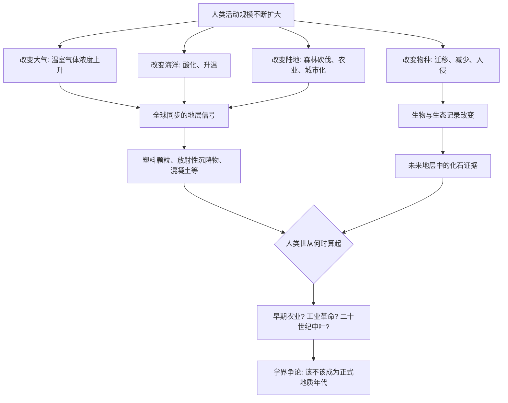

# 11｜人类是从什么时候开始改变地球的？

> 人类对地球的影响，是从工业革命才开始的吗？

---

## 一、先说结论

科尔伯特认为，人类对地球的影响，开始得比我们想象的早得多，也深得多。它不是从工业革命才开始的——**从大型动物的减少、森林的大规模砍伐，到化学物质与放射性物质进入环境，人类早已在改变这颗星球。**

地质学家甚至为此提出了一个专门的说法："人类世"。它主张，人类已经构成了一种地质力量，足以在岩层里留下自己的印记。而最能说明这件事的证据，听上去却很反常：**是塑料颗粒，和核试验留下的沉降物。**

至于人类世该从何时算起、算不算一个正式的地质年代，学界仍在激烈争论。

---

## 二、我们先理解一个问题

先理解地质学是怎么"记时间"的。

地质学家划分时间，靠的是**地层里的证据**：某个时期沉积下来的岩石、化石、化学成分，会留下独特的痕迹。只要在全世界的岩层里发现某种清晰、同步的标记，就能把同一个时间点对应起来。

那么问题来了：**如果未来有人来挖今天的地层，他会看到什么？**

他会看到：一层富含塑料微粒的沉积物；一层带有放射性同位素（来自大气层核试验）的沉积物；大量的混凝土、铝、飞灰；以及因燃烧化石燃料而改变的碳同位素比例。

这些东西的组合，在全球范围内几乎同时出现，非常醒目。**这就是"人类改变了地球"最直接的证据——不是看法，而是地层。**

---

## 三、作者到底提出了什么观点？

科尔伯特认为，人类世这个概念说明了三件事：

1. **人类的影响早已开始，且是逐步加深的。** 从早期人类扩散时大型动物的减少，到农业、森林砍伐，再到工业革命后的化石燃料燃烧，影响一层层叠加。
2. **人类已经具备"地质级"的力量。** 我们改变的不只是地表景观，还包括大气成分、海洋酸碱度、物种分布，乃至沉积物本身的组成。
3. **因此，"人类世"不只是一个环保口号，而是一个地质学问题。** 它要回答的是：我们是否已经开启了一个新的地质时代，以及它该从哪一年算起。

科尔伯特的核心判断是：**人类不只是生活在地球上，我们正在重写地球的档案。**

---

## 四、把这个观点翻译成人话

把它想成在书页上写字。

一本书，每一页记录一个时代。过去几亿年，写书的是火山、小行星、冰川、海平面。它们留下的字迹，是岩石、化石、化学层。

到了近几百年，发生了一件新鲜事：**有一支笔，开始自己往这本书上写。** 它写下塑料、混凝土、放射性同位素、异常的碳比例。这几乎是地球史上第一次，一个单一物种能在全球范围内，给地层留下如此清晰、如此同步的一笔。

"人类世"要讨论的，就是这支笔是**从哪一页开始落下的**：是工业革命那一页，还是更早的森林砍伐那一页，还是二十世纪中叶核试验与塑料大爆发的那一页？

---

## 五、为什么会这样？

为什么说人类已经成为一种地质力量？可以用下面这张图来梳理：

关键在 **F → I → J** 这一跳。

塑料与核沉降物之所以重要，是因为它们**在全球范围同时出现、又能长期保存**。大气层核试验产生的放射性同位素，随雨水与尘埃落遍全球；塑料自二十世纪中叶大规模生产后，微粒遍布海洋与湖泊的沉积物。**它们成了不需要解释就能被识别的时间标记。**

而 **J → K → L** 则说明，真正的难题不在"人类有没有影响地球"，而在"从哪一刻算起、要不要正式承认"——这是一个需要制定标准的科学问题。

---

## 六、举一个现实生活中的例子

想想你的手机相册。

照片按时间排序，想找某个事件，就看时间戳。但如果相册里突然多了几张拍摄时间不明、内容又很特殊的照片，你就很难判断：它们是哪一天拍的？要不要单独建一个相册，还是归进旧相册？

**"人类世"给地质学家出的，就是这道题。** 地层里已经出现了"新照片"（塑料、核沉降物），但它该被归为上一纪的一部分，还是单独分成一个"世"，需要一套标准来判断。

而这个判断并不轻松，因为它要求在全球范围内找到一个**最清晰、最同步、最合适的参考剖面**——这正是后面争议的来源。

---

## 七、回到书中重新理解

现在再回看科尔伯特为什么要把"人类世"放进这本书，就顺了。

前面写青蛙、大海雀、珊瑚，讲的是"人类正在消灭别的生命"；人类世这一章则把视角拉高：**人类改变的不只是别的物种，而是整颗星球的运行参数。**

这也解释了为什么"第六次大灭绝"不是危言耸听：如果人类已经能改变大气成分与岩层组成，那么改变物种的命运，只是其中一项后果。

科尔伯特想让我们看见的，是这个尺度的落差：**我们一边过着以日、以年计的日常生活，一边正在做以百万年计的地质改变。**

---

## 八、这个观点背后还有什么？

**第一，它把"环保"提升为"地质学问题"。** 影响一旦进入地层，就意味着它可能比人类文明本身更长久。

**第二，它揭示了"起点"的重要性。** 人类世从哪一年算起，决定了我们如何叙述人类与地球的关系。

**第三，它让"不可逆"变得具体。** 塑料、放射性同位素一旦进入地层，几乎无法清除。

**第四，它与物种问题相连。** 一个物种消失，也是一种进入地层、无法撤销的记录。

---

## 九、这个观点有问题吗？

关于"人类世"的界定，学界存在明确的不同意见，这是本篇最需要谨慎指出的一点。

**第一，起点在哪里，各方分歧很大。** 有学者主张从**工业革命**（约十八世纪末，大气中温室气体开始明显上升）算起；有学者主张更早，例如**早期农业**，或**欧洲人到达美洲后引发的人口锐减与森林恢复**（有研究指出，这一时期大气二氧化碳浓度出现了可测量的变化）；也有学者主张从**二十世纪中叶**算起，理由正是核试验沉降物与塑料等全球同步信号最清晰。

**第二，它是否应成为一个正式地质年代，本身就有争议。** 有研究者曾推动将其确立为一个新的地质"世"，并提出了以某处沉积物作为标准剖面的方案；但这一提案在最终的正式表决中未被接受。**因此，作为"概念"，人类世被广泛使用；作为"正式地质年代"，它至今没有被批准。**

**第三，"人类世"的叙事也可能带来误解。** 批评者担心，这个概念容易被解读为"人类整体都一样地负有责任"，从而掩盖了不同国家、不同群体在排放与消耗上的巨大差异。

**所以更准确的说法是**：人类已经在全球地层中留下了清晰可辨的印记，这一点证据充分；但"人类世"作为一个正式的地质时间单位，其起点与地位仍处在争论之中。**把"人类是有影响的"与"人类世已被正式确立"混为一谈，是不准确的。**

---

## 十、今天再看这个观点

以下部分是基于本书思想的现代延伸，不是科尔伯特的原话。

今天，"人类世"已经从学术讨论扩散为公共语言，被广泛用于描述人类对地球的系统性影响。与此同时，围绕它的学术争议仍在继续：研究者在讨论更精细的信号、更好的参考剖面，以及这个概念的适用范围。

一个值得玩味的延伸是：**人类不仅是地层的"作者"，也可能成为它未来的"读者"。** 今天我们读恐龙化石来了解白垩纪；未来的地质学家，或许会通过塑料与放射性层，来了解我们这个时代。

科尔伯特这一篇的现代意义或许在于：**它迫使我们把"当下"放进"地质时间"里审视。** 我们习惯以人生为尺度，而人类世说的是：我们正在做的事，会被记在很久很久之后的书页上。

---

## 十一、这一篇真正应该记住什么？

1. **人类对地球的影响，远早于工业革命。** 大型动物减少、森林砍伐，都是早期信号。
2. **人类已具备"地质级"力量。** 大气、海洋、物种、沉积物都在被改变。
3. **塑料与核沉降物，是"人类世"最清晰的标记。** 它们全球同步、长期可辨。
4. **"人类世"的起点与地位仍在争论。** 作为概念被广泛使用，作为正式地质年代尚未确立。
5. **人类正在重写地球的档案。** 影响之长远，可能超过文明本身。
6. **争议提醒我们：影响是真的，命名是另一回事。**

---

## 十二、留一个问题

> 如果未来有人挖开今天的地层，
> 他会读到塑料、混凝土，和来自核试验的放射性痕迹；
> 那么在我们亲手写下的这一页里，
> 我们究竟希望后人读到"一个时代"，还是读到"一次事故"？

---

**下一篇**：既然人类已经能改变整颗星球，那我们从一开始是在"保护"什么？我们说要保护物种，可"物种"这个最基本的单位，真的像我们想的那么清楚吗？

下一篇我们就来拆开这个问题——**物种到底是什么？**
