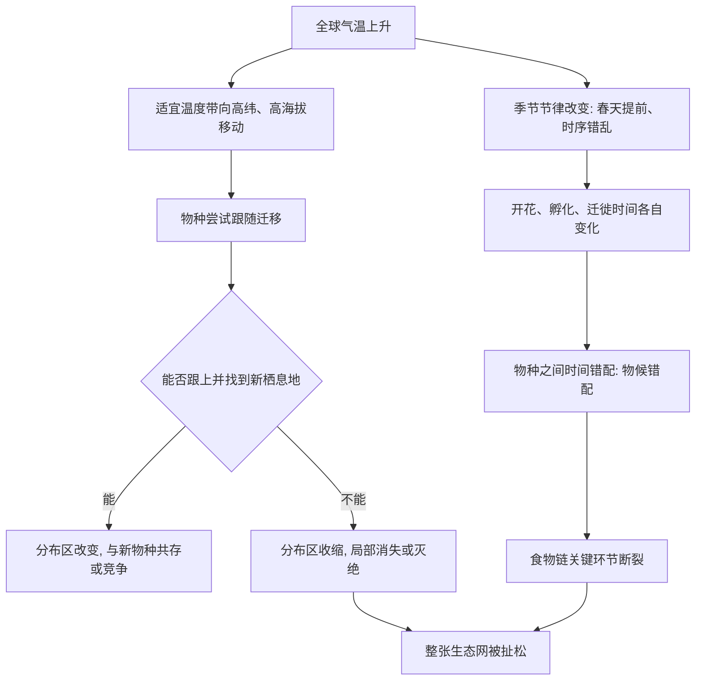

# 13｜气候变暖会如何重排生命？

> 升温一两度，为什么对生命是巨大的冲击？

---

## 一、先说结论

科尔伯特认为，气温升高一两摄氏度，听起来不多，但对生命来说是巨大的冲击，原因有两个层次：

第一，**许多物种的生存，依赖某个特定的温度区间**。一旦超出，它们不会"忍耐一下"，而是被迫迁徙——向高纬度、向高海拔移动，去寻找合适的温度。

第二，**生命的运转还有时间表**。什么时候开花、什么时候产卵、什么时候迁徙、什么时候孵化，各个物种之间相互咬合。升温会打乱这套时间表，让本该同步的事件错开——这就是"物候错配"。

第一层是空间上的位移，第二层是时间上的错位。两者叠加，整张生态网就会被扯松。

---

## 二、我们先理解一个问题

先想一个问题：如果你家暖气突然升高了三度，你会怎么办？

对大多数现代人来说，答案很简单：调回来，或者开窗。**人类可以让自己的小环境保持恒定**，这就是空调、暖气、房子的意义。

但绝大多数生物没有"房子的开关"。**它们唯一能做的，是挪动自己**——去一个温度合适的地方。

于是问题就变成了：当整片大陆在一起变热时，那些不能快速移动、或已经无处可去的物种，靠什么活下去？

这两个问题——"能不能挪"和"挪到哪去"——是理解气候如何重排生命的钥匙。

---

## 三、作者到底提出了什么观点？

科尔伯特认为，气候变暖对生命的冲击，主要体现在三个方面：

1. **物种被迫迁移。** 随着适宜温度带向极地方向和更高海拔移动，许多物种也跟着移动。这个过程在海洋、山地、森林里都被观察到。
2. **迁移不及者消亡。** 移动速度、地理障碍（山脉、海洋、城市）、繁殖速度，都会限制物种"追赶"气候的能力。追不上的，就面临局部消失乃至灭绝。
3. **物种之间的节奏被打乱。** 花开、虫孵、鸟迁、鱼洄游，这些事件原本按季节相互咬合。变暖让它们各自提前或推迟，且提前幅度不同，于是"错配"出现。

科尔伯特的核心判断是：**气候变暖最危险的地方，未必是"更热"，而是"错位"——物种与气候错位，物种与物种之间错位。**

---

## 四、把这个观点翻译成人话

把它想成一个齿轮传动的机械表。

表能走准，靠的是所有齿轮都咬合到位、转速匹配。现在，你让其中几个齿轮转得快一点，另外几个不动。结果是什么？

不是表走快，而是**表停摆**。

生态系统就像这样一台表：蜜蜂出巢、花朵开放、鸟类育雏、鱼类产卵，每个环节都有自己的时间。气候变暖让"春天"提前到来，但不同物种感知和反应的方式不同——有的跟着早，有的反应慢，有的靠日照长短而不靠温度。于是原本咬合的齿轮开始打滑。

**物种并不是因为"天太热"而崩溃，而是因为"原本说好的时间，对不上了"。**

---

## 五、为什么会这样？

为什么"升温一两度"会引发如此连锁的反应？可以用下面这张图来梳理：

关键在 **C → H → I → J** 这一支。

它揭示了气候影响最难看见的一层：**不是某个物种被热死，而是它赖以生存的"关系"被打断。** 一只鸟不会因为气温高一度就死掉，但如果它到达繁殖地时，毛虫的高峰已经过去了，它的雏鸟就可能饿死。这种影响不直接、不显眼，却极其致命。

而 **E → F** 这一支也提醒我们，变化并非全是坏事：有些物种的分布区反而扩大。但生态影响从来是"重排"而非"普遍衰退"——**有人受益，有人受损，整体结构却变了。**

---

## 六、举一个现实生活中的例子

想想高铁时刻表。

一趟列车能不能准点到达，不取决于它跑得多快，而取决于整张时刻表是否配合：几点发车、几点换乘、几点到达。如果只调整了一个站点的发车时间，而别的站点不变，乘客就会集体错过接续的车次。

**气候变暖做的事，就是悄悄改动了这张"生态时刻表"，而且只改了其中一部分。** 有的物种按温度调整了时间，有的物种按日照长短行事、纹丝不动。于是原本能接上的环节，接不上了。

从这个角度看，保护生物多样性，某种意义上就是在**维护一张精密的时间表**——而它正在被我们自己打乱。

---

## 七、回到书中重新理解

现在再回看科尔伯特为什么要写气候这一章，就顺了。

前面写青蛙、珊瑚、森林，大多是"直接"的伤害：真菌、酸化、砍伐。气候这一章展示的是更隐蔽的一层：**不直接杀死，而是打乱秩序。**

这也解释了为什么气候问题如此难被重视：它的伤害是慢的、间接的、跨物种的，没有单一的"凶手"和"现场"。人们更容易理解"一片森林被砍光了"，却很难理解"鸟和毛虫的时间对不上了"。

科尔伯特想让我们看见的，正是这种看不见的错位：**生态系统的稳固，靠的不只是物种的数量，还有它们之间的配合。**

---

## 八、这个观点背后还有什么？

**第一，它把"温度"从一个数字变成了生态变量。** 一两度的差别，对文明或许微不足道，对生命却可能决定存亡。

**第二，它说明"移动能力"是一种关键的不平等。** 会飞、会游、繁殖快、分布广的物种更容易应对；岛屿、山顶、湖泊里的物种则无路可退。

**第三，它把保护的对象从"物种"扩展到"关系"。** 保住一个物种，往往还必须保住它依赖的季节、食物与伙伴。

**第四，它与入侵物种问题相连。** 气候变暖让一些物种能够进入原本太冷的地方，也等于给"入侵"打开了新的大门。

---

## 九、这个观点有问题吗？

气候会重排生命，这一点证据相当多，但具体判断上，仍有需要谨慎的地方。

**第一，物种对气候的响应并不一致。** 有的迁移，有的靠行为调节，有的靠演化适应。把"升温必然导致灭绝"当作普遍规律，会忽略这种差异。

**第二，观测到的分布变化，原因是多重的。** 栖息地破坏、污染、入侵物种都在同时起作用，气候只是其中一个因素；把它单独指认为唯一原因，容易过度归因。

**第三，"物候错配"的普遍性与后果仍在研究中。** 已有不少案例显示错配存在，但不同物种、不同地区的表现差别很大，哪些错配会真正导致种群衰退，需要更长期的观察。

**第四，预测模型本身有不确定性。** 温度上升幅度、物种迁移速度、生态相互作用，都是难点，模型给出的往往是范围而非确定值。

**所以更准确的说法是**：气候变暖确实在重排生命的分布与节律，这一点有大量证据；但具体到"哪里的哪个物种会怎样"，仍是高度依赖情境、且仍在持续研究的科学问题。

---

## 十、今天再看这个观点

以下部分是基于本书思想的现代延伸，不是科尔伯特的原话。

今天，气候对生物影响的研究已经成为一个庞大的领域。研究显示，全球变暖正在推动许多物种向极地和高海拔移动，山地物种面临被"逼到山顶"的困境；海洋热浪则让珊瑚礁反复白化。这些现象，与书中描述的方向一致。

同时，今天的讨论也更加精细：不再只问"会不会灭绝"，而是问"哪些物种、在什么条件下、以多快的速度"。这让保护工作更聚焦，也更复杂。

科尔伯特这一篇的现代意义或许在于：**我们常把气候问题当作"天气问题"，但它首先是"生命问题"。** 一两度的差别，落在人身上是舒适度，落在其他生命身上，则可能是它们的整个时间表。

---

## 十一、这一篇真正应该记住什么？

1. **升温一两度，对生命是巨大冲击。** 因为生命的生存依赖特定的温度区间与季节节律。
2. **物种的两条应对路径：迁移与错配。** 迁不了，或时间对不上，都会出问题。
3. **物候错配是隐蔽而致命的。** 食物链的关键环节可能因为时间错开而断裂。
4. **生态的稳固靠"关系"，不只靠"数量"。** 保护必须考虑物种之间的配合。
5. **响应并不一致。** 有受损者，也有受益者，整体结构会被重排。
6. **具体预测仍有不确定性。** 气候只是众多压力之一，归因需要谨慎。

---

## 十二、留一个问题

> 如果气候变暖最危险的地方，不是让地球变热，
> 而是让生命彼此的时间与位置对不上；
> 那么我们在制定保护策略时，是不是也该从"保住某个物种"，转向"保住它们之间的关系"？

---

**下一篇**：气候打乱了原有的时间表，也让一些物种得以进入原本不属于它的地方。当人类的活动把陆地和海洋前所未有地连通起来，"外来者"就可能变成灾难。

下一篇我们就来拆开这个问题——**入侵物种为什么如此致命？**
