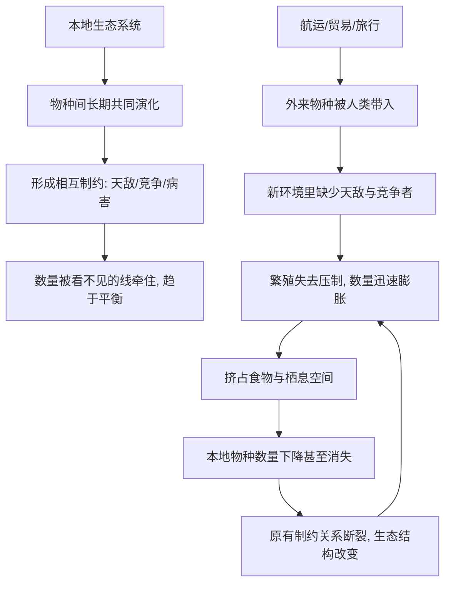

# 14｜入侵物种为什么如此致命？

> 一个"外来物种"，为什么能摧毁一个原本稳定的生态系统？

---

## 一、先说结论

科尔伯特在这条线索里想说明的，不是"外来物种都是坏东西"，而是一个更微妙的判断：**一个生态系统之所以稳定，往往不是因为里面的物种各自强大，而是因为它们彼此牵制。**

本地物种经过漫长的共同演化，形成了相互制约的关系：谁吃谁、谁和谁竞争、谁替谁传粉。而外来物种，是带着一份"免罚单"进场的——它在新的环境里可能没有天敌、没有势均力敌的竞争者、也很少被本地的病害压制。于是它可能迅速繁殖，把本地物种挤到没有立足之地。

这里要分清两件事：**并不是所有外来物种都会造成灾难**，许多外来物种在新环境里安分共存；但一旦某个外来物种"失控"，后果常常是连锁的、难以逆转的。而人类活动（航运、贸易、旅行）正在让这种失控变得空前频繁。

---

## 二、我们先理解一个问题

先想一个反直觉的场景。

一片森林里，有一种昆虫只吃某一类树叶。看上去它随时可能把树吃光。但它没有。为什么？

因为它有捕食者、有寄生蜂、有季节性的寒冷、也有同类之间的竞争——它的数量被无数条看不见的线牵住。这些线，是几千年、几万年共同演化磨出来的默契。

现在，假设有一种生物，突然被带到了这片森林。它没有那些牵制它的线，不必和谁周旋，也不必躲谁的天敌。它只做一件事：尽可能多地繁衍。

> 问题就在这里：一个物种的"致命"，未必来自它有多强，而可能来自它有多"自由"。

为什么缺少制约的外来物种，会比本地物种更容易失控？而被它挤压的那些本地物种，为什么往往连反应的时间都没有？

---

## 三、作者到底提出了什么观点？

科尔伯特沿着入侵物种这条线索，提出了可以概括为三层的判断：

1. **本地生态系统的稳定，来自共同演化形成的平衡。** 物种之间的关系是被时间"调平"的，而不是天然就和谐。
2. **外来物种的破坏力，常常来自缺少天敌与制约。** 它进入一个没有对手的环境，繁殖不再被压制，于是数量暴涨，挤压本地物种的食物与空间。
3. **人类活动让人为的物种迁移空前频繁。** 航运的压舱水、贸易的货物、旅行的行囊，都在把物种从一个大陆运到另一个大陆——这种速度，是自然扩散远远比不上的。

科尔伯特并不把这些案例讲成"某条蛇或某种动物很邪恶"。她想指出的是：**真正被改变的是规则本身——当物种的分布可以被人瞬间改写，演化就来不及做出回应。**

---

## 四、把这个观点翻译成人话

把它想成一个"空降进来的竞争者"。

一个公司里，大家各司其职，部门之间互相牵制，谁也不能一下子吞掉别人。这套平衡不一定高效，但它相对稳定。

某天，来了一个新人：他不受任何部门约束，绩效规则对他不管用，他一个人干的活顶十个人。短期看，他"很厉害"。但如果这样的力量无限扩张，原来的部门一个个被挤掉，整个公司的结构就崩了。

**你很难说这个新人"有错"。** 他只是在一个不再有约束的规则里，做了最自然的事。

外来物种也是这样。在本地的那套规则里，它可能只是很普通的一员；换了一个没有对手的舞台，它就成了压倒性的力量。

---

## 五、为什么会这样？

关键在 **E → F → G** 这一跳。

一个外来物种之所以能造成这么大动静，不是因为它"战斗力"多强，而是因为它成功绕开了本地生态里那些制约它的线。而让这种"绕开"反复发生的，是 **K**：人类活动把原本隔着海洋、山脉的物种，直接放到了一起。

**平衡需要漫长的时间形成，破坏却可以很快完成。** 这就是入侵物种问题的核心不对称。

---

## 六、举一个现实生活中的例子

关岛的棕树蛇，是这条线索里最令人震惊的案例之一。

关岛曾有多种本地鸟类，在岛上生活了漫长的岁月。岛上的生态系统里，没有能对付大型树栖蛇类的天敌——因为在蛇被带上来之前，这样的角色根本不存在。棕树蛇搭乘人类的货运，到了关岛。研究显示，在蛇类扩散之后，关岛多种本地鸟类急剧减少，有的在野外彻底消失，森林里再也听不到它们的叫声。

另一个例子是澳洲的兔子。兔子被人类带到澳洲，原本用作狩猎与养殖。问题是：澳洲的本土生态里，没有专门牵制兔子的捕食者。于是兔子的数量迅速膨胀。它们啃食草被与幼树，让大片土地的表土裸露、水土流失，本地植物与依赖它们的动物一并受到挤压。人们后来不得不动用各种手段来控制它们，代价高昂，而且至今没有彻底解决。

> 这两个案例的共同点不是"蛇很坏"或"兔子很坏"，而是：**它们进入了一个没有针对自己的约束的环境。**

---

## 七、回到书中重新理解

现在再看科尔伯特为什么把入侵物种放在讨论"机制"的这一部分，就清楚了。

她不是在一个个地讲"坏动物"的故事。她是在告诉我们：**生态系统不是一堆物种的简单相加，而是一张依赖关系的网。** 这张网之所以稳定，靠的是长期形成的相互制约。

所以，一个外来物种的进入，本质上不是"多了一种生物"，而是往这张网里塞进了一个它没有对应的节点。这个节点可能不参与原有的约束关系，却直接消耗网的资源，于是网被拉松、拉断。

回到全书的主线，这一篇其实补上了一环：前面讲栖息地丧失、气候变暖，说的是"环境在变"；而入侵物种提醒我们——**物种之间原本的位置关系，也在被人类改写。** 这两件事叠加，才是第六次大灭绝的完整拼图。

---

## 八、这个观点背后还有什么？

**第一，它改变了"保护"的对象。** 保护不只是给某个物种留一片空地，还要防止外来物种打乱原有的关系——有时候，阻止一个入侵者站稳脚跟，比事后拯救一百个本土物种更紧迫。

**第二，它揭示了全球化的生态代价。** 航运与贸易把经济连成一体，也把物种连成一体。货物流通的速度，远超任何生态系统的适应能力。

**第三，它提醒我们"平衡"是脆弱的、也是有条件的。** 平衡不是永恒的静止，而是被无数条线共同维持的、动态的、随时可能被打破的状态。

**第四，它把"人类是加速器"这件事讲得特别具体。** 物种自然扩散本来以极慢的速度发生，而航运、贸易、旅行把这速度压缩到几乎瞬间。

---

## 九、这个观点有问题吗？

作为一条主线，这个观点有力量，但也有一些需要小心的地方。

**第一，"外来物种必然有害"是一种过度简化。** 很多外来物种在新环境里安分共存，甚至成为农业与生态的一部分。判断一个物种是否"入侵"，取决于具体环境与具体条件，不能一概而论。

**第二，把本地与外来对立起来，边界可能并不清晰。** 在气候变化导致物种分布自然迁移的背景下，"本地"与"外来"的界线本身正在变得模糊。关于这一点，学界存在不同解释与争论。

**第三，叙事容易聚焦在戏剧性的个案上。** 棕树蛇、兔子这样的案例冲击力强，但入侵物种问题的全貌，还包括大量不显眼的植物、昆虫与微生物，它们的影响同样深远，只是不容易被讲成故事。

**第四，本地物种并不总是"无辜受害者"。** 有些生态系统的变化，是入侵物种与人为干扰共同作用的结果。把责任全部归于某个外来物种，有时会掩盖更根本的原因——人类对栖息地的破坏。

**所以更准确的说法是**：入侵物种确实是一种真实且严重的威胁，但"外来等于有害"的简单公式并不成立；真正关键的是原有的约束关系是否被打破，以及人类是否在为这种打破创造条件。

---

## 十、今天再看这个观点

以下部分是这一思想的现代延伸，不是科尔伯特的原话。

今天，全球贸易与旅行比科尔伯特写作时更加密集。集装箱、冷链、网购、跨境旅游，把物种迁移的通道扩展到了前所未有的程度。学界对入侵物种的监测与研究也在加深：越来越多的国家和地区建立了外来物种预警与检疫体系，因为人们逐渐明白，**事后的清除，往往比事前的防止昂贵得多。**

更值得注意的是，气候变化正在和入侵物种产生叠加效应。升温让一些原本无法越冬的外来物种在新地区站稳脚跟，也让本地物种更加虚弱、更无还手之力。两股力量相互放大，而不是彼此抵消。

所以，这一篇的现代意义也许在于：**在一个高度连通的世界里，"边界"不再只是政治概念，也是生态概念。** 我们享受着连接带来的便利，也必须承担连接带来的风险。

---

## 十一、这一篇真正应该记住什么？

1. **本地物种之间的稳定，来自长期共同演化形成的相互制约。**
2. **外来物种的破坏力，常常源于缺少天敌与竞争者，而非自身"强大"。**
3. **关岛的棕树蛇与澳洲的兔子，都是"失去制约"的经典案例。**
4. **人类活动让物种入侵空前频繁，速度远超自然扩散。**
5. **平衡形成得慢，破坏却可以很快——这是入侵问题的核心不对称。**

---

## 十二、留一个问题

> 如果入侵物种的杀伤力，本质上来自"旧的制约关系在它身上不生效"，
> 那么在我们不断把物种、货物和人于全球之间搬来搬去的时候，
> 我们究竟是在创造一个更丰富的世界，还是在制造一次次"制约失灵"的机会？

---

**下一篇**：既然有些物种已经永远消失，人类自然会想：技术这么发达，能不能把它们"复活"？这个念头听起来像科幻，却已经进入了严肃的科学与伦理讨论。下一站，我们去看"去灭绝"到底意味着什么。

下一篇我们就来拆开这个问题——**"去灭绝"能救回失去的物种吗？**
