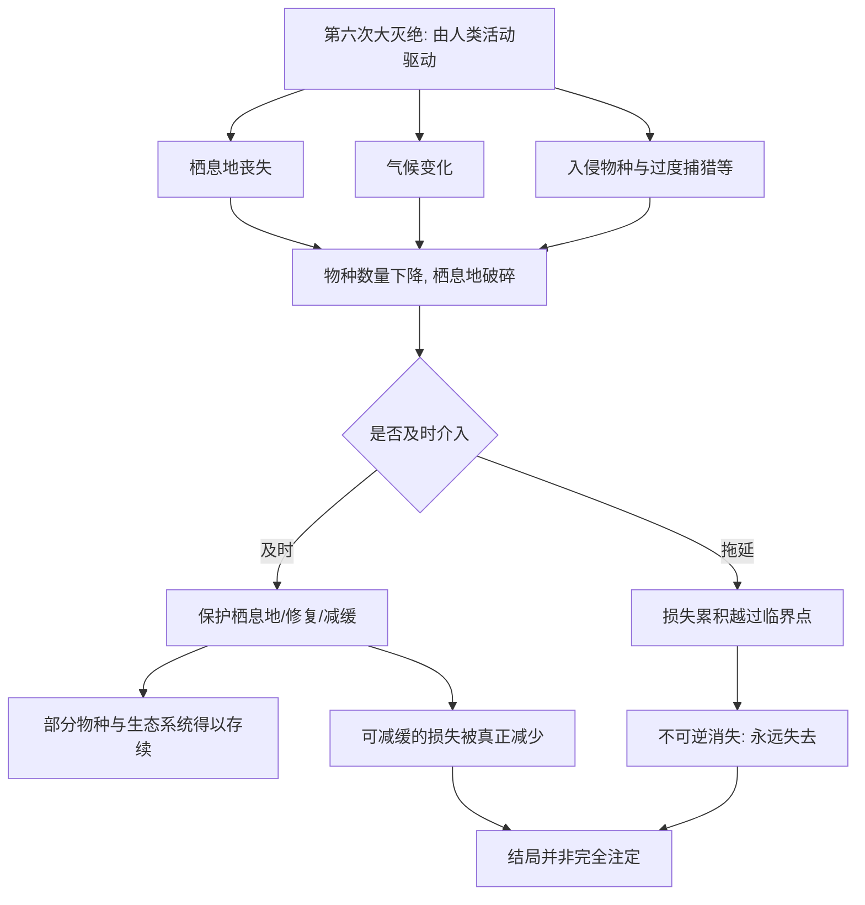

# 16｜面对第六次大灭绝，我们该怎么办？

> 看清了代价之后，人类究竟还有没有选择？

---

## 一、先说结论

科尔伯特在这一篇里，既没有给廉价的希望，也没有把我们推向绝望。

她的判断可以这样概括：**物种消失的过程，是可逆程度不同的。** 有些损失一旦发生，就再也无法挽回；但也有些损失，可以通过保护、修复与减缓而实实在在地减少。

所以真正的问题，不是"人类能不能挽救一切"——答案是挽不回全部；也不是"人类注定无能为力"——那也不对。真正的问题是：**我们愿不愿意为那些"看不见的代价"买单。**

一句话：**科尔伯特的清醒，既不等于乐观，也不等于认命，而是承认还有一部分结局，取决于我们此刻的选择。**

---

## 二、我们先理解一个问题

先分清两种"损失"。

一种损失是**不可逆**的：一个物种在野外彻底消失，它的基因、它的生态角色、它与其它生物共同演化的历史，一并归零。这样的损失，事后无论投入多少资源，都无法真正还原。

另一种损失是**可减缓的**：栖息地还没有被完全破坏，种群数量还在下降但尚未归零，气候还在恶化但尚未跨过某些临界点。这些损失，如果在足够早的时候介入，是可以被显著减少的。

> 于是最要紧的问题就变成了：**我们知道这两种损失同时存在，那么我们优先保住哪些、又在哪些上认输？**

这不是一个"科学能给出标准答案"的问题，而是一个"愿不愿意付出代价"的问题。而科尔伯特想让我们看清的，正是这道题的真实结构。

---

## 三、作者到底提出了什么观点？

科尔伯特沿着全书的主线收束，提出了可以概括为三层的判断：

1. **物种消失的代价，常常是"看不见的"。** 它不像一场地震那样立刻显现，而是缓慢累积，容易被忽略、被推迟、被当作"以后再说"。
2. **损失的可逆程度不同。** 有些物种、有些生态系统一旦失去就永远失去；但另一些损失，是可以通过保护、修复与减缓而减少的。所以"全都完蛋"和"都能挽回"这两种说法，都是过度简化。
3. **决定权在人的选择上，而不在宿命里。** 真正的问题不是"是否会失去"，而是我们愿不愿意为那些看不见的代价让渡眼前的便利与利益。

科尔伯特并不假装这些选择是轻松的。她只是指出：**把"没办法"当成结论，本身也是一种选择。**

---

## 四、把这个观点翻译成人话

把它想成一份身体的健康报告。

医生告诉你：有些损伤已经发生，比如某个器官的慢性病变，无法完全逆转；但另一些指标虽然在恶化，却还来得及稳定住，只要你现在开始改变生活方式。

这时你面对的不是"能不能治好"的问题，而是：

- 你愿不愿意为几十年后那个看不见的风险，现在就付出代价？
- 你会不会因为"反正有些已经治不好了"，索性放弃能救的那部分？

**真正难的，从来不是诊断，而是愿不愿意在代价还不明显的时候，就开始行动。**

对第六次大灭绝而言，情况完全一样。它最残酷的地方，不在于人类没有能力做什么，而在于**需要付出代价的时刻，总是比灾难真正显现的时刻早得多。**

---

## 五、为什么会这样？

关键在 **F** 这个分叉。

左边的一条路，是趁损失还可逆时介入；右边的一条路，是等到越过临界点，只能接受不可逆的结果。而决定走哪条路的，不是科学，而是**我们在代价尚不明显时，愿不愿意先行动。**

这也是为什么科尔伯特反复强调"看不见的代价"——因为最需要行动的窗口期，往往正是最容易被忽视的那段时间。

---

## 六、举一个现实生活中的例子

把她的思路落到具体行动上，大致是三类。

**第一，保护栖息地。** 前面已经说过，栖息地丧失是当前物种消失的首要推手。保留连片的森林、湿地、珊瑚礁，让物种不至于被困在碎片化的"孤岛"里，是成本相对可控、效果相对直接的一步。很多时候，**不破坏，本身就是最有效的保护。**

**第二，减缓气候变化。** 气候变暖会迫使物种向高纬度、高海拔迁移，也会打乱物种之间原有的节奏。减少温室气体排放、保护能固碳的生态系统，都是在为物种争取适应的时间。它慢，但方向明确。

**第三，控制入侵物种。** 前面讲过，外来物种的破坏力常常来自缺失制约。加强检疫、防止压舱水带走物种、在关键地区控制已经扩散的入侵者，都是在修补那张被拉松的生态网。

> 这三类行动的共性在于：它们都不会带来立竿见影的回报，却都在减少未来那些"看不见的代价"。

---

## 七、回到书中重新理解

现在再把全书串起来看，脉络就很清晰了。

从"灭绝"这个概念的发现，到五次大灭绝，到第六次的判断；从青蛙、大海雀、珊瑚、森林，到巨兽、岛屿、尼安德特人与人类世；再到物种、气候、入侵物种、去灭绝——**科尔伯特其实一直在做同一件事：把"正在失去什么"变成可以被看见、被理解、被感受的东西。**

而这一篇，是全书从"看见"走向"选择"的转折。她不想用一个光明的结尾来安慰读者，也不想用一个末日式的结尾来震慑读者。她想做的是：**让你在完全了解代价之后，自己决定要不要在乎。**

所以，这一篇真正重要的判断是：**人类或许无法阻止大灭绝的全部进程，但"进程走到哪一步"，仍有相当部分握在当下的选择里。**

---

## 八、这个观点背后还有什么？

**第一，它把"希望"重新定义了。** 真正的希望不是"一切都还有救"，而是"还有一部分取决于我们"。

**第二，它承认了取舍的必然。** 资源有限，我们不可能同时保住一切。承认取舍，比假装没有取舍更诚实。

**第三，它把责任从"未来的人"拉回了"此刻的人"。** 决定不是某一天做出，而是由每天的选择累积而成。

**第四，它让"保护"不再只是道德姿态，而是具体的成本核算。** 愿不愿意买单，是一个可以追问、也可以被检验的问题。

---

## 九、这个观点有问题吗？

作为全书的收束，这个立场克制而诚实，但也有一些可以追问的地方。

**第一，"可减缓"的判断，依赖于尚未跨过临界点的假设。** 一旦某些系统越过临界点，原本"可逆"的损失也可能变成不可逆。关于临界点的位置与后果，学界存在不同意见。

**第二，"愿不愿意买单"的说法，可能低估了结构性障碍。** 很多时候，问题不是个人愿不愿意，而是经济结构、政策与全球协作的难度——把责任完全落在"意愿"上，可能过于简化。

**第三，"不给廉价希望"本身也可能带来另一种风险。** 如果读者只接收到"代价惨重、选择艰难"，也可能滑向麻木与无力。关于如何传递这种清醒而不导向绝望，本身就是一道难题。

**第四，它终究是一种立场，而非纯科学结论。** 科尔伯特的价值在于诚实呈现复杂性，而不是给出一个可以被简单执行的答案。

**所以更准确的说法是**：这一篇给出的不是解决方案，而是一种态度——**在无法保证结果的前提下，仍然认真对待选择。**

---

## 十、今天再看这个观点

以下部分是这一思想的现代延伸，不是科尔伯特的原话。

今天，关于生物多样性、气候与生态的讨论，比这本书写作时更加广泛，也更加紧迫。越来越多的国家把生态保护写入政策，越来越多的普通人愿意为"看不见的代价"做出一点让步——减少浪费、支持可持续的产品、关注身边的栖息地。

这些行动单个看都很小，甚至显得杯水车薪。但这一篇真正想说的是：**大灭绝不是一次事件，而是一个过程；而过程，是由无数个"此刻"组成的。** 我们无法回到没有被破坏之前的世界，却可以决定它接下来变成什么样。

---

## 十一、这一篇真正应该记住什么？

1. **科尔伯特不给廉价希望，也不陷入绝望——她给的是"清醒"。**
2. **损失的不可逆程度不同：有些一旦失去就永远失去，有些仍可被减少。**
3. **真正的问题是愿不愿意为"看不见的代价"买单。**
4. **保护栖息地、减缓气候变化、控制入侵物种，是具体而现实的方向。**
5. **结局并非完全注定，一部分仍握在当下的选择里。**

---

## 十二、留一个问题

> 如果人类终究无法阻止大灭绝的全部进程，
> 那么当后代回望我们今天的选择时，
> 他们更可能责备我们"没能挽救一切"，
> 还是责备我们"明明还有机会，却没有认真去做"？

---

**全系列收束**

走到这里，我们已经从"灭绝"这个概念的诞生，一路看到正在消失的生命、人类与巨兽的旧账、机制的复杂、以及去灭绝的争议，最后回到一个关于选择的追问。

回头再看第一篇：当年，人类花了很久，才敢承认"有些东西会永远消失"。那是一次认知上的突破——承认世界会有无法填补的空缺。而今天，我们面对的，是同一个问题的升级版：**我们不仅知道物种会灭绝，还知道这件事很大程度上正由我们自己推动。**

但认知一旦完成，接下来的就不再是"能不能看清"，而是"看清之后怎么办"。

关于这个问题，科尔伯特没有替我们回答，也没有谁能替我们回答。她把代价、把争议、把选择，一样一样摆在我们面前，然后把笔交还给了读者。

所以这个系列真正的结尾，不是这篇文章，而是你合上书之后的那个念头——

> **看清了这一切之后，你打算怎么理解它，又打算做点什么？**

答案不必宏大，也不必与谁一致。它只需要是你自己认真想过之后，愿意承担的答案。

**（全系列完）**
