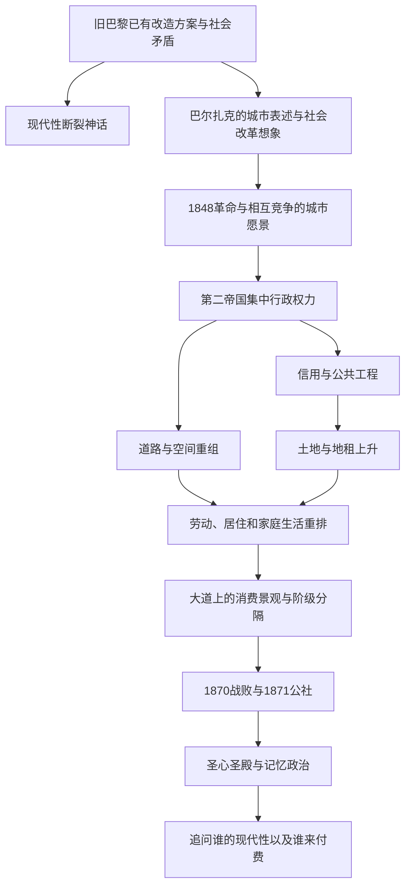

# 00｜系列拆解与目录

> 大卫·哈维《巴黎，资本之都的诞生》（Paris, Capital of Modernity）深度解读系列：从现代性神话走进一座被资本、国家与市民共同改造的城市。

## 系列简介

《巴黎，资本之都的诞生》把十九世纪巴黎当成一间观察现代资本主义城市的实验室。人们常说，奥斯曼一上任，狭窄的老城就突然变成宽阔、光亮、现代的首都；哈维追问：改造的设想此前就有，为何偏偏在革命受挫后获得资金、行政权力和政治正当性？道路、信贷、地租、工厂、家庭、百货商店与纪念碑，怎样共同决定谁能留在城市中心、谁承担代价？这本书值得读，不是因为它提供了一个万能的“拆迁解释”，而是它教我们同时看见对城市的想象和城市的物质生产。本系列按“观念与革命—空间与资本—权力与日常—城市的象征—历史余波”重组为十四个单一问题。以出版社章节目录、公开导论与史学评论为事实边界；生活场景是解释性的假设，不冒充史料或书中引文。

## 全书核心问题

| 层次 | 核心问题 | 阅读抓手 |
|---|---|---|
| 认识 | “现代性是一刀两断”为什么是有力却不可靠的故事？ | 现代性的断裂神话、巴尔扎克的城市书写 |
| 历史 | 1848 年之后，谁有权决定城市应当变成什么？ | 革命、乌托邦、第二帝国 |
| 机制 | 街道、融资和土地为何能把危机转化为建设，也把建设变成新风险？ | 空间重组、信用、地租 |
| 权力 | 国家、劳动、家庭、消费怎样一起维系新巴黎？ | 治理、阶级、女性、再生产、景观 |
| 意义 | 纪念碑如何把胜利者的城市记忆固定下来？ | 公社、圣心圣殿、历史解释的边界 |

## 全书知识地图

## 全系列目录

### 第一部分：谁发明了“全新的巴黎”

#### 01｜巴黎真的是被奥斯曼一夜改造成现代城市的吗？
核心问题：为什么“奥斯曼从零创造现代巴黎”既诱人又不准确？
核心观点：哈维质疑现代性作为彻底断裂的神话；规划有前史，真正改变的是旧方案在新权力与资本条件下被放大和执行。
理解难度：★★☆☆☆
关键词：现代性、断裂神话、奥斯曼、历史连续性

---

#### 02｜巴尔扎克的小说为什么能帮助我们理解一座城市？
核心问题：文学描写怎样揭示地图与统计表看不见的城市关系？
核心观点：哈维借巴尔扎克观察阶级、商品与欲望的城市形象；小说是理解当时想象的材料，而不是可直接当成统计事实的证据。
理解难度：★★★☆☆
关键词：巴尔扎克、表述、商品化、城市想象

---

#### 03｜革命者想象的巴黎，为什么不止一种？
核心问题：1848 年以前的社会改革方案为什么会相互竞争？
核心观点：改造不仅是铺路，也涉及劳动组织、公共生活与政治共同体；不同群体对“更好的城市”有不同答案。
理解难度：★★★☆☆
关键词：乌托邦、改革、1848、公共生活

---

### 第二部分：街道、钱和土地如何一起变化

#### 04｜1848 年革命之后，城市改造为什么突然加速？
核心问题：为什么已有的改造设想在第二帝国更容易变成现实？
核心观点：1848 年的危机与后来集中的政治权力、资金动员、工程组织相遇，使原有计划获得更大规模的执行条件；并非奥斯曼一人凭空发明。
理解难度：★★★☆☆
关键词：1848革命、第二帝国、政治权力、工程

---

#### 05｜一条宽阔大道为什么不只是交通工程？
核心问题：道路怎样同时重排出行、商业、居住与权力？
核心观点：哈维把空间组织视作社会关系的组织：拓宽街道改变可达性、土地价值和人群分布；军事控制不能作为每条道路的唯一解释。
理解难度：★★★☆☆
关键词：大道、空间关系、可达性、搬迁

---

#### 06｜修建巴黎的钱从哪里来，又把风险留给了谁？
核心问题：为什么信用能提前建设，却不能消灭未来的成本？
核心观点：国家推动的工程与金融信用相互支撑，把未来收入拉到今天；繁荣取决于偿付和增长，收益、成本与风险在群体间不均匀分配。
理解难度：★★★★☆
关键词：信用、金融、公共工程、风险

---

#### 07｜城市变漂亮时，地租为什么也会改变城市？
核心问题：城市更新产生的地点优势归谁所有？
核心观点：公共投资与区位改变可推高土地收益，地主和开发者因此获得新的议价能力；租金变化反过来重排小店与居民的落脚点。
理解难度：★★★★☆
关键词：地租、土地所有权、区位、城市更新

---

### 第三部分：谁在建设和维持“新巴黎”

#### 08｜国家为什么能把许多私人愿望变成一座新城？
核心问题：没有行政权力，资本和设计图足以改造巴黎吗？
核心观点：国家通过规划、征收、借贷与执行，把分散利益协调成规模化工程；公共权力服务什么目标以及受谁监督同样重要。
理解难度：★★★☆☆
关键词：国家、征收、治理、公共利益

---

#### 09｜城市工人为什么未必分享城市建设的成果？
核心问题：劳动者造出新巴黎，为何仍可能被排除在它的收益之外？
核心观点：工资劳动与资本积累并不保证成果按贡献分配；工程就业、劳动条件和住房价格必须同时观察。
理解难度：★★★☆☆
关键词：工资劳动、阶级、工地、分配

---

#### 10｜巴黎的现代化为什么离不开看不见的家务劳动？
核心问题：为什么只统计工厂与工地会漏掉城市经济的基础？
核心观点：哈维把妇女处境与劳动力再生产纳入城市史；挣钱、照护、做饭与维持家庭的时间和成本共同支撑有偿劳动。
理解难度：★★★☆☆
关键词：女性、照护、劳动力再生产、家庭

---

### 第四部分：新城市怎样让人看见，也让人看不见

#### 11｜大道与橱窗为什么让消费变成一场表演？
核心问题：为什么开放的街道与华丽橱窗不等于所有人都能平等享受城市？
核心观点：哈维讨论消费、休闲与景观的兴起；商品展示把城市塑成可以观看的舞台，阶级差距也在观看与被观看中显现。
理解难度：★★★☆☆
关键词：消费景观、休闲、波德莱尔、阶级

---

#### 12｜改造后的城市为什么仍需要邻里与自然？
核心问题：把城市理解成地价和道路，会漏掉哪些生活关系？
核心观点：哈维把社区、阶级与自然关系纳入改造后果；空间工程无法单独替代邻里支持、环境条件与日常归属。
理解难度：★★★★☆
关键词：社区、阶级、自然关系、生活空间

---

### 第五部分：革命之后，谁替巴黎写下结局

#### 13｜巴黎公社为什么让城市改造的矛盾暴露出来？
核心问题：为何不能只把1871年的冲突解释成道路或地租的必然结果？
核心观点：战争、政治分裂与城市内部不平等交织；哈维从地缘与城市转型理解公社，但任何单一空间机制都不能解释革命。
理解难度：★★★★☆
关键词：普法战争、巴黎公社、地缘政治、阶级

---

#### 14｜圣心圣殿为什么成了关于巴黎记忆的争夺？
核心问题：一座宗教建筑如何参与书写胜利、惩戒和城市的自我形象？
核心观点：哈维以蒙马特高地圣心圣殿作尾声，分析宗教、政治与纪念形式如何塑造公社后的记忆；建筑的历史意义不能压缩成唯一动机。
理解难度：★★★★☆
关键词：圣心圣殿、蒙马特、记忆政治、现代性

---

## 推荐阅读顺序

主线：01 → 02 → 03 → 04 → 05 → 06 → 07 → 08 → 09 → 10 → 11 → 12 → 13 → 14。

- 初识问题：01—03，先分清城市改造之前已有的想法，与文学中的巴黎。
- 把握关键机制：04—07，理解政治转折、道路、金融和地租如何接力。
- 看见代价的分配：08—10，追问国家、工人与家庭各自付出什么。
- 进入体验与记忆：11—14，从橱窗走向社区、冲突和纪念碑。

想抓骨架，优先读 01、04、05、06、14；关心城市建设与住房，读 05—10；练习批判阅读，着重读每篇第九节，尤其 02、05、13、14。系列采用问题式重组，并非原书章节逐一对应；1850 年代的机制不能直接照搬为今天的政策结论。

## 资料与边界

书的章节范围依据 Routledge 出版社书目及目录：[Paris, Capital of Modernity](https://www.routledge.com/Paris-Capital-of-Modernity/Harvey/p/book/9780415952200)。现代性“断裂神话”据公开导论节选核对：[出版方预览](https://api.taylorfrancis.com/content/books/mono/download?identifierName=doi&identifierValue=10.4324%2F9780203508619&type=googlepdf)。史学争论参考 Bertrand Taithe 在《H-France Review》的[书评](https://www.h-france.net/vol4reviews/vol4no66Taithe.pdf)。圣心圣殿的建造时间核对[圣殿官方建造史](https://www.sacre-coeur-montmartre.com/decouvrir/notre-histoire/le-voeu-national/)；其政治解释参考哈维论文[《纪念碑与神话》摘要](https://doi.org/10.1111/j.1467-8306.1979.tb01262.x)。书评载书于 2003 年出版；出版社页面标示版本版权 2004 年，版本信息不同不影响本系列论题。本文不是整部原书的逐页翻译或档案考证；未核对的细节不写成确证事实，虚构例子明确标示。

## 全系列状态

规划十四篇。回复「开始写」可从第 01 篇生成正文；本次按用户“自动执行所有流程”的要求继续完成全部篇章和 HTML。
