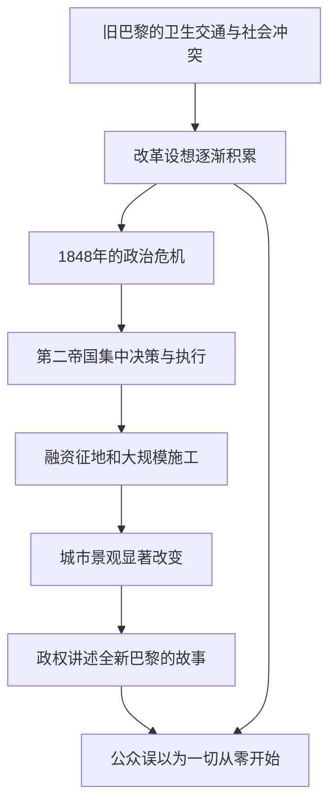

# 01｜巴黎真的是被奥斯曼一夜改造成现代城市的吗？

> 如果改造巴黎的设想早已存在，为什么我们还习惯把现代巴黎归功于一个人？

---

## 一、先说结论

巴黎的变化是真实的，但“奥斯曼凭空造出现代巴黎”不是可靠的历史解释。大卫·哈维在《巴黎，资本之都的诞生》的导论里，把现代性自称与过去彻底决裂的说法称为一种有力量的神话。奥斯曼在十九世纪中叶推动的工程规模巨大，不能因此抹掉此前数十年对道路、卫生和城市秩序的讨论。值得追问的是：**哪些旧设想，为什么在新的政治与经济条件下，终于获得了被实施的力量？**把“发明”和“实施”分开，我们才能既看到个人的行动，也看到支撑他的社会关系。

## 二、我们先理解一个问题

想象一张巴黎的前后对照图：一边是弯曲拥挤的街巷，一边是宽阔笔直的大道。如果照片配上“奥斯曼改变一切”，解释显得简单又有力。但照片只能证明两个时点的景观不同，不能说明方案最早由谁提出、谁付钱、哪些房屋被拆、住在其中的人去了哪里。视觉上的断裂，不自动等于历史上的从零开始。

1848 年的革命和后来第二帝国的政治转向，确实让法国社会发生了剧烈变化；1853 年奥斯曼出任塞纳省长，巴黎工程由此进入另一种规模。这些是可以按时间定位的历史事件。可是，**有一个人接手大工程**与**一个人发明所有工程**是两个不同判断。前者可以成立，后者需要排除此前的构想和其他行动者，不能凭一张对照图得出。

## 三、作者到底提出了什么观点？

哈维在导论《作为断裂的现代性》中提醒读者：现代城市喜欢讲一个开端故事，把过去描成黑暗、迟滞的旧世界，再把改革者写成清除障碍的英雄。问题不在于城市没有变化，而在于“彻底断裂”的说法会把渐进积累、未完成的方案和持续存在的矛盾遮住。哈维特别提到，在奥斯曼之前，巴黎的改造已经有相当多讨论与局部实施；奥斯曼要宣称自己与过去不同，也有建立新政权声望的政治需要。

把这说成“哈维否认奥斯曼的重要性”也不准确。作者要比较的是两个层次：**工程实践在何处发生规模与组织方式的变化**，以及**人们如何讲述这种变化**。如果新的行政能力、融资办法和政治联盟让旧想法突然大规模落地，变化依然可以很激烈，但它不是无中生有。这种区分，是理解全书的钥匙。

## 四、把这个观点翻译成人话

设想一个城市酝酿修跨河大桥。工程师二十年前已经画过草图，商人要求改善运输，居民抱怨旧桥太窄，财政部门却始终拿不出钱。后来一位负责人集中预算、批准征地、签下施工合同，桥终于开工。桥落成时，他的照片出现在每份报道里。说“没有他，工程不会以此规模完成”，可能合理；说“在他以前，没有人想过要修桥”，就变成了另一回事。

巴黎不是一座桥，涉及的利益也复杂得多。这个类比只想区分三件事：想法出现、条件成熟、组织实施。政治人物擅长把第三件事讲成第一件事，因为“新纪元由我开启”比“我整合了许多延续已久的力量”更适合塑造政绩。哈维要我们不满足于这类容易传播的故事，转而追问工程背后的制度与资源。

## 五、为什么会这样？

原因不是一条单线。既有的城市问题催生方案；革命和政治重组改变权力分布；金融与行政协调让工程扩大；工程成形之后，又反过来成为政权宣传自己的证明。

图中最后一条连线提醒我们：前期方案本来就存在，却可能在成功叙事里被压到背景。这里的箭头是**哈维论证的通俗重组**，不是对每条街道施工顺序的档案复原。不同街区经历的变化快慢、是否受益，也不能只靠这张简图决定。

## 六、举一个现实生活中的例子

下面是**教学用的假设场景，不是巴黎史料**。某城把废弃车站改成大型公共图书馆。新馆开放时，市长站在剪彩台上说，老车站从今天起变为“全新的文化中心”。事实上，十年前就有人提交保护建筑和改建阅览室的提案；当地志愿者还长期做儿童阅读活动。真正的新变化是本届政府筹到资金、协调产权并完成建设。

如果我们只嘲笑剪彩仪式，也会错过关键问题：没有公共财政和执行，提案可能永远留在纸上。但如果只歌颂剪彩者，就会漏掉居民的长期推动，以及搬迁期间附近小商户承担的损失。判断这座图书馆是不是好工程，需要继续看使用人数、预算、日常维护和周围人的生活，而不是靠“从废墟到新生”这句口号。

## 七、回到书中重新理解

哈维用巴黎作为案例，不是为了证明过去从来没有断裂，而是要让“断裂”接受检验。在他的公开导论中，奥斯曼对前任工作的否认尤其值得注意：既有规划和在建工程越明显，新政权越需要把它们重新讲成自己的创举。对于读者来说，重要的不是替某个官员争个人功劳，而是找到隐藏在“建设奇迹”背后的政治需要。

书中第一部分还转向巴尔扎克笔下的巴黎，以及革命之前的政治想象。这样的安排有明确作用：先看巴黎人**怎样想象城市**，再看这些想象中的一部分**怎样在第二帝国被物质化**。如果一开场就从奥斯曼的工程图纸读起，读者容易误以为大道、商店与新生活都是权力人物头脑里突然冒出来的。哈维把镜头往前推，让我们看见未被实现的选择也曾存在。

## 八、这个观点背后还有什么？

“新旧断裂”的叙事不仅争功劳，还决定人们如何评价代价。假如旧城只被说成肮脏、危险、落后，那么拆旧似乎天然合理；原有的邻里关系、低成本的生计与居民对地点的依赖，就被讲成应该消失的残余。反过来，把旧城浪漫化也一样片面：狭窄街道、卫生条件不足与贫困是真实问题。哈维所要求的不是简单拥护旧城，而是问**谁有权定义问题，谁的损失被记入账本**。

还有一层时间问题。现代化工程常把长期规划压缩为一个可庆祝的开工日期，而实际后果会在几十年里显现：某些线路更便利，有些住户搬得更远；公共设施改善，土地价格也可能上涨。这是依据哈维框架做的分析，不是在断言每个街区都经历相同命运。若不拆开不同时间尺度，“城市进步了”和“某些人受损了”就容易被误当成互相排斥的两句话。

## 九、这个观点有问题吗？

它有说服力：既能解释为什么此前的城市改革被遮蔽，也能阻止我们用一个伟人的名字代替对制度、资金和阶级的分析。关于现代性的“断裂”到底有多真实，学界仍可能有不同解释。即使计划有前史，第二帝国工程在**规模、速度、覆盖范围和行政强度**上也可能产生质变；若过分强调连续性，反而会淡化当事人经历的巨大冲击。

另一个可检验的问题是，哈维尤其关注资本积累与权力联盟，这种视角可能低估公共卫生、工程技术、人口变化和居民改善生活的主动需求。不是说这些因素一定比资本更重要，而是单凭“断裂神话”的批判，不能计算它们各自的权重。评价具体道路或供水工程，需要比较当时不同地区的资料、成本和受益者，不能用一种理论预先宣布结论。

## 十、今天再看这个观点

**以下部分是把哈维的思路用于当下的现代延伸，不是作者原话。**今天的新区建设、老工业区改造或大型交通枢纽，仍常被包装成“从无到有”的奇迹。遇到这类宣传，读者可以问：改造前的土地是谁在使用？哪一代人提出过方案？预算从何而来？新设施运营几年后，还能服务当初被承诺服务的人吗？这些问题不是反对建设，而是让成功叙事接受证据检验。

同样，也要警惕把旧城保存变成唯一正确答案。有些基础设施确实不安全，某些改造能扩大公共服务。更有用的判断方式是同时比较**不改造的代价**和**改造如何分摊代价**。一个城市是不是“现代”，不该只由照片里的直线道路决定，更该由居民能否在变化中继续拥有发言权和生活空间来衡量。

## 十一、这一篇真正应该记住什么？

1. 巴黎的剧烈改造确有其事，但可见的景观断裂不等于方案从未存在。要把想法的积累、实施条件和成果的宣传分开。
2. 哈维批判的是“新政权从零创造现代性”的叙事，而非否定奥斯曼的工程规模；把两种主张混为一谈，会误读他的开场。
3. 对城市工程既不要只算旧城的弊病，也不要只算新城的收益；还要问此前有哪些选择、由谁支付成本、谁得以讲述历史。

## 十二、留一个问题

如果改造巴黎的故事并不始于奥斯曼，那么在道路真正拓宽之前，巴黎人已经怎样在小说里描绘阶级、欲望与城市生活？那些看起来像“虚构”的画面，会不会比一张工程地图更早揭示这座城市的矛盾？
