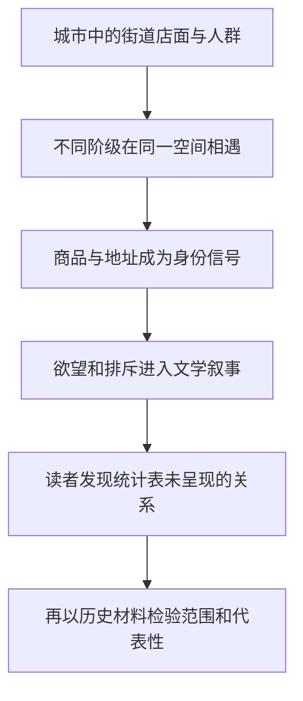

# 02｜巴尔扎克的小说为什么能帮助我们理解一座城市？

> 一张地图能标出街道，却怎样告诉我们谁羡慕谁、谁又能进入谁的生活？

---

## 一、先说结论

巴尔扎克的小说值得放在巴黎城市史旁边读，不是因为虚构人物可以替代人口调查，而是因为小说能呈现人们如何理解地位、商品和欲望。哈维把城市的物质变化与城市的**表述**放在一起考察：地图说明空间在哪里，文学让我们留意空间对不同身份的人意味着什么。它提供的是理解城市想象的线索，而非可以直接换算成当时巴黎人生活比例的统计证据。

## 二、我们先理解一个问题

设想两份材料：一份地图标明一条街道有多少店面，一份人口表列出附近住户的职业。它们都可能很准确，却不告诉你：路过一家商店的人为何突然觉得自己穿得不够体面，店主为何努力把某种生活方式摆进橱窗，租下同一街区对不同家庭又意味着何种身份变化。城市不仅是建筑与人数的集合，还是一个被反复想象、评价和讲述的地方。

因此这一节的核心问题不是“巴尔扎克的巴黎究竟有多真实”，而是**文学描写怎样揭示地图与统计表看不见的城市关系**。反过来说，看见一种欲望被写得鲜活，也不能证明所有居民都怀有同样欲望。把小说当作问题的入口，而不是把角色当作居民样本，才是稳妥的读法。

## 三、作者到底提出了什么观点？

出版社的《巴黎，资本之都的诞生》书目明确把巴尔扎克的创造性城市想象列为书的讨论对象，并把全书第一部分称作“表述”。据此阅读哈维，可以把他的关注概括为：小说怎样让阶级差别、商品化和城市想象以可感的形式出现。所谓**表述**，不是给已经存在的街道贴一张漂亮标签，而是人们用叙事、图像、说法去认识城市，也借此表达自己希望占据的位置。

哈维借巴尔扎克观察城市，并不等于声称小说提供了一张精确的十九世纪巴黎社会分布图。小说为了推动情节会选择人物、放大冲突，还会通过叙述者的眼睛安排读者的同情。作者关心的恰恰是这种选择：哪些人的行动值得被看见，哪些东西被写成令人渴望的对象，哪些门槛使人感到自己被挡在外面。

## 四、把这个观点翻译成人话

如果你只知道某条街有服装店、住户和旅馆，就像只拿到一张舞台平面图。小说则让你听见人物登场时的犹豫：他担心被看轻，于是格外注意衣服、地址和说话方式。这里的重点不是服装价格的历史数字，而是同一件商品如何变成“我属于哪里”的信号。店面可以被清点，被看见的尊严和被排除的焦虑却很难填进表格。

这也是“商品化”在这里的通俗含义之一：物品不只是满足使用需要，还被赋予可展示的身份和可交换的愿望。但不能因此把巴尔扎克笔下每次买卖都算成经济规律。文学让关系显形，经济和历史资料则帮助我们判断这种关系出现的范围、条件与变化；两者回答的不是同一道题。

## 五、为什么会这样？

城市里的人不断观察彼此，物品和地点因此可能携带社会含义。叙事把这种含义压进人物相遇的瞬间，读者容易觉察地图上并未标注的阶级距离。下面是对阅读方法的概括，不是巴尔扎克某部小说的情节复原。

其中最后一步不可省。小说能提示我们该问什么，却不能代替回答“有多少人如此生活”的证据。即便同在一条街，穷人与富人对同一橱窗也未必有同一种感受；文学的价值正在于把差异写成问题，而不是提前替差异作结论。

## 六、举一个现实生活中的例子

下面完全是**虚构的教学对比，不是巴尔扎克原文，也不是巴黎史料**。假设老城区一家商铺贴出招租广告：“临街落地窗，步行可达广场，适合精品零售，租金面议。”广告提供可出租面积之外的暗示：橱窗容易被看见，地址听起来体面，“精品”仿佛预先规定了下一位租客应该是谁。

再假设一段为教学而写的小说片段：路过的人认出了那扇落地窗，想象自己在里面招待朋友；曾在此修补衣服的老店主却盯着“精品”两字，知道自己付不起新租金。**这段文字是此处自拟，绝非书中引文。**广告让地点成为可以交易的卖点，片段让同一地点承载向往和失落。二者相比，你会发现“好铺面”既可能是一句市场描述，也可能是关于谁有资格留下的社会判断。

## 七、回到书中重新理解

哈维的安排提醒我们，先读人们怎样描绘巴黎，再读道路和建筑怎样被实际改变，有助于避免一种误会：仿佛城市只有工程开工后才开始变化。巴尔扎克的创作属于表述层面的材料；它让读者理解，阶级、商品与欲望此前已能被写作感知。这里说的“此前”是阅读结构的提示，不意味着每个文学意象都直接预言了后来的某项工程。

出版社目录所标出的“表述”与后续“物质化”也不是两组完全隔绝的材料。人们如何评价一条街、羡慕一种生活，会影响他们对城市改变的理解；反过来，具体的租约、收入、道路和住处又限制想象能否兑现。这个联系是基于哈维框架所作的阅读概括，不能在没有核对具体文本时冒充他的逐字论断。

## 八、这个观点背后还有什么？

一种城市想象并不天然属于整座城市。小说的叙述角度、出版市场和角色选择，会决定哪种声音更响。若把被写出来的欲望当作全体巴黎人的愿望，就可能把某个阶层的城市想象误认成普遍经验。同样，只凭统计分类，也可能忽略一个人同时是雇员、亲人、租客和消费者时的复杂位置。

由此可以提出一个更深的问题：城市史的材料之间如何分工？地图追踪地点，档案追踪制度和数量，文学追踪被讲述的感受与秩序。三者能互相纠错，却不能互相取代。**这是我们的阅读方法分析**，而不是说哈维为每种材料规定了固定权重；遇到具体历史主张，仍需看证据来自哪里。

## 九、这个观点有问题吗？

这种读法有说服力，因为它能把“阶级关系”从抽象标签还原为人物的目光、顾虑和消费期待，也能防止我们把地图当作城市生活的全部。争议在于：小说毕竟经过作者取舍，巴尔扎克对某些人的描写可能比对另一些人更细，不能因此宣称它完整代表巴黎的所有声音。

如果过度简化，把一切文学中的向往都解释为商品化，就会忽略亲情、政治信念、职业自尊或叙事艺术本身。其他解释还包括出版条件、读者趣味、文学体裁与作者个人立场；一些研究者可能更强调这些因素而非经济关系。比较不同作品和同期档案，才能判断某个意象是广泛的社会经验、特定群体的焦虑，还是小说为了好看而放大的冲突。

## 十、今天再看这个观点

**以下部分是把哈维的阅读思路用于当下的现代延伸，不是作者原话。**今天要认识一个街区，地图软件能告诉我们店铺分布，租房平台能显示价格，社交平台上的短视频则不断讲述这里“适合哪种人”。三种信息放在一起，才有机会分辨：某处在物理上向公众开放，是否也在价格和气氛上让不同收入的人感到自己可以留下。

但一则爆红视频也不是街区人口调查。遇到让人心动的“理想生活”叙事，可以问它展示了什么、没有展示什么，再查交通、租金与居民实际需求。这样做不是反对想象，而是防止自己把精心制作的城市形象误读成所有人的日常。

## 十一、这一篇真正应该记住什么？

1. 哈维借巴尔扎克观察阶级、商品与欲望如何被写成城市形象；文学能让关系可感，却不能直接当作社会统计。
2. 表述不是事实的反义词，而是一种有选择地组织事实和感受的方式；读小说时要追问叙述位置与被遗漏的人。
3. 要理解一座城市，同时看它怎样被想象、怎样被测量、怎样被实际使用；任何一种材料单独出场都容易失真。

## 十二、留一个问题

如果小说能让我们看见巴黎人对生活的不同期待，那么更好的巴黎应该长什么样？当人们试图把想象写成改革方案，为什么很快就会发现：他们连劳动该怎样组织、公共生活该由谁决定，都未必能达成一致？
