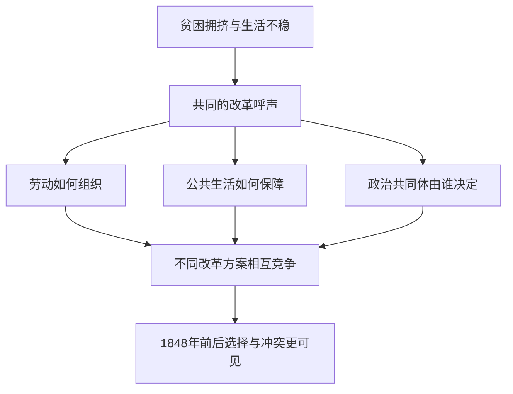

# 03｜革命者想象的巴黎，为什么不止一种？

> 要让城市变得更好，究竟该改街道，还是该改变人们一起工作和生活的办法？

---

## 一、先说结论

1848 年以前，人们对巴黎的改革想象会相互竞争，因为“更好的城市”从来不只是一张更整齐的街道图。哈维把革命前的政治想象放在巴黎改造的前景里考察：有人优先考虑劳动怎样组织，有人关心公共生活如何展开，还有人追问政治共同体中谁有决定权。它们面对相近的城市难题，却对谁应当合作、谁有权分配成果给出不同答案。

## 二、我们先理解一个问题

若一座城市拥挤、贫困，决定拓宽道路听起来顺理成章。但道路通畅之后，谁有能力住在工作地点附近？工作的人是否能参与决定生产和收入怎么分？一条新路可以改善通行，却不会自动给这些问题提供答案。城市改革一旦涉及日常生活的规则，技术上的“方便”便不能替代政治上的“谁说了算”。

这一节真正要回答的是：**1848 年以前的社会改革方案为什么会相互竞争？**问题不在于寻找一个能包办全部公共利益的口号，而在于理解相同的不满怎样产生不同方案。各方或许都批评眼前的困境，但对个人财产、集体合作、公共决策所赋予的地位并不相同；这些区别会影响他们究竟要建设什么样的巴黎。

## 三、作者到底提出了什么观点？

出版社目录把《巴黎，资本之都的诞生》第一部分称为“表述”，其中列有“想象政治共同体”这一章；书的后续部分才转向空间组织、金融、国家、劳动等物质机制。据此可以稳妥地说，哈维不是只把革命前的乌托邦和改革思潮看作工程的预告片。它们首先是在争论社会应该如何共同生活：改变劳动组织与公共生活，也是在改变城市。

“乌托邦”在这里不必理解为脱离现实的空想。它也可以是一种提问方法：假设现行的分工和权力并非天然如此，能否重新安排？但不同人即使都想摆脱贫困，也可能对由谁管理工作场所、公共设施对谁开放、冲突由谁裁决意见相左。这是对哈维讨论主题的通俗梳理，不是把某一位改革者的具体主张强行归给全体革命者。

## 四、把这个观点翻译成人话

想象大家都希望一间街区食堂让人吃得起饭。有人主张由经营者降价、提高效率；有人希望从业者共同经营、共同分配；有人更看重市政补助和普遍的就餐资格。目标都叫“改善生活”，办法却会改变员工的收入、顾客的权利以及出问题时谁承担损失。这样看，方案竞争不是因为改革者喜欢争执，而是不同答案把城市的权利与责任摆在了不同位置。

同理，改革巴黎不仅关乎路面有多宽，还关乎普通人每天在何处劳动、休息、相遇与讨论公共事务。所谓**公共生活**，不是节庆时人群挤满广场的热闹而已，还包括平常日子里能否参与共同事务。这里的食堂只是解释性类比，并非十九世纪巴黎某项经核实的改革方案。

## 五、为什么会这样？

城市困境往往同时具有物质和制度两面：同样是贫困，有人强调工资与工作关系，有人强调商品价格和公共服务，有人强调政治排斥。诊断不同，给出的改革方案也会不同；即便诊断相似，对改变现有权力的程度也可能意见相反。

这张图表达的是争论的逻辑，不是一张能够给具体派别逐一贴标签的史料表。也不要把所有分歧直接推成 1848 年革命的唯一原因：经济波动、政治制度和当时的具体事件也需另外查证。哈维的视角帮助我们把“谁的城市”放回改造议题，而不是代替对革命经过的历史研究。

## 六、举一个现实生活中的例子

下面是一间**假设的合作面包房，纯为解释改革分歧，不是十九世纪巴黎的史实**。街区里的几位面包师决定合办店铺，却很快遇到三个问题：面粉短缺时按出资比例优先分给各人，还是优先保证全街区基本供应？月底有盈余时按劳动时数分，还是先留出一笔钱降低面包价格？新成员能否参与投票，或者只有最初出资者说了算？

第一种设计可能使出资人愿意垫钱，却让缺钱的工人难以进入；另一种设计能扩大参与，却必须回答由谁负担亏损。分面粉看似采购安排，分盈余涉及劳动的价值，分决策权更是在定义这个小共同体。没有一种选择只凭“合作”两个字就能自动完成。改革方案相互竞争，也往往发生在这种具体的权利分配处。

## 七、回到书中重新理解

把革命前的政治想象放在书的前部，有助于理解为什么后来的工程并非唯一可能的现代化方向。哈维让读者先看到各种关于政治共同体的想法，再面对实际发生的改造；这样，宽阔街道与强大的行政组织不再被视为历史必然的终点，而成为需要解释的某种选择。这里说的是全书编排提供的阅读角度，不是断言哪份改革纲领曾直接决定后来每条街的建设。

“改革”和“乌托邦”两词也不应被对立成务实与幼稚。未经实行的方案仍能揭示当事人认定哪些问题值得优先处理；同时，提出理想并不能证明它能解决资金、物资、组织冲突。我们既要读出这些构想对现实的批评，也要承认构想与实施之间的距离。哈维的讨论因此与后面研究政治权力和工程组织的部分形成对照，而不是彼此替代。

## 八、这个观点背后还有什么？

方案之争隐含着对“城市居民”的不同定义。居民只是一群消费者、纳税人和通行者，还是也包括共同制定工作规则的劳动者？倘若只计算道路容量，便可能把前一种定义当成唯一合理的起点。反之，若只谈民主理想而不问供应与治理，又会漏掉维持日常生活所需的组织能力。**这是从哈维问题意识出发作出的分析**，不是他的原话。

还要注意时间差：提出一个替代方案，比为它争取持久支持容易。一个愿景要进入现实，需有人协调资源、承担失败风险，并解释为何别人应该接受这一套规则。比较竞争中的城市想象，不只是比谁说得动听，也要问参与者是否愿意、能否持续以及被排除者有没有发声渠道。

## 九、这个观点有问题吗？

这一视角的说服力在于，它防止读者把革命前的社会改革缩成“尚未开工的道路计划”，而把劳动、共同生活与政治权利放回城市史。争议在于，改革思想的文本和参与者差异很大；仅凭“乌托邦”一词就推定所有人追求同样的平等，可能歪曲其目标，也可能忽略他们之间真实的利益冲突。

如果把方案竞争过度简化为理念之争，就可能忽视粮食价格、就业、财政约束和政治制度等其他解释；反过来，只谈物质困境，又解释不了为什么相似困境会生出不同的公共目标。学界对 1848 年前后各种运动的动因和权重有不同解释，判断具体方案能否实施，还需要各自的文本、组织记录与经济资料，不能由本节的示意图代劳。

## 十、今天再看这个观点

**以下部分是把哈维关于城市想象的思路用于当下的现代延伸，不是作者原话。**今天讨论老城区更新，有人希望吸引投资，有人优先要求廉价住房，也有人要求让居民参与预算决策。这些目标可以部分兼容，也可能在土地用途、资金来源和决策程序上碰撞。先辨认各方究竟要改善谁的生活，比空泛地说“大家都支持改造”更有用。

一个可行的讨论方法，是把方案写成具体选择：谁获得使用权？谁出钱？争议由谁裁决？能否在试行后修改？这些问题不会直接给出唯一的好答案，却能把口号背后的不同共同体想象暴露出来。提出异议也不等于反对建设；有时正是在认真讨论之后，建设才可能获得更可靠的公共支持。

## 十一、这一篇真正应该记住什么？

1. 1848 年以前的改革想象会竞争，因为改善城市同时涉及劳动组织、公共生活与政治共同体，而不是只有铺路一种答案。
2. 乌托邦可以是对现有规则提出替代选择的工具；但好愿景仍需要面对资源、治理与冲突，不能因名字好听就免于检验。
3. 理解一个改革方案，应同时追问它解决谁的问题、让谁参与决策、把成本留给谁，并区分思想争论与实际历史结果。

## 十二、留一个问题

既然不同人早已提出不同的城市未来，为什么后来成为现实的却是其中某些大型改造？从争论中的设想走到可以开工的工程，1848 年的危机与之后的权力格局究竟改变了什么？
