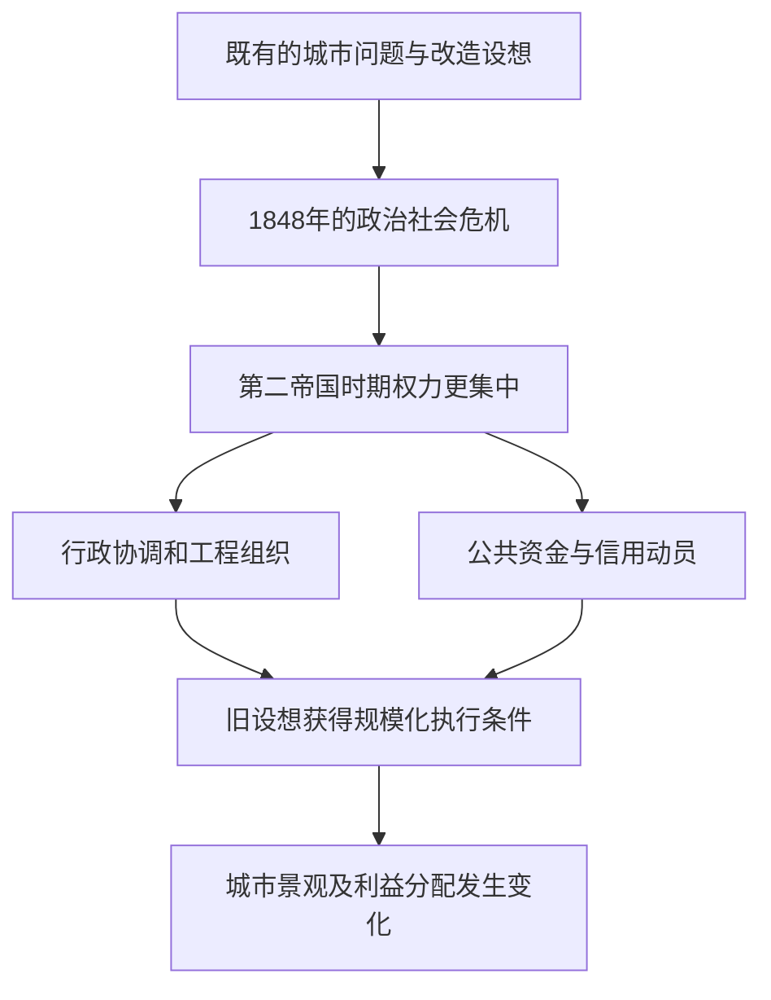

# 04｜1848 年革命之后，城市改造为什么突然加速？

> 旧方案并不会自己开工：是什么让十九世纪中叶的巴黎获得了大规模动工的条件？

---

## 一、先说结论

巴黎改造在 1848 年革命后进入新的历史阶段，不是因为此前没人想过改变城市，而是危机、后来集中的政治权力、资金动员与工程组织逐渐接上了。哈维关心的正是旧构想如何在第二帝国获得更大规模的执行条件。奥斯曼的角色重要，但把变化归功于他一个人的突然灵感，会遮蔽方案、财政、行政与政治秩序相互配合的过程。

## 二、我们先理解一个问题

任何城市都可能存着一叠多年未动的改造图纸。工程师能画出路线，居民也知道排水和交通有问题，却总卡在预算、产权、施工协调和政治反对上。一份图纸与一条建成的道路之间，隔着许多需要不同人同时做出的决定。要解释何以“突然加速”，必须追问这些障碍何时、以什么方式被重新安排，而不能只看最终剪彩的日期。

本文的核心问题是：**为什么已有的改造设想在第二帝国更容易变成现实？**“更容易”不等于所有项目都顺利，也不等于革命一发生工程便自动启动。1848 年革命与第二帝国之间有政治变动的过程；把不同时间节点压成一瞬间，会把我们真正要解释的制度转向抹掉。

## 三、作者到底提出了什么观点？

哈维的叙述不把城市更新理解成一位天才设计师的独奏。出版社目录先列“表述”中的现代性神话和政治共同体想象，后列“物质化”中的空间关系、金钱信用与金融、国家等主题。这一编排支持一种理解：旧方案的实现，既依赖城市问题和改革想象，也依赖后来有能力筹钱、决策和组织工程的政治结构。

1848 年的危机使社会秩序与改革路径成为迫切议题；后来第二帝国的政治权力集中，给跨地区协调与大规模执行创造了条件。资金可让工程不必等每一笔现款到位，行政与施工组织则把纸面设想转成持续建设。**这是哈维论证框架的概括**，不是说所有巴黎工程都由同一资金来源支付，也不是说所有项目有完全相同的政治动机。

## 四、把这个观点翻译成人话

设想某城早就知道一座桥该修：老桥拥堵，方案也画好了。但要让新桥出现，市政得决定优先顺序，议会或主管机构得允许支出，债务或税收得提供资金，施工单位得分阶段组织，道路两端还得接上原有交通。只强调画图的人，或者只强调批钱的人，都无法解释为什么桥最终能通车。

巴黎的规模远比这个类比复杂。我们暂且用它区分四件事：**问题使改革变得迫切，权力使决策能够集中，资金把未来资源调到眼前，工程组织让多项工作衔接**。其中任何一环都可能受到争议；把“加速”理解为条件相遇，而非某人的魔法，才能继续看见建设的收益与成本如何分布。

## 五、为什么会这样？

已有设想能否实现，取决于谁能使分散的行动接力。政治危机改变了改革的议程；政权变化重排了决定权；融资扩大了可立即调用的资源；技术人员、行政体系和施工安排则把资源投入具体地点。这些条件并不意味着工程必然成功，反而提醒我们每一环都可能制造新的风险。

图示的是机制层次，不是逐年施工年表。信用可以提前推动建设，却意味着将来的偿付问题；行政协调可以减少拖延，也可能压缩被影响者参与决定的机会。因此同一套使工程变快的安排，不能直接推出“所有人的生活都变好了”。

## 六、举一个现实生活中的例子

下面是**完全假设的当代城市暴雨排水工程，不是巴黎史料**。某城暴雨后道路反复积水，居民早已要求扩建排水管，工程部门也有初步方案，但两片辖区各管一段、预算年度不一致，施工每次都被推迟。又一次暴雨后，市级部门把两段管线列成一项工程，重新分配预算，统一审批顺序，再安排分区施工与临时通行。

工程启动，并不是暴雨凭空发明了排水需求，也不是某位负责人突然想到地下有管线；变化在于危机提高了优先级，权力和预算重组打通了原先的协调瓶颈，施工才得以衔接。但也要继续问：钱从哪些项目挪来？工期内谁通行不便？新设施覆盖哪些地段？这个假设只帮助理解“条件相遇”，不证明十九世纪巴黎具体做过同样的预算调整。

## 七、回到书中重新理解

回到哈维的巴黎，可以更清楚地分开“设想存在”与“执行能力出现”。书中从现代性叙事与改革想象过渡到空间、金融和国家，读者由此可以追问：哪些关于城市的愿望在新的权力条件下被选中，哪些没有？既然执行需要决策与资源，结果就不只是技术效率的产物，也与谁掌握这些条件有关。

可核对的历史时间点是：1848 年法国发生革命，第二帝国随后建立，奥斯曼于 1853 年出任塞纳省长。这些事实可以说明先后次序，却不能仅凭年份证明任何单项工程的具体因果。哈维强调的不是“1848 年革命直接修成每一条大道”，而是危机后的政治经济格局使已有设想获得了不同于此前的实施条件。

## 八、这个观点背后还有什么？

“加速”是需要选择观察尺度的词。对行政部门来说，审批和施工可能显著提速；对被拆迁或迁移的人来说，骤变也意味着更少的适应时间。公共工程带来的便利可能是真实的，机会和损失却不一定落到同一批人身上。因此，速度只是解释起点，不是评价终点。**这是沿着哈维的框架展开的分析**，不是作者对每个街区的统一判词。

还有一层是政治正当性。危机之后，政府若以改善秩序、卫生或交通为名推动建设，其理由可能包含真实的公共问题；然而“确实有问题”不等于“只有这一种方案”，更不等于“可以不问谁出资、谁迁移”。旧方案为何在新政权下被采纳，既是组织能力的问题，也是优先选择的问题。

## 九、这个观点有问题吗？

这一解释有说服力：它把 1848 年后的变化放进危机、政治权力、资金与工程能力的连接中，避免用“奥斯曼一人发明现代巴黎”代替因果分析。它的争议在于，哪一环最关键并不容易仅凭宏观叙述判定；不同项目的启动时间、资金办法和地方阻力可能并不相同。

若把所有工程都概括成政权控制的工具，会过度简化公共卫生需求、人口变化、专业工程知识与居民对便利的要求。另一种解释可能更强调技术累积或城市长期增长，而非单次政治危机。学界对第二帝国改革动因的解释可以不同；要分辨具体项目，仍需核对其预算、行政记录、设计与受影响者的处境，不能让一种结构性论证替代细部证据。

## 十、今天再看这个观点

**以下部分是把哈维的分析框架用于当下的现代延伸，不是作者原话。**今天一项长期搁置的基础设施在危机后突然启动，我们也可以分别检查：方案是否早已提出？新预算来自哪里？哪些部门获得协调权？进度变快之后，公开讨论和成本审查有没有同步跟上？这些问题有助于避免把“效率提升”简单等同于“方案最优”。

也不能反过来把所有快速建设都视作坏事。危急的安全问题有时确实需要果断投入；问题是如何在行动的同时保留可追溯的决策依据，说明未来谁负责偿付、谁监督质量、谁有机会提出替代方案。这样，“建得快”才可能与“建得对”成为两个都接受检验的目标。

## 十一、这一篇真正应该记住什么？

1. 1848 年之后的巴黎改造不是从零发明：危机与后来的政治权力集中、资金动员和工程组织相遇，使旧设想更易大规模落实。
2. 加速要分清时间与机制；革命、第二帝国的建立和具体工程开工并非同一瞬间，先后发生也不自动等于单一因果。
3. 衡量工程不能只看有没有开工，还要看谁能决策、谁提供资源，以及便利、偿付压力和搬迁代价落到谁身上。

## 十二、留一个问题

当旧构想终于获得开工的权力、钱与组织能力，最先改变的会是什么？一条宽阔大道建成后，它究竟只是让车马走得更顺，还是也悄悄改变了沿线人们做生意和居住的机会？
